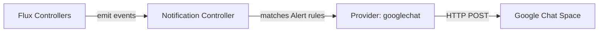

# How to Configure Flux Notification Provider for Google Chat

Author: [nawazdhandala](https://github.com/nawazdhandala)

Tags: Flux CD, GitOps, Kubernetes, Notifications, Google Chat, Monitoring

Description: Learn how to configure Flux CD's notification controller to send deployment and reconciliation alerts to Google Chat spaces using the Provider resource.

---

Google Chat (formerly Hangouts Chat) is the team messaging component of Google Workspace. If your organization uses Google Workspace, configuring Flux CD to send notifications to Google Chat spaces provides a seamless way to monitor Kubernetes deployments without switching contexts.

This guide walks through the complete setup, from creating a Google Chat webhook to verifying that notifications flow correctly.

## Prerequisites

- A Kubernetes cluster with Flux CD installed (including the notification controller)
- `kubectl` access to the cluster
- A Google Chat space where you have permission to add webhooks
- The `flux` CLI installed (optional but helpful)

## Step 1: Create a Google Chat Webhook

Open the Google Chat space where you want to receive notifications. Click on the space name at the top, then select **Apps & integrations** (or **Manage webhooks** in older versions). Click **Add webhooks** and provide a name such as "Flux CD". Copy the generated webhook URL.

The URL will follow this format:

```text
https://chat.googleapis.com/v1/spaces/SPACE_ID/messages?key=KEY&token=TOKEN
```

## Step 2: Create a Kubernetes Secret

Store the Google Chat webhook URL in a Kubernetes secret.

```bash
# Create a secret containing the Google Chat webhook URL
kubectl create secret generic googlechat-webhook-url \
  --namespace=flux-system \
  --from-literal=address="https://chat.googleapis.com/v1/spaces/SPACE_ID/messages?key=KEY&token=TOKEN"
```

## Step 3: Create the Flux Notification Provider

Define a Provider resource for Google Chat.

```yaml
# provider-googlechat.yaml
# Configures Flux to send notifications to Google Chat
apiVersion: notification.toolkit.fluxcd.io/v1beta3
kind: Provider
metadata:
  name: googlechat-provider
  namespace: flux-system
spec:
  # Use "googlechat" as the provider type
  type: googlechat
  # Reference to the secret containing the webhook URL
  secretRef:
    name: googlechat-webhook-url
```

Apply the Provider:

```bash
# Apply the Google Chat provider configuration
kubectl apply -f provider-googlechat.yaml
```

## Step 4: Create an Alert Resource

Define an Alert that specifies which events to forward.

```yaml
# alert-googlechat.yaml
# Routes Flux events to the Google Chat provider
apiVersion: notification.toolkit.fluxcd.io/v1beta3
kind: Alert
metadata:
  name: googlechat-alert
  namespace: flux-system
spec:
  providerRef:
    name: googlechat-provider
  eventSeverity: info
  eventSources:
    - kind: Kustomization
      name: "*"
    - kind: HelmRelease
      name: "*"
    - kind: GitRepository
      name: "*"
```

Apply the Alert:

```bash
# Apply the alert configuration
kubectl apply -f alert-googlechat.yaml
```

## Step 5: Verify the Configuration

Check that both resources are ready.

```bash
# Verify provider and alert status
kubectl get providers.notification.toolkit.fluxcd.io -n flux-system
kubectl get alerts.notification.toolkit.fluxcd.io -n flux-system
```

## Step 6: Test the Notification

Trigger a reconciliation to generate an event.

```bash
# Force reconciliation to produce a test notification
flux reconcile kustomization flux-system --with-source
```

A card should appear in your Google Chat space within a few seconds.

## How It Works



The notification controller formats events into Google Chat card messages and posts them to the webhook endpoint. Google Chat renders them as interactive cards in the space.

## Error-Only Alerts

To reduce noise, configure an alert for errors only:

```yaml
apiVersion: notification.toolkit.fluxcd.io/v1beta3
kind: Alert
metadata:
  name: googlechat-errors
  namespace: flux-system
spec:
  providerRef:
    name: googlechat-provider
  eventSeverity: error
  eventSources:
    - kind: Kustomization
      name: "*"
    - kind: HelmRelease
      name: "*"
```

## Multiple Spaces

You can route different notifications to different Google Chat spaces by creating multiple providers:

```yaml
# Provider for the SRE space
apiVersion: notification.toolkit.fluxcd.io/v1beta3
kind: Provider
metadata:
  name: googlechat-sre
  namespace: flux-system
spec:
  type: googlechat
  secretRef:
    name: googlechat-sre-webhook
---
# Provider for the development space
apiVersion: notification.toolkit.fluxcd.io/v1beta3
kind: Provider
metadata:
  name: googlechat-dev
  namespace: flux-system
spec:
  type: googlechat
  secretRef:
    name: googlechat-dev-webhook
```

Then create separate Alert resources referencing each provider.

## Troubleshooting

If notifications are not appearing in Google Chat:

1. **Secret format**: Ensure the secret has an `address` key with the full webhook URL, including query parameters.
2. **URL encoding**: The webhook URL contains query parameters (`key` and `token`). Make sure they are preserved correctly in the secret.
3. **Namespace alignment**: Provider, Alert, and Secret must be in the same namespace.
4. **Controller logs**: Check `kubectl logs -n flux-system deploy/notification-controller` for HTTP errors.
5. **Network access**: Confirm the cluster can reach `chat.googleapis.com` on port 443.
6. **Webhook limits**: Google Chat has rate limits on incoming webhooks. High-frequency events may be throttled.
7. **Space permissions**: Verify that webhooks are enabled for the space and have not been removed by an administrator.

## Conclusion

Google Chat integration with Flux CD is ideal for teams already embedded in the Google Workspace ecosystem. The setup is minimal -- a webhook URL, a Kubernetes secret, and two Flux custom resources -- and provides immediate visibility into cluster operations. By combining multiple providers and targeted alerts, you can build a comprehensive notification strategy that keeps every team informed through their preferred Google Chat space.
