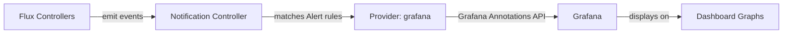

# How to Configure Flux Notification Provider for Grafana

Author: [nawazdhandala](https://github.com/nawazdhandala)

Tags: Flux CD, GitOps, Kubernetes, Notifications, Grafana, Observability, Annotations

Description: Learn how to configure Flux CD's notification controller to send deployment annotations to Grafana dashboards using the Provider resource.

---

Grafana is one of the most popular observability platforms, and one of its most useful features is annotations -- markers on dashboard graphs that indicate when events occurred. By integrating Flux CD with Grafana, you can automatically add annotations to your dashboards whenever a deployment happens. This makes it easy to correlate metric changes with deployment events.

This guide covers configuring the Grafana notification provider to send deployment annotations.

## Prerequisites

- A Kubernetes cluster with Flux CD installed (including the notification controller)
- `kubectl` access to the cluster
- A Grafana instance with API access (Grafana Cloud or self-hosted)
- A Grafana API key or service account token with annotation write permissions
- The `flux` CLI installed (optional but helpful)

## Step 1: Create a Grafana API Key

In Grafana, navigate to **Configuration** then **API keys** (or **Service Accounts** in newer versions). Create a new API key or service account token with the **Editor** role, which grants permission to create annotations.

Copy the generated token.

## Step 2: Create a Kubernetes Secret

Store the Grafana API token in a Kubernetes secret.

```bash
# Create a secret containing the Grafana API token
kubectl create secret generic grafana-token \
  --namespace=flux-system \
  --from-literal=token=YOUR_GRAFANA_API_TOKEN
```

## Step 3: Create the Flux Notification Provider

Define a Provider resource for Grafana.

```yaml
# provider-grafana.yaml
# Configures Flux to send annotations to Grafana dashboards
apiVersion: notification.toolkit.fluxcd.io/v1
kind: Provider
metadata:
  name: grafana-provider
  namespace: flux-system
spec:
  # Use "grafana" as the provider type
  type: grafana
  # The Grafana instance URL
  address: https://grafana.example.com
  # Reference to the secret containing the API token
  secretRef:
    name: grafana-token
```

Apply the Provider:

```bash
# Apply the Grafana provider configuration
kubectl apply -f provider-grafana.yaml
```

## Step 4: Create an Alert Resource

Create an Alert that sends deployment events as Grafana annotations.

```yaml
# alert-grafana.yaml
# Sends Flux events as annotations to Grafana
apiVersion: notification.toolkit.fluxcd.io/v1
kind: Alert
metadata:
  name: grafana-alert
  namespace: flux-system
spec:
  providerRef:
    name: grafana-provider
  # Send all events to Grafana for comprehensive annotation coverage
  eventSeverity: info
  eventSources:
    - kind: Kustomization
      name: "*"
    - kind: HelmRelease
      name: "*"
    - kind: GitRepository
      name: "*"
```

Apply the Alert:

```bash
# Apply the alert configuration
kubectl apply -f alert-grafana.yaml
```

## Step 5: Verify the Configuration

Check that both resources are ready.

```bash
# Verify provider and alert status
kubectl get providers.notification.toolkit.fluxcd.io -n flux-system
kubectl get alerts.notification.toolkit.fluxcd.io -n flux-system
```

## Step 6: Test the Notification

Trigger a reconciliation to create an annotation:

```bash
# Force reconciliation to generate a Grafana annotation
flux reconcile kustomization flux-system --with-source
```

Open your Grafana dashboard and look for the annotation marker on the time axis.

## How It Works



The notification controller sends Flux events to the Grafana Annotations API. Grafana stores these as annotations that can be displayed on any dashboard. When viewing a dashboard, you can see vertical lines or markers at the exact time of each deployment event.

## Viewing Annotations on Dashboards

To see Flux annotations on your Grafana dashboards:

1. Open any dashboard
2. Click the dashboard settings gear icon
3. Go to **Annotations**
4. Add a new annotation query filtered by tags (Flux annotations include tags like `flux`, the resource kind, and the resource name)
5. Save the dashboard

Annotations will now appear as vertical lines on all panels in the dashboard.

## Grafana Cloud Configuration

For Grafana Cloud, use your Grafana Cloud instance URL:

```yaml
apiVersion: notification.toolkit.fluxcd.io/v1
kind: Provider
metadata:
  name: grafana-cloud-provider
  namespace: flux-system
spec:
  type: grafana
  # Use your Grafana Cloud instance URL
  address: https://YOUR_INSTANCE.grafana.net
  secretRef:
    name: grafana-cloud-token
```

## Error-Only Annotations

To only annotate failures:

```yaml
apiVersion: notification.toolkit.fluxcd.io/v1
kind: Alert
metadata:
  name: grafana-errors
  namespace: flux-system
spec:
  providerRef:
    name: grafana-provider
  eventSeverity: error
  eventSources:
    - kind: Kustomization
      name: "*"
    - kind: HelmRelease
      name: "*"
```

## Combining with Grafana Alerts

Grafana annotations from Flux can be combined with Grafana alerting rules. For example, you could create a Grafana alert that triggers when an error rate spikes within a configurable time window after a Flux deployment annotation. This creates a powerful automated detection system for deployment-related regressions.

## Multiple Grafana Instances

If you have separate Grafana instances for different environments:

```yaml
# Production Grafana
apiVersion: notification.toolkit.fluxcd.io/v1
kind: Provider
metadata:
  name: grafana-prod
  namespace: flux-system
spec:
  type: grafana
  address: https://grafana-prod.example.com
  secretRef:
    name: grafana-prod-token
---
# Staging Grafana
apiVersion: notification.toolkit.fluxcd.io/v1
kind: Provider
metadata:
  name: grafana-staging
  namespace: flux-system
spec:
  type: grafana
  address: https://grafana-staging.example.com
  secretRef:
    name: grafana-staging-token
```

## Troubleshooting

If annotations are not appearing in Grafana:

1. **API token permissions**: The token must have Editor role or specific annotation write permissions.
2. **Grafana URL**: The `address` must be the root URL of your Grafana instance (no trailing `/api` path).
3. **Dashboard annotation query**: Ensure your dashboard has an annotation query configured to display Flux annotations.
4. **Namespace alignment**: Provider, Alert, and Secret must be in the same namespace.
5. **Controller logs**: Check `kubectl logs -n flux-system deploy/notification-controller` for HTTP errors.
6. **Network access**: The cluster must be able to reach your Grafana instance on port 443 (or the configured port).
7. **Time range**: Make sure your dashboard time range includes the time when the annotation was created.
8. **Annotation visibility**: Check that annotations are enabled in the dashboard settings (the toggle at the top of the dashboard).

## Conclusion

Grafana integration with Flux CD bridges the gap between deployment events and observability. By automatically annotating dashboards with deployment markers, you can instantly see whether metric changes correlate with deployments. This is one of the most impactful monitoring integrations available, as it transforms any Grafana dashboard into a deployment-aware view of your system's behavior. The setup is simple, and the operational value is immediate and significant.
