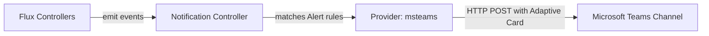

# How to Configure Flux Notification Provider for Microsoft Teams

Author: [nawazdhandala](https://github.com/nawazdhandala)

Tags: Flux CD, GitOps, Kubernetes, Notifications, Microsoft Teams, Monitoring

Description: Learn how to configure Flux CD's notification controller to send deployment and reconciliation alerts to Microsoft Teams channels using the Provider resource.

---

Microsoft Teams is one of the most widely used collaboration platforms in enterprise environments. Integrating Flux CD notifications with Teams ensures your operations team stays informed about Kubernetes deployments and reconciliation events without leaving their primary communication tool.

This guide explains how to set up a Flux notification Provider for Microsoft Teams, including creating the webhook connector, configuring secrets, and wiring up alerts.

## Prerequisites

- A Kubernetes cluster with Flux CD installed (including the notification controller)
- `kubectl` access to the cluster
- A Microsoft Teams workspace with permission to add connectors to a channel
- The `flux` CLI installed (optional but helpful)

## Step 1: Create a Microsoft Teams Incoming Webhook

In Microsoft Teams, navigate to the channel where you want notifications to appear. Click the three-dot menu next to the channel name and select **Connectors** (or **Manage channel** then **Connectors** depending on your Teams version). Find **Incoming Webhook**, click **Configure**, give it a name like "Flux CD", and click **Create**. Copy the generated webhook URL.

The URL will look similar to:

```text
https://outlook.office.com/webhook/XXXXXXXX/IncomingWebhook/YYYYYYYY/ZZZZZZZZ
```

## Step 2: Create a Kubernetes Secret

Store the Microsoft Teams webhook URL in a Kubernetes secret.

```bash
# Create a secret containing the Microsoft Teams webhook URL
kubectl create secret generic msteams-webhook-url \
  --namespace=flux-system \
  --from-literal=address=https://outlook.office.com/webhook/XXXXXXXX/IncomingWebhook/YYYYYYYY/ZZZZZZZZ
```

## Step 3: Create the Flux Notification Provider

Define a Provider resource that points to Microsoft Teams.

```yaml
# provider-msteams.yaml
# Configures Flux to send notifications to Microsoft Teams
apiVersion: notification.toolkit.fluxcd.io/v1beta3
kind: Provider
metadata:
  name: msteams-provider
  namespace: flux-system
spec:
  # Use "msteams" as the provider type for Microsoft Teams
  type: msteams
  # Channel field is not used for MS Teams -- routing is determined by the webhook URL
  # Reference to the secret containing the webhook URL
  secretRef:
    name: msteams-webhook-url
```

Apply the Provider:

```bash
# Apply the Microsoft Teams provider configuration
kubectl apply -f provider-msteams.yaml
```

## Step 4: Create an Alert Resource

Create an Alert that specifies which events should be forwarded to Teams.

```yaml
# alert-msteams.yaml
# Routes Flux events to the Microsoft Teams provider
apiVersion: notification.toolkit.fluxcd.io/v1beta3
kind: Alert
metadata:
  name: msteams-alert
  namespace: flux-system
spec:
  providerRef:
    name: msteams-provider
  # Send both info and error events
  eventSeverity: info
  eventSources:
    - kind: Kustomization
      name: "*"
    - kind: HelmRelease
      name: "*"
    - kind: GitRepository
      name: "*"
```

Apply the Alert:

```bash
# Apply the alert configuration
kubectl apply -f alert-msteams.yaml
```

## Step 5: Verify the Setup

Check that both resources are in a ready state.

```bash
# Verify provider and alert status
kubectl get providers.notification.toolkit.fluxcd.io -n flux-system
kubectl get alerts.notification.toolkit.fluxcd.io -n flux-system
```

## Step 6: Test the Notification

Trigger a reconciliation to generate an event.

```bash
# Force reconciliation to generate a test notification
flux reconcile kustomization flux-system --with-source
```

You should see a card appear in your Teams channel within a few seconds, displaying details about the reconciliation event.

## How It Works

The notification controller formats Flux events into Microsoft Teams Adaptive Card payloads and sends them via HTTP POST to the webhook URL. Teams renders these as rich cards in the channel.



## Filtering by Severity

To receive only error notifications in Teams:

```yaml
apiVersion: notification.toolkit.fluxcd.io/v1beta3
kind: Alert
metadata:
  name: msteams-errors
  namespace: flux-system
spec:
  providerRef:
    name: msteams-provider
  # Only forward error events to reduce noise
  eventSeverity: error
  eventSources:
    - kind: Kustomization
      name: "*"
    - kind: HelmRelease
      name: "*"
```

## Scoping Alerts to Specific Resources

Rather than watching all resources, you can target specific ones:

```yaml
apiVersion: notification.toolkit.fluxcd.io/v1beta3
kind: Alert
metadata:
  name: msteams-production
  namespace: flux-system
spec:
  providerRef:
    name: msteams-provider
  eventSeverity: info
  eventSources:
    # Only watch specific Kustomizations
    - kind: Kustomization
      name: production-apps
    - kind: HelmRelease
      name: ingress-nginx
      namespace: ingress-system
```

## Troubleshooting

If notifications are not reaching Microsoft Teams, check the following:

1. **Secret format**: The secret must contain an `address` key with the full webhook URL.
2. **Namespace alignment**: Provider, Alert, and Secret must reside in the same namespace.
3. **Notification controller logs**: Run `kubectl logs -n flux-system deploy/notification-controller` to look for HTTP errors.
4. **Webhook validity**: Verify the connector has not been removed or disabled in Teams.
5. **Network access**: Ensure the cluster can reach `outlook.office.com` on HTTPS (port 443).
6. **Teams connector limits**: Microsoft has rate limits on incoming webhooks. If you send a high volume of events, some may be throttled.

## Multiple Teams Channels

You can create multiple Providers pointing to different Teams channels and route different alerts accordingly:

```yaml
# Provider for the development team channel
apiVersion: notification.toolkit.fluxcd.io/v1beta3
kind: Provider
metadata:
  name: msteams-dev
  namespace: flux-system
spec:
  type: msteams
  secretRef:
    name: msteams-dev-webhook
---
# Provider for the operations team channel
apiVersion: notification.toolkit.fluxcd.io/v1beta3
kind: Provider
metadata:
  name: msteams-ops
  namespace: flux-system
spec:
  type: msteams
  secretRef:
    name: msteams-ops-webhook
```

## Conclusion

Integrating Flux CD notifications with Microsoft Teams brings deployment visibility directly into your team's collaboration workflow. The setup requires only a webhook connector, a Kubernetes secret, and two Flux resources. Combined with alert filtering, you can ensure the right information reaches the right team channel without excessive noise.
