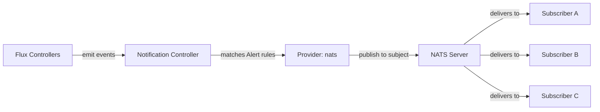

# How to Configure Flux Notification Provider for NATS

Author: [nawazdhandala](https://github.com/nawazdhandala)

Tags: Flux CD, GitOps, Kubernetes, Notifications, NATS, Messaging, Event Streaming

Description: Learn how to configure Flux CD's notification controller to publish deployment and reconciliation events to NATS subjects using the Provider resource.

---

NATS is a high-performance, cloud-native messaging system designed for distributed systems. By integrating Flux CD with NATS, you can publish Kubernetes deployment events to NATS subjects, where they can be consumed by any number of subscribers. This enables event-driven architectures where deployment events trigger downstream actions across your infrastructure.

This guide covers setting up the NATS notification provider from configuring the NATS server to verifying that events are published correctly.

## Prerequisites

- A Kubernetes cluster with Flux CD installed (including the notification controller)
- `kubectl` access to the cluster
- A NATS server accessible from the cluster (can be in-cluster or external)
- The `flux` CLI installed (optional but helpful)

## Step 1: Ensure NATS Is Running

If you do not already have a NATS server, you can deploy one in your cluster:

```bash
# Deploy NATS using Helm
helm repo add nats https://nats-io.github.io/k8s/helm/charts/
helm repo update
helm install nats nats/nats --namespace nats-system --create-namespace
```

The NATS server will be accessible at `nats://nats.nats-system.svc.cluster.local:4222` from within the cluster.

## Step 2: Create a Kubernetes Secret

Store the NATS server address in a Kubernetes secret. If your NATS server requires authentication, include the credentials.

For an unauthenticated NATS server:

```bash
# Create a secret with the NATS server address
kubectl create secret generic nats-secret \
  --namespace=flux-system \
  --from-literal=address=nats://nats.nats-system.svc.cluster.local:4222
```

For an authenticated NATS server:

```bash
# Create a secret with NATS address, username, and password
kubectl create secret generic nats-secret \
  --namespace=flux-system \
  --from-literal=address=nats://nats.nats-system.svc.cluster.local:4222 \
  --from-literal=username=flux \
  --from-literal=password=YOUR_NATS_PASSWORD
```

## Step 3: Create the Flux Notification Provider

Define a Provider resource for NATS.

```yaml
# provider-nats.yaml
# Configures Flux to publish events to NATS
apiVersion: notification.toolkit.fluxcd.io/v1
kind: Provider
metadata:
  name: nats-provider
  namespace: flux-system
spec:
  # Use "nats" as the provider type
  type: nats
  # The NATS subject where events will be published
  channel: flux.events
  # Reference to the secret containing the NATS server address
  secretRef:
    name: nats-secret
```

Apply the Provider:

```bash
# Apply the NATS provider configuration
kubectl apply -f provider-nats.yaml
```

## Step 4: Create an Alert Resource

Create an Alert that defines which events are published to NATS.

```yaml
# alert-nats.yaml
# Publishes Flux events to NATS
apiVersion: notification.toolkit.fluxcd.io/v1
kind: Alert
metadata:
  name: nats-alert
  namespace: flux-system
spec:
  providerRef:
    name: nats-provider
  eventSeverity: info
  eventSources:
    - kind: Kustomization
      name: "*"
    - kind: HelmRelease
      name: "*"
    - kind: GitRepository
      name: "*"
```

Apply the Alert:

```bash
# Apply the alert configuration
kubectl apply -f alert-nats.yaml
```

## Step 5: Verify the Configuration

Check that both resources are ready.

```bash
# Verify provider and alert status
kubectl get providers.notification.toolkit.fluxcd.io -n flux-system
kubectl get alerts.notification.toolkit.fluxcd.io -n flux-system
```

## Step 6: Test the Notification

Subscribe to the NATS subject and trigger a reconciliation to verify events are published.

In one terminal, subscribe to the subject:

```bash
# Subscribe to the Flux events subject using the NATS CLI
nats sub "flux.events" --server nats://nats.nats-system.svc.cluster.local:4222
```

In another terminal, trigger a reconciliation:

```bash
# Force reconciliation to publish an event
flux reconcile kustomization flux-system --with-source
```

You should see the event JSON appear in the subscriber terminal.

## How It Works



The notification controller publishes Flux events as JSON messages to the configured NATS subject. Any number of subscribers can listen on that subject and process the events independently. This pub/sub model enables fan-out patterns where a single deployment event triggers multiple downstream actions.

## Using NATS Subjects for Routing

NATS supports hierarchical subjects with wildcard subscriptions. You can leverage this for event routing:

```yaml
# Provider that publishes to a hierarchical subject
apiVersion: notification.toolkit.fluxcd.io/v1
kind: Provider
metadata:
  name: nats-kustomizations
  namespace: flux-system
spec:
  type: nats
  # Use hierarchical subjects for fine-grained routing
  channel: flux.kustomizations.events
  secretRef:
    name: nats-secret
---
apiVersion: notification.toolkit.fluxcd.io/v1
kind: Provider
metadata:
  name: nats-helmreleases
  namespace: flux-system
spec:
  type: nats
  channel: flux.helmreleases.events
  secretRef:
    name: nats-secret
```

Subscribers can then use wildcards:

```bash
# Subscribe to all Flux events using wildcard
nats sub "flux.*.events"

# Subscribe only to Kustomization events
nats sub "flux.kustomizations.events"
```

## Event-Driven Automation

Common use cases for NATS-based Flux event consumption:

- **Automated testing**: A subscriber triggers integration tests after successful deployments
- **Audit logging**: A subscriber writes all deployment events to a database for compliance
- **Custom notifications**: A subscriber formats and sends notifications to platforms not natively supported by Flux
- **Metrics collection**: A subscriber extracts deployment metrics and pushes them to a time-series database

## Troubleshooting

If events are not appearing on the NATS subject:

1. **NATS server connectivity**: Verify the cluster can reach the NATS server at the configured address and port.
2. **Secret format**: The secret must contain an `address` key with the NATS URL (using the `nats://` scheme).
3. **Authentication**: If NATS requires credentials, include `username` and `password` in the secret.
4. **Subject name**: Verify the `channel` field matches the subject you are subscribing to.
5. **Namespace alignment**: Provider, Alert, and Secret must be in the same namespace.
6. **Controller logs**: Check `kubectl logs -n flux-system deploy/notification-controller` for connection errors.
7. **NATS TLS**: If NATS uses TLS, ensure the notification controller trusts the certificate.

## Conclusion

NATS integration with Flux CD enables an event-driven architecture for your deployment pipeline. By publishing Flux events to NATS subjects, you decouple event production from consumption, allowing any number of downstream systems to react to deployments independently. This is particularly powerful for microservices architectures where deployment events need to trigger actions across multiple services and teams.
