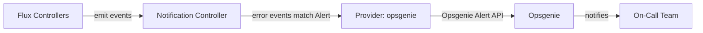

# How to Configure Flux Notification Provider for Opsgenie

Author: [nawazdhandala](https://github.com/nawazdhandala)

Tags: Flux CD, GitOps, Kubernetes, Notifications, Opsgenie, Incident Management, Monitoring

Description: Learn how to configure Flux CD's notification controller to send deployment and reconciliation alerts to Opsgenie using the Provider resource.

---

Opsgenie, part of Atlassian's suite of tools, is an incident management and alerting platform that helps operations teams manage on-call schedules and respond to critical events. By integrating Flux CD with Opsgenie, you can automatically create alerts when Kubernetes deployments fail or reconciliation errors occur.

This guide covers the complete setup from obtaining an Opsgenie API key to verifying that alerts are created correctly.

## Prerequisites

- A Kubernetes cluster with Flux CD installed (including the notification controller)
- `kubectl` access to the cluster
- An Opsgenie account with permission to create API integrations
- The `flux` CLI installed (optional but helpful)

## Step 1: Create an Opsgenie API Integration

In Opsgenie, go to **Settings** then **Integration list**. Click **Add integration** and search for **API**. Create a new API integration and copy the **API Key**. Note the API URL -- it will be either `https://api.opsgenie.com` for US or `https://api.eu.opsgenie.com` for EU.

## Step 2: Create a Kubernetes Secret

Store the Opsgenie API key in a Kubernetes secret.

```bash
# Create a secret containing the Opsgenie API key
kubectl create secret generic opsgenie-api-key \
  --namespace=flux-system \
  --from-literal=token=YOUR_OPSGENIE_API_KEY
```

## Step 3: Create the Flux Notification Provider

Define a Provider resource for Opsgenie.

```yaml
# provider-opsgenie.yaml
# Configures Flux to send notifications to Opsgenie
apiVersion: notification.toolkit.fluxcd.io/v1beta3
kind: Provider
metadata:
  name: opsgenie-provider
  namespace: flux-system
spec:
  # Use "opsgenie" as the provider type
  type: opsgenie
  # The Opsgenie API address (use api.eu.opsgenie.com for EU instances)
  address: https://api.opsgenie.com
  # Reference to the secret containing the API key
  secretRef:
    name: opsgenie-api-key
```

Apply the Provider:

```bash
# Apply the Opsgenie provider configuration
kubectl apply -f provider-opsgenie.yaml
```

## Step 4: Create an Alert Resource

For incident management platforms, you typically want to forward only error events.

```yaml
# alert-opsgenie.yaml
# Routes Flux error events to Opsgenie
apiVersion: notification.toolkit.fluxcd.io/v1beta3
kind: Alert
metadata:
  name: opsgenie-alert
  namespace: flux-system
spec:
  providerRef:
    name: opsgenie-provider
  # Only send error events to avoid alert fatigue
  eventSeverity: error
  eventSources:
    - kind: Kustomization
      name: "*"
    - kind: HelmRelease
      name: "*"
    - kind: GitRepository
      name: "*"
```

Apply the Alert:

```bash
# Apply the alert configuration
kubectl apply -f alert-opsgenie.yaml
```

## Step 5: Verify the Configuration

Check that both resources are ready.

```bash
# Verify provider and alert status
kubectl get providers.notification.toolkit.fluxcd.io -n flux-system
kubectl get alerts.notification.toolkit.fluxcd.io -n flux-system
```

For detailed status:

```bash
# Describe the provider for detailed status and errors
kubectl describe provider opsgenie-provider -n flux-system
```

## Step 6: Test the Notification

Monitor the notification controller logs while triggering a reconciliation:

```bash
# Watch controller logs for outgoing events
kubectl logs -n flux-system deploy/notification-controller -f
```

Any error events will trigger an Opsgenie alert.

## How It Works



The notification controller uses the Opsgenie Alert API to create alerts. Opsgenie then processes the alert according to the configured routing rules, escalation policies, and notification channels.

## EU Region Configuration

If your Opsgenie instance is in the EU region:

```yaml
apiVersion: notification.toolkit.fluxcd.io/v1beta3
kind: Provider
metadata:
  name: opsgenie-eu-provider
  namespace: flux-system
spec:
  type: opsgenie
  # Use the EU API endpoint
  address: https://api.eu.opsgenie.com
  secretRef:
    name: opsgenie-api-key
```

## Routing to Specific Teams

You can include all events and let Opsgenie handle routing, or create separate providers for different teams:

```yaml
# Provider for the platform team
apiVersion: notification.toolkit.fluxcd.io/v1beta3
kind: Provider
metadata:
  name: opsgenie-platform
  namespace: flux-system
spec:
  type: opsgenie
  address: https://api.opsgenie.com
  secretRef:
    name: opsgenie-platform-key
---
# Provider for the application team
apiVersion: notification.toolkit.fluxcd.io/v1beta3
kind: Provider
metadata:
  name: opsgenie-apps
  namespace: flux-system
spec:
  type: opsgenie
  address: https://api.opsgenie.com
  secretRef:
    name: opsgenie-apps-key
---
# Route infrastructure errors to platform team
apiVersion: notification.toolkit.fluxcd.io/v1beta3
kind: Alert
metadata:
  name: opsgenie-platform-alert
  namespace: flux-system
spec:
  providerRef:
    name: opsgenie-platform
  eventSeverity: error
  eventSources:
    - kind: Kustomization
      name: "infrastructure"
---
# Route application errors to app team
apiVersion: notification.toolkit.fluxcd.io/v1beta3
kind: Alert
metadata:
  name: opsgenie-apps-alert
  namespace: flux-system
spec:
  providerRef:
    name: opsgenie-apps
  eventSeverity: error
  eventSources:
    - kind: Kustomization
      name: "apps"
    - kind: HelmRelease
      name: "*"
```

## Troubleshooting

If Opsgenie alerts are not being created:

1. **API key**: Verify the secret contains a `token` key with a valid Opsgenie API key that has create alert permissions.
2. **API endpoint**: Use `https://api.opsgenie.com` for US or `https://api.eu.opsgenie.com` for EU. Using the wrong endpoint will result in authentication errors.
3. **Event severity**: If `eventSeverity` is set to `error`, only error events trigger alerts -- not informational events.
4. **Namespace alignment**: Provider, Alert, and Secret must be in the same namespace.
5. **Controller logs**: Check `kubectl logs -n flux-system deploy/notification-controller` for HTTP errors.
6. **Network access**: The cluster must be able to reach the Opsgenie API on port 443.
7. **Integration limits**: Free-tier Opsgenie accounts have limited integrations. Verify your plan supports API integrations.

## Conclusion

Opsgenie integration with Flux CD ensures that deployment failures and reconciliation errors automatically create alerts that reach the right on-call engineers. Combined with Opsgenie's routing rules and escalation policies, this setup provides a robust incident management workflow for Kubernetes environments managed by Flux CD. The configuration is minimal and can be extended with multiple providers to route alerts to different teams based on the affected resources.
