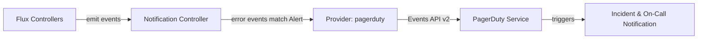

# How to Configure Flux Notification Provider for PagerDuty

Author: [nawazdhandala](https://github.com/nawazdhandala)

Tags: Flux CD, GitOps, Kubernetes, Notifications, PagerDuty, Incident Management, Monitoring

Description: Learn how to configure Flux CD's notification controller to send deployment and reconciliation alerts to PagerDuty using the Provider resource.

---

PagerDuty is a leading incident management platform used by operations teams to manage on-call schedules and respond to critical events. Integrating Flux CD with PagerDuty allows you to automatically create incidents when deployments fail or reconciliation errors occur, ensuring that the right person is paged immediately.

This guide walks through configuring Flux CD to send notifications to PagerDuty using the Events API v2.

## Prerequisites

- A Kubernetes cluster with Flux CD installed (including the notification controller)
- `kubectl` access to the cluster
- A PagerDuty account with permission to create services and integration keys
- The `flux` CLI installed (optional but helpful)

## Step 1: Create a PagerDuty Integration Key

In PagerDuty, navigate to **Services** and select the service where you want Flux events to create incidents (or create a new service). Under the service's **Integrations** tab, click **Add Integration**. Select **Events API v2** and click **Add**. Copy the **Integration Key** (also called a routing key).

## Step 2: Create a Kubernetes Secret

Store the PagerDuty integration key in a Kubernetes secret. For PagerDuty, the `token` field is used for the routing key.

```bash
# Create a secret containing the PagerDuty integration key
kubectl create secret generic pagerduty-integration-key \
  --namespace=flux-system \
  --from-literal=token=YOUR_PAGERDUTY_INTEGRATION_KEY
```

## Step 3: Create the Flux Notification Provider

Define a Provider resource for PagerDuty.

```yaml
# provider-pagerduty.yaml
# Configures Flux to send notifications to PagerDuty
apiVersion: notification.toolkit.fluxcd.io/v1
kind: Provider
metadata:
  name: pagerduty-provider
  namespace: flux-system
spec:
  # Use "pagerduty" as the provider type
  type: pagerduty
  # PagerDuty channel corresponds to the severity of the PagerDuty event
  channel: critical
  # Reference to the secret containing the integration key
  secretRef:
    name: pagerduty-integration-key
```

Apply the Provider:

```bash
# Apply the PagerDuty provider configuration
kubectl apply -f provider-pagerduty.yaml
```

## Step 4: Create an Alert Resource

For PagerDuty, you typically want to forward only error events to avoid creating unnecessary incidents.

```yaml
# alert-pagerduty.yaml
# Routes Flux error events to PagerDuty to create incidents
apiVersion: notification.toolkit.fluxcd.io/v1
kind: Alert
metadata:
  name: pagerduty-alert
  namespace: flux-system
spec:
  providerRef:
    name: pagerduty-provider
  # Only send error events to PagerDuty to avoid alert fatigue
  eventSeverity: error
  eventSources:
    - kind: Kustomization
      name: "*"
    - kind: HelmRelease
      name: "*"
    - kind: GitRepository
      name: "*"
```

Apply the Alert:

```bash
# Apply the alert configuration
kubectl apply -f alert-pagerduty.yaml
```

## Step 5: Verify the Configuration

Check that both resources are ready.

```bash
# Verify provider and alert status
kubectl get providers.notification.toolkit.fluxcd.io -n flux-system
kubectl get alerts.notification.toolkit.fluxcd.io -n flux-system
```

## Step 6: Test the Notification

To test without causing a real failure, you can inspect the notification controller logs while triggering a reconciliation:

```bash
# Check the controller logs for outgoing events
kubectl logs -n flux-system deploy/notification-controller -f
```

In a separate terminal, trigger a reconciliation:

```bash
# Force reconciliation
flux reconcile kustomization flux-system --with-source
```

If there are any errors during reconciliation, an incident will be created in PagerDuty.

## How It Works



The notification controller sends events to the PagerDuty Events API v2 endpoint. PagerDuty then creates an incident on the configured service and notifies the on-call responder according to the service's escalation policy.

## Configuring Event Severity

The `channel` field in the Provider can be used to set the PagerDuty event severity:

```yaml
apiVersion: notification.toolkit.fluxcd.io/v1
kind: Provider
metadata:
  name: pagerduty-warning
  namespace: flux-system
spec:
  type: pagerduty
  # Severity can be: critical, error, warning, or info
  channel: warning
  secretRef:
    name: pagerduty-integration-key
```

## Separate Services for Different Environments

Route production and staging alerts to different PagerDuty services:

```yaml
# Provider for production service
apiVersion: notification.toolkit.fluxcd.io/v1
kind: Provider
metadata:
  name: pagerduty-prod
  namespace: flux-system
spec:
  type: pagerduty
  channel: critical
  secretRef:
    name: pagerduty-prod-key
---
# Provider for staging service
apiVersion: notification.toolkit.fluxcd.io/v1
kind: Provider
metadata:
  name: pagerduty-staging
  namespace: flux-system
spec:
  type: pagerduty
  channel: warning
  secretRef:
    name: pagerduty-staging-key
---
# Alert for production errors
apiVersion: notification.toolkit.fluxcd.io/v1
kind: Alert
metadata:
  name: pagerduty-prod-alert
  namespace: flux-system
spec:
  providerRef:
    name: pagerduty-prod
  eventSeverity: error
  eventSources:
    - kind: Kustomization
      name: "production-*"
---
# Alert for staging errors
apiVersion: notification.toolkit.fluxcd.io/v1
kind: Alert
metadata:
  name: pagerduty-staging-alert
  namespace: flux-system
spec:
  providerRef:
    name: pagerduty-staging
  eventSeverity: error
  eventSources:
    - kind: Kustomization
      name: "staging-*"
```

## Troubleshooting

If PagerDuty incidents are not being created:

1. **Integration key**: Verify the secret contains a `token` key with a valid Events API v2 integration key (not a REST API key).
2. **Service configuration**: Ensure the PagerDuty service has the Events API v2 integration enabled.
3. **Event severity filter**: If you set `eventSeverity: error`, only error events will trigger -- informational events will be skipped.
4. **Namespace alignment**: Provider, Alert, and Secret must be in the same namespace.
5. **Controller logs**: Check `kubectl logs -n flux-system deploy/notification-controller` for HTTP errors.
6. **Network access**: The cluster must be able to reach `events.pagerduty.com` on port 443.
7. **Deduplication**: PagerDuty deduplicates events with the same dedup key. If an incident already exists for the same resource, new events may be grouped rather than creating a new incident.

## Conclusion

PagerDuty integration with Flux CD ensures that deployment failures and reconciliation errors trigger real incidents that reach on-call engineers through PagerDuty's escalation policies. By filtering alerts to error-only events, you avoid alert fatigue while maintaining rapid response capability for genuine issues. This setup is essential for production Kubernetes environments where uptime and rapid incident response are critical.
