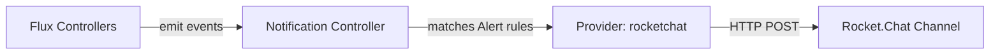

# How to Configure Flux Notification Provider for Rocket.Chat

Author: [nawazdhandala](https://github.com/nawazdhandala)

Tags: Flux CD, GitOps, Kubernetes, Notifications, Rocket.Chat, Monitoring

Description: Learn how to configure Flux CD's notification controller to send deployment and reconciliation alerts to Rocket.Chat channels using the Provider resource.

---

Rocket.Chat is a popular open-source team communication platform that many organizations use as a self-hosted alternative to Slack. Flux CD natively supports Rocket.Chat as a notification provider, making it straightforward to route deployment events and reconciliation alerts to your Rocket.Chat channels.

This guide covers everything from creating a Rocket.Chat webhook to verifying that notifications arrive in your channel.

## Prerequisites

- A Kubernetes cluster with Flux CD installed (including the notification controller)
- `kubectl` access to the cluster
- A Rocket.Chat instance with admin or webhook management permissions
- The `flux` CLI installed (optional but helpful)

## Step 1: Create a Rocket.Chat Incoming Webhook

In your Rocket.Chat instance, go to **Administration** then **Integrations** and click **New Integration**. Select **Incoming WebHook**. Configure it as follows:

- **Enabled**: Yes
- **Name**: Flux CD Notifications
- **Post to Channel**: The channel where you want messages (e.g., `#deployments`)
- **Post as**: Choose a username for the bot (e.g., `flux-bot`)

Save the integration and copy the **Webhook URL**. It will look something like:

```
https://rocketchat.example.com/hooks/TOKEN_VALUE
```

## Step 2: Create a Kubernetes Secret

Store the Rocket.Chat webhook URL in a Kubernetes secret.

```bash
# Create a secret containing the Rocket.Chat webhook URL
kubectl create secret generic rocketchat-webhook-url \
  --namespace=flux-system \
  --from-literal=address=https://rocketchat.example.com/hooks/TOKEN_VALUE
```

## Step 3: Create the Flux Notification Provider

Define a Provider resource for Rocket.Chat.

```yaml
# provider-rocketchat.yaml
# Configures Flux to send notifications to Rocket.Chat
apiVersion: notification.toolkit.fluxcd.io/v1beta3
kind: Provider
metadata:
  name: rocketchat-provider
  namespace: flux-system
spec:
  # Use "rocketchat" as the provider type
  type: rocketchat
  # Channel where messages are posted
  channel: deployments
  # Reference to the secret containing the webhook URL
  secretRef:
    name: rocketchat-webhook-url
```

Apply the Provider:

```bash
# Apply the Rocket.Chat provider configuration
kubectl apply -f provider-rocketchat.yaml
```

## Step 4: Create an Alert Resource

Create an Alert that defines which events to forward.

```yaml
# alert-rocketchat.yaml
# Routes Flux events to the Rocket.Chat provider
apiVersion: notification.toolkit.fluxcd.io/v1beta3
kind: Alert
metadata:
  name: rocketchat-alert
  namespace: flux-system
spec:
  providerRef:
    name: rocketchat-provider
  eventSeverity: info
  eventSources:
    - kind: Kustomization
      name: "*"
    - kind: HelmRelease
      name: "*"
    - kind: GitRepository
      name: "*"
```

Apply the Alert:

```bash
# Apply the alert configuration
kubectl apply -f alert-rocketchat.yaml
```

## Step 5: Verify the Setup

Check both resources are in a ready state.

```bash
# Verify provider and alert status
kubectl get providers.notification.toolkit.fluxcd.io -n flux-system
kubectl get alerts.notification.toolkit.fluxcd.io -n flux-system
```

## Step 6: Test the Notification

Trigger a reconciliation event.

```bash
# Force reconciliation to generate a test notification
flux reconcile kustomization flux-system --with-source
```

A message should appear in your Rocket.Chat channel within a few seconds.

## Architecture Overview



## Error-Only Notifications

To reduce noise and only receive error notifications:

```yaml
apiVersion: notification.toolkit.fluxcd.io/v1beta3
kind: Alert
metadata:
  name: rocketchat-errors
  namespace: flux-system
spec:
  providerRef:
    name: rocketchat-provider
  # Only forward error events
  eventSeverity: error
  eventSources:
    - kind: Kustomization
      name: "*"
    - kind: HelmRelease
      name: "*"
```

## Routing to Multiple Channels

Create separate providers for different channels:

```yaml
# Provider for production alerts
apiVersion: notification.toolkit.fluxcd.io/v1beta3
kind: Provider
metadata:
  name: rocketchat-prod
  namespace: flux-system
spec:
  type: rocketchat
  channel: production-alerts
  secretRef:
    name: rocketchat-webhook-url
---
# Provider for development updates
apiVersion: notification.toolkit.fluxcd.io/v1beta3
kind: Provider
metadata:
  name: rocketchat-dev
  namespace: flux-system
spec:
  type: rocketchat
  channel: dev-updates
  secretRef:
    name: rocketchat-webhook-url
```

## Troubleshooting

If notifications are not arriving in Rocket.Chat:

1. **Secret format**: The secret must contain an `address` key with the complete webhook URL.
2. **Integration enabled**: Verify the incoming webhook integration is enabled in Rocket.Chat administration.
3. **Channel name**: The `channel` field should not include the `#` prefix.
4. **Namespace alignment**: Provider, Alert, and Secret must all be in the same namespace.
5. **Controller logs**: Inspect logs with `kubectl logs -n flux-system deploy/notification-controller`.
6. **Network connectivity**: Ensure the cluster can reach your Rocket.Chat instance. For self-hosted instances behind a firewall, you may need to configure network policies or egress rules.
7. **TLS certificates**: If your Rocket.Chat instance uses a self-signed certificate, the notification controller may reject the connection. You may need to configure the controller to trust the CA.

## Self-Hosted Considerations

Since Rocket.Chat is often self-hosted, keep the following in mind:

- **Internal DNS**: If your Rocket.Chat is on an internal network, make sure Kubernetes DNS can resolve the hostname.
- **Certificate trust**: For instances with custom TLS certificates, you may need to mount the CA bundle into the notification controller.
- **Proxy settings**: If your cluster routes external traffic through a proxy, configure the notification controller's environment variables accordingly.

## Conclusion

Rocket.Chat integration with Flux CD provides a self-hosted notification solution that keeps your team informed about cluster operations without relying on external services. The configuration process is straightforward: create a webhook, store it as a secret, and define Provider and Alert resources. This gives your team real-time visibility into deployments and reconciliation status directly in their communication platform.
