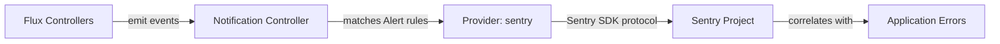

# How to Configure Flux Notification Provider for Sentry

Author: [nawazdhandala](https://github.com/nawazdhandala)

Tags: Flux CD, GitOps, Kubernetes, Notifications, Sentry, Error Tracking, Monitoring

Description: Learn how to configure Flux CD's notification controller to send deployment and reconciliation events to Sentry using the Provider resource.

---

Sentry is a widely used error tracking and performance monitoring platform. By integrating Flux CD with Sentry, you can correlate deployment events with application errors, making it easier to identify which deployments introduced regressions. Sentry uses these events to mark releases and track their impact.

This guide covers setting up a Flux notification Provider for Sentry, from generating a DSN to verifying events appear in your Sentry project.

## Prerequisites

- A Kubernetes cluster with Flux CD installed (including the notification controller)
- `kubectl` access to the cluster
- A Sentry account with a project configured
- The `flux` CLI installed (optional but helpful)

## Step 1: Get Your Sentry DSN

In Sentry, navigate to your project's **Settings** then **Client Keys (DSN)**. Copy the DSN, which is the endpoint used to send events to Sentry.

The DSN looks like:

```text
https://EXAMPLEKEY@o123456.ingest.sentry.io/1234567
```

## Step 2: Create a Kubernetes Secret

Store the Sentry DSN in a Kubernetes secret.

```bash
# Create a secret containing the Sentry DSN
kubectl create secret generic sentry-dsn \
  --namespace=flux-system \
  --from-literal=address=https://EXAMPLEKEY@o123456.ingest.sentry.io/1234567
```

## Step 3: Create the Flux Notification Provider

Define a Provider resource for Sentry.

```yaml
# provider-sentry.yaml
# Configures Flux to send notifications to Sentry
apiVersion: notification.toolkit.fluxcd.io/v1
kind: Provider
metadata:
  name: sentry-provider
  namespace: flux-system
spec:
  # Use "sentry" as the provider type
  type: sentry
  # Channel can be used for the Sentry environment
  channel: production
  # Reference to the secret containing the Sentry DSN
  secretRef:
    name: sentry-dsn
```

Apply the Provider:

```bash
# Apply the Sentry provider configuration
kubectl apply -f provider-sentry.yaml
```

## Step 4: Create an Alert Resource

Create an Alert that specifies which events are sent to Sentry.

```yaml
# alert-sentry.yaml
# Routes Flux events to Sentry
apiVersion: notification.toolkit.fluxcd.io/v1
kind: Alert
metadata:
  name: sentry-alert
  namespace: flux-system
spec:
  providerRef:
    name: sentry-provider
  # Send error events to Sentry for tracking
  eventSeverity: error
  eventSources:
    - kind: Kustomization
      name: "*"
    - kind: HelmRelease
      name: "*"
    - kind: GitRepository
      name: "*"
```

Apply the Alert:

```bash
# Apply the alert configuration
kubectl apply -f alert-sentry.yaml
```

## Step 5: Verify the Configuration

Check that both resources are ready.

```bash
# Verify provider and alert status
kubectl get providers.notification.toolkit.fluxcd.io -n flux-system
kubectl get alerts.notification.toolkit.fluxcd.io -n flux-system
```

## Step 6: Test the Notification

Trigger a reconciliation to generate events:

```bash
# Force reconciliation
flux reconcile kustomization flux-system --with-source
```

If any errors occur, they will appear as events in your Sentry project.

## How It Works



The notification controller sends events to Sentry using the DSN endpoint. Sentry processes these events and can correlate them with application errors, helping you identify deployment-related regressions.

## Tracking Multiple Environments

Use the `channel` field to set the Sentry environment:

```yaml
# Provider for production environment
apiVersion: notification.toolkit.fluxcd.io/v1
kind: Provider
metadata:
  name: sentry-prod
  namespace: flux-system
spec:
  type: sentry
  channel: production
  secretRef:
    name: sentry-dsn
---
# Provider for staging environment
apiVersion: notification.toolkit.fluxcd.io/v1
kind: Provider
metadata:
  name: sentry-staging
  namespace: flux-system
spec:
  type: sentry
  channel: staging
  secretRef:
    name: sentry-dsn
```

## Sending All Events Including Info

If you want to track all deployment events in Sentry, not just errors:

```yaml
apiVersion: notification.toolkit.fluxcd.io/v1
kind: Alert
metadata:
  name: sentry-all-events
  namespace: flux-system
spec:
  providerRef:
    name: sentry-provider
  # Track both successful and failed events
  eventSeverity: info
  eventSources:
    - kind: Kustomization
      name: "*"
    - kind: HelmRelease
      name: "*"
```

This is useful for correlating successful deployments with performance changes in Sentry.

## Troubleshooting

If events are not appearing in Sentry:

1. **DSN format**: Verify the DSN is correct and contains the project ID, key, and organization slug.
2. **Secret format**: The secret must have an `address` key containing the full DSN.
3. **Project configuration**: Ensure the Sentry project is active and accepting events.
4. **Namespace alignment**: Provider, Alert, and Secret must be in the same namespace.
5. **Controller logs**: Check `kubectl logs -n flux-system deploy/notification-controller` for errors.
6. **Network access**: The cluster must be able to reach your Sentry instance (either `sentry.io` or your self-hosted Sentry URL) on port 443.
7. **Rate limits**: Sentry enforces rate limits on incoming events. Check your Sentry project's rate limit settings.
8. **Self-hosted Sentry**: If using a self-hosted Sentry instance, update the DSN to point to your instance's ingest endpoint.

## Conclusion

Integrating Flux CD with Sentry bridges the gap between deployment events and application error tracking. By sending reconciliation events to Sentry, you gain the ability to correlate deployments with error spikes, making it faster to identify and roll back problematic releases. This integration is especially valuable for teams that already use Sentry for application monitoring and want a unified view of deployment impact.
