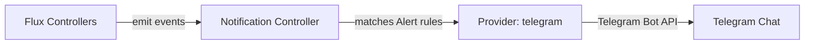

# How to Configure Flux Notification Provider for Telegram

Author: [nawazdhandala](https://github.com/nawazdhandala)

Tags: Flux CD, GitOps, Kubernetes, Notifications, Telegram, Messaging, Monitoring

Description: Learn how to configure Flux CD's notification controller to send deployment and reconciliation alerts to Telegram chats using the Provider resource.

---

Telegram is a popular messaging platform known for its bot API and group chat capabilities. Flux CD supports Telegram as a notification provider, making it easy to receive deployment updates and reconciliation alerts directly in a Telegram chat or group.

This guide covers the full setup from creating a Telegram bot to verifying that notifications arrive in your chat.

## Prerequisites

- A Kubernetes cluster with Flux CD installed (including the notification controller)
- `kubectl` access to the cluster
- A Telegram account
- The `flux` CLI installed (optional but helpful)

## Step 1: Create a Telegram Bot

Open Telegram and search for **@BotFather**. Start a conversation and send the `/newbot` command. Follow the prompts to name your bot and get the **bot token**. The token will look like:

```text
123456789:ABCdefGHIjklMNOpqrSTUvwxYZ
```

## Step 2: Get the Chat ID

Add your bot to the Telegram group or start a direct chat with it. To find the chat ID, you can use the following method:

Send a message to the bot, then query the Telegram API:

```bash
# Replace BOT_TOKEN with your actual bot token
curl -s "https://api.telegram.org/botBOT_TOKEN/getUpdates" | python3 -m json.tool
```

Look for the `chat.id` field in the response. For group chats, the ID will be a negative number (e.g., `-1001234567890`).

## Step 3: Create a Kubernetes Secret

Store the Telegram bot token in a Kubernetes secret. The address should be the Telegram API endpoint with the chat ID.

```bash
# Create a secret containing the Telegram bot token
kubectl create secret generic telegram-bot-token \
  --namespace=flux-system \
  --from-literal=token=YOUR_TELEGRAM_BOT_TOKEN \
  --from-literal=address=https://api.telegram.org
```

## Step 4: Create the Flux Notification Provider

Define a Provider resource for Telegram.

```yaml
# provider-telegram.yaml
# Configures Flux to send notifications to Telegram
apiVersion: notification.toolkit.fluxcd.io/v1beta3
kind: Provider
metadata:
  name: telegram-provider
  namespace: flux-system
spec:
  # Use "telegram" as the provider type
  type: telegram
  # The Telegram chat ID where messages will be sent
  channel: "-1001234567890"
  # Reference to the secret containing the bot token
  secretRef:
    name: telegram-bot-token
```

Apply the Provider:

```bash
# Apply the Telegram provider configuration
kubectl apply -f provider-telegram.yaml
```

## Step 5: Create an Alert Resource

Create an Alert that defines which events are forwarded to Telegram.

```yaml
# alert-telegram.yaml
# Routes Flux events to Telegram
apiVersion: notification.toolkit.fluxcd.io/v1beta3
kind: Alert
metadata:
  name: telegram-alert
  namespace: flux-system
spec:
  providerRef:
    name: telegram-provider
  eventSeverity: info
  eventSources:
    - kind: Kustomization
      name: "*"
    - kind: HelmRelease
      name: "*"
    - kind: GitRepository
      name: "*"
```

Apply the Alert:

```bash
# Apply the alert configuration
kubectl apply -f alert-telegram.yaml
```

## Step 6: Verify the Configuration

Check that both resources are ready.

```bash
# Verify provider and alert status
kubectl get providers.notification.toolkit.fluxcd.io -n flux-system
kubectl get alerts.notification.toolkit.fluxcd.io -n flux-system
```

## Step 7: Test the Notification

Trigger a reconciliation to generate an event:

```bash
# Force reconciliation to produce a test notification
flux reconcile kustomization flux-system --with-source
```

A message should appear in your Telegram chat within seconds.

## How It Works



The notification controller formats Flux events into messages and sends them to the Telegram Bot API, which delivers them to the specified chat.

## Error-Only Notifications

To reduce noise, only receive error notifications:

```yaml
apiVersion: notification.toolkit.fluxcd.io/v1beta3
kind: Alert
metadata:
  name: telegram-errors
  namespace: flux-system
spec:
  providerRef:
    name: telegram-provider
  eventSeverity: error
  eventSources:
    - kind: Kustomization
      name: "*"
    - kind: HelmRelease
      name: "*"
```

## Multiple Telegram Chats

Route different events to different Telegram chats or groups:

```yaml
# Provider for the ops team group
apiVersion: notification.toolkit.fluxcd.io/v1beta3
kind: Provider
metadata:
  name: telegram-ops
  namespace: flux-system
spec:
  type: telegram
  channel: "-1001234567890"
  secretRef:
    name: telegram-bot-token
---
# Provider for the dev team group
apiVersion: notification.toolkit.fluxcd.io/v1beta3
kind: Provider
metadata:
  name: telegram-dev
  namespace: flux-system
spec:
  type: telegram
  channel: "-1009876543210"
  secretRef:
    name: telegram-bot-token
---
# Errors go to ops
apiVersion: notification.toolkit.fluxcd.io/v1beta3
kind: Alert
metadata:
  name: telegram-ops-errors
  namespace: flux-system
spec:
  providerRef:
    name: telegram-ops
  eventSeverity: error
  eventSources:
    - kind: Kustomization
      name: "*"
    - kind: HelmRelease
      name: "*"
---
# All events go to dev
apiVersion: notification.toolkit.fluxcd.io/v1beta3
kind: Alert
metadata:
  name: telegram-dev-all
  namespace: flux-system
spec:
  providerRef:
    name: telegram-dev
  eventSeverity: info
  eventSources:
    - kind: Kustomization
      name: "*"
    - kind: HelmRelease
      name: "*"
```

## Personal Notifications

You can also send notifications to a personal Telegram chat by using your personal chat ID instead of a group chat ID:

```yaml
apiVersion: notification.toolkit.fluxcd.io/v1beta3
kind: Provider
metadata:
  name: telegram-personal
  namespace: flux-system
spec:
  type: telegram
  # Personal chat IDs are positive numbers
  channel: "123456789"
  secretRef:
    name: telegram-bot-token
```

## Troubleshooting

If messages are not appearing in Telegram:

1. **Bot token**: Verify the secret contains a valid `token` key with the bot token from BotFather.
2. **Chat ID**: Ensure the `channel` field contains the correct chat ID. Group chat IDs start with `-100`.
3. **Bot membership**: The bot must be added to the group chat as a member. For groups with privacy mode, the bot needs admin access.
4. **API address**: The secret must contain `address` set to `https://api.telegram.org`.
5. **Namespace alignment**: Provider, Alert, and Secret must be in the same namespace.
6. **Controller logs**: Check `kubectl logs -n flux-system deploy/notification-controller` for errors.
7. **Network access**: The cluster must be able to reach `api.telegram.org` on port 443.
8. **Bot blocked**: If a user has blocked the bot, messages to that personal chat will fail silently.
9. **Rate limits**: Telegram enforces rate limits on bot API calls. If you have many events, some messages may be delayed.

## Conclusion

Telegram integration with Flux CD provides a lightweight and accessible notification channel for Kubernetes deployment events. The Telegram Bot API is straightforward to set up, and Telegram's mobile app ensures you receive notifications wherever you are. Whether you use it for team groups or personal alerts, Telegram notifications from Flux keep you connected to your cluster's deployment activity without requiring complex infrastructure.
