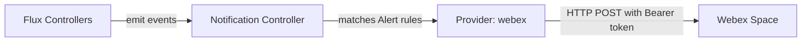

# How to Configure Flux Notification Provider for Webex

Author: [nawazdhandala](https://github.com/nawazdhandala)

Tags: Flux CD, GitOps, Kubernetes, Notifications, Webex, Cisco, Monitoring

Description: Learn how to configure Flux CD's notification controller to send deployment and reconciliation alerts to Webex spaces using the Provider resource.

---

Cisco Webex is a widely used collaboration platform in enterprise environments. Flux CD supports Webex as a notification provider, allowing you to receive Kubernetes deployment updates and reconciliation alerts directly in your Webex spaces.

This guide covers the entire setup process, from creating a Webex bot and webhook to verifying that notifications arrive in your space.

## Prerequisites

- A Kubernetes cluster with Flux CD installed (including the notification controller)
- `kubectl` access to the cluster
- A Webex account with access to create bots or incoming webhooks
- The `flux` CLI installed (optional but helpful)

## Step 1: Create a Webex Bot and Get the Token

Navigate to https://developer.webex.com and sign in. Create a new bot (or use an existing one). The bot will need a bearer token and the room ID of the space where you want to post messages.

To find the room ID, you can use the Webex API or the Webex developer portal to list your rooms.

## Step 2: Create a Kubernetes Secret

Store the Webex bot token in a Kubernetes secret. The address should point to the Webex API endpoint, and the token is stored in the secret.

```bash
# Create a secret containing the Webex configuration
# The address is the Webex API endpoint for messages
kubectl create secret generic webex-secret \
  --namespace=flux-system \
  --from-literal=address=https://webexapis.com/v1/messages \
  --from-literal=token=YOUR_WEBEX_BOT_TOKEN
```

## Step 3: Create the Flux Notification Provider

Define a Provider resource for Webex.

```yaml
# provider-webex.yaml
# Configures Flux to send notifications to Webex
apiVersion: notification.toolkit.fluxcd.io/v1
kind: Provider
metadata:
  name: webex-provider
  namespace: flux-system
spec:
  # Use "webex" as the provider type
  type: webex
  # The Webex room ID where messages will be posted
  channel: WEBEX_ROOM_ID
  # Reference to the secret containing the API address and token
  secretRef:
    name: webex-secret
```

Apply the Provider:

```bash
# Apply the Webex provider configuration
kubectl apply -f provider-webex.yaml
```

## Step 4: Create an Alert Resource

Create an Alert that defines which Flux events are forwarded to Webex.

```yaml
# alert-webex.yaml
# Routes Flux events to the Webex provider
apiVersion: notification.toolkit.fluxcd.io/v1
kind: Alert
metadata:
  name: webex-alert
  namespace: flux-system
spec:
  providerRef:
    name: webex-provider
  eventSeverity: info
  eventSources:
    - kind: Kustomization
      name: "*"
    - kind: HelmRelease
      name: "*"
    - kind: GitRepository
      name: "*"
```

Apply the Alert:

```bash
# Apply the alert configuration
kubectl apply -f alert-webex.yaml
```

## Step 5: Verify the Configuration

Check that both resources are in a ready state.

```bash
# Verify provider and alert status
kubectl get providers.notification.toolkit.fluxcd.io -n flux-system
kubectl get alerts.notification.toolkit.fluxcd.io -n flux-system
```

## Step 6: Test the Notification

Trigger a reconciliation to generate an event.

```bash
# Force reconciliation to produce a test notification
flux reconcile kustomization flux-system --with-source
```

A message should appear in your Webex space shortly.

## How It Works



The notification controller authenticates with the Webex API using the bot token from the secret and posts messages to the room specified in the `channel` field.

## Error-Only Notifications

To only receive error notifications:

```yaml
apiVersion: notification.toolkit.fluxcd.io/v1
kind: Alert
metadata:
  name: webex-errors
  namespace: flux-system
spec:
  providerRef:
    name: webex-provider
  eventSeverity: error
  eventSources:
    - kind: Kustomization
      name: "*"
    - kind: HelmRelease
      name: "*"
```

## Multiple Webex Spaces

Create separate providers for different Webex spaces by using different room IDs:

```yaml
# Provider for production space
apiVersion: notification.toolkit.fluxcd.io/v1
kind: Provider
metadata:
  name: webex-prod
  namespace: flux-system
spec:
  type: webex
  channel: PRODUCTION_ROOM_ID
  secretRef:
    name: webex-secret
---
# Provider for staging space
apiVersion: notification.toolkit.fluxcd.io/v1
kind: Provider
metadata:
  name: webex-staging
  namespace: flux-system
spec:
  type: webex
  channel: STAGING_ROOM_ID
  secretRef:
    name: webex-secret
```

## Troubleshooting

If notifications are not appearing in Webex:

1. **Bot token**: Ensure the token in the secret is a valid bot access token and has not expired.
2. **Room ID**: Verify the `channel` field contains the correct Webex room ID (not the room name).
3. **Bot membership**: The bot must be a member of the Webex space to post messages. Add the bot to the space if it is not already a member.
4. **Secret format**: The secret should contain `address` and `token` keys.
5. **Namespace alignment**: Provider, Alert, and Secret must be in the same namespace.
6. **Controller logs**: Check `kubectl logs -n flux-system deploy/notification-controller` for errors.
7. **Network access**: The cluster must be able to reach `webexapis.com` on port 443.

## Conclusion

Webex integration with Flux CD is a strong fit for enterprise teams that rely on Cisco's collaboration suite. The setup involves creating a bot, storing credentials as a Kubernetes secret, and defining Provider and Alert resources. This gives your team real-time deployment visibility directly within their Webex spaces, reducing context switching and improving incident response times.
