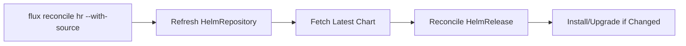
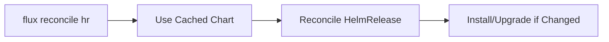

# How to Force Reconcile a HelmRelease in Flux

Author: [nawazdhandala](https://github.com/nawazdhandala)

Tags: Flux CD, GitOps, Kubernetes, Helm, HelmRelease, Reconcile, Operations

Description: Learn how to force an immediate reconciliation of a HelmRelease in Flux CD without waiting for the regular interval.

---

## Introduction

Flux CD reconciles HelmReleases at regular intervals defined by `spec.interval`. However, there are times when you need changes applied immediately -- after pushing a fix, during incident response, or when verifying a deployment. The `flux reconcile` CLI command triggers an immediate reconciliation without waiting for the next interval tick.

## Basic Force Reconciliation

The simplest way to force reconciliation is with the Flux CLI.

```bash
# Force reconcile a HelmRelease
flux reconcile helmrelease my-app -n default
```

You can also use the short alias `hr`.

```bash
# Using the short alias
flux reconcile hr my-app -n default
```

This tells the Helm Controller to immediately check the HelmRelease against its desired state and perform any necessary install, upgrade, or rollback.

## Reconcile with Source

By default, `flux reconcile hr` only reconciles the HelmRelease itself. If you also want to refresh the chart source (fetch the latest chart version), use the `--with-source` flag.

```bash
# Reconcile the HelmRelease and refresh its chart source
flux reconcile hr my-app -n default --with-source
```

This is equivalent to first reconciling the HelmRepository (or GitRepository) source and then reconciling the HelmRelease. It ensures Flux picks up any newly published chart versions.



Without `--with-source`:



## How Force Reconciliation Works

When you run `flux reconcile hr`, Flux annotates the HelmRelease with a reconciliation request timestamp. The Helm Controller detects this annotation and processes the HelmRelease immediately, regardless of the interval.

```bash
# Under the hood, this is equivalent to:
kubectl annotate helmrelease my-app -n default \
  reconcile.fluxcd.io/requestedAt="$(date +%s)" --overwrite
```

The Flux CLI is the preferred method, but knowing the annotation approach is useful for automation scripts.

## Common Use Cases

### After Pushing a Fix

When you have pushed a configuration change to Git and want it applied immediately.

```bash
# Push changes to Git
git add helmrelease.yaml
git commit -m "Fix database connection string"
git push

# Force Flux to pick up the change now
flux reconcile source git flux-system -n flux-system
flux reconcile hr my-app -n default
```

### Verifying Deployment Status

After a change, verify the reconciliation completes successfully.

```bash
# Reconcile and check the result
flux reconcile hr my-app -n default

# Check the status
flux get helmreleases -n default
```

### After Updating a Chart in a HelmRepository

When a new chart version is published and you want to deploy it immediately.

```bash
# Refresh the HelmRepository source and reconcile the release
flux reconcile hr my-app -n default --with-source
```

### After Updating a ConfigMap or Secret

When you update a ConfigMap or Secret referenced in `spec.valuesFrom`, force reconciliation to pick up the new values.

```bash
# Update the ConfigMap
kubectl apply -f updated-configmap.yaml

# Force the HelmRelease to reconcile with the new values
flux reconcile hr my-app -n default
```

### Recovering from a Stuck State

If a HelmRelease appears stuck or is not reconciling properly, force reconciliation can help.

```bash
# Check current status
flux get helmreleases -n default

# Force reconciliation to clear any stuck state
flux reconcile hr my-app -n default

# If still stuck, check the Helm Controller logs
kubectl logs -n flux-system deploy/helm-controller | grep my-app
```

## Reconciling Multiple HelmReleases

You can reconcile multiple HelmReleases by scripting the CLI.

```bash
# Reconcile all HelmReleases in a namespace
for hr in $(flux get helmreleases -n production --no-header | awk '{print $1}'); do
  echo "Reconciling $hr..."
  flux reconcile hr "$hr" -n production
done
```

```bash
# Reconcile specific HelmReleases
for hr in frontend backend-api worker; do
  flux reconcile hr "$hr" -n production --with-source
done
```

## Reconcile vs Resume

It is important to understand the difference between reconciling and resuming.

| Command | Purpose |
|---|---|
| `flux reconcile hr` | Triggers immediate reconciliation of an active (non-suspended) HelmRelease |
| `flux resume hr` | Resumes a suspended HelmRelease and triggers reconciliation |

If a HelmRelease is suspended, `flux reconcile hr` will not have an effect. You need to resume it first.

```bash
# This will NOT work on a suspended HelmRelease
flux reconcile hr my-app -n default

# First resume, which also triggers reconciliation
flux resume hr my-app -n default
```

## Monitoring Reconciliation

After forcing reconciliation, monitor the progress and result.

```bash
# Watch the reconciliation in real-time
flux get helmreleases -n default --watch

# Check the last reconciliation timestamp
kubectl get helmrelease my-app -n default \
  -o jsonpath='{.status.lastHandledReconcileAt}'

# View recent events
kubectl events --for helmrelease/my-app -n default --watch

# Check Helm Controller logs for the reconciliation
kubectl logs -n flux-system deploy/helm-controller --follow | grep my-app
```

## Automation with CI/CD

You can integrate force reconciliation into CI/CD pipelines to ensure deployments are applied immediately after chart or configuration changes.

```bash
#!/bin/bash
# ci-deploy.sh - Force reconciliation after CI/CD changes

NAMESPACE="production"
HELMRELEASE="my-app"

echo "Triggering reconciliation for $HELMRELEASE..."

# Reconcile with source to pick up new chart versions
flux reconcile hr "$HELMRELEASE" -n "$NAMESPACE" --with-source

# Wait and check status
sleep 5
STATUS=$(flux get helmreleases -n "$NAMESPACE" --no-header | grep "$HELMRELEASE" | awk '{print $2}')

if [ "$STATUS" = "True" ]; then
  echo "Reconciliation successful"
else
  echo "Reconciliation may still be in progress or failed"
  flux get helmreleases -n "$NAMESPACE"
  exit 1
fi
```

## Using Annotations for Automation

For programmatic access (without the Flux CLI), use the reconciliation annotation.

```bash
# Trigger reconciliation via annotation (no Flux CLI needed)
kubectl annotate helmrelease my-app -n default \
  reconcile.fluxcd.io/requestedAt="$(date +%s)" \
  --overwrite
```

This is useful in environments where the Flux CLI is not installed, such as within Kubernetes Jobs or custom controllers.

## Conclusion

Force reconciliation with `flux reconcile hr` is an essential operational command for Flux CD. Use it to apply changes immediately after Git pushes, pick up new chart versions with `--with-source`, recover from stuck states, and integrate with CI/CD pipelines. It complements the interval-based reconciliation model by providing on-demand control when you need changes applied right away.
