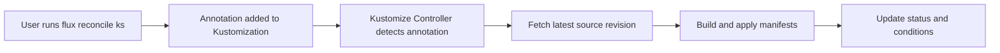

# How to Force Reconcile a Kustomization in Flux

Author: [nawazdhandala](https://github.com/nawazdhandala)

Tags: Flux CD, GitOps, Kubernetes, Kustomize, Reconciliation, Kustomization

Description: Learn how to force reconcile a Kustomization in Flux CD to immediately apply changes without waiting for the next scheduled interval.

---

## Introduction

Flux CD reconciles Kustomizations at a configured interval, typically every 5 to 30 minutes. However, there are times when you need changes applied immediately -- after pushing an urgent fix, correcting a configuration error, or verifying that a new commit works correctly. Flux provides a way to force an immediate reconciliation using the `flux reconcile ks` command.

This guide explains how to trigger on-demand reconciliation, what happens during the process, and how to handle common scenarios.

## Prerequisites

- A Kubernetes cluster with Flux CD installed
- The `flux` CLI installed and configured
- At least one Kustomization resource deployed in your cluster

## How Reconciliation Works in Flux

Under normal operation, the kustomize-controller checks each Kustomization at its configured `spec.interval`. When you force reconcile, Flux annotates the Kustomization with `reconcile.fluxcd.io/requestedAt`, which the controller picks up immediately.



## Forcing a Reconciliation

Use the `flux reconcile ks` command to trigger an immediate reconciliation.

```bash
# Force reconcile a Kustomization named "my-app"
flux reconcile ks my-app
```

Expected output:

```text
► annotating Kustomization my-app in flux-system namespace
✔ Kustomization annotated
◎ waiting for Kustomization reconciliation
✔ Kustomization reconciliation completed
✔ applied revision main@sha1:abc123
```

If the Kustomization is in a non-default namespace, specify it:

```bash
# Force reconcile in a specific namespace
flux reconcile ks my-app --namespace=production
```

## Reconciling with Source

By default, `flux reconcile ks` only reconciles the Kustomization itself using the last fetched source. If you also want to fetch the latest source before reconciling, use the `--with-source` flag.

```bash
# Force reconcile the Kustomization and its source (GitRepository)
flux reconcile ks my-app --with-source
```

This is particularly useful when you have just pushed a commit and want Flux to pick it up immediately without waiting for the source controller's interval as well.

Output with source reconciliation:

```text
► annotating GitRepository my-repo in flux-system namespace
✔ GitRepository annotated
◎ waiting for GitRepository reconciliation
✔ GitRepository reconciliation completed
✔ fetched revision main@sha1:def456
► annotating Kustomization my-app in flux-system namespace
✔ Kustomization annotated
◎ waiting for Kustomization reconciliation
✔ Kustomization reconciliation completed
✔ applied revision main@sha1:def456
```

## Verifying the Reconciliation

After forcing a reconciliation, verify that it completed successfully.

```bash
# Check the Kustomization status
flux get ks my-app
```

Output:

```text
NAME    REVISION            SUSPENDED  READY  MESSAGE
my-app  main@sha1:def456    False      True   Applied revision: main@sha1:def456
```

For more detailed information, use the events command:

```bash
# View recent events for the Kustomization
flux events --for Kustomization/my-app
```

## Reconciling All Kustomizations

To force reconcile all Kustomizations in a namespace, use a loop:

```bash
# Force reconcile all Kustomizations in flux-system namespace
flux get ks --no-header | awk '{print $1}' | xargs -I {} flux reconcile ks {}
```

If you also want to refresh all sources:

```bash
# Force reconcile all Kustomizations with their sources
flux get ks --no-header | awk '{print $1}' | xargs -I {} flux reconcile ks {} --with-source
```

## Using kubectl to Force Reconciliation

You can also trigger reconciliation without the Flux CLI by annotating the Kustomization directly with kubectl.

```bash
# Annotate the Kustomization to trigger reconciliation
kubectl annotate --overwrite kustomization my-app \
  reconcile.fluxcd.io/requestedAt="$(date +%s)" \
  -n flux-system
```

This sets the `requestedAt` annotation to the current timestamp, which the controller detects and uses to trigger a new reconciliation cycle.

## Common Scenarios

### After Pushing a Hotfix

When you push an urgent fix and cannot wait for the next reconciliation interval:

```bash
# Push your fix to Git, then force reconcile with source refresh
git push origin main
flux reconcile ks my-app --with-source
```

### After Updating a ConfigMap or Secret

If you updated a ConfigMap or Secret that a Kustomization depends on:

```bash
# Force reconcile to pick up the new configuration
flux reconcile ks my-app
```

### After Resolving a Failed Reconciliation

If a previous reconciliation failed (for example, due to invalid YAML) and you have fixed the issue in Git:

```bash
# Check the current error
flux get ks my-app

# After fixing in Git, force reconcile with source
flux reconcile ks my-app --with-source

# Verify the fix was applied
flux get ks my-app
```

## Reconciliation vs. Resume

It is important to understand the difference between reconciling and resuming:

- **`flux reconcile ks`** triggers an immediate reconciliation on a Kustomization that is already active (not suspended). It does not change the `spec.suspend` field.
- **`flux resume ks`** sets `spec.suspend` to `false` and triggers a reconciliation. Use this only when a Kustomization is currently suspended.

If you try to reconcile a suspended Kustomization, the reconciliation will be ignored because the controller skips suspended resources. You must resume it first:

```bash
# This will not work on a suspended Kustomization
flux reconcile ks my-app  # ignored if suspended

# Instead, resume it first
flux resume ks my-app
```

## Troubleshooting

### Reconciliation Hangs

If the reconciliation command seems to hang, it may be waiting for the controller to complete. Check the controller logs:

```bash
# Check kustomize-controller logs for issues
kubectl logs -n flux-system deploy/kustomize-controller --tail=100
```

### Reconciliation Completes but Nothing Changes

If the reconciliation succeeds but no changes are applied, the cluster state likely already matches the desired state in Git. Verify by checking the applied revision:

```bash
# Compare the applied revision with the latest commit
flux get ks my-app
git log --oneline -1
```

### Source Not Updated

If the Kustomization reconciles but uses an old revision, the source may not have been refreshed. Use the `--with-source` flag or reconcile the source separately:

```bash
# Reconcile the GitRepository source directly
flux reconcile source git my-repo
```

## Conclusion

Force reconciliation is one of the most frequently used operational commands in Flux CD. The `flux reconcile ks` command gives you immediate control over when changes are applied, making it essential for hotfixes, debugging, and verification workflows. Remember to use `--with-source` when you need to fetch the latest Git revision as part of the reconciliation process.
