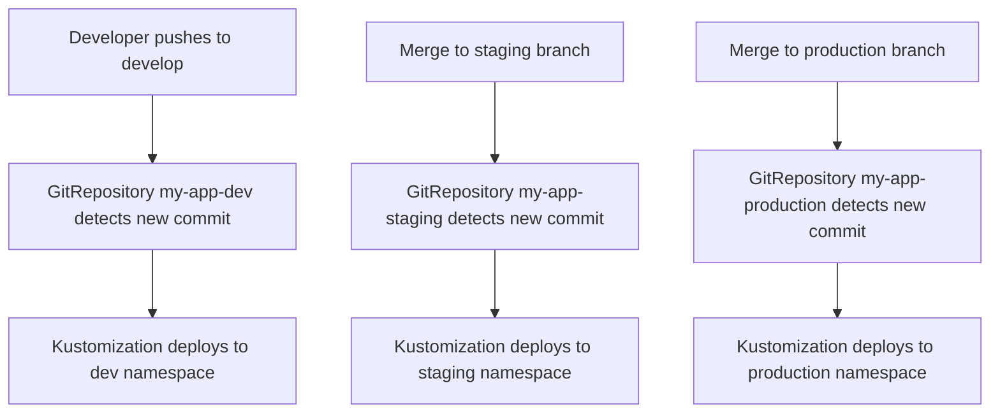

# How to Set Up GitRepository Branch Tracking in Flux

Author: [nawazdhandala](https://github.com/nawazdhandala)

Tags: Flux CD, GitOps, Kubernetes, Source Controller, GitRepository, Branch Tracking

Description: Learn how to configure Flux CD GitRepository sources to track specific branches and automatically deploy changes when new commits are pushed.

---

## Introduction

Branch tracking is the most common way to configure a Flux CD GitRepository source. When you set `spec.ref.branch`, the Source Controller monitors the specified branch and creates a new artifact every time it detects a new commit. This enables continuous deployment where pushing a commit to a branch automatically triggers a reconciliation and deployment cycle.

This guide covers how to configure branch tracking, set up multi-environment deployments using different branches, and optimize the reconciliation interval for your workflow.

## Prerequisites

- A Kubernetes cluster with Flux CD installed
- `kubectl` and the `flux` CLI installed locally
- A Git repository with one or more branches

## Basic Branch Tracking

The most straightforward GitRepository configuration tracks a single branch. Here is how to track the `main` branch.

```yaml
# gitrepository-main.yaml - Track the main branch
apiVersion: source.toolkit.fluxcd.io/v1
kind: GitRepository
metadata:
  name: my-app
  namespace: flux-system
spec:
  interval: 5m
  url: https://github.com/my-org/my-app
  ref:
    # Track the main branch for new commits
    branch: main
```

When the Source Controller reconciles this resource, it fetches the latest commit on the `main` branch and produces an artifact. The artifact revision will look like `main@sha1:abc1234def5678`.

Apply the manifest and verify.

```bash
# Apply the GitRepository manifest
kubectl apply -f gitrepository-main.yaml

# Check that the resource is tracking the branch
flux get sources git my-app -n flux-system
```

## Default Branch Behavior

If you omit the entire `spec.ref` field, Flux defaults to tracking the `main` branch. The following two configurations are equivalent.

```yaml
# These two configurations produce the same result
# Option 1: Explicit branch
apiVersion: source.toolkit.fluxcd.io/v1
kind: GitRepository
metadata:
  name: my-app
  namespace: flux-system
spec:
  interval: 5m
  url: https://github.com/my-org/my-app
  ref:
    branch: main
---
# Option 2: Omit ref entirely (defaults to main)
apiVersion: source.toolkit.fluxcd.io/v1
kind: GitRepository
metadata:
  name: my-app-default
  namespace: flux-system
spec:
  interval: 5m
  url: https://github.com/my-org/my-app
```

It is recommended to always be explicit about the branch you are tracking to avoid confusion, especially if the repository's default branch is not `main`.

## Multi-Environment Branch Strategy

A common pattern is to use different branches for different environments. You can create separate GitRepository resources, each tracking a different branch, and pair them with environment-specific Kustomizations.

```yaml
# gitrepository-environments.yaml - Separate sources for each environment
apiVersion: source.toolkit.fluxcd.io/v1
kind: GitRepository
metadata:
  name: my-app-dev
  namespace: flux-system
spec:
  # Check more frequently in development
  interval: 1m
  url: https://github.com/my-org/my-app
  ref:
    branch: develop
  secretRef:
    name: git-credentials
---
apiVersion: source.toolkit.fluxcd.io/v1
kind: GitRepository
metadata:
  name: my-app-staging
  namespace: flux-system
spec:
  interval: 5m
  url: https://github.com/my-org/my-app
  ref:
    branch: staging
  secretRef:
    name: git-credentials
---
apiVersion: source.toolkit.fluxcd.io/v1
kind: GitRepository
metadata:
  name: my-app-production
  namespace: flux-system
spec:
  # Check less frequently in production
  interval: 10m
  url: https://github.com/my-org/my-app
  ref:
    branch: production
  secretRef:
    name: git-credentials
```

Each GitRepository can then be referenced by a corresponding Kustomization.

```yaml
# kustomization-environments.yaml - Environment-specific Kustomizations
apiVersion: kustomize.toolkit.fluxcd.io/v1
kind: Kustomization
metadata:
  name: my-app-dev
  namespace: flux-system
spec:
  interval: 5m
  sourceRef:
    kind: GitRepository
    name: my-app-dev
  path: ./deploy/overlays/dev
  prune: true
---
apiVersion: kustomize.toolkit.fluxcd.io/v1
kind: Kustomization
metadata:
  name: my-app-staging
  namespace: flux-system
spec:
  interval: 5m
  sourceRef:
    kind: GitRepository
    name: my-app-staging
  path: ./deploy/overlays/staging
  prune: true
---
apiVersion: kustomize.toolkit.fluxcd.io/v1
kind: Kustomization
metadata:
  name: my-app-production
  namespace: flux-system
spec:
  interval: 10m
  sourceRef:
    kind: GitRepository
    name: my-app-production
  path: ./deploy/overlays/production
  prune: true
```

## Deployment Flow with Branch Tracking

The following diagram illustrates how branch tracking drives deployments across environments.



## Choosing the Right Reconciliation Interval

The `spec.interval` field controls how frequently the Source Controller checks for new commits. Choosing the right interval involves balancing responsiveness against load on your Git server.

| Environment | Suggested Interval | Rationale |
|---|---|---|
| Development | 1m | Fast feedback loop for developers |
| Staging | 5m | Reasonable balance |
| Production | 10m-30m | Stability over speed |

You can always trigger an immediate reconciliation manually.

```bash
# Force immediate reconciliation without waiting for the interval
flux reconcile source git my-app-dev -n flux-system
```

## Tracking Feature Branches

For pull request previews or feature branch deployments, you can dynamically create GitRepository resources that track feature branches. This is typically done through automation or a controller.

```yaml
# gitrepository-feature.yaml - Track a feature branch for preview deployment
apiVersion: source.toolkit.fluxcd.io/v1
kind: GitRepository
metadata:
  name: my-app-feature-login-v2
  namespace: flux-system
spec:
  interval: 1m
  url: https://github.com/my-org/my-app
  ref:
    # Track a specific feature branch
    branch: feature/login-v2
  secretRef:
    name: git-credentials
```

Remember to clean up feature branch GitRepository resources after the branch is merged.

```bash
# Delete the feature branch GitRepository after merging
kubectl delete gitrepository my-app-feature-login-v2 -n flux-system
```

## Monitoring Branch Tracking

You can monitor all GitRepository sources and their current revisions across your cluster.

```bash
# List all GitRepository sources and their tracked revisions
flux get sources git --all-namespaces

# Watch for changes in real time
flux get sources git -n flux-system --watch
```

To set up alerts when a branch tracking source fails, you can use the Flux notification controller with a Provider and Alert resource.

```yaml
# alert-git-failures.yaml - Alert when GitRepository reconciliation fails
apiVersion: notification.toolkit.fluxcd.io/v1beta3
kind: Alert
metadata:
  name: git-source-failures
  namespace: flux-system
spec:
  providerRef:
    name: slack-provider
  eventSeverity: error
  eventSources:
    - kind: GitRepository
      name: '*'
```

## Troubleshooting

If a branch-tracking GitRepository is not updating when you push new commits, check the following.

```bash
# Verify the branch exists in the remote repository
git ls-remote --heads https://github.com/my-org/my-app

# Check the GitRepository status for errors
kubectl describe gitrepository my-app -n flux-system

# Force a reconciliation and watch the result
flux reconcile source git my-app -n flux-system --with-source
```

Common issues include:

- **Branch does not exist**: Verify the branch name is spelled correctly and exists in the remote repository.
- **Stale artifact**: If the interval is long, you may need to wait or force a reconciliation.
- **Authentication failure**: If the repository is private, ensure the Secret referenced by `secretRef` is valid.

## Conclusion

Branch tracking is the foundation of most Flux CD GitOps workflows. By configuring the `spec.ref.branch` field, you instruct Flux to continuously monitor a branch and deploy the latest changes automatically. Combined with environment-specific branches and appropriate reconciliation intervals, branch tracking provides a flexible and predictable deployment pipeline.
