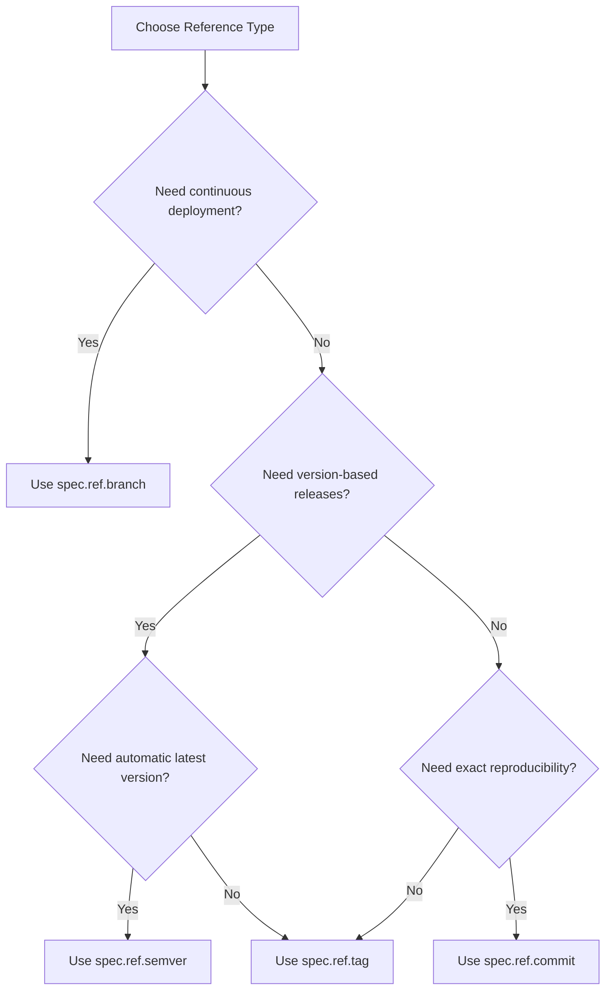

# How to Set Up GitRepository Commit SHA Pinning in Flux

Author: [nawazdhandala](https://github.com/nawazdhandala)

Tags: Flux CD, GitOps, Kubernetes, Source Controller, GitRepository, Commit SHA, Pinning

Description: Learn how to pin a Flux CD GitRepository source to a specific commit SHA for immutable, reproducible deployments.

---

## Introduction

Commit SHA pinning is the most precise way to specify which version of a Git repository Flux CD should deploy. While branch tracking follows a moving target and tag tracking depends on tag immutability, commit SHA pinning references an exact, immutable point in the repository history. This guarantees that the deployed version cannot change unless you explicitly update the commit SHA.

This guide covers how to configure commit SHA pinning, when to use it, and how to integrate it into your deployment workflow.

## Prerequisites

- A Kubernetes cluster with Flux CD installed
- `kubectl` and the `flux` CLI installed locally
- A Git repository with known commit SHAs

## Basic Commit SHA Pinning

To pin a GitRepository to a specific commit, set `spec.ref.commit` to the full commit SHA. You must also specify a `branch` when using `commit` so that the Source Controller knows which branch to search for the commit.

```yaml
# gitrepository-commit.yaml - Pin to a specific commit SHA
apiVersion: source.toolkit.fluxcd.io/v1
kind: GitRepository
metadata:
  name: my-app
  namespace: flux-system
spec:
  interval: 5m
  url: https://github.com/my-org/my-app
  ref:
    # The branch that contains the commit
    branch: main
    # The full commit SHA to pin to
    commit: a1b2c3d4e5f6a7b8c9d0e1f2a3b4c5d6e7f8a9b0
```

Apply the manifest and verify.

```bash
# Apply the GitRepository manifest
kubectl apply -f gitrepository-commit.yaml

# Verify the source is pinned to the commit
flux get sources git my-app -n flux-system
```

The artifact revision will show the pinned commit SHA, confirming that the Source Controller fetched exactly that commit.

## Finding the Commit SHA

You can find the commit SHA for a specific point in your repository using standard Git commands.

```bash
# Get the full SHA of the latest commit on main
git rev-parse main

# Get the full SHA of a specific tag
git rev-parse v1.2.3

# List recent commits with their SHAs
git log --oneline -10 main
```

Always use the full 40-character SHA, not the abbreviated form. While Flux may accept abbreviated SHAs in some cases, using the full SHA is more reliable and explicit.

## When to Use Commit SHA Pinning

Commit SHA pinning is ideal for the following scenarios:

1. **Compliance and audit requirements**: When regulations require you to prove exactly which version of code was deployed at a given time.
2. **Hotfix deployments**: When you need to deploy a specific commit that may not yet have a tag.
3. **Rollback to a known good state**: When you need to revert to a specific commit that was previously running in production.
4. **Reproducible builds**: When you need to guarantee that the same artifact is produced regardless of when the reconciliation occurs.
5. **Security-sensitive environments**: When any change, including tag movements, must be explicitly authorized.

## Commit SHA Pinning vs Other Reference Types

The following comparison helps you choose the right reference type for your use case.



## Rollback Using Commit SHA Pinning

One of the most practical uses of commit SHA pinning is performing a rollback. If you discover an issue with the latest deployment, you can pin the GitRepository to the last known good commit.

```yaml
# gitrepository-rollback.yaml - Rollback to a known good commit
apiVersion: source.toolkit.fluxcd.io/v1
kind: GitRepository
metadata:
  name: my-app
  namespace: flux-system
spec:
  interval: 5m
  url: https://github.com/my-org/my-app
  ref:
    branch: main
    # Pin to the last known good commit
    commit: f8e7d6c5b4a3f2e1d0c9b8a7f6e5d4c3b2a1f0e9
```

You can perform this rollback quickly using kubectl patch.

```bash
# Rollback by patching the commit reference
kubectl patch gitrepository my-app -n flux-system \
  --type=merge \
  -p '{"spec":{"ref":{"commit":"f8e7d6c5b4a3f2e1d0c9b8a7f6e5d4c3b2a1f0e9"}}}'

# Force reconciliation to apply the rollback immediately
flux reconcile source git my-app -n flux-system
```

## Transitioning Between Reference Types

You can switch between different reference types by updating the `spec.ref` field. For example, to move from branch tracking to commit pinning during an incident, or back to branch tracking after the incident is resolved.

```yaml
# During normal operation - track the branch
apiVersion: source.toolkit.fluxcd.io/v1
kind: GitRepository
metadata:
  name: my-app
  namespace: flux-system
spec:
  interval: 5m
  url: https://github.com/my-org/my-app
  ref:
    branch: main
```

```yaml
# During an incident - pin to a safe commit
apiVersion: source.toolkit.fluxcd.io/v1
kind: GitRepository
metadata:
  name: my-app
  namespace: flux-system
spec:
  interval: 5m
  url: https://github.com/my-org/my-app
  ref:
    branch: main
    commit: a1b2c3d4e5f6a7b8c9d0e1f2a3b4c5d6e7f8a9b0
```

When both `branch` and `commit` are specified, `commit` takes precedence. The `branch` field is used to determine which branch to clone, but the checkout is performed at the specified commit.

## Automating Commit SHA Updates

In a GitOps workflow, the commit SHA in your Flux configuration should be updated through pull requests. Here is an example of how a CI pipeline might automate this.

```bash
# Example: CI script to update the commit SHA in the Flux config repo
# Run this after a successful build/test of the application

# Get the commit SHA that passed CI
NEW_SHA=$(git rev-parse HEAD)

# Clone the Flux config repo
git clone https://github.com/my-org/flux-config.git
cd flux-config

# Update the commit SHA in the GitRepository manifest
# Using sed to replace the commit field value
sed -i "s/commit: .*/commit: ${NEW_SHA}/" clusters/production/sources/my-app.yaml

# Commit and push the change
git add clusters/production/sources/my-app.yaml
git commit -m "Deploy my-app at commit ${NEW_SHA}"
git push origin main
```

## Verification and Audit

After pinning to a commit, verify the exact revision that is deployed.

```bash
# Get the current artifact revision
kubectl get gitrepository my-app -n flux-system \
  -o jsonpath='{.status.artifact.revision}{"\n"}'

# Verify it matches the expected commit
# Expected output: main@sha1:a1b2c3d4e5f6a7b8c9d0e1f2a3b4c5d6e7f8a9b0
```

For audit purposes, you can also check when the artifact was last updated.

```bash
# Get the last update timestamp
kubectl get gitrepository my-app -n flux-system \
  -o jsonpath='{.status.artifact.lastUpdateTime}{"\n"}'
```

## Troubleshooting

If the GitRepository fails to reconcile when using commit SHA pinning, check the following.

```bash
# Check the GitRepository status conditions
kubectl get gitrepository my-app -n flux-system -o yaml | grep -A 5 "conditions:"

# Look for errors in Source Controller logs
kubectl logs -n flux-system deployment/source-controller | grep "my-app"
```

Common issues include:

- **Commit not found**: Ensure the commit SHA is correct and exists on the specified branch. The commit must be reachable from the branch tip.
- **Abbreviated SHA**: Use the full 40-character SHA. Abbreviated SHAs may not be unique and can cause errors.
- **Branch mismatch**: The specified branch must contain the commit. If the commit is on a different branch, update the `branch` field accordingly.

## Conclusion

Commit SHA pinning provides the highest level of deployment precision in Flux CD. By referencing an immutable commit SHA, you eliminate any ambiguity about what is deployed. This makes it the ideal choice for production environments with strict compliance requirements, rollback scenarios, and any situation where reproducibility is paramount. While it requires more manual updates than branch or semver tracking, the tradeoff in predictability and auditability is often worth it.
