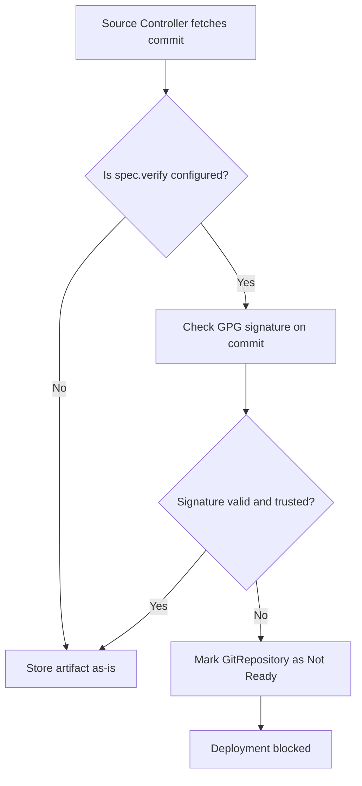

# How to Verify GitRepository Commits with GPG Signatures in Flux

Author: [nawazdhandala](https://github.com/nawazdhandala)

Tags: Flux CD, GitOps, Kubernetes, GPG, Signature Verification, GitRepository, Security

Description: Learn how to configure Flux CD to verify GPG signatures on Git commits, ensuring only cryptographically signed code gets deployed to your cluster.

---

Supply chain security is critical in GitOps workflows. If an attacker gains write access to your Git repository, they could push malicious changes that Flux would automatically deploy. GPG signature verification adds a layer of defense by ensuring that only commits signed by trusted keys are accepted. This guide walks you through configuring the `spec.verify` field on Flux GitRepository resources.

## Prerequisites

Before you begin, make sure you have:

- A Kubernetes cluster with Flux CD installed
- The Flux CLI (`flux`) installed locally
- GPG keys set up for your team members who sign commits
- `kubectl` access to your cluster

## How GPG Verification Works in Flux

When you configure `spec.verify` on a GitRepository, the Flux source controller checks the GPG signature on the latest commit of the specified branch or tag. If the signature cannot be verified against the provided public keys, the source controller refuses to update the artifact and marks the GitRepository as not ready.

The verification flow looks like this.



## Step 1: Export Your GPG Public Keys

First, export the GPG public keys of all team members who are authorized to sign commits.

```bash
# List available GPG keys
gpg --list-keys

# Export a public key in ASCII armor format
gpg --export --armor developer@example.com > developer-public.asc
```

If you have multiple authorized signers, export all of their keys.

```bash
# Export multiple keys into a single file
gpg --export --armor developer1@example.com developer2@example.com > team-public-keys.asc
```

## Step 2: Create a Kubernetes Secret with the Public Keys

Store the GPG public keys in a Kubernetes Secret that the source controller can access.

```bash
# Create a secret containing the GPG public keys
kubectl create secret generic git-gpg-public-keys \
  --namespace=flux-system \
  --from-file=author.asc=team-public-keys.asc
```

Alternatively, define the secret as a YAML manifest.

```yaml
# gpg-keys-secret.yaml
# Secret containing GPG public keys for commit verification
apiVersion: v1
kind: Secret
metadata:
  name: git-gpg-public-keys
  namespace: flux-system
type: Opaque
data:
  # Base64-encoded GPG public key(s)
  author.asc: <base64-encoded-public-keys>
```

```bash
# Generate base64 encoding of your key file
cat team-public-keys.asc | base64

# Apply the secret
kubectl apply -f gpg-keys-secret.yaml
```

## Step 3: Configure the GitRepository with Verification

Add the `spec.verify` field to your GitRepository resource, referencing the secret that contains the trusted public keys.

```yaml
# gitrepository-gpg-verified.yaml
# GitRepository with GPG signature verification enabled
apiVersion: source.toolkit.fluxcd.io/v1
kind: GitRepository
metadata:
  name: my-app
  namespace: flux-system
spec:
  interval: 5m
  url: https://github.com/your-org/my-app.git
  ref:
    branch: main
  # Verify GPG signatures on commits
  verify:
    mode: HEAD
    secretRef:
      name: git-gpg-public-keys
```

The `mode: HEAD` setting tells Flux to verify the signature on the HEAD commit of the specified branch. This is currently the only supported mode.

```bash
# Apply the GitRepository with verification
kubectl apply -f gitrepository-gpg-verified.yaml
```

## Step 4: Verify the Configuration

Check that the GitRepository successfully reconciles with signature verification active.

```bash
# Check the GitRepository status
flux get source git my-app
```

If the latest commit is properly signed by one of the trusted keys, you will see the source in a ready state.

```text
NAME    REVISION              SUSPENDED   READY   MESSAGE
my-app  main@sha1:abc123def   False       True    verified signature of commit 'abc123def'
```

For more detail, describe the resource.

```bash
# Get detailed conditions and events
kubectl describe gitrepository my-app -n flux-system
```

## Step 5: Test with an Unsigned Commit

To confirm that verification is working, push an unsigned commit to your repository and observe what happens.

```bash
# Push a commit without a GPG signature
git commit --no-gpg-sign -m "test unsigned commit"
git push origin main

# After the reconciliation interval, check status
flux get source git my-app
```

The GitRepository should report a verification failure.

```text
NAME    REVISION    SUSPENDED   READY   MESSAGE
my-app              False       False   failed to verify signature of commit 'xyz789': no valid signature found
```

## Step 6: Signing Commits Correctly

Ensure your team members are signing their commits consistently.

```bash
# Configure Git to sign all commits by default
git config --global commit.gpgsign true

# Set the GPG key to use for signing
git config --global user.signingkey YOUR_KEY_ID

# Make a signed commit
git commit -S -m "signed commit message"

# Verify a commit signature locally
git verify-commit HEAD
```

## Handling Key Rotation

When team members change or keys expire, update the secret with the new set of public keys.

```bash
# Export the updated set of public keys
gpg --export --armor dev1@example.com dev2@example.com newdev@example.com > updated-keys.asc

# Update the Kubernetes secret
kubectl create secret generic git-gpg-public-keys \
  --namespace=flux-system \
  --from-file=author.asc=updated-keys.asc \
  --dry-run=client -o yaml | kubectl apply -f -

# Force reconciliation to pick up the new keys
flux reconcile source git my-app
```

## Using Cosign for Keyless Verification

Flux also supports Cosign for signature verification, which can work with keyless signing via Sigstore. This is configured through the same `spec.verify` field but with a different mode.

```yaml
# gitrepository-cosign-verified.yaml
# GitRepository with Cosign signature verification
apiVersion: source.toolkit.fluxcd.io/v1
kind: GitRepository
metadata:
  name: my-app
  namespace: flux-system
spec:
  interval: 5m
  url: https://github.com/your-org/my-app.git
  ref:
    branch: main
  verify:
    mode: HEAD
    provider: cosign
    secretRef:
      name: cosign-public-keys
```

## Troubleshooting

Common issues with GPG verification in Flux.

```bash
# Check source controller logs for verification errors
kubectl logs -n flux-system deployment/source-controller | grep -i "verify\|gpg\|signature"

# Verify the secret exists and has the expected data
kubectl get secret git-gpg-public-keys -n flux-system -o jsonpath='{.data}' | jq
```

- **"no valid signature found"**: The commit is either unsigned or signed with a key not in the secret. Verify the public key in the secret matches the signing key.
- **"failed to verify signature"**: The public key may be corrupted or in the wrong format. Ensure it is a valid ASCII-armored GPG public key.
- **Old commits verified, new ones fail**: A team member may not have GPG signing enabled. Check their Git configuration.

## Summary

GPG signature verification in Flux GitRepository resources adds a strong security gate to your GitOps pipeline. By configuring `spec.verify` with your team's trusted public keys, you ensure that only authenticated, signed commits can trigger deployments. This protects against unauthorized changes, even if an attacker gains write access to your repository. Remember to keep your key secret updated as team membership and keys change.
