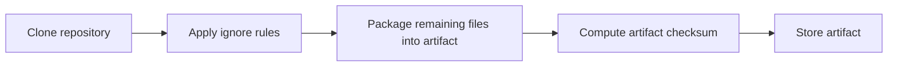

# How to Configure GitRepository Ignore Rules in Flux

Author: [nawazdhandala](https://github.com/nawazdhandala)

Tags: Flux CD, GitOps, Kubernetes, Source Controller, GitRepository, Ignore Rules, Artifact Optimization

Description: Learn how to configure ignore rules in Flux CD GitRepository sources to exclude unnecessary files from artifacts and prevent unwanted reconciliations.

---

## Introduction

When the Flux Source Controller clones a Git repository, it packages the contents into a tarball artifact that downstream resources like Kustomizations consume. By default, every file in the repository is included in the artifact. For repositories that contain documentation, tests, CI configuration, and other non-deployment files alongside Kubernetes manifests, this can lead to unnecessarily large artifacts and spurious reconciliations triggered by changes to irrelevant files.

The `spec.ignore` field in the GitRepository resource lets you exclude files and directories from the artifact using `.gitignore`-style syntax. This guide explains how to configure ignore rules effectively.

## Prerequisites

- A Kubernetes cluster with Flux CD installed
- `kubectl` and the `flux` CLI installed locally
- A Git repository containing both deployment manifests and other files

## Basic Ignore Rules

The `spec.ignore` field accepts a multi-line string using `.gitignore` pattern syntax. Files matching these patterns are excluded from the artifact.

```yaml
# gitrepository-ignore.yaml - Exclude non-deployment files
apiVersion: source.toolkit.fluxcd.io/v1
kind: GitRepository
metadata:
  name: my-app
  namespace: flux-system
spec:
  interval: 5m
  url: https://github.com/my-org/my-app
  ref:
    branch: main
  # Ignore rules using .gitignore syntax
  ignore: |
    # Exclude documentation
    /docs/
    /*.md
    LICENSE
    # Exclude CI/CD configuration
    /.github/
    /.gitlab-ci.yml
    /Jenkinsfile
    # Exclude tests
    /tests/
    /test/
    # Exclude development files
    /Makefile
    /Dockerfile
    /.dockerignore
```

Apply the manifest.

```bash
# Apply the GitRepository with ignore rules
kubectl apply -f gitrepository-ignore.yaml

# Verify the source reconciles successfully
flux get sources git my-app -n flux-system
```

## How Ignore Rules Work

The Source Controller processes ignore rules after cloning the repository and before creating the artifact. The flow is as follows.



Importantly, ignore rules affect two things:

1. **Artifact size**: Excluded files are not packaged into the tarball, reducing its size.
2. **Change detection**: Changes to excluded files do not trigger new artifacts or downstream reconciliations. If the only changes in a new commit are to ignored files, the artifact checksum remains the same.

## Pattern Syntax Reference

The ignore rules follow standard `.gitignore` syntax. Here are the most useful patterns.

```yaml
spec:
  ignore: |
    # Comments start with #

    # Ignore a specific file in the root directory
    /README.md

    # Ignore all files with a specific extension anywhere in the tree
    *.md

    # Ignore a specific directory and all its contents
    /docs/

    # Ignore all directories with a specific name at any depth
    **/test/

    # Ignore all files in a directory but keep the directory
    /config/*.example

    # Negate a pattern (include a file that would otherwise be ignored)
    !README.md
    # Note: negation must come after the pattern it negates

    # Ignore everything except a specific directory
    /*
    !/deploy/
```

## Common Ignore Configurations

### Monorepo with Multiple Services

In a monorepo where multiple services share a single repository, each GitRepository source can ignore everything except its own directory.

```yaml
# gitrepository-service-a.yaml - Only include the service-a directory
apiVersion: source.toolkit.fluxcd.io/v1
kind: GitRepository
metadata:
  name: service-a
  namespace: flux-system
spec:
  interval: 5m
  url: https://github.com/my-org/monorepo
  ref:
    branch: main
  ignore: |
    # Ignore everything at the root
    /*
    # But include the service-a deploy directory
    !/services/service-a/
```

```yaml
# gitrepository-service-b.yaml - Only include the service-b directory
apiVersion: source.toolkit.fluxcd.io/v1
kind: GitRepository
metadata:
  name: service-b
  namespace: flux-system
spec:
  interval: 5m
  url: https://github.com/my-org/monorepo
  ref:
    branch: main
  ignore: |
    # Ignore everything at the root
    /*
    # But include the service-b deploy directory
    !/services/service-b/
```

### Application Repository with Source Code

For repositories that contain both application source code and Kubernetes manifests, exclude the source code.

```yaml
# gitrepository-app-repo.yaml - Exclude application source code
apiVersion: source.toolkit.fluxcd.io/v1
kind: GitRepository
metadata:
  name: my-app
  namespace: flux-system
spec:
  interval: 5m
  url: https://github.com/my-org/my-app
  ref:
    branch: main
  ignore: |
    # Exclude source code directories
    /src/
    /lib/
    /pkg/
    /cmd/
    /internal/
    # Exclude build and dependency files
    /vendor/
    /node_modules/
    go.mod
    go.sum
    package.json
    package-lock.json
    # Exclude documentation and metadata
    /*.md
    /docs/
    LICENSE
    # Exclude CI configuration
    /.github/
    /.gitlab-ci.yml
    # Exclude container build files
    /Dockerfile*
    /.dockerignore
    # Exclude test files
    /tests/
    *_test.go
```

### Dedicated Infrastructure Repository

For a repository that contains only Kubernetes manifests, you typically only need to exclude documentation and CI files.

```yaml
# gitrepository-infra.yaml - Minimal ignore rules for an infra repo
apiVersion: source.toolkit.fluxcd.io/v1
kind: GitRepository
metadata:
  name: infrastructure
  namespace: flux-system
spec:
  interval: 10m
  url: https://github.com/my-org/infrastructure
  ref:
    branch: main
  ignore: |
    # Exclude documentation
    /*.md
    /docs/
    LICENSE
    # Exclude CI files
    /.github/
```

## Reducing Spurious Reconciliations

One of the key benefits of ignore rules is preventing unnecessary reconciliations. Without ignore rules, a commit that only updates a README file would trigger a new artifact and cause all downstream Kustomizations to reconcile. With proper ignore rules, changes to excluded files are invisible to Flux.

Consider this scenario. You have a Kustomization that runs database migrations on every reconciliation. Without ignore rules, updating documentation in the same repository would trigger the migration Kustomization unnecessarily.

```yaml
# Prevent documentation changes from triggering deployments
apiVersion: source.toolkit.fluxcd.io/v1
kind: GitRepository
metadata:
  name: my-app
  namespace: flux-system
spec:
  interval: 5m
  url: https://github.com/my-org/my-app
  ref:
    branch: main
  ignore: |
    # These changes should not trigger deployments
    /*.md
    /docs/
    /CHANGELOG.md
    /CONTRIBUTING.md
    /.github/ISSUE_TEMPLATE/
    /.github/PULL_REQUEST_TEMPLATE.md
```

## Verifying Ignore Rules

To verify that your ignore rules are working correctly, you can check whether changes to ignored files produce new artifacts.

```bash
# Record the current artifact revision
kubectl get gitrepository my-app -n flux-system \
  -o jsonpath='{.status.artifact.revision}{"\n"}'

# After pushing a commit that only changes ignored files,
# force a reconciliation
flux reconcile source git my-app -n flux-system

# Check the artifact revision again - it should be the same
kubectl get gitrepository my-app -n flux-system \
  -o jsonpath='{.status.artifact.revision}{"\n"}'
```

If the revision changed despite only modifying ignored files, your ignore patterns may not be matching correctly. Double-check the pattern syntax.

## Troubleshooting

Common issues with ignore rules include:

- **Patterns not matching**: Ensure paths start with `/` for root-relative patterns. Without a leading `/`, the pattern matches at any depth.
- **Negation not working**: Negation patterns (`!`) must appear after the pattern they are negating. Order matters.
- **Directory not ignored**: Directory patterns must end with `/` to match only directories. Without the trailing slash, the pattern also matches files with that name.

```bash
# Check the Source Controller logs for artifact details
kubectl logs -n flux-system deployment/source-controller | grep "my-app"
```

## Conclusion

Configuring ignore rules in your Flux CD GitRepository sources is a best practice that reduces artifact sizes, prevents spurious reconciliations, and makes your GitOps pipeline more efficient. By excluding non-deployment files like documentation, tests, CI configuration, and source code, you ensure that only meaningful changes trigger deployments. Take the time to set up appropriate ignore rules for each of your GitRepository sources, especially in monorepo setups and repositories that mix application code with deployment manifests.
