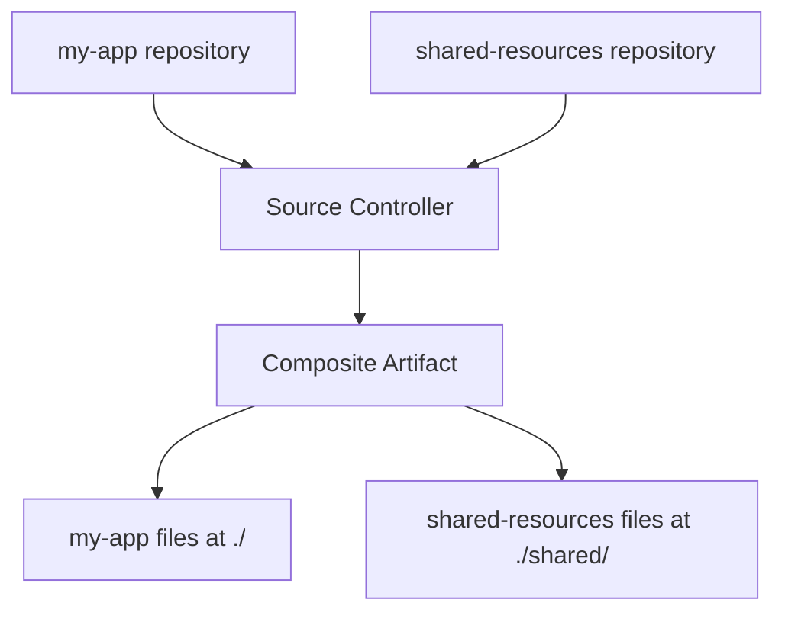

# How to Configure GitRepository Include Paths in Flux

Author: [nawazdhandala](https://github.com/nawazdhandala)

Tags: Flux CD, GitOps, Kubernetes, Source Controller, GitRepository, Include Paths, Monorepo

Description: Learn how to use the spec.include field in Flux CD GitRepository sources to compose artifacts from multiple repositories or specific subdirectories.

---

## Introduction

The `spec.include` field in the Flux CD GitRepository resource allows you to compose an artifact by including files from other GitRepository sources. This is a powerful feature for organizations that split their configuration across multiple repositories or need to combine shared resources with application-specific manifests. Instead of duplicating configuration, you can reference common resources from a shared repository and include them alongside your application manifests.

This guide covers how to configure `spec.include`, practical use cases like shared libraries and multi-repo setups, and how the Source Controller assembles the composite artifact.

## Prerequisites

- A Kubernetes cluster with Flux CD installed
- `kubectl` and the `flux` CLI installed locally
- Two or more Git repositories (or a clear use case for combining repository contents)

## Understanding spec.include

The `spec.include` field is a list of references to other GitRepository sources. When the Source Controller reconciles a GitRepository with `spec.include`, it:

1. Clones the main repository
2. Fetches the artifacts from each included GitRepository
3. Copies the included files into a specified directory within the main repository's artifact
4. Packages everything into a single composite artifact

Each include entry has two fields:
- `repository`: A reference to another GitRepository resource
- `fromPath`: The path within the included repository to copy from
- `toPath`: The destination path in the composite artifact

## Basic Include Configuration

Suppose you have two repositories: one containing shared Kubernetes resources and another containing application-specific manifests. You want to combine them into a single artifact.

First, create a GitRepository for the shared resources.

```yaml
# shared-resources-source.yaml - The shared resources repository
apiVersion: source.toolkit.fluxcd.io/v1
kind: GitRepository
metadata:
  name: shared-resources
  namespace: flux-system
spec:
  interval: 10m
  url: https://github.com/my-org/shared-k8s-resources
  ref:
    branch: main
```

Next, create the main GitRepository that includes the shared resources.

```yaml
# my-app-source.yaml - Main repository with included shared resources
apiVersion: source.toolkit.fluxcd.io/v1
kind: GitRepository
metadata:
  name: my-app
  namespace: flux-system
spec:
  interval: 5m
  url: https://github.com/my-org/my-app
  ref:
    branch: main
  # Include files from other GitRepository sources
  include:
    - repository:
        name: shared-resources
      # Copy from the root of the shared repository
      fromPath: ./
      # Place the files into a 'shared' directory in the artifact
      toPath: ./shared/
```

Apply both manifests.

```bash
# Apply the shared resources GitRepository first
kubectl apply -f shared-resources-source.yaml

# Then apply the main GitRepository with includes
kubectl apply -f my-app-source.yaml

# Verify both sources are ready
flux get sources git --all-namespaces
```

## How the Composite Artifact is Assembled

The following diagram illustrates how the Source Controller combines multiple repositories into a single artifact.



The resulting artifact contains all files from the main repository at the root, plus the included files at the specified `toPath`. A Kustomization consuming this artifact can reference paths from both sources.

## Including Specific Subdirectories

You do not have to include the entire referenced repository. Use `fromPath` to select a specific subdirectory.

```yaml
# Include only the monitoring directory from the shared repository
apiVersion: source.toolkit.fluxcd.io/v1
kind: GitRepository
metadata:
  name: my-app
  namespace: flux-system
spec:
  interval: 5m
  url: https://github.com/my-org/my-app
  ref:
    branch: main
  include:
    - repository:
        name: shared-resources
      # Only include the monitoring configurations
      fromPath: ./monitoring/
      # Place them under the monitoring directory in the artifact
      toPath: ./monitoring/
    - repository:
        name: shared-resources
      # Also include the network policies
      fromPath: ./network-policies/
      # Place them in a policies directory
      toPath: ./policies/
```

## Practical Use Cases

### Shared Base Configurations

Many organizations maintain a set of base Kustomize overlays or Helm values that are shared across multiple applications. The include feature lets each application reference these shared bases without copying them.

```yaml
# shared-bases-source.yaml - Repository containing shared Kustomize bases
apiVersion: source.toolkit.fluxcd.io/v1
kind: GitRepository
metadata:
  name: kustomize-bases
  namespace: flux-system
spec:
  interval: 30m
  url: https://github.com/my-org/kustomize-bases
  ref:
    tag: v1.5.0
---
# app-source.yaml - Application repo that uses shared bases
apiVersion: source.toolkit.fluxcd.io/v1
kind: GitRepository
metadata:
  name: my-app
  namespace: flux-system
spec:
  interval: 5m
  url: https://github.com/my-org/my-app
  ref:
    branch: main
  include:
    - repository:
        name: kustomize-bases
      fromPath: ./bases/
      toPath: ./bases/
```

The application's kustomization.yaml can then reference the shared bases.

```yaml
# kustomization.yaml inside the my-app repository at ./deploy/production/
# This file references both local and included resources
apiVersion: kustomize.config.k8s.io/v1beta1
kind: Kustomization
resources:
  # Local application manifests
  - deployment.yaml
  - service.yaml
  # Shared base from the included repository
  - ../../bases/monitoring/
  - ../../bases/network-policy/
```

### Multi-Team Shared Infrastructure

In larger organizations, platform teams may maintain shared infrastructure components that application teams need to include in their deployments.

```yaml
# Platform team's shared infrastructure
apiVersion: source.toolkit.fluxcd.io/v1
kind: GitRepository
metadata:
  name: platform-infra
  namespace: flux-system
spec:
  interval: 30m
  url: https://github.com/my-org/platform-infrastructure
  ref:
    # Pin to a specific version for stability
    tag: v3.2.1
---
# Application team's deployment repo
apiVersion: source.toolkit.fluxcd.io/v1
kind: GitRepository
metadata:
  name: team-alpha-app
  namespace: flux-system
spec:
  interval: 5m
  url: https://github.com/my-org/team-alpha-app
  ref:
    branch: main
  include:
    - repository:
        name: platform-infra
      # Include the service mesh configuration
      fromPath: ./service-mesh/
      toPath: ./platform/service-mesh/
    - repository:
        name: platform-infra
      # Include the observability stack configuration
      fromPath: ./observability/
      toPath: ./platform/observability/
```

### Secrets and Configuration Split

Some organizations store sensitive configuration templates in a separate repository with tighter access controls.

```yaml
# Separate repository for environment-specific configurations
apiVersion: source.toolkit.fluxcd.io/v1
kind: GitRepository
metadata:
  name: env-config
  namespace: flux-system
spec:
  interval: 10m
  url: https://github.com/my-org/environment-configs
  ref:
    branch: main
  secretRef:
    name: env-config-credentials
---
# Main application repository includes environment configs
apiVersion: source.toolkit.fluxcd.io/v1
kind: GitRepository
metadata:
  name: my-app
  namespace: flux-system
spec:
  interval: 5m
  url: https://github.com/my-org/my-app
  ref:
    branch: main
  include:
    - repository:
        name: env-config
      fromPath: ./production/
      toPath: ./config/
```

## Multiple Includes

You can include files from multiple GitRepository sources in a single resource. The Source Controller resolves all includes and assembles the composite artifact.

```yaml
# gitrepository-multi-include.yaml - Multiple includes from different sources
apiVersion: source.toolkit.fluxcd.io/v1
kind: GitRepository
metadata:
  name: my-app
  namespace: flux-system
spec:
  interval: 5m
  url: https://github.com/my-org/my-app
  ref:
    branch: main
  include:
    - repository:
        name: shared-crds
      fromPath: ./
      toPath: ./crds/
    - repository:
        name: shared-policies
      fromPath: ./policies/
      toPath: ./policies/
    - repository:
        name: shared-monitoring
      fromPath: ./dashboards/
      toPath: ./monitoring/dashboards/
```

## Reconciliation Behavior

The composite GitRepository reconciles whenever either the main repository or any of the included repositories change. This means:

- A new commit to the main repository triggers a new composite artifact
- A new artifact from any included GitRepository also triggers a new composite artifact
- The composite artifact's revision reflects the main repository's revision

```bash
# Check the composite artifact status
flux get sources git my-app -n flux-system

# The artifact revision shows the main repo's commit
# Included source changes also trigger a new artifact build
kubectl get gitrepository my-app -n flux-system \
  -o jsonpath='{.status.artifact.revision}{"\n"}'
```

## Troubleshooting

If includes are not working as expected, verify the following.

```bash
# Ensure all included GitRepository sources are ready
flux get sources git -n flux-system

# Check for errors in the Source Controller logs
kubectl logs -n flux-system deployment/source-controller | grep "my-app"

# Describe the GitRepository for detailed status
kubectl describe gitrepository my-app -n flux-system
```

Common issues include:

- **Included GitRepository not ready**: The main GitRepository cannot reconcile if any included source is not ready. Ensure all referenced GitRepositories exist and are in a ready state.
- **Path conflicts**: If `toPath` overlaps with existing paths in the main repository, included files may overwrite local files. Choose distinct paths.
- **Cross-namespace references**: The included GitRepository must be in the same namespace as the main GitRepository. Cross-namespace references are not supported.
- **Circular includes**: Do not create circular include references where repository A includes B and B includes A. This will cause reconciliation failures.

## Conclusion

The `spec.include` field in Flux CD GitRepository sources enables powerful multi-repository composition patterns. Whether you need to share base configurations across teams, combine platform infrastructure with application manifests, or split sensitive configuration into separate repositories, includes provide a clean way to assemble composite artifacts without duplicating files. By referencing other GitRepository sources and mapping their contents to specific paths, you maintain a single source of truth for shared resources while keeping your deployment pipeline modular and maintainable.
