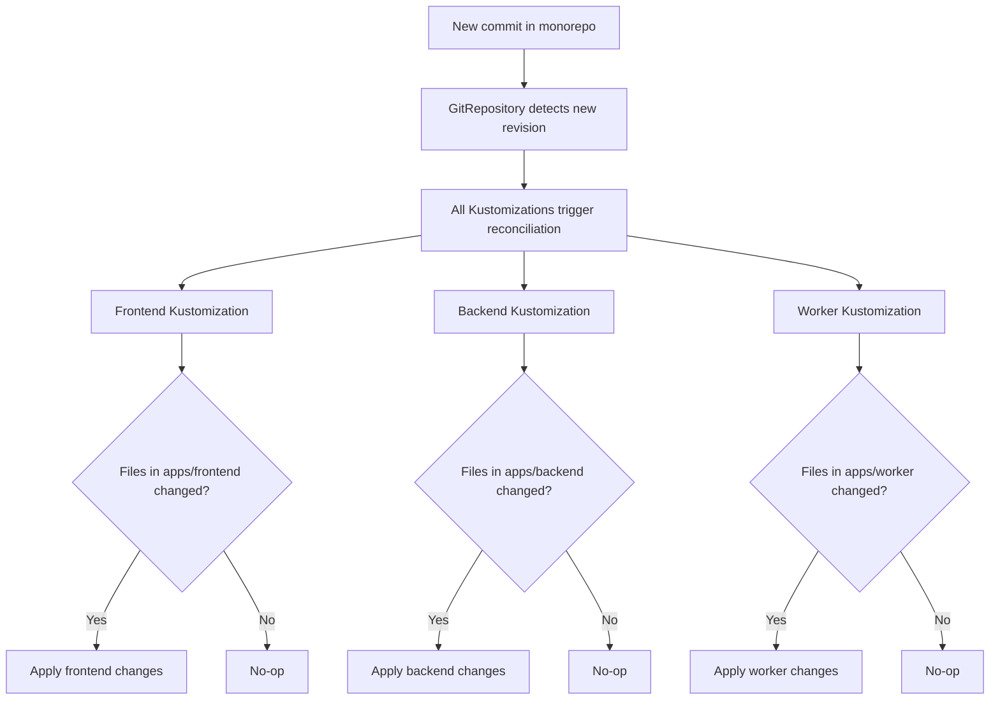

# How to Use GitRepository with Monorepos in Flux

Author: [nawazdhandala](https://github.com/nawazdhandala)

Tags: Flux CD, GitOps, Kubernetes, GitRepository, Monorepo, Kustomization, Path Filtering

Description: Learn how to configure Flux CD to work with monorepos by using path-based Kustomizations and multiple source references from a single GitRepository.

---

Monorepos consolidate multiple applications, services, and infrastructure configurations into a single Git repository. While this simplifies version control and code sharing, it creates challenges for GitOps tools that need to watch for changes and deploy specific parts of the repository. This guide explains how to configure Flux CD to work effectively with monorepos using path-based Kustomizations, targeted reconciliation, and efficient source management.

## Prerequisites

Before you begin, make sure you have:

- A Kubernetes cluster with Flux CD installed
- The Flux CLI (`flux`) installed locally
- `kubectl` access to your cluster
- A monorepo containing multiple applications or services

## Understanding the Monorepo Challenge

In a typical monorepo, you might have a structure like this.

```
my-monorepo/
├── apps/
│   ├── frontend/
│   │   ├── deployment.yaml
│   │   ├── service.yaml
│   │   └── kustomization.yaml
│   ├── backend/
│   │   ├── deployment.yaml
│   │   ├── service.yaml
│   │   └── kustomization.yaml
│   └── worker/
│       ├── deployment.yaml
│       ├── service.yaml
│       └── kustomization.yaml
├── infrastructure/
│   ├── monitoring/
│   │   └── kustomization.yaml
│   ├── ingress/
│   │   └── kustomization.yaml
│   └── cert-manager/
│       └── kustomization.yaml
└── clusters/
    ├── production/
    │   └── kustomization.yaml
    └── staging/
        └── kustomization.yaml
```

The key challenge is that a change to `apps/frontend/` should not trigger a redeployment of `apps/backend/` or `infrastructure/monitoring/`.

## Step 1: Create a Single GitRepository Source

Start by defining one GitRepository resource that points to the monorepo. All Kustomizations will share this source.

```yaml
# gitrepository-monorepo.yaml
# Single GitRepository source for the entire monorepo
apiVersion: source.toolkit.fluxcd.io/v1
kind: GitRepository
metadata:
  name: monorepo
  namespace: flux-system
spec:
  interval: 5m
  url: https://github.com/your-org/my-monorepo.git
  ref:
    branch: main
  secretRef:
    name: git-credentials
```

```bash
# Apply the GitRepository
kubectl apply -f gitrepository-monorepo.yaml
```

## Step 2: Create Path-Based Kustomizations

Define separate Kustomization resources for each application or service, each pointing to a different path within the monorepo.

```yaml
# kustomizations-apps.yaml
# Separate Kustomization for each application in the monorepo
apiVersion: kustomize.toolkit.fluxcd.io/v1
kind: Kustomization
metadata:
  name: frontend
  namespace: flux-system
spec:
  interval: 10m
  sourceRef:
    kind: GitRepository
    name: monorepo
  # Only deploy resources from the frontend path
  path: ./apps/frontend
  prune: true
  targetNamespace: frontend
---
apiVersion: kustomize.toolkit.fluxcd.io/v1
kind: Kustomization
metadata:
  name: backend
  namespace: flux-system
spec:
  interval: 10m
  sourceRef:
    kind: GitRepository
    name: monorepo
  # Only deploy resources from the backend path
  path: ./apps/backend
  prune: true
  targetNamespace: backend
---
apiVersion: kustomize.toolkit.fluxcd.io/v1
kind: Kustomization
metadata:
  name: worker
  namespace: flux-system
spec:
  interval: 10m
  sourceRef:
    kind: GitRepository
    name: monorepo
  # Only deploy resources from the worker path
  path: ./apps/worker
  prune: true
  targetNamespace: worker
```

```bash
# Apply all Kustomizations
kubectl apply -f kustomizations-apps.yaml
```

## Step 3: Use Dependencies Between Kustomizations

In monorepos, some services depend on shared infrastructure. Use `spec.dependsOn` to ensure the correct deployment order.

```yaml
# kustomizations-with-dependencies.yaml
# Infrastructure deployed first, then applications
apiVersion: kustomize.toolkit.fluxcd.io/v1
kind: Kustomization
metadata:
  name: infrastructure
  namespace: flux-system
spec:
  interval: 10m
  sourceRef:
    kind: GitRepository
    name: monorepo
  path: ./infrastructure
  prune: true
---
apiVersion: kustomize.toolkit.fluxcd.io/v1
kind: Kustomization
metadata:
  name: frontend
  namespace: flux-system
spec:
  interval: 10m
  sourceRef:
    kind: GitRepository
    name: monorepo
  path: ./apps/frontend
  prune: true
  targetNamespace: frontend
  # Wait for infrastructure to be ready before deploying the app
  dependsOn:
    - name: infrastructure
---
apiVersion: kustomize.toolkit.fluxcd.io/v1
kind: Kustomization
metadata:
  name: backend
  namespace: flux-system
spec:
  interval: 10m
  sourceRef:
    kind: GitRepository
    name: monorepo
  path: ./apps/backend
  prune: true
  targetNamespace: backend
  dependsOn:
    - name: infrastructure
```

## Step 4: Understand How Flux Handles Changes in Monorepos

When any file in the monorepo changes, the GitRepository detects a new commit and updates its artifact. All Kustomizations that reference this GitRepository will then reconcile. However, Flux is smart about this: if the rendered manifests for a specific path have not changed, Flux will not apply any updates for that Kustomization.

The reconciliation flow works as follows.



## Step 5: Optimize with Multiple GitRepository Sources

For very large monorepos where you want to reduce unnecessary artifact downloads, you can create multiple GitRepository resources with different include/exclude patterns. However, a more common approach is to use a single GitRepository with a short interval and rely on the Kustomization-level path filtering.

If different parts of the monorepo need different reconciliation intervals, create separate GitRepository sources.

```yaml
# gitrepository-fast-apps.yaml
# Faster polling for application changes
apiVersion: source.toolkit.fluxcd.io/v1
kind: GitRepository
metadata:
  name: monorepo-apps
  namespace: flux-system
spec:
  # Poll frequently for application changes
  interval: 1m
  url: https://github.com/your-org/my-monorepo.git
  ref:
    branch: main
  secretRef:
    name: git-credentials
---
# gitrepository-slow-infra.yaml
# Slower polling for infrastructure changes
apiVersion: source.toolkit.fluxcd.io/v1
kind: GitRepository
metadata:
  name: monorepo-infra
  namespace: flux-system
spec:
  # Poll less frequently for infrastructure
  interval: 30m
  url: https://github.com/your-org/my-monorepo.git
  ref:
    branch: main
  secretRef:
    name: git-credentials
```

## Step 6: Handle Shared Libraries and Overlays

Monorepos often contain shared Kustomize bases that multiple applications reference. Structure your Kustomizations to handle this correctly.

```yaml
# Monorepo structure with shared base
# my-monorepo/
# ├── base/
# │   ├── deployment.yaml
# │   └── kustomization.yaml
# ├── apps/
# │   ├── frontend/
# │   │   └── kustomization.yaml  (references ../../base)
# │   └── backend/
# │       └── kustomization.yaml  (references ../../base)

# Kustomization that uses shared base through overlays
apiVersion: kustomize.toolkit.fluxcd.io/v1
kind: Kustomization
metadata:
  name: frontend
  namespace: flux-system
spec:
  interval: 10m
  sourceRef:
    kind: GitRepository
    name: monorepo
  # The overlay in this path can reference ../base internally
  path: ./apps/frontend
  prune: true
  targetNamespace: frontend
```

## Step 7: Environment-Specific Deployments from a Monorepo

Use the cluster directory pattern to manage multiple environments from the same monorepo.

```yaml
# clusters/production/kustomization.yaml in the monorepo
# This is the entry point for the production cluster
apiVersion: kustomize.config.k8s.io/v1beta1
kind: Kustomization
resources:
  - ../../apps/frontend/overlays/production
  - ../../apps/backend/overlays/production
  - ../../infrastructure/production
```

```yaml
# Flux Kustomization pointing to the cluster-specific path
apiVersion: kustomize.toolkit.fluxcd.io/v1
kind: Kustomization
metadata:
  name: production-cluster
  namespace: flux-system
spec:
  interval: 10m
  sourceRef:
    kind: GitRepository
    name: monorepo
  # Each cluster has its own entry point in the monorepo
  path: ./clusters/production
  prune: true
```

## Step 8: Monitor Monorepo Deployments

Track which parts of the monorepo are deployed and at which revision.

```bash
# Check the status of all Kustomizations referencing the monorepo
flux get kustomization -A

# See which revision each Kustomization has applied
kubectl get kustomizations -A -o custom-columns=\
'NAME:.metadata.name,REVISION:.status.lastAppliedRevision,READY:.status.conditions[?(@.type=="Ready")].status'
```

## Summary

Using Flux with monorepos is straightforward when you follow these patterns: define a single GitRepository source for the monorepo, create separate Kustomization resources for each application or service with distinct `path` values, use `dependsOn` to manage deployment ordering, and leverage the cluster directory pattern for multi-environment setups. Flux handles monorepo changes efficiently because it only applies updates when the rendered manifests for a given path actually change, even though all Kustomizations trigger reconciliation on every new commit.
