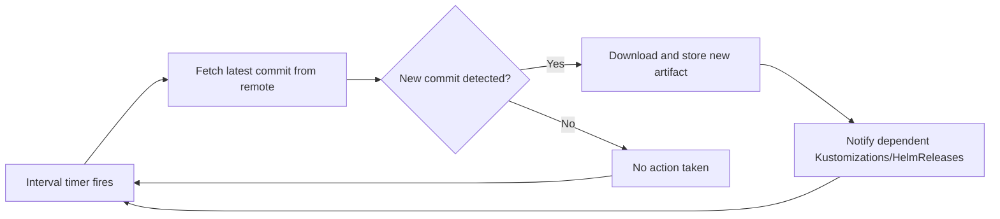

# How to Configure GitRepository Reconciliation Interval in Flux

Author: [nawazdhandala](https://github.com/nawazdhandala)

Tags: Flux CD, GitOps, Kubernetes, GitRepository, Reconciliation, Interval, Source Controller

Description: Learn how to configure and tune the reconciliation interval for Flux CD GitRepository resources to balance responsiveness with resource usage.

---

The reconciliation interval determines how frequently Flux checks your Git repository for changes. Setting it correctly is a balancing act: too short and you waste resources polling for changes that rarely happen; too long and your deployments lag behind commits. This guide explains how `spec.interval` works on GitRepository resources and how to configure it for different use cases.

## Prerequisites

Before you begin, make sure you have:

- A Kubernetes cluster with Flux CD installed
- The Flux CLI (`flux`) installed locally
- `kubectl` access to your cluster

## How the Reconciliation Interval Works

The `spec.interval` field on a GitRepository tells the Flux source controller how often to check the remote Git repository for new commits. At each interval, the source controller fetches the latest commit for the configured ref (branch, tag, or semver) and compares it to the previously stored revision. If a new commit is found, it downloads the source and produces a new artifact.



## Step 1: Set the Reconciliation Interval

The interval is specified as a Go duration string. Common values include `1m` (one minute), `5m` (five minutes), `10m` (ten minutes), and `1h` (one hour).

```yaml
# gitrepository-interval.yaml
# GitRepository with a 5-minute reconciliation interval
apiVersion: source.toolkit.fluxcd.io/v1
kind: GitRepository
metadata:
  name: my-app
  namespace: flux-system
spec:
  # Check for new commits every 5 minutes
  interval: 5m
  url: https://github.com/your-org/my-app.git
  ref:
    branch: main
```

```bash
# Apply the GitRepository
kubectl apply -f gitrepository-interval.yaml
```

Using the Flux CLI, you can set the interval at creation time.

```bash
# Create a GitRepository with a 10-minute interval
flux create source git my-app \
  --url=https://github.com/your-org/my-app.git \
  --branch=main \
  --interval=10m
```

## Step 2: Choose the Right Interval for Your Use Case

Different environments benefit from different intervals.

**Development environments** where rapid feedback matters:

```yaml
# Fast polling for development
apiVersion: source.toolkit.fluxcd.io/v1
kind: GitRepository
metadata:
  name: dev-app
  namespace: flux-system
spec:
  # Poll every minute for fast feedback during development
  interval: 1m
  url: https://github.com/your-org/dev-app.git
  ref:
    branch: develop
```

**Production environments** where stability and resource efficiency are priorities:

```yaml
# Slower polling for production
apiVersion: source.toolkit.fluxcd.io/v1
kind: GitRepository
metadata:
  name: prod-app
  namespace: flux-system
spec:
  # Poll every 10 minutes for production stability
  interval: 10m
  url: https://github.com/your-org/prod-app.git
  ref:
    tag: v1.2.3
```

**Infrequently changing infrastructure repositories**:

```yaml
# Long interval for stable infrastructure config
apiVersion: source.toolkit.fluxcd.io/v1
kind: GitRepository
metadata:
  name: infra-config
  namespace: flux-system
spec:
  # Check once per hour for infrastructure that rarely changes
  interval: 1h
  url: https://github.com/your-org/infra-config.git
  ref:
    branch: main
```

## Step 3: Update the Interval on an Existing GitRepository

To change the interval on a running GitRepository, update the spec and re-apply.

```bash
# Patch the interval on an existing GitRepository
kubectl patch gitrepository my-app -n flux-system \
  --type=merge \
  -p '{"spec":{"interval":"2m"}}'
```

Or edit the resource directly.

```bash
# Edit the GitRepository interactively
kubectl edit gitrepository my-app -n flux-system
```

## Step 4: Trigger Immediate Reconciliation

You do not need to wait for the interval timer. You can manually trigger a reconciliation at any time.

```bash
# Force an immediate reconciliation
flux reconcile source git my-app
```

This is especially useful after pushing an urgent change when you do not want to wait for the next scheduled check.

```bash
# Reconcile and wait for the result
flux reconcile source git my-app --with-source
```

## Step 5: Monitor Reconciliation Timing

Check when the last reconciliation occurred and when the next one is scheduled.

```bash
# View reconciliation status including last update time
flux get source git my-app
```

For detailed timing information, examine the resource status.

```bash
# Get the last reconciliation timestamp
kubectl get gitrepository my-app -n flux-system \
  -o jsonpath='{.status.conditions[?(@.type=="Ready")].lastTransitionTime}'
```

You can also check the `status.artifact.lastUpdateTime` to see when the artifact was last updated.

```bash
# Check when the artifact was last updated
kubectl get gitrepository my-app -n flux-system \
  -o jsonpath='{.status.artifact.lastUpdateTime}'
```

## Performance Considerations

The reconciliation interval directly affects resource consumption on your cluster.

**API rate limits**: If you host your Git repository on a service like GitHub, frequent polling can consume your API rate limit. GitHub allows 5,000 authenticated requests per hour. Each reconciliation uses at least one API call. With many GitRepository sources at short intervals, you can approach this limit.

```bash
# Calculate requests per hour
# Example: 20 GitRepository sources at 1-minute intervals = 1,200 requests/hour
# Example: 20 GitRepository sources at 5-minute intervals = 240 requests/hour
```

**Source controller resources**: Each reconciliation consumes CPU and memory in the source controller. For clusters with many GitRepository sources, use longer intervals or ensure the source controller has adequate resources.

```yaml
# Ensure source controller has enough resources for frequent reconciliations
apiVersion: apps/v1
kind: Deployment
metadata:
  name: source-controller
  namespace: flux-system
spec:
  template:
    spec:
      containers:
      - name: manager
        resources:
          requests:
            cpu: 100m
            memory: 256Mi
          limits:
            cpu: 500m
            memory: 512Mi
```

## Using Webhooks to Reduce Polling

For faster response times without aggressive polling, configure a webhook receiver. This lets your Git provider notify Flux of changes immediately, and you can use a longer interval as a fallback.

```yaml
# GitRepository with long interval, supplemented by webhooks
apiVersion: source.toolkit.fluxcd.io/v1
kind: GitRepository
metadata:
  name: my-app
  namespace: flux-system
spec:
  # Long interval since webhooks handle immediate notifications
  interval: 30m
  url: https://github.com/your-org/my-app.git
  ref:
    branch: main
```

```bash
# Set up a webhook receiver for GitHub
flux create receiver github-receiver \
  --type=github \
  --event=push \
  --secret-ref=webhook-secret \
  --resource=GitRepository/my-app
```

## Summary

The `spec.interval` field on a Flux GitRepository controls how often the source controller polls for new commits. Choose shorter intervals (1-2 minutes) for development environments where fast feedback matters, and longer intervals (10-30 minutes) for production or stable infrastructure repositories. Use `flux reconcile` to trigger immediate checks when needed, and consider webhook receivers to get instant notifications without aggressive polling. Balancing the interval correctly keeps your deployments responsive while minimizing resource consumption and API rate limit usage.
