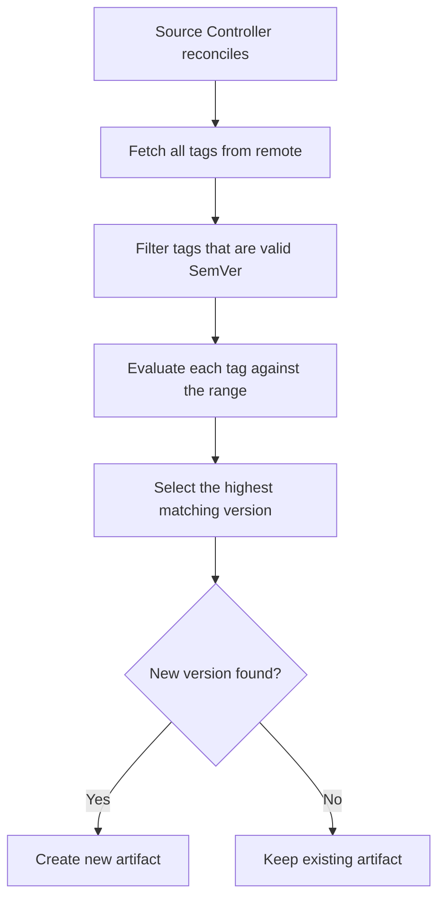

# How to Set Up GitRepository SemVer Tag Filtering in Flux

Author: [nawazdhandala](https://github.com/nawazdhandala)

Tags: Flux CD, GitOps, Kubernetes, Source Controller, GitRepository, SemVer, Semantic Versioning

Description: Learn how to configure Flux CD GitRepository sources to automatically track the latest Git tag matching a semantic versioning range.

---

## Introduction

Semantic versioning (SemVer) tag filtering is one of the most powerful features of the Flux CD GitRepository resource. By setting `spec.ref.semver`, you instruct the Source Controller to scan all tags in the repository, find the latest tag that matches a given SemVer range, and produce an artifact from that tag. This enables automatic deployments of new releases while giving you control over which major or minor versions are accepted.

This guide covers SemVer range syntax, practical filtering examples, and strategies for using SemVer-based deployments across environments.

## Prerequisites

- A Kubernetes cluster with Flux CD installed
- `kubectl` and the `flux` CLI installed locally
- A Git repository with tags following the semantic versioning convention (e.g., `v1.0.0`, `v1.1.0`, `v2.0.0`)

## Basic SemVer Filtering

To track the latest tag matching a SemVer range, use the `spec.ref.semver` field. The Source Controller evaluates all tags in the repository against the range and selects the highest matching version.

```yaml
# gitrepository-semver.yaml - Track the latest patch version of v1.x
apiVersion: source.toolkit.fluxcd.io/v1
kind: GitRepository
metadata:
  name: my-app
  namespace: flux-system
spec:
  interval: 5m
  url: https://github.com/my-org/my-app
  ref:
    # Match any v1.x.x tag, pick the latest
    semver: ">=1.0.0 <2.0.0"
```

Apply and verify.

```bash
# Apply the GitRepository manifest
kubectl apply -f gitrepository-semver.yaml

# Check which tag was selected
flux get sources git my-app -n flux-system
```

If the repository has tags `v1.0.0`, `v1.1.0`, `v1.2.3`, and `v2.0.0`, the Source Controller will select `v1.2.3` as the highest version within the range.

## SemVer Range Syntax

Flux uses the Go semver library for range evaluation. Here are the most commonly used range patterns.

### Exact Version

```yaml
# Match exactly v1.2.3
spec:
  ref:
    semver: "1.2.3"
```

### Patch-Level Range (Tilde)

The tilde (`~`) operator allows patch-level changes. It matches versions with the same major and minor number.

```yaml
# Match >=1.2.0 and <1.3.0 (any patch of 1.2.x)
spec:
  ref:
    semver: "~1.2.0"
```

### Minor-Level Range (Caret)

The caret (`^`) operator allows minor and patch-level changes. It matches versions with the same major number.

```yaml
# Match >=1.2.0 and <2.0.0 (any minor/patch of 1.x.x)
spec:
  ref:
    semver: "^1.2.0"
```

### Comparison Operators

```yaml
# Greater than or equal to 1.0.0 and less than 2.0.0
spec:
  ref:
    semver: ">=1.0.0 <2.0.0"
```

### Wildcard

```yaml
# Any version 1.x.x
spec:
  ref:
    semver: "1.x"

# Any version 1.2.x
spec:
  ref:
    semver: "1.2.x"
```

### OR Operator

```yaml
# Match 1.x or 2.x versions
spec:
  ref:
    semver: ">=1.0.0 <3.0.0"
```

## Tag Prefix Handling

Flux handles the common `v` prefix on tags automatically. Tags like `v1.2.3` are treated as version `1.2.3` when evaluating SemVer ranges. You do not need to include the `v` prefix in the range.

```yaml
# This matches tags like v1.2.3, v1.3.0, etc.
apiVersion: source.toolkit.fluxcd.io/v1
kind: GitRepository
metadata:
  name: my-app
  namespace: flux-system
spec:
  interval: 5m
  url: https://github.com/my-org/my-app
  ref:
    # The 'v' prefix on tags is handled automatically
    semver: ">=1.0.0 <2.0.0"
```

## Practical Examples

### Track Latest Stable in a Major Version

This is common for production environments that want automatic patch and minor updates but need to avoid breaking changes from major version bumps.

```yaml
# production-source.yaml - Auto-update within major version 2
apiVersion: source.toolkit.fluxcd.io/v1
kind: GitRepository
metadata:
  name: my-app-production
  namespace: flux-system
spec:
  interval: 10m
  url: https://github.com/my-org/my-app
  ref:
    # Accept any 2.x.x release automatically
    semver: "^2.0.0"
  secretRef:
    name: git-credentials
```

### Track Only Patch Updates

For environments that need the tightest control, allow only patch updates within a specific minor version.

```yaml
# conservative-source.yaml - Only accept patch updates for 2.1.x
apiVersion: source.toolkit.fluxcd.io/v1
kind: GitRepository
metadata:
  name: my-app-conservative
  namespace: flux-system
spec:
  interval: 10m
  url: https://github.com/my-org/my-app
  ref:
    # Only accept patch updates: 2.1.0, 2.1.1, 2.1.2, etc.
    semver: "~2.1.0"
  secretRef:
    name: git-credentials
```

### Pre-release Filtering

SemVer pre-release tags (e.g., `v1.2.0-rc.1`) are only matched if the range explicitly includes pre-release identifiers.

```yaml
# Include release candidates
spec:
  ref:
    # Match release candidates for 1.2.0
    semver: ">=1.2.0-rc.1 <1.2.1"
```

```yaml
# Exclude pre-releases (default behavior)
spec:
  ref:
    # This will NOT match v1.2.0-rc.1, only stable releases
    semver: ">=1.0.0 <2.0.0"
```

## Multi-Environment SemVer Strategy

A common pattern uses progressively broader SemVer ranges as you move toward production, allowing new versions to soak in lower environments first.

```yaml
# Multi-environment SemVer strategy
# Development - track the latest version across all major versions
apiVersion: source.toolkit.fluxcd.io/v1
kind: GitRepository
metadata:
  name: my-app-dev
  namespace: flux-system
spec:
  interval: 1m
  url: https://github.com/my-org/my-app
  ref:
    semver: "*"
  secretRef:
    name: git-credentials
---
# Staging - track the latest within the current major version
apiVersion: source.toolkit.fluxcd.io/v1
kind: GitRepository
metadata:
  name: my-app-staging
  namespace: flux-system
spec:
  interval: 5m
  url: https://github.com/my-org/my-app
  ref:
    semver: "^2.0.0"
  secretRef:
    name: git-credentials
---
# Production - track only patch updates
apiVersion: source.toolkit.fluxcd.io/v1
kind: GitRepository
metadata:
  name: my-app-production
  namespace: flux-system
spec:
  interval: 10m
  url: https://github.com/my-org/my-app
  ref:
    semver: "~2.1.0"
  secretRef:
    name: git-credentials
```

## How SemVer Resolution Works

The following diagram shows the tag resolution process.



## Monitoring Version Changes

When using SemVer filtering, it is important to monitor which version is currently deployed so you are aware of automatic updates.

```bash
# Check the current resolved tag
flux get sources git my-app -n flux-system

# Watch for version changes
flux get sources git my-app -n flux-system --watch
```

You can also set up notifications to alert your team when a new version is deployed.

## Troubleshooting

If the GitRepository is not picking up a new tag, check the following.

```bash
# List all tags in the remote repository
git ls-remote --tags https://github.com/my-org/my-app

# Check the GitRepository status for the resolved version
kubectl get gitrepository my-app -n flux-system -o yaml | grep -A 3 "artifact:"

# Force reconciliation
flux reconcile source git my-app -n flux-system
```

Common issues include:

- **Tags not following SemVer**: The Source Controller only considers tags that are valid semantic versions. Tags like `release-1.2.3` or `build-456` are ignored.
- **Pre-release tags not matched**: Standard SemVer ranges exclude pre-release versions unless explicitly included in the range.
- **Interval too long**: If the reconciliation interval is long, it may take time for a new tag to be detected. Force a reconciliation or reduce the interval.

## Conclusion

SemVer tag filtering brings the best of both worlds to Flux CD deployments: automatic updates within safe boundaries. By defining a SemVer range, you control which versions are eligible for deployment while still benefiting from automatic detection of new releases. This approach is particularly effective when combined with a consistent tagging strategy in your CI pipeline, enabling a fully automated release workflow from tag creation to deployment.
