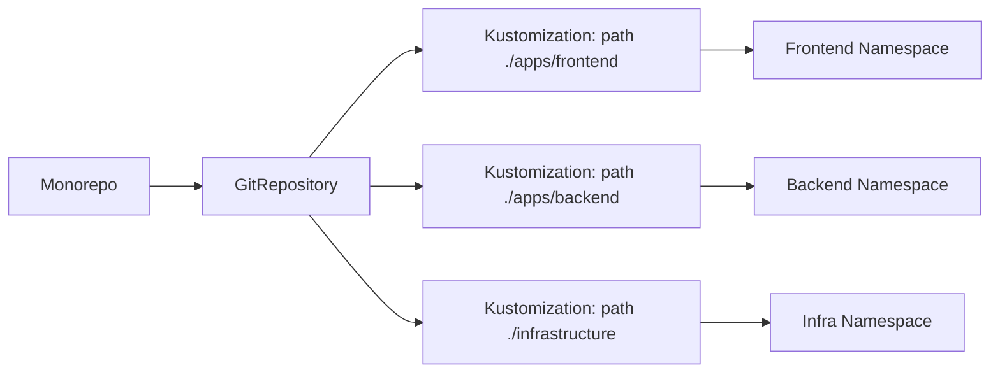

# How to Use GitRepository with Sparse Checkout in Flux

Author: [nawazdhandala](https://github.com/nawazdhandala)

Tags: Flux CD, GitOps, Kubernetes, Sparse Checkout, Monorepo, Performance

Description: Learn how to configure Flux CD GitRepository resources with sparse checkout to selectively sync only specific directories from large monorepos.

---

Large monorepos containing configurations for multiple environments, teams, or applications can slow down Flux reconciliation. Flux CD supports including only specific directories from a GitRepository through the `include` field and path-based filtering, allowing you to fetch only what you need. This guide explains how to use these capabilities to optimize your GitOps workflow with large repositories.

## The Problem with Large Repos

When Flux clones a GitRepository, it fetches the entire repository contents by default. For a monorepo with hundreds of megabytes of manifests across many directories, this creates several issues:

- Slow clone and fetch times
- Unnecessary storage consumption on the source-controller
- Longer reconciliation cycles

## Understanding Flux Approach to Sparse Checkout

Flux does not use Git's native sparse-checkout feature directly. Instead, it provides two mechanisms to work with subsets of a repository:

1. **Kustomization path filtering** -- The Kustomization resource has a `spec.path` field that points to a specific directory within the GitRepository artifact.
2. **GitRepository `include` field** -- The GitRepository resource can include artifacts from other GitRepository resources, allowing composition from multiple sources.

The most common and practical approach is to use `spec.path` on the Kustomization resource to select which directory within a full clone to apply.

## Step 1: Use Kustomization Path Filtering

The simplest way to work with a subset of a monorepo is to point your Kustomization at a specific subdirectory.

Consider a monorepo with this structure:

```bash
# Repository structure
my-monorepo/
  apps/
    frontend/
    backend/
    worker/
  infrastructure/
    monitoring/
    networking/
    storage/
  clusters/
    production/
    staging/
```

Create a GitRepository for the monorepo and Kustomizations for specific paths:

```yaml
apiVersion: source.toolkit.fluxcd.io/v1
kind: GitRepository
metadata:
  name: monorepo
  namespace: flux-system
spec:
  interval: 10m
  url: https://github.com/your-org/my-monorepo.git
  ref:
    branch: main
  secretRef:
    name: git-credentials
```

Now create separate Kustomization resources that each target a specific directory:

```yaml
apiVersion: kustomize.toolkit.fluxcd.io/v1
kind: Kustomization
metadata:
  name: frontend-app
  namespace: flux-system
spec:
  interval: 10m
  sourceRef:
    kind: GitRepository
    name: monorepo
  # Only apply manifests from the frontend directory
  path: ./apps/frontend
  prune: true
  targetNamespace: frontend
---
apiVersion: kustomize.toolkit.fluxcd.io/v1
kind: Kustomization
metadata:
  name: monitoring
  namespace: flux-system
spec:
  interval: 10m
  sourceRef:
    kind: GitRepository
    name: monorepo
  # Only apply manifests from the monitoring directory
  path: ./infrastructure/monitoring
  prune: true
  targetNamespace: monitoring
```

## Step 2: Use the Include Field for Cross-Repo Composition

The `include` field on a GitRepository allows you to pull specific directories from other GitRepository resources into a combined artifact. This is useful when you want to compose configurations from multiple repositories.

Set up a primary GitRepository that includes content from other repositories:

```yaml
apiVersion: source.toolkit.fluxcd.io/v1
kind: GitRepository
metadata:
  name: app-config
  namespace: flux-system
spec:
  interval: 10m
  url: https://github.com/your-org/app-config.git
  ref:
    branch: main
  secretRef:
    name: git-credentials
  include:
    # Pull the common/ directory from the shared-libs repo into ./common
    - repository:
        name: shared-libs
      fromPath: common/
      toPath: common/
```

The referenced GitRepository must exist in the same namespace:

```yaml
apiVersion: source.toolkit.fluxcd.io/v1
kind: GitRepository
metadata:
  name: shared-libs
  namespace: flux-system
spec:
  interval: 30m
  url: https://github.com/your-org/shared-libs.git
  ref:
    branch: main
  secretRef:
    name: git-credentials
```

The resulting artifact for `app-config` will contain its own files plus the contents of `common/` from `shared-libs`.

## Step 3: Optimize Clone Depth for Performance

While not a sparse checkout in the strict sense, reducing clone depth significantly speeds up fetching large repos.

Use a shallow clone with tag or commit reference:

```yaml
apiVersion: source.toolkit.fluxcd.io/v1
kind: GitRepository
metadata:
  name: monorepo-shallow
  namespace: flux-system
spec:
  interval: 10m
  url: https://github.com/your-org/my-monorepo.git
  ref:
    branch: main
  secretRef:
    name: git-credentials
```

Flux performs shallow clones by default for branch-based references, fetching only the latest commit. This already reduces bandwidth significantly compared to a full clone.

## Step 4: Split a Monorepo into Multiple GitRepositories

Another effective strategy is to create multiple GitRepository resources pointing to the same repository but used by different Kustomizations for different paths.

Multiple Kustomizations sharing a single GitRepository but targeting different paths:

```yaml
apiVersion: source.toolkit.fluxcd.io/v1
kind: GitRepository
metadata:
  name: platform-monorepo
  namespace: flux-system
spec:
  interval: 10m
  url: https://github.com/your-org/platform.git
  ref:
    branch: main
  secretRef:
    name: git-credentials
---
# Team A only cares about their apps
apiVersion: kustomize.toolkit.fluxcd.io/v1
kind: Kustomization
metadata:
  name: team-a-apps
  namespace: flux-system
spec:
  interval: 5m
  sourceRef:
    kind: GitRepository
    name: platform-monorepo
  path: ./teams/team-a
  prune: true
---
# Team B has their own section
apiVersion: kustomize.toolkit.fluxcd.io/v1
kind: Kustomization
metadata:
  name: team-b-apps
  namespace: flux-system
spec:
  interval: 5m
  sourceRef:
    kind: GitRepository
    name: platform-monorepo
  path: ./teams/team-b
  prune: true
---
# Platform team manages shared infrastructure
apiVersion: kustomize.toolkit.fluxcd.io/v1
kind: Kustomization
metadata:
  name: platform-infra
  namespace: flux-system
spec:
  interval: 10m
  sourceRef:
    kind: GitRepository
    name: platform-monorepo
  path: ./infrastructure
  prune: true
```

This pattern uses one GitRepository fetch but distributes the apply logic across multiple Kustomizations, each scoped to its own directory.

## Step 5: Use Ignore Patterns

The GitRepository resource supports a `.sourceignore` file (similar to `.gitignore`) that tells Flux to exclude certain files from the generated artifact.

Create a `.sourceignore` file in the root of your repository:

```bash
# .sourceignore - Exclude files that Flux does not need
# Exclude documentation
docs/
*.md

# Exclude CI/CD pipeline definitions
.github/
.gitlab-ci.yml
Jenkinsfile

# Exclude test fixtures
**/tests/
**/testdata/

# Exclude large binary files
*.tar.gz
*.zip
```

You can also specify the ignore rules inline in the GitRepository spec:

```yaml
apiVersion: source.toolkit.fluxcd.io/v1
kind: GitRepository
metadata:
  name: monorepo-filtered
  namespace: flux-system
spec:
  interval: 10m
  url: https://github.com/your-org/my-monorepo.git
  ref:
    branch: main
  secretRef:
    name: git-credentials
  ignore: |
    # Exclude non-Kubernetes files from the artifact
    docs/
    *.md
    .github/
    **/tests/
```

The `ignore` field reduces the size of the artifact stored by the source-controller, even though the full repo is still fetched.

## Architecture Diagram

This diagram shows how a monorepo flows through Flux with path-based filtering:



## Verifying the Configuration

Check that your filtered configurations are working correctly.

Verify the source and Kustomization status:

```bash
# Check the GitRepository status
flux get sources git

# Check which Kustomizations are using the source
flux get kustomizations

# Verify a specific Kustomization is applying from the correct path
kubectl describe kustomization frontend-app -n flux-system
```

## Summary

While Flux does not implement Git's native sparse-checkout, it provides effective alternatives for working with monorepos. The primary tool is Kustomization path filtering, which lets you point multiple Kustomizations at different directories within a single GitRepository. The `include` field enables cross-repo composition, and `.sourceignore` or the `ignore` field reduces artifact size. For most monorepo use cases, combining a single GitRepository with multiple path-scoped Kustomizations delivers the best balance of simplicity and performance.
