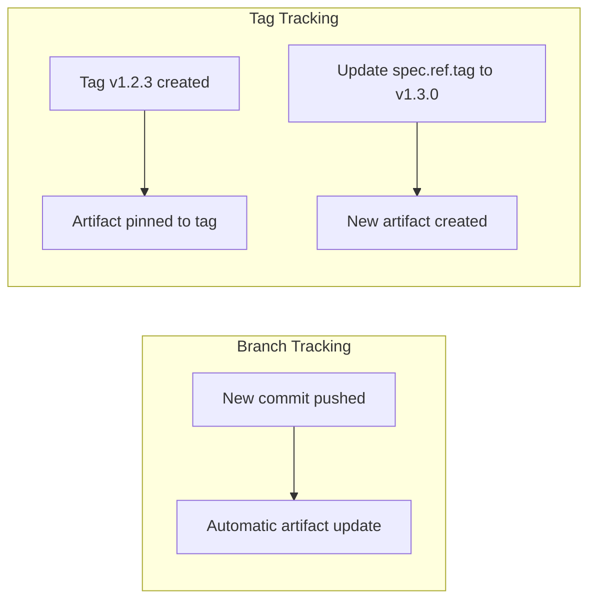

# How to Set Up GitRepository Tag Tracking in Flux

Author: [nawazdhandala](https://github.com/nawazdhandala)

Tags: Flux CD, GitOps, Kubernetes, Source Controller, GitRepository, Tag Tracking, Releases

Description: Learn how to configure Flux CD GitRepository sources to track specific Git tags for stable, version-pinned deployments.

---

## Introduction

While branch tracking provides continuous deployment of the latest commits, tag tracking offers a more controlled approach. By setting `spec.ref.tag` on a GitRepository resource, you pin Flux to a specific Git tag. The Source Controller fetches the exact commit that the tag points to and produces an artifact from it. This is particularly useful for production environments where you want explicit control over which version is deployed.

This guide explains how to configure tag tracking, update tags for new deployments, and integrate tag-based releases into your workflow.

## Prerequisites

- A Kubernetes cluster with Flux CD installed
- `kubectl` and the `flux` CLI installed locally
- A Git repository with tagged releases

## Basic Tag Tracking

To track a specific tag, set `spec.ref.tag` in the GitRepository spec. The Source Controller will fetch the commit referenced by that tag.

```yaml
# gitrepository-tag.yaml - Track a specific Git tag
apiVersion: source.toolkit.fluxcd.io/v1
kind: GitRepository
metadata:
  name: my-app
  namespace: flux-system
spec:
  interval: 5m
  url: https://github.com/my-org/my-app
  ref:
    # Pin to a specific tag
    tag: v1.2.3
```

Apply the manifest.

```bash
# Apply the GitRepository manifest
kubectl apply -f gitrepository-tag.yaml

# Verify the source is tracking the tag
flux get sources git my-app -n flux-system
```

The artifact revision will appear as `v1.2.3@sha1:abc1234def5678`, indicating both the tag name and the commit SHA it resolves to.

## How Tag Tracking Differs from Branch Tracking

With branch tracking, Flux detects new commits on every reconciliation interval and updates the artifact automatically. With tag tracking, the artifact stays the same as long as the tag does not change. This provides stability because the deployed version only changes when you explicitly update the tag reference.



## Updating the Tag for a New Release

When you are ready to deploy a new version, update the `spec.ref.tag` field in your GitRepository manifest. This can be done by updating the manifest in your Flux configuration repository.

```yaml
# gitrepository-tag-updated.yaml - Updated to a new release tag
apiVersion: source.toolkit.fluxcd.io/v1
kind: GitRepository
metadata:
  name: my-app
  namespace: flux-system
spec:
  interval: 5m
  url: https://github.com/my-org/my-app
  ref:
    # Updated from v1.2.3 to v1.3.0
    tag: v1.3.0
```

If you manage your Flux configuration with GitOps (which is the recommended approach), commit this change to your configuration repository. Flux will detect the change in its own configuration and update the GitRepository, which in turn triggers a new deployment.

You can also update it imperatively for testing purposes.

```bash
# Patch the GitRepository to track a new tag
kubectl patch gitrepository my-app -n flux-system \
  --type=merge \
  -p '{"spec":{"ref":{"tag":"v1.3.0"}}}'

# Force reconciliation to pick up the change immediately
flux reconcile source git my-app -n flux-system
```

## Working with Annotated vs Lightweight Tags

Git supports two types of tags: annotated and lightweight. The Flux Source Controller handles both correctly.

- **Annotated tags** are full Git objects with a tagger, date, and message. They are created with `git tag -a`.
- **Lightweight tags** are simple pointers to a commit. They are created with `git tag` without the `-a` flag.

```bash
# Create an annotated tag (recommended for releases)
git tag -a v1.3.0 -m "Release v1.3.0 - new authentication module"
git push origin v1.3.0

# Create a lightweight tag
git tag v1.3.0-rc1
git push origin v1.3.0-rc1
```

Both types work with `spec.ref.tag`. Annotated tags are recommended for production releases because they carry additional metadata.

## Tag-Based Release Workflow

Here is a complete workflow that uses tags to control production deployments. The Flux configuration repository contains the GitRepository manifests, and version updates are made through pull requests.

```yaml
# clusters/production/sources/my-app.yaml
# This file lives in the Flux configuration repository
apiVersion: source.toolkit.fluxcd.io/v1
kind: GitRepository
metadata:
  name: my-app
  namespace: flux-system
spec:
  interval: 10m
  url: https://github.com/my-org/my-app
  ref:
    tag: v2.1.0
  secretRef:
    name: git-credentials
---
# clusters/production/apps/my-app.yaml
apiVersion: kustomize.toolkit.fluxcd.io/v1
kind: Kustomization
metadata:
  name: my-app
  namespace: flux-system
spec:
  interval: 10m
  sourceRef:
    kind: GitRepository
    name: my-app
  path: ./deploy/production
  prune: true
  wait: true
  timeout: 5m
```

The release process looks like this:

1. A developer creates and pushes a new tag (e.g., `v2.2.0`) to the application repository.
2. Someone opens a pull request in the Flux configuration repository to update `spec.ref.tag` from `v2.1.0` to `v2.2.0`.
3. After review and approval, the PR is merged.
4. Flux detects the change in its configuration repository, updates the GitRepository, and deploys the new version.

## Combining Tag Tracking with Multiple Environments

You can use different tags for different environments to implement a promotion-based workflow.

```yaml
# Environment-specific tag tracking
apiVersion: source.toolkit.fluxcd.io/v1
kind: GitRepository
metadata:
  name: my-app-staging
  namespace: flux-system
spec:
  interval: 5m
  url: https://github.com/my-org/my-app
  ref:
    # Staging runs the release candidate
    tag: v2.2.0-rc1
  secretRef:
    name: git-credentials
---
apiVersion: source.toolkit.fluxcd.io/v1
kind: GitRepository
metadata:
  name: my-app-production
  namespace: flux-system
spec:
  interval: 10m
  url: https://github.com/my-org/my-app
  ref:
    # Production runs the stable release
    tag: v2.1.0
  secretRef:
    name: git-credentials
```

## Verifying the Deployed Tag

After updating the tag, verify that the correct version is deployed.

```bash
# Check which tag revision the GitRepository is serving
flux get sources git my-app -n flux-system

# Get the full artifact details
kubectl get gitrepository my-app -n flux-system \
  -o jsonpath='{.status.artifact.revision}'
```

## Troubleshooting

Common issues with tag tracking include:

- **Tag not found**: Ensure the tag exists in the remote repository. Run `git ls-remote --tags https://github.com/my-org/my-app` to list available tags.
- **Artifact not updating after tag change**: Force a reconciliation with `flux reconcile source git my-app -n flux-system`.
- **Moved tags**: If a tag was deleted and recreated pointing to a different commit, the Source Controller will detect the change on the next reconciliation. However, moving tags is generally considered bad practice.

```bash
# List all available tags in the remote repository
git ls-remote --tags https://github.com/my-org/my-app

# Check events for the GitRepository
kubectl events -n flux-system --for gitrepository/my-app
```

## Conclusion

Tag tracking with Flux CD provides a stable and predictable deployment model. By pinning your GitRepository to a specific tag, you gain explicit control over which version of your application is deployed. This approach works well for production environments where changes should be deliberate and reviewed. Combined with a pull request workflow for updating tags in your Flux configuration repository, tag tracking delivers both safety and auditability for your deployment pipeline.
