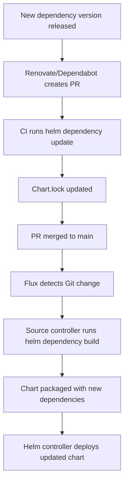

# How to Handle Helm Chart Dependency Updates in Flux

Author: [nawazdhandala](https://github.com/nawazdhandala)

Tags: Flux CD, GitOps, Kubernetes, Helm, HelmChart, Dependencies, Chart Management

Description: Learn how to manage and automate Helm chart dependency updates in Flux CD, including sub-chart versioning, dependency resolution, and update strategies.

---

## Introduction

Helm charts often depend on other charts, known as sub-charts or dependencies. When using Flux CD to manage deployments, you need a strategy for keeping these dependencies up to date. Flux handles chart dependencies differently depending on whether you use a chart from a remote repository or a chart stored in Git. Understanding these mechanisms is essential for maintaining reliable deployments.

This guide covers how Helm chart dependencies work in Flux, how to configure dependency resolution, and how to automate dependency updates.

## How Helm Dependencies Work

Helm chart dependencies are declared in the `Chart.yaml` file. When a chart is packaged, its dependencies are downloaded and included in the `charts/` directory.

```yaml
# Chart.yaml with dependencies
apiVersion: v2
name: my-app
version: 1.0.0
dependencies:
  - name: postgresql
    version: ">=12.0.0 <13.0.0"     # Semver range for the dependency
    repository: https://charts.bitnami.com/bitnami
    condition: postgresql.enabled     # Optional: toggle dependency with values
  - name: redis
    version: "18.x"
    repository: https://charts.bitnami.com/bitnami
    condition: redis.enabled
```

## Scenario 1: Charts from a Remote Repository

When you deploy a chart from a remote HelmRepository, the chart author manages dependencies. The chart package already includes all resolved dependencies. In this case, you simply update the chart version in your HelmRelease.

```yaml
# HelmRelease using a remote chart with bundled dependencies
apiVersion: helm.toolkit.fluxcd.io/v2
kind: HelmRelease
metadata:
  name: my-app
  namespace: default
spec:
  interval: 10m
  chart:
    spec:
      chart: my-app
      version: "1.2.x"                # Update this to pick up new dependency versions
      sourceRef:
        kind: HelmRepository
        name: my-repo
        namespace: flux-system
      interval: 5m
  values:
    postgresql:
      enabled: true
      auth:
        postgresPassword: my-password
    redis:
      enabled: true
```

When the chart author publishes version 1.3.0 with updated dependencies, Flux will automatically detect and deploy it (if the semver constraint matches).

## Scenario 2: Charts Stored in Git

When your chart source is a GitRepository, Flux needs to build the chart from source, including resolving dependencies. This is where dependency management becomes more involved.

### Configure GitRepository and HelmChart

```yaml
# gitrepository.yaml
# GitRepository containing the Helm chart source
apiVersion: source.toolkit.fluxcd.io/v1
kind: GitRepository
metadata:
  name: my-app-repo
  namespace: flux-system
spec:
  interval: 5m
  url: https://github.com/myorg/my-app
  ref:
    branch: main
```

```yaml
# HelmRelease using a chart from Git
apiVersion: helm.toolkit.fluxcd.io/v2
kind: HelmRelease
metadata:
  name: my-app
  namespace: default
spec:
  interval: 10m
  chart:
    spec:
      chart: ./charts/my-app          # Path to the chart within the Git repository
      sourceRef:
        kind: GitRepository
        name: my-app-repo
        namespace: flux-system
      interval: 5m
      reconcileStrategy: Revision      # Rebuild on any Git commit
  values:
    postgresql:
      enabled: true
```

When Flux builds a chart from a GitRepository, the source controller automatically runs `helm dependency build` to resolve and download dependencies before packaging the chart. This means the dependencies declared in `Chart.yaml` are fetched at build time.

### Adding HelmRepository Sources for Dependencies

For Flux to resolve dependencies from external repositories, those repositories must be accessible to the source controller. The source controller uses the repository URLs listed in `Chart.yaml` directly.

If the dependency repositories require authentication, you need to create HelmRepository resources with credentials so that the source controller can authenticate.

```yaml
# HelmRepository for the Bitnami dependency repository
apiVersion: source.toolkit.fluxcd.io/v1
kind: HelmRepository
metadata:
  name: bitnami
  namespace: flux-system
spec:
  interval: 30m
  url: https://charts.bitnami.com/bitnami
```

For private dependency repositories, include authentication.

```yaml
# HelmRepository for a private dependency repository
apiVersion: source.toolkit.fluxcd.io/v1
kind: HelmRepository
metadata:
  name: private-charts
  namespace: flux-system
spec:
  interval: 30m
  url: https://charts.internal.example.com
  secretRef:
    name: private-chart-creds
```

## Automating Dependency Version Updates

### Using Renovate Bot

Renovate can automatically create pull requests when chart dependency versions are updated upstream.

```yaml
# renovate.json - Configure Renovate to update Helm chart dependencies
{
  "$schema": "https://docs.renovatebot.com/renovate-schema.json",
  "helm-values": {
    "enabled": true
  },
  "helmChart": {
    "enabled": true
  },
  "regexManagers": [
    {
      "fileMatch": ["charts/.*/Chart\\.yaml$"],
      "matchStrings": [
        "repository: (?<registryUrl>.*?)\\s+name: (?<depName>.*?)\\s+version: (?<currentValue>.*?)\\s"
      ],
      "datasourceTemplate": "helm"
    }
  ]
}
```

### Using Flux Image Automation (for OCI Dependencies)

If your dependencies are stored in OCI registries, you can use Flux image automation to detect new versions and update the `Chart.yaml` file in Git.

## Managing Dependency Conflicts

When multiple charts depend on different versions of the same sub-chart, conflicts can arise. Helm handles this through the dependency tree, but you should be aware of version incompatibilities.

### Using Aliases to Avoid Conflicts

```yaml
# Chart.yaml with aliased dependencies to avoid conflicts
apiVersion: v2
name: my-platform
version: 1.0.0
dependencies:
  - name: postgresql
    version: "12.x"
    repository: https://charts.bitnami.com/bitnami
    alias: app-db                     # Alias to avoid name collision
  - name: postgresql
    version: "12.x"
    repository: https://charts.bitnami.com/bitnami
    alias: analytics-db               # Second instance with different alias
```

### Overriding Dependency Values

Override sub-chart values through the parent chart's values in the HelmRelease.

```yaml
# HelmRelease with dependency value overrides
apiVersion: helm.toolkit.fluxcd.io/v2
kind: HelmRelease
metadata:
  name: my-platform
  namespace: default
spec:
  interval: 10m
  chart:
    spec:
      chart: my-platform
      version: "1.x"
      sourceRef:
        kind: HelmRepository
        name: my-repo
        namespace: flux-system
      interval: 10m
  values:
    # Override values for the "app-db" (postgresql) dependency
    app-db:
      primary:
        persistence:
          size: 50Gi
      auth:
        postgresPassword: app-password
    # Override values for the "analytics-db" (postgresql) dependency
    analytics-db:
      primary:
        persistence:
          size: 100Gi
      auth:
        postgresPassword: analytics-password
```

## Locking Dependency Versions

Helm generates a `Chart.lock` file when you run `helm dependency update`. This lock file pins the exact dependency versions. When stored in Git, Flux uses the lock file to ensure reproducible builds.

```bash
# Generate the lock file locally
cd charts/my-app
helm dependency update

# The Chart.lock file is generated
cat Chart.lock
```

```yaml
# Chart.lock - Auto-generated by helm dependency update
dependencies:
  - name: postgresql
    repository: https://charts.bitnami.com/bitnami
    version: 12.8.3                  # Exact pinned version
  - name: redis
    repository: https://charts.bitnami.com/bitnami
    version: 18.4.0                  # Exact pinned version
digest: sha256:abc123...
generated: "2026-03-05T10:00:00Z"
```

Commit the `Chart.lock` file alongside `Chart.yaml` to ensure Flux uses the exact same dependency versions every time.

```bash
# Commit the lock file
git add Chart.yaml Chart.lock
git commit -m "Update chart dependencies"
git push
```

## Dependency Update Workflow



## Troubleshooting Dependency Issues

### Chart Build Failures

```bash
# Check source controller logs for dependency resolution errors
kubectl logs -n flux-system deploy/source-controller --since=10m | grep -i "dependency\|build\|error"

# Check the HelmChart status
kubectl describe helmchart -n flux-system <chart-name>
```

### Common Errors

1. **"repository not found"**: The dependency repository URL in `Chart.yaml` is unreachable. Ensure the URL is correct and the source controller has network access.
2. **"version not found"**: The specified dependency version does not exist. Check the version constraint in `Chart.yaml`.
3. **"Chart.lock is out of date"**: The `Chart.lock` does not match `Chart.yaml`. Run `helm dependency update` locally and commit the updated lock file.
4. **Timeout during dependency download**: Large dependencies or slow repositories may cause timeouts. Increase the source controller's resource limits.

### Rebuild Dependencies Manually

```bash
# Force the source controller to rebuild the chart
flux reconcile source git my-app-repo -n flux-system
```

## Best Practices

1. **Always commit Chart.lock**: This ensures reproducible builds across environments.
2. **Use semver ranges wisely**: In `Chart.yaml`, use ranges like `12.x` or `>=12.0.0 <13.0.0` to allow patch updates while preventing breaking changes.
3. **Automate updates**: Use Renovate or Dependabot to create PRs for dependency updates, with CI validation before merging.
4. **Test dependency updates in staging**: Deploy to a staging environment first before promoting to production.
5. **Monitor dependency health**: Subscribe to security advisories for your chart dependencies to stay informed about vulnerabilities.

## Conclusion

Managing Helm chart dependency updates in Flux requires understanding how dependencies are resolved in different source types. For charts from remote repositories, the chart author manages dependencies and you control updates through version constraints. For charts stored in Git, Flux automatically resolves dependencies at build time using the `Chart.yaml` and `Chart.lock` files. Combine these mechanisms with automated update tools like Renovate and a proper staging pipeline to keep your dependencies current without sacrificing stability.
