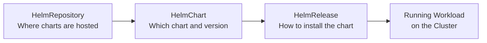

# How to Set Up HelmChart Source from HelmRepository in Flux

Author: [nawazdhandala](https://github.com/nawazdhandala)

Tags: Flux CD, GitOps, Kubernetes, Helm, HelmChart, HelmRepository, Source Controller

Description: Learn how to create a HelmChart source that pulls charts from a HelmRepository in Flux CD, including version pinning, value overrides, and reconciliation configuration.

---

## Introduction

In Flux CD, the HelmChart custom resource defines which Helm chart to pull and from which source. When combined with a HelmRepository, it tells the Flux source controller to fetch a specific chart and version from a Helm repository. The HelmChart resource acts as the bridge between a HelmRepository (where charts live) and a HelmRelease (which installs charts on the cluster).

This guide walks you through creating HelmChart sources that reference HelmRepository resources, covering version selection, reconciliation intervals, and practical deployment patterns.

## Prerequisites

- A running Kubernetes cluster with Flux CD v2.x installed
- kubectl and the Flux CLI configured
- At least one HelmRepository resource already created

## The Flux Helm Deployment Pipeline

Understanding how HelmChart fits into the overall Flux pipeline helps clarify its role.



The HelmChart resource handles the "what" -- which chart, which version, from which source.

## Creating a Basic HelmChart

First, ensure you have a HelmRepository defined.

```yaml
# helmrepository-bitnami.yaml
# Define the source repository for charts
apiVersion: source.toolkit.fluxcd.io/v1
kind: HelmRepository
metadata:
  name: bitnami
  namespace: flux-system
spec:
  url: https://charts.bitnami.com/bitnami
  interval: 30m
```

Now create a HelmChart that references a chart from this repository.

```yaml
# helmchart-nginx.yaml
# HelmChart source that pulls the nginx chart from the Bitnami repository
apiVersion: source.toolkit.fluxcd.io/v1
kind: HelmChart
metadata:
  name: nginx
  namespace: flux-system
spec:
  # The name of the chart in the repository
  chart: nginx
  # The version of the chart to pull (supports exact versions and ranges)
  version: "15.x"
  # Reference to the HelmRepository source
  sourceRef:
    kind: HelmRepository
    name: bitnami
  # How often to check for new chart versions matching the version constraint
  interval: 10m
```

Apply both resources.

```bash
# Apply the HelmRepository and HelmChart resources
kubectl apply -f helmrepository-bitnami.yaml
kubectl apply -f helmchart-nginx.yaml
```

## Key HelmChart Spec Fields

The HelmChart spec has several important fields.

| Field | Description | Required |
|-------|-------------|----------|
| `spec.chart` | Name of the chart in the repository | Yes |
| `spec.version` | Version constraint (exact or semver range) | No (defaults to latest) |
| `spec.sourceRef` | Reference to a source (HelmRepository, GitRepository, or Bucket) | Yes |
| `spec.interval` | How often to check for matching new versions | Yes |
| `spec.reconcileStrategy` | Strategy for detecting new chart versions (`ChartVersion` or `Revision`) | No |
| `spec.valuesFiles` | List of values files to include from the chart | No |

## Pinning to an Exact Version

For production environments, you may want to pin to an exact chart version to avoid unexpected changes.

```yaml
# helmchart-pinned.yaml
# HelmChart pinned to an exact version for production stability
apiVersion: source.toolkit.fluxcd.io/v1
kind: HelmChart
metadata:
  name: redis-production
  namespace: flux-system
spec:
  chart: redis
  # Pin to an exact version -- no automatic upgrades
  version: "17.11.3"
  sourceRef:
    kind: HelmRepository
    name: bitnami
  interval: 30m
```

## Using SemVer Ranges

SemVer ranges allow you to automatically pick up patch or minor version updates while staying within a safe range.

```yaml
# helmchart-semver.yaml
# HelmChart using a semver range to allow automatic patch updates
apiVersion: source.toolkit.fluxcd.io/v1
kind: HelmChart
metadata:
  name: redis-staging
  namespace: flux-system
spec:
  chart: redis
  # Accept any patch version within the 17.11.x range
  version: ">=17.11.0 <17.12.0"
  sourceRef:
    kind: HelmRepository
    name: bitnami
  interval: 10m
```

## Including Values Files

Some charts include alternative values files for different environments. You can specify which values files to include when the chart is fetched.

```yaml
# helmchart-with-values.yaml
# HelmChart that includes specific values files from the chart archive
apiVersion: source.toolkit.fluxcd.io/v1
kind: HelmChart
metadata:
  name: my-app
  namespace: flux-system
spec:
  chart: my-app
  version: "2.x"
  sourceRef:
    kind: HelmRepository
    name: internal-charts
  interval: 10m
  # Include additional values files from the chart archive
  valuesFiles:
    - values.yaml
    - values-production.yaml
```

## Configuring Reconcile Strategy

The `spec.reconcileStrategy` field controls how Flux detects new chart versions.

```yaml
# helmchart-reconcile-strategy.yaml
# HelmChart with explicit reconcile strategy
apiVersion: source.toolkit.fluxcd.io/v1
kind: HelmChart
metadata:
  name: cert-manager
  namespace: flux-system
spec:
  chart: cert-manager
  version: "1.x"
  sourceRef:
    kind: HelmRepository
    name: jetstack
  interval: 15m
  # ChartVersion triggers reconciliation when the chart version changes
  # Revision triggers reconciliation when the source revision changes
  reconcileStrategy: ChartVersion
```

## HelmChart with an OCI HelmRepository

When your HelmRepository uses the OCI protocol, the HelmChart configuration remains the same. The chart name corresponds to the OCI artifact name.

```yaml
# helmrepository-oci.yaml
# OCI-based HelmRepository
apiVersion: source.toolkit.fluxcd.io/v1
kind: HelmRepository
metadata:
  name: oci-charts
  namespace: flux-system
spec:
  type: oci
  url: oci://ghcr.io/my-org/charts
  interval: 30m
---
# helmchart-from-oci.yaml
# HelmChart referencing an OCI HelmRepository
apiVersion: source.toolkit.fluxcd.io/v1
kind: HelmChart
metadata:
  name: my-service
  namespace: flux-system
spec:
  # The chart name matches the OCI artifact name in the registry
  chart: my-service
  version: "1.0.x"
  sourceRef:
    kind: HelmRepository
    name: oci-charts
  interval: 10m
```

## Verifying the HelmChart

After applying the HelmChart, verify that Flux has fetched the chart artifact.

```bash
# Check the HelmChart status
kubectl get helmchart -n flux-system

# Get detailed information including the resolved version
kubectl describe helmchart -n flux-system nginx

# Use the Flux CLI
flux get sources chart
```

A successful fetch shows `READY: True` and the resolved chart version.

```
NAME    CHART   VERSION   SOURCE KIND      SOURCE NAME   AGE   READY   STATUS
nginx   nginx   15.x      HelmRepository   bitnami       1m    True    pulled 'nginx' chart with version '15.4.4'
```

## Connecting HelmChart to HelmRelease

In practice, HelmChart resources are often created implicitly by a HelmRelease. When you define a HelmRelease with a `chart.spec`, Flux creates the corresponding HelmChart automatically.

```yaml
# helmrelease-implicit-chart.yaml
# HelmRelease that implicitly creates a HelmChart
apiVersion: helm.toolkit.fluxcd.io/v2
kind: HelmRelease
metadata:
  name: nginx
  namespace: default
spec:
  interval: 30m
  chart:
    spec:
      chart: nginx
      version: "15.x"
      sourceRef:
        kind: HelmRepository
        name: bitnami
        namespace: flux-system
      interval: 10m
```

This HelmRelease automatically creates a HelmChart in the flux-system namespace. You can still inspect it using the same kubectl commands.

## Cleanup

To remove a HelmChart and its associated resources, delete them in reverse order.

```bash
# Delete the HelmChart
kubectl delete helmchart -n flux-system nginx

# If needed, also delete the HelmRepository
kubectl delete helmrepository -n flux-system bitnami
```

## Summary

The HelmChart resource in Flux CD connects a HelmRepository source to the deployment pipeline. By specifying the chart name, version constraint, and source reference, you control exactly which chart Flux fetches and how often it checks for updates. Use exact versions for production stability, semver ranges for automated patch updates, and the reconcile strategy field to fine-tune how Flux detects changes. In most workflows, HelmChart resources are created implicitly through HelmRelease definitions, but understanding the underlying resource helps with debugging and advanced configurations.
