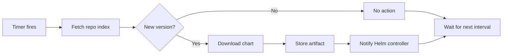

# How to Configure HelmChart Reconciliation Interval in Flux

Author: [nawazdhandala](https://github.com/nawazdhandala)

Tags: Flux CD, GitOps, Kubernetes, Helm, HelmChart, Reconciliation, Performance

Description: Learn how to configure and optimize the reconciliation interval for HelmChart resources in Flux CD to balance responsiveness with cluster performance.

---

## Introduction

In Flux CD, the reconciliation interval determines how frequently the source controller checks for new versions of a Helm chart. Setting this interval correctly is a balancing act: too short and you create unnecessary load on the chart repository and the cluster; too long and you delay the rollout of new chart versions. Understanding how reconciliation works and how to tune it is essential for running Flux efficiently in production.

This guide explains the reconciliation mechanism for HelmChart resources, how to configure intervals at different levels, and best practices for optimizing performance.

## How HelmChart Reconciliation Works

When Flux reconciles a HelmChart resource, the source controller performs the following steps:

1. Fetches the chart repository index (for HTTP repositories) or checks the OCI registry for new tags
2. Resolves the chart version based on the configured version constraint
3. Downloads the chart archive if a new version is detected
4. Stores the chart artifact in the source controller's internal storage
5. Notifies the Helm controller that a new chart artifact is available

The reconciliation interval controls how often step 1 begins.



## Setting the HelmChart Interval

The interval is configured in the `spec.interval` field of the HelmChart resource. However, most HelmChart resources are created automatically by Flux when you define a HelmRelease. In that case, the interval is set within the HelmRelease's `spec.chart.spec.interval` field.

### Interval on a HelmRelease (Most Common)

```yaml
# helmrelease-with-interval.yaml
# HelmRelease with explicit chart reconciliation interval
apiVersion: helm.toolkit.fluxcd.io/v2
kind: HelmRelease
metadata:
  name: my-app
  namespace: default
spec:
  interval: 10m                     # How often to reconcile the HelmRelease itself
  chart:
    spec:
      chart: my-app
      version: ">=1.0.0"
      sourceRef:
        kind: HelmRepository
        name: my-repo
        namespace: flux-system
      interval: 5m                  # How often to check for new chart versions
  values:
    replicaCount: 2
```

The two intervals serve different purposes:

- `spec.interval` (10m): How often the Helm controller reconciles the release (checking for drift, applying values changes)
- `spec.chart.spec.interval` (5m): How often the source controller checks the repository for a new chart version

### Interval on a Standalone HelmChart

If you manage HelmChart resources directly (not through HelmRelease), set the interval on the HelmChart itself.

```yaml
# helmchart-standalone.yaml
# Standalone HelmChart with reconciliation interval
apiVersion: source.toolkit.fluxcd.io/v1
kind: HelmChart
metadata:
  name: my-app
  namespace: flux-system
spec:
  chart: my-app
  version: ">=1.0.0"
  sourceRef:
    kind: HelmRepository
    name: my-repo
  interval: 5m                      # Check for new chart versions every 5 minutes
  reconcileStrategy: ChartVersion   # Only reconcile when the chart version changes
```

## Reconcile Strategy

The `reconcileStrategy` field determines what triggers a new artifact to be produced.

```yaml
# HelmChart with different reconcile strategies
apiVersion: source.toolkit.fluxcd.io/v1
kind: HelmChart
metadata:
  name: my-app
  namespace: flux-system
spec:
  chart: my-app
  version: "*"
  sourceRef:
    kind: HelmRepository
    name: my-repo
  interval: 10m
  reconcileStrategy: ChartVersion    # Options: ChartVersion or Revision
```

- **ChartVersion** (default): A new artifact is produced only when the chart version changes. This is ideal for semver-based workflows.
- **Revision**: A new artifact is produced whenever the chart revision changes, even if the version number stays the same. This is useful for development workflows where charts are overwritten with the same version.

## Choosing the Right Interval

The optimal interval depends on your use case.

### Production Environments

For production, longer intervals reduce load and provide stability.

```yaml
# Production: check for chart updates every 30 minutes
spec:
  chart:
    spec:
      chart: my-app
      version: "1.x"              # Pinned to major version
      sourceRef:
        kind: HelmRepository
        name: production-repo
        namespace: flux-system
      interval: 30m               # Less frequent checks in production
```

### Staging and Development

For staging or development environments, shorter intervals accelerate feedback loops.

```yaml
# Staging: check for chart updates every 1 minute
spec:
  chart:
    spec:
      chart: my-app
      version: "*"                # Accept any version
      sourceRef:
        kind: HelmRepository
        name: staging-repo
        namespace: flux-system
      interval: 1m                # Fast feedback in staging
```

### Recommended Intervals by Environment

| Environment | Chart Interval | Release Interval | Reconcile Strategy |
|-------------|---------------|-----------------|-------------------|
| Development | 1m            | 1m              | Revision          |
| Staging     | 2m            | 5m              | ChartVersion      |
| Production  | 15m-30m       | 10m             | ChartVersion      |

## HelmRepository Interval vs HelmChart Interval

The HelmRepository also has an interval that controls how often the repository index is fetched. This interval interacts with the HelmChart interval.

```yaml
# HelmRepository with its own interval
apiVersion: source.toolkit.fluxcd.io/v1
kind: HelmRepository
metadata:
  name: my-repo
  namespace: flux-system
spec:
  interval: 10m                  # Fetch the repo index every 10 minutes
  url: https://charts.example.com
```

If the HelmRepository interval is longer than the HelmChart interval, the chart check will use a cached index until the repository interval fires. For example, if the HelmRepository interval is 10m and the HelmChart interval is 1m, new chart versions will only be detected after the repository index is refreshed (every 10m).

For OCI repositories, there is no index to cache, so the HelmChart interval directly controls how often the registry is queried.

## Suspending Reconciliation

You can temporarily suspend reconciliation for a HelmChart without deleting the resource.

```bash
# Suspend reconciliation for a HelmRelease (suspends both chart and release)
flux suspend helmrelease my-app -n default

# Resume reconciliation
flux resume helmrelease my-app -n default
```

Or set it declaratively.

```yaml
# Suspend a HelmRelease to stop all reconciliation
apiVersion: helm.toolkit.fluxcd.io/v2
kind: HelmRelease
metadata:
  name: my-app
  namespace: default
spec:
  suspend: true                  # Pauses both chart and release reconciliation
  interval: 10m
  chart:
    spec:
      chart: my-app
      version: "1.x"
      sourceRef:
        kind: HelmRepository
        name: my-repo
        namespace: flux-system
      interval: 5m
```

## Forcing Immediate Reconciliation

Regardless of the configured interval, you can trigger an immediate reconciliation.

```bash
# Force immediate reconciliation of a HelmRelease
flux reconcile helmrelease my-app -n default

# Force immediate reconciliation of a specific source
flux reconcile source helm my-repo -n flux-system
```

## Monitoring Reconciliation

Track reconciliation timing and performance by checking resource statuses.

```bash
# View the last reconciliation time for all HelmReleases
flux get helmreleases -A

# View the last reconciliation time for chart sources
flux get sources chart -A

# Check the source controller metrics for reconciliation duration
kubectl port-forward -n flux-system deploy/source-controller 8080:8080
curl -s localhost:8080/metrics | grep gotk_reconcile_duration
```

## Performance Considerations

1. **Batch intervals**: If you have many HelmChart resources pointing to the same repository, align their intervals so the repository index is fetched once and shared.
2. **Rate limits**: Public chart repositories may have rate limits. Use longer intervals (15m+) for public repos.
3. **Resource usage**: Each reconciliation consumes CPU and memory in the source controller. Monitor resource usage and increase limits if needed.
4. **OCI vs HTTP**: OCI repositories do not have an index to download, making individual checks lighter, but each chart version query is a separate API call.

## Conclusion

The HelmChart reconciliation interval is a key lever for controlling how quickly Flux detects and deploys new chart versions. Shorter intervals provide faster feedback but increase load, while longer intervals conserve resources at the cost of responsiveness. For most production environments, a chart interval of 15-30 minutes combined with the ChartVersion reconcile strategy provides a good balance. Use `flux reconcile` for on-demand updates when you cannot wait for the next scheduled interval.
