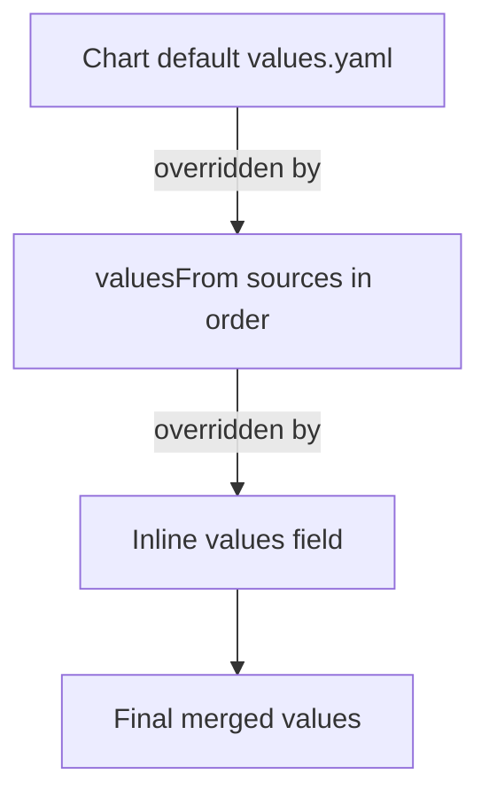

# How to Configure HelmChart Values File in Flux

Author: [nawazdhandala](https://github.com/nawazdhandala)

Tags: Flux CD, GitOps, Kubernetes, Helm, HelmRelease, Values, Configuration, ConfigMap

Description: Learn how to configure Helm chart values in Flux CD using inline values, valuesFrom references, ConfigMaps, Secrets, and multi-environment strategies.

---

Helm chart values are the primary mechanism for customizing deployments. In Flux CD, you configure values directly on the HelmRelease resource rather than passing them via command-line flags. Flux offers multiple ways to supply values: inline in the manifest, from ConfigMaps, from Secrets, or from a combination of sources with well-defined merge order. This guide covers all these approaches and when to use each one.

## Inline Values

The simplest approach is specifying values directly in the HelmRelease manifest under the `values` field:

```yaml
# HelmRelease with inline values
apiVersion: helm.toolkit.fluxcd.io/v2
kind: HelmRelease
metadata:
  name: my-app
  namespace: default
spec:
  interval: 30m
  chart:
    spec:
      chart: my-app
      version: "1.0.0"
      sourceRef:
        kind: HelmRepository
        name: my-repo
        namespace: flux-system
      interval: 10m
  # Inline values - same structure as a values.yaml file
  values:
    replicaCount: 3
    image:
      repository: my-app
      tag: "v1.2.3"
    service:
      type: ClusterIP
      port: 8080
    ingress:
      enabled: true
      hosts:
        - host: my-app.example.com
          paths:
            - path: /
              pathType: Prefix
    resources:
      requests:
        cpu: 100m
        memory: 128Mi
      limits:
        cpu: 500m
        memory: 512Mi
```

Inline values are ideal for small, straightforward configurations that do not contain sensitive data.

## Values from ConfigMaps

For larger value sets or shared configurations, store values in a ConfigMap and reference it with `valuesFrom`:

```yaml
# ConfigMap containing Helm values
apiVersion: v1
kind: ConfigMap
metadata:
  name: my-app-values
  namespace: default
data:
  # The key name can be anything; you reference it in valuesKey
  values.yaml: |
    replicaCount: 3
    image:
      repository: my-app
      tag: "v1.2.3"
    service:
      type: ClusterIP
      port: 8080
    resources:
      requests:
        cpu: 100m
        memory: 128Mi
      limits:
        cpu: 500m
        memory: 512Mi
---
# HelmRelease referencing the ConfigMap for values
apiVersion: helm.toolkit.fluxcd.io/v2
kind: HelmRelease
metadata:
  name: my-app
  namespace: default
spec:
  interval: 30m
  chart:
    spec:
      chart: my-app
      version: "1.0.0"
      sourceRef:
        kind: HelmRepository
        name: my-repo
        namespace: flux-system
      interval: 10m
  valuesFrom:
    - kind: ConfigMap
      name: my-app-values
      # The key in the ConfigMap data that contains the YAML values
      valuesKey: values.yaml
```

## Values from Secrets

For sensitive values like passwords and API keys, use a Secret:

```yaml
# Secret containing sensitive Helm values
apiVersion: v1
kind: Secret
metadata:
  name: my-app-secrets
  namespace: default
type: Opaque
stringData:
  # Sensitive values stored in a Secret
  values.yaml: |
    database:
      password: "super-secret-password"
    externalApi:
      apiKey: "my-api-key-12345"
---
# HelmRelease referencing the Secret for sensitive values
apiVersion: helm.toolkit.fluxcd.io/v2
kind: HelmRelease
metadata:
  name: my-app
  namespace: default
spec:
  interval: 30m
  chart:
    spec:
      chart: my-app
      version: "1.0.0"
      sourceRef:
        kind: HelmRepository
        name: my-repo
        namespace: flux-system
      interval: 10m
  valuesFrom:
    - kind: Secret
      name: my-app-secrets
      valuesKey: values.yaml
```

## Combining Multiple Value Sources

Flux allows you to combine inline values with multiple `valuesFrom` references. Values are merged in a specific order, with later sources overriding earlier ones:

```yaml
# HelmRelease combining multiple value sources
apiVersion: helm.toolkit.fluxcd.io/v2
kind: HelmRelease
metadata:
  name: my-app
  namespace: default
spec:
  interval: 30m
  chart:
    spec:
      chart: my-app
      version: "1.0.0"
      sourceRef:
        kind: HelmRepository
        name: my-repo
        namespace: flux-system
      interval: 10m
  valuesFrom:
    # First: base configuration from a ConfigMap
    - kind: ConfigMap
      name: my-app-base-values
      valuesKey: values.yaml
    # Second: environment-specific overrides from another ConfigMap
    - kind: ConfigMap
      name: my-app-production-values
      valuesKey: values.yaml
    # Third: sensitive values from a Secret (highest priority in valuesFrom)
    - kind: Secret
      name: my-app-secrets
      valuesKey: values.yaml
  # Inline values have the HIGHEST priority and override everything above
  values:
    replicaCount: 5
```

The merge order is:



## Optional Value References

If a ConfigMap or Secret might not exist yet, mark the reference as optional to prevent the HelmRelease from failing:

```yaml
# HelmRelease with optional valuesFrom reference
apiVersion: helm.toolkit.fluxcd.io/v2
kind: HelmRelease
metadata:
  name: my-app
  namespace: default
spec:
  interval: 30m
  chart:
    spec:
      chart: my-app
      version: "1.0.0"
      sourceRef:
        kind: HelmRepository
        name: my-repo
        namespace: flux-system
      interval: 10m
  valuesFrom:
    - kind: ConfigMap
      name: my-app-values
      valuesKey: values.yaml
    - kind: ConfigMap
      name: my-app-feature-flags
      valuesKey: values.yaml
      # Do not fail if this ConfigMap does not exist
      optional: true
  values:
    replicaCount: 2
```

## Targeting Specific Keys

You can map a single value from a ConfigMap or Secret to a specific path in the values hierarchy using `targetPath`:

```yaml
# ConfigMap with individual values
apiVersion: v1
kind: ConfigMap
metadata:
  name: app-config
  namespace: default
data:
  db-host: "postgres.database.svc.cluster.local"
  db-port: "5432"
---
# Secret with individual sensitive values
apiVersion: v1
kind: Secret
metadata:
  name: app-secrets
  namespace: default
type: Opaque
stringData:
  db-password: "my-db-password"
---
# HelmRelease using targetPath to map individual values
apiVersion: helm.toolkit.fluxcd.io/v2
kind: HelmRelease
metadata:
  name: my-app
  namespace: default
spec:
  interval: 30m
  chart:
    spec:
      chart: my-app
      version: "1.0.0"
      sourceRef:
        kind: HelmRepository
        name: my-repo
        namespace: flux-system
      interval: 10m
  valuesFrom:
    # Map a single ConfigMap key to a specific values path
    - kind: ConfigMap
      name: app-config
      valuesKey: db-host
      targetPath: database.host
    - kind: ConfigMap
      name: app-config
      valuesKey: db-port
      targetPath: database.port
    # Map a Secret key to a specific values path
    - kind: Secret
      name: app-secrets
      valuesKey: db-password
      targetPath: database.password
  values:
    database:
      name: myapp
```

This is especially useful when you want to share a single Secret across multiple HelmReleases, each using different keys.

## Multi-Environment Strategy

For managing the same chart across multiple environments, use a layered values approach:

```bash
# Directory structure for multi-environment values
clusters/
  base/
    my-app-base-values.yaml    # Shared base configuration
  staging/
    my-app-env-values.yaml     # Staging-specific overrides
  production/
    my-app-env-values.yaml     # Production-specific overrides
```

The base ConfigMap:

```yaml
# Base values shared across all environments
apiVersion: v1
kind: ConfigMap
metadata:
  name: my-app-base-values
  namespace: default
data:
  values.yaml: |
    image:
      repository: my-app
    service:
      type: ClusterIP
      port: 8080
    resources:
      requests:
        cpu: 100m
        memory: 128Mi
```

The production override ConfigMap:

```yaml
# Production-specific overrides
apiVersion: v1
kind: ConfigMap
metadata:
  name: my-app-env-values
  namespace: default
data:
  values.yaml: |
    replicaCount: 5
    image:
      tag: "v1.2.3"
    resources:
      requests:
        cpu: 500m
        memory: 512Mi
      limits:
        cpu: "1"
        memory: 1Gi
```

## Debugging Merged Values

To see the final merged values that Flux passes to Helm, inspect the HelmRelease status:

```bash
# Check what values Flux computed for the HelmRelease
kubectl get helmrelease my-app -n default -o jsonpath='{.status.lastAppliedRevision}'

# Get the Helm release values as Helm sees them
helm get values my-app -n default

# Compare with the chart defaults
helm show values my-app --repo https://charts.example.com --version 1.0.0
```

By using a combination of inline values, ConfigMaps, and Secrets with well-defined merge ordering, Flux CD gives you full control over Helm chart configuration while keeping sensitive data secure and shared configuration DRY across environments.
