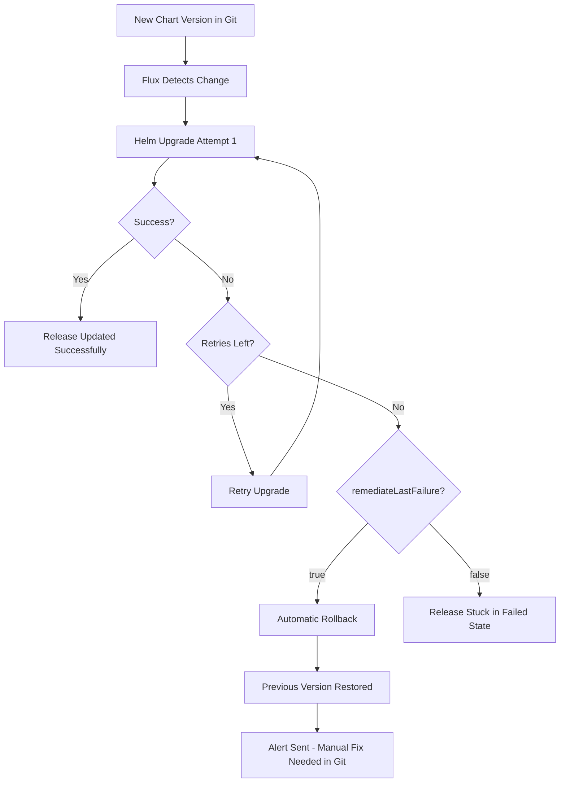

# How to Configure HelmRelease Automatic Rollback on Failure in Flux

Author: [nawazdhandala](https://github.com/nawazdhandala)

Tags: Flux CD, GitOps, Kubernetes, Helm, HelmRelease, Rollback, Remediation, High Availability

Description: Learn how to configure automatic rollback on failure for HelmRelease in Flux CD to maintain application availability when upgrades or installations fail.

---

## Introduction

In production Kubernetes environments, application availability is paramount. When a Helm chart upgrade introduces a bug, misconfiguration, or incompatible change, you need the system to recover automatically without waiting for human intervention. Flux CD supports automatic rollback on failure through its remediation configuration, which can roll back to the last known-good release when an upgrade fails.

This guide covers how to configure automatic rollback for both install and upgrade failures, combining the relevant `spec.install.remediation` and `spec.upgrade.remediation` fields into a comprehensive self-healing deployment strategy.

## How Automatic Rollback Works

Automatic rollback in Flux is implemented through the remediation system. When a Helm operation fails and all retries are exhausted, Flux can automatically roll back the release to its previous successful state.

The following diagram shows the complete rollback flow for upgrades:



## Configuring Automatic Rollback

To enable automatic rollback, you need to set `remediateLastFailure: true` in the upgrade remediation configuration. This tells Flux to perform a Helm rollback after exhausting all retry attempts.

The following example enables automatic rollback with 3 retries:

```yaml
apiVersion: helm.toolkit.fluxcd.io/v2
kind: HelmRelease
metadata:
  name: my-application
  namespace: production
spec:
  interval: 10m
  chart:
    spec:
      chart: my-application
      version: "2.0.0"
      sourceRef:
        kind: HelmRepository
        name: my-repo
        namespace: flux-system
  # Install configuration with remediation
  install:
    remediation:
      retries: 3
      # Uninstall on failure during initial install
      remediateLastFailure: true
  # Upgrade configuration with automatic rollback
  upgrade:
    remediation:
      retries: 3
      # Roll back to previous version on upgrade failure
      remediateLastFailure: true
  values:
    replicaCount: 3
    image:
      repository: myregistry/my-application
      tag: "v2.0.0"
```

## Install vs Upgrade Rollback Behavior

It is important to understand that rollback behaves differently for installs and upgrades:

**Install remediation** (`spec.install.remediation.remediateLastFailure`): When set to `true`, Flux uninstalls the failed release. There is no previous version to roll back to since this is the first installation. On the next reconciliation, Flux will attempt a fresh install.

**Upgrade remediation** (`spec.upgrade.remediation.remediateLastFailure`): When set to `true`, Flux performs a Helm rollback to the last successful release revision. The application returns to the previous working version.

The following example highlights the different behavior for each scenario:

```yaml
apiVersion: helm.toolkit.fluxcd.io/v2
kind: HelmRelease
metadata:
  name: my-application
  namespace: production
spec:
  interval: 10m
  chart:
    spec:
      chart: my-application
      version: "2.0.0"
      sourceRef:
        kind: HelmRepository
        name: my-repo
        namespace: flux-system
  install:
    # Timeout for the initial installation
    timeout: 5m
    remediation:
      retries: 3
      # For install: uninstall the failed release and retry from scratch
      remediateLastFailure: true
  upgrade:
    # Timeout for upgrade operations
    timeout: 5m
    # Remove resources created during a failed upgrade
    cleanupOnFail: true
    remediation:
      retries: 3
      # For upgrade: roll back to the last successful version
      remediateLastFailure: true
  values:
    replicaCount: 3
```

## Production-Grade Rollback Configuration

For production environments, combine automatic rollback with appropriate timeouts, cleanup policies, and monitoring.

The following example shows a production-grade configuration with all recommended rollback settings:

```yaml
apiVersion: helm.toolkit.fluxcd.io/v2
kind: HelmRelease
metadata:
  name: payment-service
  namespace: production
spec:
  interval: 10m
  chart:
    spec:
      chart: payment-service
      version: "3.1.0"
      sourceRef:
        kind: HelmRepository
        name: internal-charts
        namespace: flux-system
  install:
    timeout: 10m
    remediation:
      retries: 3
      remediateLastFailure: true
  upgrade:
    timeout: 10m
    # Clean up orphaned resources from failed upgrades
    cleanupOnFail: true
    remediation:
      # Allow sufficient retries for transient issues
      retries: 5
      # Always roll back to maintain service availability
      remediateLastFailure: true
  # Enable drift detection to prevent manual changes
  driftDetection:
    mode: enabled
  values:
    replicaCount: 5
    image:
      repository: myregistry/payment-service
      tag: "v3.1.0"
    resources:
      requests:
        cpu: 200m
        memory: 256Mi
      limits:
        cpu: 1000m
        memory: 1Gi
    podDisruptionBudget:
      minAvailable: 2
```

## Setting Up Alerts for Rollback Events

Automatic rollback keeps your application running, but you still need to know when it happens so you can fix the underlying issue in Git. Flux supports alerting through its notification controller.

The following example configures a Flux Alert to notify you when a HelmRelease fails and triggers a rollback:

```yaml
# Alert provider configuration (e.g., Slack)
apiVersion: notification.toolkit.fluxcd.io/v1
kind: Provider
metadata:
  name: slack-alerts
  namespace: flux-system
spec:
  type: slack
  channel: deployment-alerts
  secretRef:
    name: slack-webhook-url
---
# Alert configuration for HelmRelease failures
apiVersion: notification.toolkit.fluxcd.io/v1
kind: Alert
metadata:
  name: helmrelease-failures
  namespace: flux-system
spec:
  providerRef:
    name: slack-alerts
  eventSeverity: error
  eventSources:
    # Monitor all HelmReleases in the production namespace
    - kind: HelmRelease
      namespace: production
      name: "*"
```

## Testing Automatic Rollback

To verify your rollback configuration works correctly, you can intentionally deploy a broken version and observe the rollback.

Use the following steps to test automatic rollback in a non-production environment:

```bash
# Step 1: Verify the current working release
flux get helmrelease my-application -n production

# Step 2: Push a change to Git that will cause an upgrade failure
# (e.g., set an image tag that does not exist)

# Step 3: Watch the HelmRelease status as Flux processes the upgrade
kubectl get helmrelease my-application -n production -w

# Step 4: After retries are exhausted, verify rollback occurred
helm history my-application -n production

# Step 5: Confirm the application is running on the previous version
kubectl get deployment my-application -n production -o jsonpath='{.spec.template.spec.containers[0].image}'
```

## What Happens After a Rollback

After Flux rolls back a release, the HelmRelease remains in a failed condition because the desired state in Git still specifies the newer (broken) version. Flux will continue to attempt the upgrade on each reconciliation cycle. To resolve this permanently, you need to either:

1. **Fix the issue in Git** -- update the chart version, values, or image tag to a working configuration
2. **Revert the Git change** -- roll back the Git commit that introduced the broken upgrade

Once you push a fix to Git, Flux will detect the change and attempt a new upgrade with a fresh retry counter.

## Best Practices

1. **Always enable rollback for production workloads** by setting `remediateLastFailure: true` on upgrade remediation.
2. **Configure alerts** so your team is notified immediately when a rollback occurs.
3. **Use cleanupOnFail** to remove resources created during a failed upgrade before the rollback.
4. **Set reasonable timeouts** that account for your application's startup time and health check delays.
5. **Test rollback behavior** in staging environments before relying on it in production.
6. **Combine with Pod Disruption Budgets** to ensure the rollback itself does not cause downtime.

## Conclusion

Automatic rollback is one of the most important features of Flux's HelmRelease remediation system. By configuring `remediateLastFailure: true` on your upgrade remediation, you ensure that failed upgrades do not leave your applications in a broken state. Combined with proper alerting and monitoring, this creates a deployment pipeline that self-heals from failures while keeping your team informed about issues that need attention.
