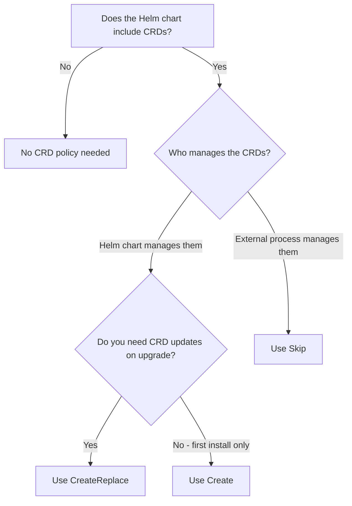

# How to Configure HelmRelease CRDs Installation Policy in Flux

Author: [nawazdhandala](https://github.com/nawazdhandala)

Tags: Flux CD, GitOps, Kubernetes, Helm, HelmRelease, CRD, Custom Resource Definitions, Installation Policy

Description: Learn how to configure the CRDs installation policy for HelmRelease in Flux CD to control how Custom Resource Definitions are created and updated during Helm operations.

---

## Introduction

Many Helm charts include Custom Resource Definitions (CRDs) that extend the Kubernetes API. Managing CRDs during Helm installations and upgrades requires special consideration because CRDs are cluster-scoped resources that affect all namespaces, and deleting them can destroy all associated custom resources across the cluster.

Flux CD provides the `spec.install.crds` field on HelmRelease resources to control how CRDs are handled during Helm install operations. This guide explains the available CRD policies and when to use each one.

## CRD Installation Policy Options

Flux supports three CRD installation policies through the `spec.install.crds` field:

| Policy | Description |
|--------|-------------|
| `Create` | Create CRDs if they do not exist. Do not update or replace existing CRDs. This is the default behavior. |
| `CreateReplace` | Create CRDs if they do not exist. Replace existing CRDs with the versions from the Helm chart. |
| `Skip` | Do not install or update CRDs. Assume they are managed externally. |

## Default Behavior: Create

When no CRD policy is specified, Flux uses the `Create` policy. This creates CRDs that do not exist but will not modify CRDs that are already present in the cluster.

The following example uses the default `Create` policy:

```yaml
apiVersion: helm.toolkit.fluxcd.io/v2
kind: HelmRelease
metadata:
  name: cert-manager
  namespace: cert-manager
spec:
  interval: 10m
  chart:
    spec:
      chart: cert-manager
      version: "1.13.0"
      sourceRef:
        kind: HelmRepository
        name: jetstack
        namespace: flux-system
  install:
    # Create CRDs only if they do not already exist (default behavior)
    crds: Create
  values:
    installCRDs: false
```

## Using CreateReplace for CRD Updates

When upgrading Helm charts that include updated CRDs with new fields or versions, you need the `CreateReplace` policy. This ensures CRDs are updated to match the chart version, which is necessary when new CRD fields are required by the updated application.

The following example uses `CreateReplace` to keep CRDs in sync with the chart version:

```yaml
apiVersion: helm.toolkit.fluxcd.io/v2
kind: HelmRelease
metadata:
  name: cert-manager
  namespace: cert-manager
spec:
  interval: 10m
  chart:
    spec:
      chart: cert-manager
      version: "1.14.0"
      sourceRef:
        kind: HelmRepository
        name: jetstack
        namespace: flux-system
  install:
    # Create or replace CRDs to ensure they match the chart version
    crds: CreateReplace
    remediation:
      retries: 3
      remediateLastFailure: true
  upgrade:
    # Also apply CRD updates during upgrades
    crds: CreateReplace
    remediation:
      retries: 3
      remediateLastFailure: true
  values:
    # Let Flux handle CRDs via the crds policy, not the chart's built-in option
    installCRDs: false
```

## Using Skip for Externally Managed CRDs

In some environments, CRDs are managed separately from the Helm chart -- for example, by a platform team using a dedicated Kustomization or by another HelmRelease. In these cases, use the `Skip` policy to prevent the Helm chart from touching the CRDs.

The following example skips CRD installation because CRDs are managed by a separate Kustomization:

```yaml
# First, manage CRDs separately via Kustomization
apiVersion: kustomize.toolkit.fluxcd.io/v1
kind: Kustomization
metadata:
  name: cert-manager-crds
  namespace: flux-system
spec:
  interval: 10m
  sourceRef:
    kind: GitRepository
    name: cert-manager-crds
  path: ./crds
  prune: false
---
# Then, install the Helm chart without CRDs
apiVersion: helm.toolkit.fluxcd.io/v2
kind: HelmRelease
metadata:
  name: cert-manager
  namespace: cert-manager
spec:
  interval: 10m
  # Ensure CRDs are applied before the HelmRelease
  dependsOn:
    - name: cert-manager-crds
      namespace: flux-system
  chart:
    spec:
      chart: cert-manager
      version: "1.14.0"
      sourceRef:
        kind: HelmRepository
        name: jetstack
        namespace: flux-system
  install:
    # Skip CRD installation -- CRDs are managed by the Kustomization above
    crds: Skip
  upgrade:
    crds: Skip
  values:
    installCRDs: false
```

## CRD Policy Decision Guide

The following diagram helps you choose the right CRD policy for your situation:



## Handling CRD Upgrades Safely

CRD updates can be risky because they affect all custom resources in the cluster. Here are strategies for managing CRD upgrades safely.

### Strategy 1: Use CreateReplace with Backup

Before upgrading charts with CRD changes, back up existing custom resources:

```bash
# Back up all custom resources before a CRD upgrade
kubectl get certificates.cert-manager.io --all-namespaces -o yaml > certificates-backup.yaml
kubectl get issuers.cert-manager.io --all-namespaces -o yaml > issuers-backup.yaml
kubectl get clusterissuers.cert-manager.io -o yaml > clusterissuers-backup.yaml

# Then apply the HelmRelease upgrade with CreateReplace
flux reconcile helmrelease cert-manager -n cert-manager
```

### Strategy 2: Separate CRD Lifecycle

For maximum control, manage CRDs independently from the application:

```yaml
# CRD HelmRelease -- installed first, updated carefully
apiVersion: helm.toolkit.fluxcd.io/v2
kind: HelmRelease
metadata:
  name: prometheus-operator-crds
  namespace: monitoring
spec:
  interval: 30m
  chart:
    spec:
      chart: prometheus-operator-crds
      version: "6.0.0"
      sourceRef:
        kind: HelmRepository
        name: prometheus-community
        namespace: flux-system
  install:
    crds: CreateReplace
  upgrade:
    crds: CreateReplace
---
# Application HelmRelease -- depends on CRDs being present
apiVersion: helm.toolkit.fluxcd.io/v2
kind: HelmRelease
metadata:
  name: kube-prometheus-stack
  namespace: monitoring
spec:
  interval: 10m
  dependsOn:
    - name: prometheus-operator-crds
  chart:
    spec:
      chart: kube-prometheus-stack
      version: "55.0.0"
      sourceRef:
        kind: HelmRepository
        name: prometheus-community
        namespace: flux-system
  install:
    # Skip CRDs since they are managed separately
    crds: Skip
  upgrade:
    crds: Skip
  values:
    prometheusOperator:
      enabled: true
```

## Verifying CRD Policy

After applying your HelmRelease, verify CRDs are handled according to your policy:

```bash
# List all CRDs installed by a specific Helm chart
kubectl get crds -o name | grep cert-manager

# Check CRD versions and creation timestamps
kubectl get crd certificates.cert-manager.io -o jsonpath='{.metadata.resourceVersion}'

# Verify the HelmRelease status
flux get helmrelease cert-manager -n cert-manager
```

## Best Practices

1. **Use `CreateReplace` when the Helm chart manages its own CRDs** and you want automatic CRD updates on chart upgrades.
2. **Use `Skip` when CRDs are managed externally** by a platform team, a separate Kustomization, or a dedicated CRD chart.
3. **Use `Create` (default) when you only need CRDs on first install** and plan to handle CRD updates manually or through another process.
4. **Never set `prune: true` on Kustomizations that manage CRDs** -- accidentally deleting a CRD destroys all its custom resources cluster-wide.
5. **Disable chart-level CRD installation** (e.g., `installCRDs: false` for cert-manager) when using Flux's CRD policy to avoid conflicts.
6. **Back up custom resources before CRD upgrades** that might change the CRD schema.

## Conclusion

Properly managing CRDs is critical for Helm charts that extend the Kubernetes API. Flux's `spec.install.crds` and `spec.upgrade.crds` fields give you fine-grained control over CRD lifecycle management, whether you want Flux to handle CRDs automatically with `CreateReplace`, only create them initially with `Create`, or leave them to an external process with `Skip`. Choose the policy that matches your organizational structure and risk tolerance for CRD changes.
