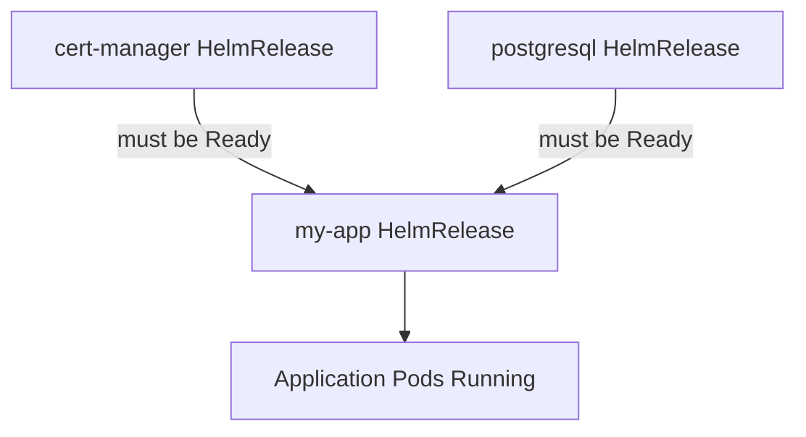

# How to Configure HelmRelease Dependencies in Flux

Author: [nawazdhandala](https://github.com/nawazdhandala)

Tags: Flux CD, GitOps, Kubernetes, Helm, HelmRelease, Dependencies, Ordering

Description: Learn how to configure deployment ordering between HelmReleases using the spec.dependsOn field in Flux CD.

---

## Introduction

In real-world Kubernetes environments, applications often depend on other services. A web application might need a database to be running first. A monitoring stack might depend on a certificate manager. Flux CD provides the `spec.dependsOn` field in HelmRelease to define these ordering relationships, ensuring that dependent releases are installed only after their prerequisites are ready.

## How dependsOn Works

The `spec.dependsOn` field accepts a list of HelmRelease references. Flux will not start reconciling a HelmRelease until all its dependencies have been successfully installed and report a `Ready` status. If a dependency fails, the dependent HelmRelease will wait.



## Basic Dependency Configuration

Here is a simple example where an application depends on a PostgreSQL database.

```yaml
# postgresql.yaml - Database HelmRelease (no dependencies)
apiVersion: helm.toolkit.fluxcd.io/v2
kind: HelmRelease
metadata:
  name: postgresql
  namespace: default
spec:
  interval: 10m
  chart:
    spec:
      chart: postgresql
      version: "13.x"
      sourceRef:
        kind: HelmRepository
        name: bitnami
        namespace: flux-system
  values:
    auth:
      database: myapp
      username: myapp
```

```yaml
# my-app.yaml - Application that depends on PostgreSQL
apiVersion: helm.toolkit.fluxcd.io/v2
kind: HelmRelease
metadata:
  name: my-app
  namespace: default
spec:
  interval: 10m
  # This HelmRelease waits until postgresql is Ready
  dependsOn:
    - name: postgresql
  chart:
    spec:
      chart: my-app
      version: "1.x"
      sourceRef:
        kind: HelmRepository
        name: my-repo
        namespace: flux-system
  values:
    database:
      host: postgresql.default.svc
      port: 5432
```

## Multiple Dependencies

A HelmRelease can depend on multiple other releases. All must be Ready before reconciliation begins.

```yaml
# my-app.yaml - Application with multiple dependencies
apiVersion: helm.toolkit.fluxcd.io/v2
kind: HelmRelease
metadata:
  name: my-app
  namespace: default
spec:
  interval: 10m
  dependsOn:
    # All of these must be Ready before my-app is installed
    - name: postgresql
    - name: redis
    - name: rabbitmq
  chart:
    spec:
      chart: my-app
      version: "1.x"
      sourceRef:
        kind: HelmRepository
        name: my-repo
        namespace: flux-system
  values:
    database:
      host: postgresql.default.svc
    cache:
      host: redis-master.default.svc
    queue:
      host: rabbitmq.default.svc
```

## Cross-Namespace Dependencies

Dependencies can reference HelmReleases in other namespaces using the `namespace` field.

```yaml
# Application depending on infrastructure in another namespace
apiVersion: helm.toolkit.fluxcd.io/v2
kind: HelmRelease
metadata:
  name: my-app
  namespace: production
spec:
  interval: 10m
  dependsOn:
    # cert-manager is in the cert-manager namespace
    - name: cert-manager
      namespace: cert-manager
    # ingress-nginx is in the ingress namespace
    - name: ingress-nginx
      namespace: ingress
  chart:
    spec:
      chart: my-app
      version: "1.x"
      sourceRef:
        kind: HelmRepository
        name: my-repo
        namespace: flux-system
  values:
    ingress:
      enabled: true
      annotations:
        cert-manager.io/cluster-issuer: letsencrypt-prod
```

## Dependency Chains

You can create chains of dependencies where A depends on B, and B depends on C.

```yaml
# Step 1: cert-manager (no dependencies)
apiVersion: helm.toolkit.fluxcd.io/v2
kind: HelmRelease
metadata:
  name: cert-manager
  namespace: cert-manager
spec:
  interval: 10m
  chart:
    spec:
      chart: cert-manager
      version: "1.x"
      sourceRef:
        kind: HelmRepository
        name: jetstack
        namespace: flux-system
  values:
    installCRDs: true
---
# Step 2: ingress-nginx depends on cert-manager
apiVersion: helm.toolkit.fluxcd.io/v2
kind: HelmRelease
metadata:
  name: ingress-nginx
  namespace: ingress
spec:
  interval: 10m
  dependsOn:
    - name: cert-manager
      namespace: cert-manager
  chart:
    spec:
      chart: ingress-nginx
      version: "4.x"
      sourceRef:
        kind: HelmRepository
        name: ingress-nginx
        namespace: flux-system
---
# Step 3: my-app depends on ingress-nginx (which depends on cert-manager)
apiVersion: helm.toolkit.fluxcd.io/v2
kind: HelmRelease
metadata:
  name: my-app
  namespace: production
spec:
  interval: 10m
  dependsOn:
    - name: ingress-nginx
      namespace: ingress
  chart:
    spec:
      chart: my-app
      version: "1.x"
      sourceRef:
        kind: HelmRepository
        name: my-repo
        namespace: flux-system
```

This creates the following installation order: cert-manager, then ingress-nginx, then my-app.

## Full Stack Example

Here is a complete example of a multi-tier application stack with dependencies.

```yaml
# infrastructure/databases.yaml
apiVersion: helm.toolkit.fluxcd.io/v2
kind: HelmRelease
metadata:
  name: postgresql
  namespace: database
spec:
  interval: 10m
  chart:
    spec:
      chart: postgresql
      version: "13.x"
      sourceRef:
        kind: HelmRepository
        name: bitnami
        namespace: flux-system
  values:
    auth:
      database: app
---
apiVersion: helm.toolkit.fluxcd.io/v2
kind: HelmRelease
metadata:
  name: redis
  namespace: cache
spec:
  interval: 10m
  chart:
    spec:
      chart: redis
      version: "18.x"
      sourceRef:
        kind: HelmRepository
        name: bitnami
        namespace: flux-system
---
# apps/backend.yaml - Backend depends on database and cache
apiVersion: helm.toolkit.fluxcd.io/v2
kind: HelmRelease
metadata:
  name: backend-api
  namespace: production
spec:
  interval: 10m
  dependsOn:
    - name: postgresql
      namespace: database
    - name: redis
      namespace: cache
  chart:
    spec:
      chart: backend-api
      version: "2.x"
      sourceRef:
        kind: HelmRepository
        name: my-repo
        namespace: flux-system
---
# apps/frontend.yaml - Frontend depends on backend
apiVersion: helm.toolkit.fluxcd.io/v2
kind: HelmRelease
metadata:
  name: frontend
  namespace: production
spec:
  interval: 10m
  dependsOn:
    - name: backend-api
  chart:
    spec:
      chart: frontend
      version: "2.x"
      sourceRef:
        kind: HelmRepository
        name: my-repo
        namespace: flux-system
```

## Checking Dependency Status

Monitor the dependency chain to see which releases are waiting.

```bash
# Check all HelmReleases and their status
flux get helmreleases -A

# Check a specific HelmRelease for dependency issues
kubectl describe helmrelease my-app -n production

# View the conditions showing dependency wait status
kubectl get helmrelease my-app -n production -o jsonpath='{.status.conditions[*].message}'
```

## Important Behavior Notes

There are several behaviors to understand when using dependsOn:

- **Install only**: dependsOn is primarily enforced during the initial install. Once all releases are installed, they reconcile independently based on their own intervals.
- **No circular dependencies**: Flux does not detect circular dependencies. A circular chain will result in all involved HelmReleases waiting indefinitely.
- **Failure propagation**: If a dependency fails, dependent releases will remain pending. Fix the failing dependency to unblock the chain.
- **Deletion order**: dependsOn does not control deletion order. If you need ordered deletion, remove resources manually or use finalizers.

## Conclusion

The `spec.dependsOn` field provides a straightforward way to order HelmRelease installations in Flux CD. It handles common patterns like database-before-application, infrastructure-before-workloads, and multi-tier application stacks. Keep dependency chains as shallow as possible to avoid long deployment times, and always verify that your dependency graph has no cycles.
