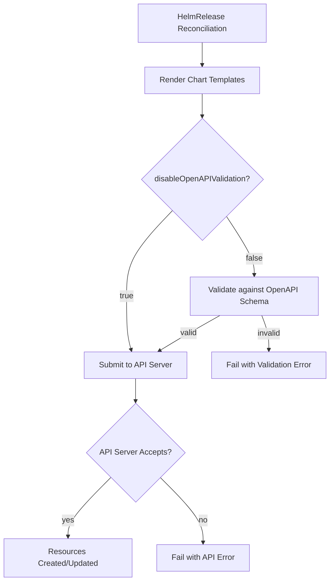

# How to Configure HelmRelease disableOpenAPIValidation in Flux

Author: [nawazdhandala](https://github.com/nawazdhandala)

Tags: Flux CD, GitOps, Kubernetes, Helm, HelmRelease, OpenAPI Validation, Install, Upgrade

Description: Learn how to disable OpenAPI validation on HelmRelease in Flux CD to handle charts with custom resources or non-standard schemas.

---

When Helm installs or upgrades a release, it validates the rendered manifests against the Kubernetes OpenAPI schema by default. This validation catches issues like incorrect field names, wrong types, and invalid resource structures before they hit the API server. However, there are cases where this validation gets in the way -- particularly with Custom Resource Definitions (CRDs) that are not yet registered, beta APIs, or charts that include resources with schemas not known to the cluster at validation time. Flux provides the `disableOpenAPIValidation` option to handle these situations.

## What OpenAPI Validation Does

Kubernetes exposes an OpenAPI schema that describes the structure of all known resource types. When Helm renders a chart, it can validate the output against this schema to catch errors early. This is equivalent to running `helm install --disable-openapi-validation=false` (the default).

When validation is enabled and encounters a field that is not in the schema, the install or upgrade will fail with a validation error -- even though the Kubernetes API server might accept the resource just fine.

## Prerequisites

- Kubernetes cluster with Flux CD v2.x or later
- A HelmRepository or chart source configured
- `kubectl` and `flux` CLI tools

## When to Disable OpenAPI Validation

Common scenarios where disabling OpenAPI validation is necessary:

1. **CRDs installed by the same chart** -- The chart installs CRDs and creates Custom Resources in a single release. The CRDs may not be registered when validation runs.
2. **Server-side unknown fields** -- Resources contain fields that are valid but not described in the cluster's OpenAPI schema (common with newer API versions or alpha/beta features).
3. **Third-party CRDs** -- The chart references CRDs from another operator that may not be installed yet.
4. **Schema mismatches** -- The cluster's OpenAPI schema is outdated relative to the resources being deployed.

## Configuring disableOpenAPIValidation for Install

To disable OpenAPI validation during the initial installation:

```yaml
# HelmRelease with OpenAPI validation disabled for install
apiVersion: helm.toolkit.fluxcd.io/v2
kind: HelmRelease
metadata:
  name: my-operator
  namespace: default
spec:
  interval: 10m
  chart:
    spec:
      chart: my-operator
      version: "3.x"
      sourceRef:
        kind: HelmRepository
        name: my-repo
        namespace: flux-system
  install:
    # Disable OpenAPI schema validation during install
    disableOpenAPIValidation: true
```

## Configuring disableOpenAPIValidation for Upgrade

To disable validation during upgrades:

```yaml
# HelmRelease with OpenAPI validation disabled for upgrade
apiVersion: helm.toolkit.fluxcd.io/v2
kind: HelmRelease
metadata:
  name: my-operator
  namespace: default
spec:
  interval: 10m
  chart:
    spec:
      chart: my-operator
      version: "3.x"
      sourceRef:
        kind: HelmRepository
        name: my-repo
        namespace: flux-system
  upgrade:
    # Disable OpenAPI schema validation during upgrade
    disableOpenAPIValidation: true
```

## Disabling for Both Install and Upgrade

Typically you will want to disable validation for both operations:

```yaml
# HelmRelease with OpenAPI validation disabled for both install and upgrade
apiVersion: helm.toolkit.fluxcd.io/v2
kind: HelmRelease
metadata:
  name: my-operator
  namespace: default
spec:
  interval: 10m
  chart:
    spec:
      chart: my-operator
      version: "3.x"
      sourceRef:
        kind: HelmRepository
        name: my-repo
        namespace: flux-system
  install:
    disableOpenAPIValidation: true
  upgrade:
    disableOpenAPIValidation: true
```

## Real-World Example: Installing a CRD-Heavy Operator

Consider deploying cert-manager, which installs CRDs and Custom Resources in the same chart:

```yaml
# cert-manager HelmRelease with OpenAPI validation disabled
apiVersion: helm.toolkit.fluxcd.io/v2
kind: HelmRelease
metadata:
  name: cert-manager
  namespace: cert-manager
spec:
  interval: 15m
  chart:
    spec:
      chart: cert-manager
      version: "1.x"
      sourceRef:
        kind: HelmRepository
        name: jetstack
        namespace: flux-system
  install:
    # CRDs may not be registered when validation runs
    disableOpenAPIValidation: true
    createNamespace: true
  upgrade:
    disableOpenAPIValidation: true
  values:
    installCRDs: true
```

## Understanding the Validation Flow

The following diagram shows where OpenAPI validation sits in the Helm install/upgrade pipeline:



Note that even with OpenAPI validation disabled, the Kubernetes API server still performs its own validation. Disabling OpenAPI validation only skips the client-side pre-check that Helm performs.

## Combining with Other Install/Upgrade Options

You can combine `disableOpenAPIValidation` with other options in the install and upgrade specs:

```yaml
# Full install and upgrade configuration
apiVersion: helm.toolkit.fluxcd.io/v2
kind: HelmRelease
metadata:
  name: my-operator
  namespace: default
spec:
  interval: 10m
  chart:
    spec:
      chart: my-operator
      version: "3.x"
      sourceRef:
        kind: HelmRepository
        name: my-repo
        namespace: flux-system
  install:
    disableOpenAPIValidation: true
    disableWait: false
    timeout: 5m
    remediation:
      retries: 3
  upgrade:
    disableOpenAPIValidation: true
    disableWait: false
    timeout: 5m
    remediation:
      retries: 3
      remediateLastFailure: true
```

## Identifying OpenAPI Validation Errors

If you encounter OpenAPI validation errors, they typically look like this in the HelmRelease status:

```bash
# Check for validation errors
flux get helmrelease my-operator

# Look for specific error messages
kubectl describe helmrelease my-operator -n default | grep -A 10 "Message"
```

Common error messages include:
- `error validating data: unknown field "spec.someField"`
- `ValidationError: unknown field in object`
- `the server could not find the requested resource`

These errors indicate that disabling OpenAPI validation would allow the install to proceed.

## Best Practices

1. **Prefer keeping validation enabled.** OpenAPI validation catches real errors before they reach the API server. Only disable it when necessary.
2. **Understand why validation fails.** Before disabling validation, investigate the root cause. If CRDs are missing, consider installing them separately first.
3. **Use CRD installation order.** Flux supports dependency ordering with `dependsOn`. Install CRDs in a separate HelmRelease and depend on it, rather than disabling validation.
4. **Re-enable when possible.** If you disable validation for initial setup (e.g., CRD registration), consider removing the flag once CRDs are stable.
5. **Monitor for real errors.** With validation disabled, malformed resources will only fail at the API server level. Watch your HelmRelease events carefully.

## Alternative: Splitting CRD Installation

Instead of disabling validation, you can split CRD installation into a separate HelmRelease:

```yaml
# Install CRDs first
apiVersion: helm.toolkit.fluxcd.io/v2
kind: HelmRelease
metadata:
  name: my-operator-crds
  namespace: default
spec:
  interval: 10m
  chart:
    spec:
      chart: my-operator-crds
      sourceRef:
        kind: HelmRepository
        name: my-repo
        namespace: flux-system
---
# Then install the operator, depending on the CRDs
apiVersion: helm.toolkit.fluxcd.io/v2
kind: HelmRelease
metadata:
  name: my-operator
  namespace: default
spec:
  dependsOn:
    - name: my-operator-crds
  interval: 10m
  chart:
    spec:
      chart: my-operator
      sourceRef:
        kind: HelmRepository
        name: my-repo
        namespace: flux-system
```

## Conclusion

The `disableOpenAPIValidation` option in Flux HelmRelease is a targeted escape hatch for charts that include resources with schemas not yet known to the cluster. By configuring `spec.install.disableOpenAPIValidation` and `spec.upgrade.disableOpenAPIValidation`, you can work around CRD registration timing issues and unknown field errors. Use this option judiciously and prefer structural solutions like CRD dependency ordering when possible.
