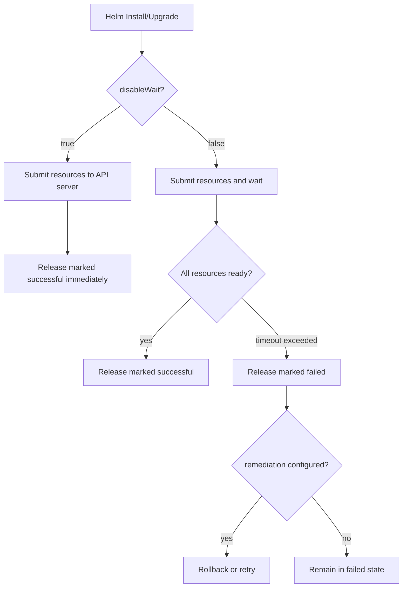

# How to Configure HelmRelease disableWait in Flux

Author: [nawazdhandala](https://github.com/nawazdhandala)

Tags: Flux CD, GitOps, Kubernetes, Helm, HelmRelease, disableWait, Install, Upgrade

Description: Learn how to configure the disableWait option on HelmRelease in Flux CD to skip waiting for resources to become ready during install and upgrade operations.

---

By default, when Flux installs or upgrades a HelmRelease, it waits for all Kubernetes resources deployed by the chart to reach a ready state before marking the release as successful. This mirrors the behavior of `helm install --wait` and `helm upgrade --wait`. While this is a sensible default for most workloads, there are scenarios where waiting causes problems -- long-running init containers, CRDs that take time to reconcile, or resources that depend on external systems. The `disableWait` option lets you skip this waiting step.

## How disableWait Works

When `disableWait` is set to `true`, Flux tells Helm not to wait for resources to become ready. Helm will apply the manifests and immediately consider the release successful as soon as all resources are submitted to the Kubernetes API server. This does not mean the resources are running -- it just means they have been created.

Flux provides `disableWait` separately for install and upgrade operations:

- `spec.install.disableWait` -- Skips waiting during initial install
- `spec.upgrade.disableWait` -- Skips waiting during upgrades

There is also `disableWaitForJobs`, which specifically controls whether Helm waits for Jobs to complete.

## Prerequisites

- Kubernetes cluster with Flux CD v2.x or later installed
- A HelmRepository source configured
- `kubectl` and `flux` CLI tools

## Configuring disableWait for Install

To skip waiting during the initial chart installation:

```yaml
# HelmRelease with disableWait enabled for install operations
apiVersion: helm.toolkit.fluxcd.io/v2
kind: HelmRelease
metadata:
  name: my-app
  namespace: default
spec:
  interval: 10m
  chart:
    spec:
      chart: my-app
      version: "1.x"
      sourceRef:
        kind: HelmRepository
        name: my-repo
        namespace: flux-system
  install:
    # Skip waiting for resources to become ready during install
    disableWait: true
```

## Configuring disableWait for Upgrade

To skip waiting during upgrades:

```yaml
# HelmRelease with disableWait enabled for upgrade operations
apiVersion: helm.toolkit.fluxcd.io/v2
kind: HelmRelease
metadata:
  name: my-app
  namespace: default
spec:
  interval: 10m
  chart:
    spec:
      chart: my-app
      version: "1.x"
      sourceRef:
        kind: HelmRepository
        name: my-repo
        namespace: flux-system
  upgrade:
    # Skip waiting for resources to become ready during upgrade
    disableWait: true
```

## Disabling Wait for Both Install and Upgrade

In most cases, if you disable wait for one operation, you will want it disabled for both:

```yaml
# HelmRelease with disableWait for both install and upgrade
apiVersion: helm.toolkit.fluxcd.io/v2
kind: HelmRelease
metadata:
  name: my-app
  namespace: default
spec:
  interval: 10m
  chart:
    spec:
      chart: my-app
      version: "1.x"
      sourceRef:
        kind: HelmRepository
        name: my-repo
        namespace: flux-system
  install:
    disableWait: true
  upgrade:
    disableWait: true
```

## Using disableWaitForJobs

If your chart includes Kubernetes Jobs (such as database migrations or setup tasks), Helm normally waits for those Jobs to complete. You can disable this behavior independently:

```yaml
# Disable waiting for Jobs specifically
apiVersion: helm.toolkit.fluxcd.io/v2
kind: HelmRelease
metadata:
  name: my-app
  namespace: default
spec:
  interval: 10m
  chart:
    spec:
      chart: my-app
      version: "1.x"
      sourceRef:
        kind: HelmRepository
        name: my-repo
        namespace: flux-system
  install:
    # Still wait for Deployments, Services, etc.
    disableWait: false
    # But do not wait for Jobs to complete
    disableWaitForJobs: true
  upgrade:
    disableWait: false
    disableWaitForJobs: true
```

## When to Use disableWait

Here are common scenarios where disabling wait is useful:

### Charts with Long Startup Times

Some applications take several minutes to initialize. If the Helm timeout (`spec.install.timeout` or `spec.upgrade.timeout`) is reached before the pods are ready, the release will be marked as failed and potentially rolled back. Rather than setting an extremely long timeout, you can disable wait and let the application start at its own pace.

### CRD-Based Operators

Operator charts often install CRDs and then deploy controllers that depend on those CRDs. The controller pods may not become ready until the CRDs are fully registered. Disabling wait allows the install to proceed without blocking on controller readiness.

### External Dependencies

If pods depend on external services (databases, message queues) that may not be immediately available, waiting will cause install failures. Disabling wait lets the pods enter a crash-loop until the dependency is available, without blocking the Helm release.

## The Relationship Between disableWait and Timeout

The `timeout` and `disableWait` fields interact as follows:



When `disableWait` is `true`, the timeout setting becomes largely irrelevant for readiness checks (though Helm still uses it for the API submission phase).

## Combining with Remediation Settings

If you disable wait, you may also want to adjust your remediation strategy since Helm will not automatically detect failures:

```yaml
# disableWait with adjusted remediation
apiVersion: helm.toolkit.fluxcd.io/v2
kind: HelmRelease
metadata:
  name: my-app
  namespace: default
spec:
  interval: 10m
  chart:
    spec:
      chart: my-app
      version: "1.x"
      sourceRef:
        kind: HelmRepository
        name: my-repo
        namespace: flux-system
  install:
    disableWait: true
    remediation:
      retries: 3
  upgrade:
    disableWait: true
    remediation:
      retries: 3
      remediateLastFailure: true
```

## Verifying the Configuration

After applying your HelmRelease, confirm it is reconciling without wait issues:

```bash
# Check the HelmRelease status
flux get helmrelease my-app

# Verify the Helm release was created
helm list -n default

# Check if pods are still starting up (expected with disableWait)
kubectl get pods -l app.kubernetes.io/name=my-app -n default
```

## Best Practices

1. **Use disableWait sparingly.** Waiting for readiness is a valuable safety net. Only disable it when you have a clear reason.
2. **Set up health checks separately.** If you disable wait, use Flux health checks or external monitoring to verify that your application eventually becomes ready.
3. **Combine with appropriate timeouts.** Even with disableWait, set reasonable timeouts for the API submission phase.
4. **Document your reasoning.** Add a comment in your HelmRelease explaining why wait is disabled, so future operators understand the decision.
5. **Consider disableWaitForJobs first.** If only Jobs are causing timeout issues, use `disableWaitForJobs` instead of fully disabling wait.

## Conclusion

The `disableWait` option on HelmRelease in Flux gives you control over whether Helm blocks on resource readiness during install and upgrade operations. By configuring `spec.install.disableWait` and `spec.upgrade.disableWait`, you can handle charts with long startup times, CRD dependencies, or external service requirements without hitting timeout failures. Use this feature judiciously and pair it with proper monitoring to ensure your applications reach a healthy state.
