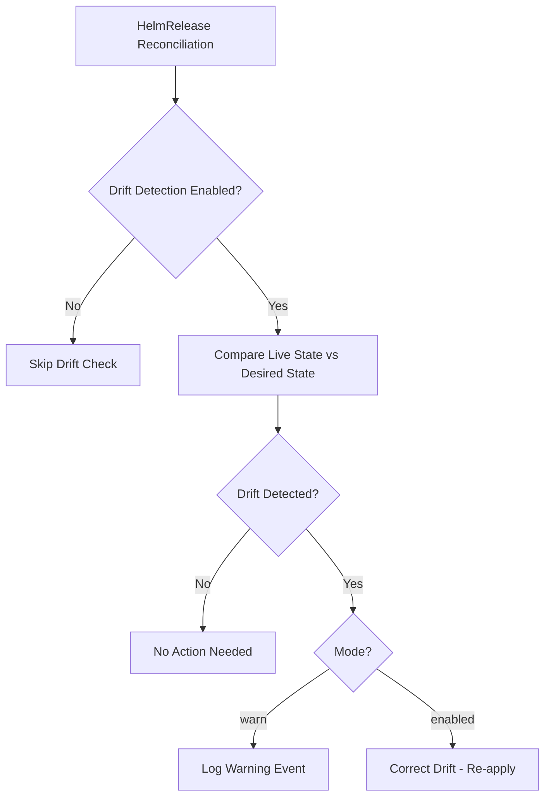

# How to Configure HelmRelease Drift Detection in Flux

Author: [nawazdhandala](https://github.com/nawazdhandala)

Tags: Flux CD, GitOps, Kubernetes, Helm, HelmRelease, Drift Detection, Configuration Management

Description: Learn how to configure HelmRelease drift detection in Flux CD to automatically detect and correct configuration changes made outside of GitOps workflows.

---

## Introduction

In a GitOps workflow, all changes to your Kubernetes cluster should flow through Git. However, in practice, engineers sometimes make manual changes directly to the cluster using `kubectl edit`, `kubectl patch`, or other tools. These out-of-band changes create **configuration drift** -- a divergence between the desired state in Git and the actual state in the cluster.

Flux CD's HelmRelease controller includes a built-in drift detection mechanism that can identify when the live state of Helm-managed resources has diverged from the desired state defined in your HelmRelease manifest. This guide walks you through configuring drift detection so your cluster stays in sync with your Git repository.

## How Drift Detection Works

When drift detection is enabled, the Flux Helm controller periodically compares the live state of resources managed by a Helm release against the last applied state. If differences are found, Flux can either log a warning or actively correct the drift by re-applying the desired state.

The following diagram illustrates the drift detection flow:



## Drift Detection Modes

Flux supports two drift detection modes via the `spec.driftDetection.mode` field:

- **`enabled`**: Flux detects drift and automatically corrects it by re-applying the Helm release values. This is the recommended mode for production environments where you want to enforce GitOps strictly.
- **`warn`**: Flux detects drift and emits Kubernetes events and log entries, but does not take corrective action. This is useful during an initial rollout or when you want visibility without enforcement.

## Enabling Drift Detection

To enable drift detection, add the `spec.driftDetection` field to your HelmRelease manifest.

The following example enables drift detection in `enabled` mode, which will automatically correct any detected drift:

```yaml
apiVersion: helm.toolkit.fluxcd.io/v2
kind: HelmRelease
metadata:
  name: my-application
  namespace: default
spec:
  interval: 10m
  chart:
    spec:
      chart: my-application
      version: "1.2.0"
      sourceRef:
        kind: HelmRepository
        name: my-repo
        namespace: flux-system
  # Enable drift detection to automatically correct out-of-band changes
  driftDetection:
    mode: enabled
  values:
    replicaCount: 3
    image:
      repository: myregistry/my-application
      tag: "v1.2.0"
```

## Using Warn Mode

If you want to start with observability before enforcement, use `warn` mode. This lets you see what drift exists without automatically correcting it.

The following manifest configures drift detection in warn-only mode:

```yaml
apiVersion: helm.toolkit.fluxcd.io/v2
kind: HelmRelease
metadata:
  name: my-application
  namespace: default
spec:
  interval: 10m
  chart:
    spec:
      chart: my-application
      version: "1.2.0"
      sourceRef:
        kind: HelmRepository
        name: my-repo
        namespace: flux-system
  # Warn mode: detect drift but do not correct it
  driftDetection:
    mode: warn
  values:
    replicaCount: 3
```

## Verifying Drift Detection

After applying your HelmRelease, you can verify that drift detection is active by checking the HelmRelease status.

Use the following command to inspect the HelmRelease and look for drift-related conditions:

```bash
# Check the HelmRelease status for drift detection information
kubectl get helmrelease my-application -n default -o yaml | grep -A 5 driftDetection
```

You can also watch for drift-related Kubernetes events:

```bash
# Watch for events related to drift detection on the HelmRelease
kubectl events --for helmrelease/my-application -n default
```

When drift is detected in `warn` mode, you will see events like:

```bash
# Example output showing a drift warning event
# LAST SEEN   TYPE      REASON          OBJECT                          MESSAGE
# 2m          Warning   DriftDetected   helmrelease/my-application      Drift detected: Deployment/default/my-application
```

## Testing Drift Detection

To verify your drift detection configuration is working, you can intentionally introduce drift and observe Flux's response.

The following commands simulate a manual change and then watch Flux correct it:

```bash
# Manually scale the deployment to introduce drift
kubectl scale deployment my-application -n default --replicas=5

# Watch Flux detect and correct the drift (replicas should return to 3)
kubectl get deployment my-application -n default -w
```

With `enabled` mode, Flux will detect the replica count change on the next reconciliation and reset it to the value defined in the HelmRelease (3 replicas).

## Combining with Reconciliation Interval

Drift detection runs as part of the regular reconciliation loop. The `spec.interval` field controls how frequently Flux checks for drift. A shorter interval means faster drift correction but higher API server load.

The following example sets a 5-minute reconciliation interval for faster drift correction:

```yaml
apiVersion: helm.toolkit.fluxcd.io/v2
kind: HelmRelease
metadata:
  name: my-application
  namespace: default
spec:
  # Shorter interval for faster drift correction
  interval: 5m
  chart:
    spec:
      chart: my-application
      version: "1.2.0"
      sourceRef:
        kind: HelmRepository
        name: my-repo
        namespace: flux-system
  driftDetection:
    mode: enabled
  values:
    replicaCount: 3
```

## Best Practices

1. **Start with `warn` mode** in new environments to understand what drift exists before enforcing corrections.
2. **Transition to `enabled` mode** once your team is comfortable with the GitOps workflow and understands what changes are being flagged.
3. **Use appropriate reconciliation intervals** -- 5 to 10 minutes is a good balance between responsiveness and API server load.
4. **Monitor drift events** using your observability stack to track how often drift occurs and identify teams or processes that need better GitOps discipline.
5. **Combine with RBAC** to restrict manual cluster modifications and reduce drift sources.

## Conclusion

Drift detection is a critical feature for maintaining GitOps integrity in production Kubernetes clusters. By configuring `spec.driftDetection.mode` on your HelmRelease resources, you gain visibility into unauthorized changes and can optionally enforce automatic correction. Start with `warn` mode for observability, then move to `enabled` mode for full enforcement once your team is ready.
