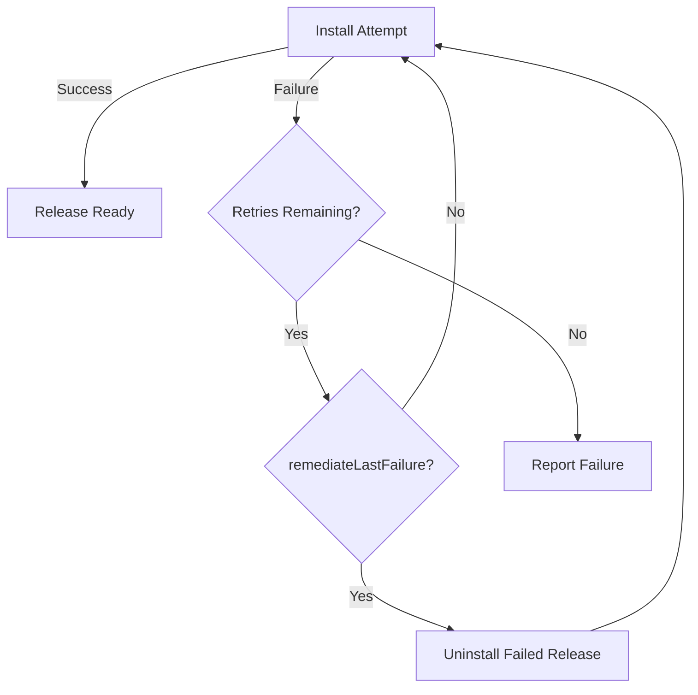

# How to Configure HelmRelease Install Action in Flux

Author: [nawazdhandala](https://github.com/nawazdhandala)

Tags: Flux CD, GitOps, Kubernetes, Helm, HelmRelease, Install, Remediation

Description: Learn how to configure the install action in a Flux CD HelmRelease to control initial Helm chart installation behavior and failure remediation.

---

## Introduction

When Flux CD encounters a HelmRelease for the first time (or when the corresponding Helm release does not exist on the cluster), it performs an install action. The `spec.install` field allows you to fine-tune how this installation behaves, including remediation strategies for failed installs, resource replacement policies, and Custom Resource Definition handling.

## Default Install Behavior

Without any `spec.install` configuration, Flux performs a standard `helm install` with default settings. The install will be attempted once, and if it fails, the HelmRelease will report a failure condition. Configuring `spec.install` gives you control over retries, timeouts, and error handling.

## Basic Install Configuration

Here is a HelmRelease with common install options.

```yaml
# helmrelease.yaml - HelmRelease with install configuration
apiVersion: helm.toolkit.fluxcd.io/v2
kind: HelmRelease
metadata:
  name: my-app
  namespace: default
spec:
  interval: 10m
  chart:
    spec:
      chart: my-app
      version: "1.x"
      sourceRef:
        kind: HelmRepository
        name: my-repo
        namespace: flux-system
  # Install action configuration
  install:
    # Create the target namespace if it does not exist
    createNamespace: true
    # Remediation configuration for failed installs
    remediation:
      # Number of retries before giving up
      retries: 3
  values:
    replicaCount: 2
```

## Install Remediation

The `spec.install.remediation` field controls how Flux handles failed installations.

```yaml
# HelmRelease with detailed install remediation
apiVersion: helm.toolkit.fluxcd.io/v2
kind: HelmRelease
metadata:
  name: my-app
  namespace: default
spec:
  interval: 10m
  chart:
    spec:
      chart: my-app
      version: "1.x"
      sourceRef:
        kind: HelmRepository
        name: my-repo
        namespace: flux-system
  install:
    remediation:
      # Number of retries after the initial failure (default: 0)
      retries: 5
      # Whether to uninstall on failure before retrying
      # This cleans up any partial resources from the failed install
      remediateLastFailure: true
```

The remediation flow works as follows.



## Create Namespace on Install

The `createNamespace` option tells Helm to create the target namespace if it does not already exist.

```yaml
# HelmRelease that creates its namespace during install
apiVersion: helm.toolkit.fluxcd.io/v2
kind: HelmRelease
metadata:
  name: monitoring
  namespace: flux-system
spec:
  interval: 10m
  # Deploy into a different namespace
  targetNamespace: monitoring
  chart:
    spec:
      chart: kube-prometheus-stack
      version: "55.x"
      sourceRef:
        kind: HelmRepository
        name: prometheus-community
        namespace: flux-system
  install:
    # Automatically create the monitoring namespace
    createNamespace: true
    remediation:
      retries: 3
```

## Custom Resource Definition Install Policy

Some charts include CRDs. The `crds` field controls how CRDs are handled during installation.

```yaml
# HelmRelease with CRD install policy
apiVersion: helm.toolkit.fluxcd.io/v2
kind: HelmRelease
metadata:
  name: cert-manager
  namespace: cert-manager
spec:
  interval: 10m
  chart:
    spec:
      chart: cert-manager
      version: "1.x"
      sourceRef:
        kind: HelmRepository
        name: jetstack
        namespace: flux-system
  install:
    # CRD install policy: Create, CreateReplace, or Skip
    crds: CreateReplace
    createNamespace: true
    remediation:
      retries: 3
  values:
    installCRDs: true
```

The CRD policy options are:

| Policy | Behavior |
|---|---|
| `Create` | Create CRDs if they do not exist (default) |
| `CreateReplace` | Create CRDs or replace them if they already exist |
| `Skip` | Do not install CRDs at all |

## Disable Wait

By default, Helm waits for all resources to be ready before marking the install as successful. You can disable this behavior.

```yaml
# HelmRelease with wait disabled during install
apiVersion: helm.toolkit.fluxcd.io/v2
kind: HelmRelease
metadata:
  name: my-app
  namespace: default
spec:
  interval: 10m
  chart:
    spec:
      chart: my-app
      version: "1.x"
      sourceRef:
        kind: HelmRepository
        name: my-repo
        namespace: flux-system
  install:
    # Do not wait for resources to become ready
    disableWait: true
    # Do not wait for Jobs to complete
    disableWaitForJobs: true
    remediation:
      retries: 3
```

Disabling wait is useful for charts with long startup times or jobs that take a while to complete.

## Replace on Install

The `replace` option uses `helm install --replace` which reuses the name of a failed or deleted release.

```yaml
# HelmRelease with replace on install
apiVersion: helm.toolkit.fluxcd.io/v2
kind: HelmRelease
metadata:
  name: my-app
  namespace: default
spec:
  interval: 10m
  chart:
    spec:
      chart: my-app
      version: "1.x"
      sourceRef:
        kind: HelmRepository
        name: my-repo
        namespace: flux-system
  install:
    # Replace a deleted or failed release with the same name
    replace: true
    remediation:
      retries: 3
```

## Complete Install Configuration Example

Here is a HelmRelease with all install options configured.

```yaml
# helmrelease-full-install.yaml - All install options
apiVersion: helm.toolkit.fluxcd.io/v2
kind: HelmRelease
metadata:
  name: my-app
  namespace: default
spec:
  interval: 10m
  timeout: 5m
  chart:
    spec:
      chart: my-app
      version: "1.x"
      sourceRef:
        kind: HelmRepository
        name: my-repo
        namespace: flux-system
  install:
    # Create target namespace if missing
    createNamespace: true
    # CRD handling policy
    crds: CreateReplace
    # Do not wait for resources to be ready
    disableWait: false
    # Do not wait for Jobs to complete
    disableWaitForJobs: false
    # Replace a previous failed release
    replace: false
    # Remediation for install failures
    remediation:
      retries: 5
      remediateLastFailure: true
  values:
    replicaCount: 3
```

## Monitoring Install Progress

After applying a HelmRelease, monitor the install progress.

```bash
# Watch the HelmRelease status
flux get helmreleases -n default --watch

# Check the install conditions
kubectl get helmrelease my-app -n default -o jsonpath='{.status.conditions}'

# View Helm Controller logs for install details
kubectl logs -n flux-system deploy/helm-controller --follow | grep my-app

# Check the Helm release history
helm history my-app -n default
```

## Troubleshooting Install Failures

When installs fail repeatedly, investigate the root cause.

```bash
# Get detailed HelmRelease status
kubectl describe helmrelease my-app -n default

# Check the Helm release status
helm status my-app -n default

# View events related to the HelmRelease
kubectl events --for helmrelease/my-app -n default

# Check pod status for deployment issues
kubectl get pods -n default -l app.kubernetes.io/name=my-app
```

## Conclusion

Configuring the install action in a Flux CD HelmRelease gives you fine-grained control over how charts are first deployed to your cluster. Use `remediation.retries` to handle transient failures, `createNamespace` for automatic namespace provisioning, and `crds` policy for CRD management. These options make your GitOps deployments more resilient and self-healing from the first install onward.
