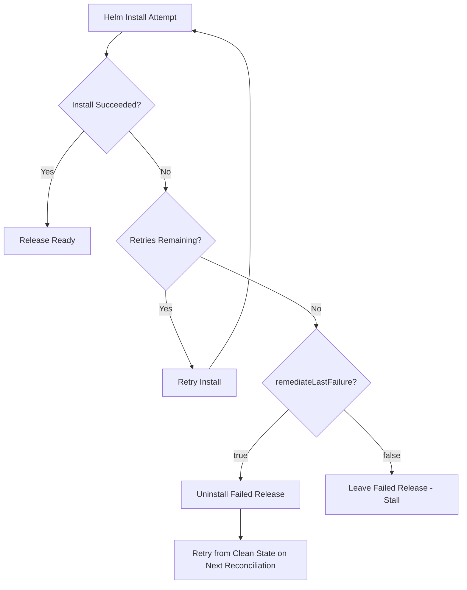

# How to Configure HelmRelease Install Remediation in Flux

Author: [nawazdhandala](https://github.com/nawazdhandala)

Tags: Flux CD, GitOps, Kubernetes, Helm, HelmRelease, Remediation, Install, Error Handling

Description: Learn how to configure install remediation strategies for HelmRelease in Flux CD to handle initial Helm chart installation failures gracefully.

---

## Introduction

When Flux CD installs a Helm chart for the first time, the installation can fail for various reasons: invalid values, missing dependencies, resource quota limits, or transient cluster issues. Without remediation configuration, a failed install leaves the HelmRelease in a stuck state, requiring manual intervention.

Flux provides the `spec.install.remediation` field on HelmRelease resources to define how the Helm controller should respond to installation failures. This includes configuring retry attempts, whether to uninstall failed releases, and how to handle persistent failures.

## How Install Remediation Works

When a Helm install fails, Flux evaluates the remediation configuration to decide what to do next. The following diagram shows the decision flow:



## Basic Install Remediation

The simplest remediation configuration specifies how many times Flux should retry a failed installation before giving up.

The following example configures Flux to retry the installation up to 3 times:

```yaml
apiVersion: helm.toolkit.fluxcd.io/v2
kind: HelmRelease
metadata:
  name: my-application
  namespace: default
spec:
  interval: 10m
  chart:
    spec:
      chart: my-application
      version: "1.2.0"
      sourceRef:
        kind: HelmRepository
        name: my-repo
        namespace: flux-system
  # Configure install remediation with retries
  install:
    remediation:
      # Retry the install up to 3 times before giving up
      retries: 3
  values:
    replicaCount: 3
    image:
      repository: myregistry/my-application
      tag: "v1.2.0"
```

## Configuring remediateLastFailure

The `remediateLastFailure` field controls whether Flux should uninstall a failed Helm release before retrying. When set to `true`, Flux cleans up the failed release so the next attempt starts fresh. This is particularly useful when a partial install leaves resources in an inconsistent state.

The following example enables cleanup of failed installations:

```yaml
apiVersion: helm.toolkit.fluxcd.io/v2
kind: HelmRelease
metadata:
  name: my-application
  namespace: default
spec:
  interval: 10m
  chart:
    spec:
      chart: my-application
      version: "1.2.0"
      sourceRef:
        kind: HelmRepository
        name: my-repo
        namespace: flux-system
  install:
    remediation:
      # Retry installation 3 times
      retries: 3
      # Uninstall the failed release before retrying
      remediateLastFailure: true
  values:
    replicaCount: 3
```

## Full Install Configuration with Remediation

The `spec.install` field supports additional options beyond remediation that control the Helm install behavior. These can be combined with remediation settings for a comprehensive installation strategy.

The following example shows a complete install configuration with remediation, timeout, and resource replacement settings:

```yaml
apiVersion: helm.toolkit.fluxcd.io/v2
kind: HelmRelease
metadata:
  name: my-application
  namespace: default
spec:
  interval: 10m
  chart:
    spec:
      chart: my-application
      version: "1.2.0"
      sourceRef:
        kind: HelmRepository
        name: my-repo
        namespace: flux-system
  install:
    # Set a timeout for the install operation
    timeout: 5m
    # Replace resources that already exist instead of failing
    replace: true
    remediation:
      # Retry up to 5 times for mission-critical applications
      retries: 5
      # Clean up failed releases before retrying
      remediateLastFailure: true
  values:
    replicaCount: 3
    image:
      repository: myregistry/my-application
      tag: "v1.2.0"
    resources:
      requests:
        cpu: 100m
        memory: 128Mi
      limits:
        cpu: 500m
        memory: 512Mi
```

## Monitoring Install Remediation

After configuring install remediation, you should monitor how Flux handles installation failures. Use the following commands to check the status.

Check the HelmRelease conditions to see the current install state:

```bash
# View the HelmRelease status and conditions
kubectl get helmrelease my-application -n default -o yaml

# Check for install-related events
kubectl events --for helmrelease/my-application -n default

# Use Flux CLI for a human-readable status
flux get helmrelease my-application -n default
```

You can also check the Helm controller logs for detailed remediation information:

```bash
# View Helm controller logs filtered for your release
kubectl logs -n flux-system deploy/helm-controller | grep my-application
```

## Example: Handling Transient Failures

Transient failures are common in Kubernetes clusters -- a brief network issue, a temporary resource crunch, or a slow API server can all cause a Helm install to fail. The following configuration is designed to handle transient failures with generous retries.

This example uses higher retry counts and cleanup to handle intermittent cluster issues:

```yaml
apiVersion: helm.toolkit.fluxcd.io/v2
kind: HelmRelease
metadata:
  name: database
  namespace: production
spec:
  interval: 15m
  chart:
    spec:
      chart: postgresql
      version: "12.1.0"
      sourceRef:
        kind: HelmRepository
        name: bitnami
        namespace: flux-system
  install:
    # Longer timeout for database charts that need PV provisioning
    timeout: 10m
    remediation:
      # More retries for infrastructure-critical components
      retries: 5
      # Always clean up failed installs for databases
      remediateLastFailure: true
  values:
    auth:
      postgresPassword: "${POSTGRES_PASSWORD}"
    primary:
      persistence:
        size: 50Gi
```

## Understanding Retry Behavior

When `retries` is set, Flux counts each failed install attempt. Once the retry limit is reached, Flux stops attempting to install the release and sets the HelmRelease status to a failure condition. The release will remain in this state until:

1. You update the HelmRelease spec (which resets the retry counter)
2. You manually reconcile the HelmRelease with `flux reconcile helmrelease`
3. The next reconciliation interval triggers (if `remediateLastFailure` is true)

To manually trigger a retry after exhausting all attempts:

```bash
# Force a reconciliation, resetting the retry counter
flux reconcile helmrelease my-application -n default
```

## Best Practices

1. **Set retries to at least 3** for production workloads to handle transient failures without manual intervention.
2. **Enable remediateLastFailure** for applications where a clean install is preferable to debugging a partially deployed release.
3. **Set appropriate timeouts** -- charts that provision PersistentVolumes or wait for external resources may need longer timeouts.
4. **Use alerts** to get notified when a HelmRelease exhausts its retry budget, so you can investigate root causes.
5. **Do not set retries too high** -- if an install consistently fails, a high retry count just delays the notification. Three to five retries is usually sufficient.

## Conclusion

Install remediation in Flux CD provides automated recovery from Helm chart installation failures. By configuring `spec.install.remediation.retries` and `spec.install.remediation.remediateLastFailure`, you can build resilient deployment pipelines that handle transient failures gracefully while still alerting on persistent issues. This reduces the need for manual intervention and keeps your GitOps workflow running smoothly.
