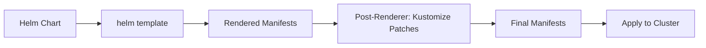

# How to Use HelmRelease with JSON Merge Patches in Flux

Author: [nawazdhandala](https://github.com/nawazdhandala)

Tags: Flux CD, GitOps, Kubernetes, Helm, HelmRelease, JSON Merge Patch, Post Rendering, Kustomize

Description: Learn how to apply JSON Merge Patches to HelmRelease resources in Flux CD using post-renderers for fine-grained control over Helm chart output.

---

When deploying Helm charts through Flux CD, you often need to modify rendered manifests without forking the upstream chart. JSON Merge Patches, defined in RFC 7386, provide a straightforward way to merge changes into existing resources. Flux supports these patches through the `spec.postRenderers` field on a HelmRelease, allowing you to apply Kustomize-style patches after Helm renders the templates.

## What Are JSON Merge Patches?

JSON Merge Patches work by merging a patch document into a target document. If a key exists in both the patch and the target, the patch value replaces the target value. If the patch sets a key to `null`, the key is removed from the target. This is simpler than JSON 6902 patches because you describe the desired state rather than individual operations.

In Flux, JSON Merge Patches are specified under `spec.postRenderers[].kustomize.patches`, which uses the strategic merge patch format supported by Kustomize.

## Prerequisites

Before proceeding, ensure you have the following in place:

- A Kubernetes cluster with Flux CD installed (v2.x or later)
- A HelmRepository or other chart source configured
- `kubectl` and `flux` CLI tools installed

## How Post-Renderers Work in Flux

Post-renderers intercept the output of `helm template` before the manifests are applied to the cluster. Flux passes the rendered YAML through a Kustomize pipeline where you can apply patches, add labels, or modify any field in the output.

The following diagram illustrates the flow:



## Basic Example: Adding Labels with a JSON Merge Patch

Suppose you are deploying an nginx chart and need to add custom labels to the Deployment resource. Here is how you configure the HelmRelease with a post-renderer patch:

```yaml
# HelmRelease with a JSON Merge Patch to add labels to the Deployment
apiVersion: helm.toolkit.fluxcd.io/v2
kind: HelmRelease
metadata:
  name: nginx
  namespace: default
spec:
  interval: 10m
  chart:
    spec:
      chart: nginx
      version: "15.x"
      sourceRef:
        kind: HelmRepository
        name: bitnami
        namespace: flux-system
  postRenderers:
    - kustomize:
        # patches uses strategic merge patch / JSON merge patch format
        patches:
          - target:
              kind: Deployment
              name: nginx
            patch: |
              apiVersion: apps/v1
              kind: Deployment
              metadata:
                name: nginx
                labels:
                  team: platform
                  environment: production
```

The `target` field selects which resources to patch by kind, name, namespace, group, version, or label selector. The `patch` field contains the JSON Merge Patch as inline YAML.

## Modifying Container Resources

A common use case is overriding container resource requests and limits that the chart does not expose as values:

```yaml
# Patch container resources on a specific Deployment
apiVersion: helm.toolkit.fluxcd.io/v2
kind: HelmRelease
metadata:
  name: my-app
  namespace: default
spec:
  interval: 10m
  chart:
    spec:
      chart: my-app
      version: "2.x"
      sourceRef:
        kind: HelmRepository
        name: my-repo
        namespace: flux-system
  postRenderers:
    - kustomize:
        patches:
          - target:
              kind: Deployment
              name: my-app
            patch: |
              apiVersion: apps/v1
              kind: Deployment
              metadata:
                name: my-app
              spec:
                template:
                  spec:
                    containers:
                      - name: my-app
                        resources:
                          requests:
                            cpu: "500m"
                            memory: "256Mi"
                          limits:
                            cpu: "1000m"
                            memory: "512Mi"
```

## Adding Annotations to a Service

You can target any resource type. Here is an example that adds AWS load balancer annotations to a Service:

```yaml
# Add AWS NLB annotations to a Service resource
postRenderers:
  - kustomize:
      patches:
        - target:
            kind: Service
            name: my-app
          patch: |
            apiVersion: v1
            kind: Service
            metadata:
              name: my-app
              annotations:
                service.beta.kubernetes.io/aws-load-balancer-type: "nlb"
                service.beta.kubernetes.io/aws-load-balancer-scheme: "internal"
```

## Patching Multiple Resources

You can include multiple patch entries within a single post-renderer to modify different resources:

```yaml
# Patch multiple resources in one post-renderer
postRenderers:
  - kustomize:
      patches:
        # Patch the Deployment
        - target:
            kind: Deployment
            name: my-app
          patch: |
            apiVersion: apps/v1
            kind: Deployment
            metadata:
              name: my-app
              annotations:
                custom-annotation: "patched-by-flux"
        # Patch the ConfigMap
        - target:
            kind: ConfigMap
            name: my-app-config
          patch: |
            apiVersion: v1
            kind: ConfigMap
            metadata:
              name: my-app-config
            data:
              LOG_LEVEL: "debug"
```

## Removing a Field with JSON Merge Patch

To remove a field, set its value to `null` in the patch. For example, to remove an annotation:

```yaml
# Remove an annotation by setting it to null
postRenderers:
  - kustomize:
      patches:
        - target:
            kind: Deployment
            name: my-app
          patch: |
            apiVersion: apps/v1
            kind: Deployment
            metadata:
              name: my-app
              annotations:
                deprecated-annotation: null
```

## Verifying Your Patches

After applying the HelmRelease, verify that your patches were applied correctly:

```bash
# Check the HelmRelease status
flux get helmrelease my-app

# Inspect the actual resource to confirm the patch was applied
kubectl get deployment my-app -o yaml | grep -A 5 labels

# Check for errors in the HelmRelease events
kubectl describe helmrelease my-app -n default
```

If a patch fails to apply, Flux will report the error in the HelmRelease status conditions. Common issues include targeting a resource name that does not match the rendered output or using an incorrect API version.

## Best Practices

1. **Use specific targets.** Always specify the `kind` and `name` in the `target` field to avoid accidentally patching the wrong resource.
2. **Prefer chart values first.** Only use post-renderer patches when the chart does not expose the configuration you need as Helm values.
3. **Keep patches minimal.** Include only the fields you want to change. The merge patch will preserve all other fields.
4. **Test locally.** Use `flux debug helmrelease` or `helm template` combined with `kustomize` to preview the output before pushing to your Git repository.
5. **Document your patches.** Add comments in your HelmRelease manifest explaining why each patch is necessary, especially for future maintainers.

## Conclusion

JSON Merge Patches in Flux post-renderers give you a clean, declarative way to customize Helm chart output without maintaining chart forks. By leveraging the `spec.postRenderers[].kustomize.patches` field, you can add labels, annotations, resource limits, and any other modifications directly in your HelmRelease manifest. This approach keeps your GitOps workflow simple while providing the flexibility needed for production deployments.
