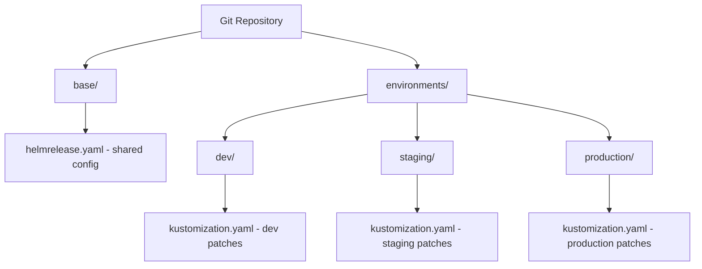

# How to Use HelmRelease with Kustomize Patches in Flux

Author: [nawazdhandala](https://github.com/nawazdhandala)

Tags: Flux CD, GitOps, Kubernetes, Helm, HelmRelease, Kustomize, Patches, Multi-Environment

Description: Learn how to use Kustomize patches with HelmRelease in Flux CD to customize Helm chart deployments across multiple environments without modifying the charts.

---

## Introduction

Managing Helm chart deployments across multiple environments -- development, staging, and production -- often requires environment-specific customizations. While Helm values handle many configuration differences, some modifications require changes that go beyond what a chart's values expose. Kustomize patches applied through Flux's HelmRelease post-renderers provide a powerful mechanism for these environment-specific customizations.

This guide demonstrates practical patterns for using Kustomize patches with HelmRelease resources in Flux, including multi-environment setups, resource targeting, and common patch patterns.

## Multi-Environment Architecture

A common Flux repository structure separates base configurations from environment-specific overlays. Kustomize patches in HelmRelease post-renderers enable per-environment customization of Helm chart output.



## Base HelmRelease with Post-Renderer Patches

Start by defining a base HelmRelease that includes post-renderer patches for common organizational requirements. Environment overlays can then add additional patches.

The following base HelmRelease includes patches that apply across all environments:

```yaml
# base/helmrelease.yaml
apiVersion: helm.toolkit.fluxcd.io/v2
kind: HelmRelease
metadata:
  name: my-application
  namespace: default
spec:
  interval: 10m
  chart:
    spec:
      chart: my-application
      version: "1.2.0"
      sourceRef:
        kind: HelmRepository
        name: my-repo
        namespace: flux-system
  install:
    remediation:
      retries: 3
      remediateLastFailure: true
  upgrade:
    remediation:
      retries: 3
      remediateLastFailure: true
  values:
    replicaCount: 1
    image:
      repository: myregistry/my-application
      tag: "v1.2.0"
  # Base post-renderers applied in all environments
  postRenderers:
    - kustomize:
        patches:
          # Add standard organizational labels to all Deployments
          - target:
              kind: Deployment
            patch: |
              apiVersion: apps/v1
              kind: Deployment
              metadata:
                name: all
                labels:
                  app.kubernetes.io/managed-by: flux
                  app.kubernetes.io/part-of: my-application
```

## Environment-Specific Patches Using Kustomize Overlays

Each environment can use a Flux Kustomization to apply Kustomize patches to the base HelmRelease itself, modifying the post-renderers or values for that environment.

The following example shows the directory structure and Kustomization files for each environment.

### Development Environment

The development overlay adds debug-friendly patches:

```yaml
# environments/dev/kustomization.yaml
apiVersion: kustomize.config.k8s.io/v1beta1
kind: Kustomization
resources:
  - ../../base/helmrelease.yaml
patches:
  # Override values for development
  - target:
      kind: HelmRelease
      name: my-application
    patch: |
      apiVersion: helm.toolkit.fluxcd.io/v2
      kind: HelmRelease
      metadata:
        name: my-application
      spec:
        values:
          replicaCount: 1
          image:
            tag: "v1.2.0-dev"
          resources:
            requests:
              cpu: 100m
              memory: 128Mi
            limits:
              cpu: 200m
              memory: 256Mi
```

### Production Environment

The production overlay adds security and performance patches:

```yaml
# environments/production/kustomization.yaml
apiVersion: kustomize.config.k8s.io/v1beta1
kind: Kustomization
resources:
  - ../../base/helmrelease.yaml
patches:
  # Override values for production
  - target:
      kind: HelmRelease
      name: my-application
    patch: |
      apiVersion: helm.toolkit.fluxcd.io/v2
      kind: HelmRelease
      metadata:
        name: my-application
      spec:
        values:
          replicaCount: 5
          image:
            tag: "v1.2.0"
          resources:
            requests:
              cpu: 500m
              memory: 512Mi
            limits:
              cpu: 1000m
              memory: 1Gi
```

## Patching Specific Resource Types

Kustomize patches in post-renderers can target specific Kubernetes resource types within the Helm chart output.

### Patching Deployments

The following patches modify Deployment behavior for production environments:

```yaml
apiVersion: helm.toolkit.fluxcd.io/v2
kind: HelmRelease
metadata:
  name: my-application
  namespace: production
spec:
  interval: 10m
  chart:
    spec:
      chart: my-application
      version: "1.2.0"
      sourceRef:
        kind: HelmRepository
        name: my-repo
        namespace: flux-system
  values:
    replicaCount: 5
  postRenderers:
    - kustomize:
        patches:
          # Add pod anti-affinity for high availability
          - target:
              kind: Deployment
              name: my-application
            patch: |
              apiVersion: apps/v1
              kind: Deployment
              metadata:
                name: my-application
              spec:
                template:
                  spec:
                    affinity:
                      podAntiAffinity:
                        preferredDuringSchedulingIgnoredDuringExecution:
                          - weight: 100
                            podAffinityTerm:
                              labelSelector:
                                matchExpressions:
                                  - key: app.kubernetes.io/name
                                    operator: In
                                    values:
                                      - my-application
                              topologyKey: kubernetes.io/hostname
```

### Patching Services

The following example modifies Service resources to add cloud provider annotations:

```yaml
postRenderers:
  - kustomize:
      patches:
        # Add AWS NLB annotations to the Service
        - target:
            kind: Service
            name: my-application
          patch: |
            apiVersion: v1
            kind: Service
            metadata:
              name: my-application
              annotations:
                # Configure AWS Network Load Balancer
                service.beta.kubernetes.io/aws-load-balancer-type: "nlb"
                service.beta.kubernetes.io/aws-load-balancer-scheme: "internet-facing"
                service.beta.kubernetes.io/aws-load-balancer-cross-zone-load-balancing-enabled: "true"
```

### Patching ConfigMaps

The following example adds data to a ConfigMap rendered by the Helm chart:

```yaml
postRenderers:
  - kustomize:
      patches:
        # Add environment-specific configuration to a ConfigMap
        - target:
            kind: ConfigMap
            name: my-application-config
          patch: |
            apiVersion: v1
            kind: ConfigMap
            metadata:
              name: my-application-config
            data:
              # Add production-specific settings
              LOG_FORMAT: "json"
              CACHE_TTL: "300"
              FEATURE_NEW_UI: "true"
```

## Patching with Node Selectors and Tolerations

In production environments, you often need to schedule workloads on specific node pools. Post-renderer patches make this easy.

The following example adds node selectors and tolerations for a dedicated node pool:

```yaml
apiVersion: helm.toolkit.fluxcd.io/v2
kind: HelmRelease
metadata:
  name: my-application
  namespace: production
spec:
  interval: 10m
  chart:
    spec:
      chart: my-application
      version: "1.2.0"
      sourceRef:
        kind: HelmRepository
        name: my-repo
        namespace: flux-system
  values:
    replicaCount: 5
  postRenderers:
    - kustomize:
        patches:
          - target:
              kind: Deployment
              name: my-application
            patch: |
              apiVersion: apps/v1
              kind: Deployment
              metadata:
                name: my-application
              spec:
                template:
                  spec:
                    # Schedule on dedicated application nodes
                    nodeSelector:
                      node-pool: application
                    # Tolerate the taint on application nodes
                    tolerations:
                      - key: "dedicated"
                        operator: "Equal"
                        value: "application"
                        effect: "NoSchedule"
                    # Use topology spread for even distribution
                    topologySpreadConstraints:
                      - maxSkew: 1
                        topologyKey: topology.kubernetes.io/zone
                        whenUnsatisfiable: DoNotSchedule
                        labelSelector:
                          matchLabels:
                            app.kubernetes.io/name: my-application
```

## Flux Kustomization Referencing HelmRelease

The Flux Kustomization resource ties together the environment overlays and applies them to the cluster.

The following example shows Flux Kustomization resources for each environment:

```yaml
# clusters/production/apps.yaml
apiVersion: kustomize.toolkit.fluxcd.io/v1
kind: Kustomization
metadata:
  name: apps-production
  namespace: flux-system
spec:
  interval: 10m
  sourceRef:
    kind: GitRepository
    name: flux-system
  # Point to the production overlay directory
  path: ./environments/production
  prune: true
  wait: true
```

## Verifying Patches

After applying your HelmRelease with Kustomize patches, verify the patches were applied correctly.

Use the following commands to inspect the patched resources:

```bash
# Check that labels were applied by the post-renderer patch
kubectl get deployment my-application -n production -o jsonpath='{.metadata.labels}' | jq .

# Verify node selectors were added
kubectl get deployment my-application -n production \
  -o jsonpath='{.spec.template.spec.nodeSelector}'

# Verify tolerations were added
kubectl get deployment my-application -n production \
  -o jsonpath='{.spec.template.spec.tolerations}' | jq .

# Check the full rendered deployment
kubectl get deployment my-application -n production -o yaml

# Verify the HelmRelease reconciled successfully
flux get helmrelease my-application -n production
```

## Common Pitfalls

1. **Patch name mismatch**: The `name` in a strategic merge patch must match the actual resource name rendered by the Helm chart. If the chart uses a name template (e.g., `release-name-chart-name`), you must use that exact name.

2. **Container name mismatch**: When patching container-level fields, the container name in your patch must match the container name in the Helm chart output.

3. **List merging behavior**: Strategic merge patches merge lists by key. For containers, the key is `name`. If your patch has a container with a name that does not exist in the original, it adds a new container instead of modifying an existing one.

4. **Patch ordering**: Multiple post-renderers are applied in sequence. If two post-renderers modify the same field, the last one wins.

## Best Practices

1. **Use a base-and-overlay structure** to share common configurations across environments while allowing per-environment patches.
2. **Target patches precisely** using the `target` field with kind and name selectors to avoid unintended modifications.
3. **Prefer chart values for simple overrides** and reserve patches for modifications the chart does not support through values.
4. **Test patches in development first** before promoting to staging and production.
5. **Keep patches focused and well-documented** so future maintainers understand why each patch exists.
6. **Use strategic merge patches for adding fields** and JSON patches for replacing or removing specific values.

## Conclusion

Kustomize patches in Flux's HelmRelease post-renderers provide a flexible mechanism for customizing Helm chart output across multiple environments. By combining base HelmRelease configurations with environment-specific Kustomize overlays, you can manage complex multi-environment deployments without forking Helm charts or maintaining per-environment chart forks. This pattern keeps your GitOps repository clean, maintainable, and scalable as your Kubernetes infrastructure grows.
