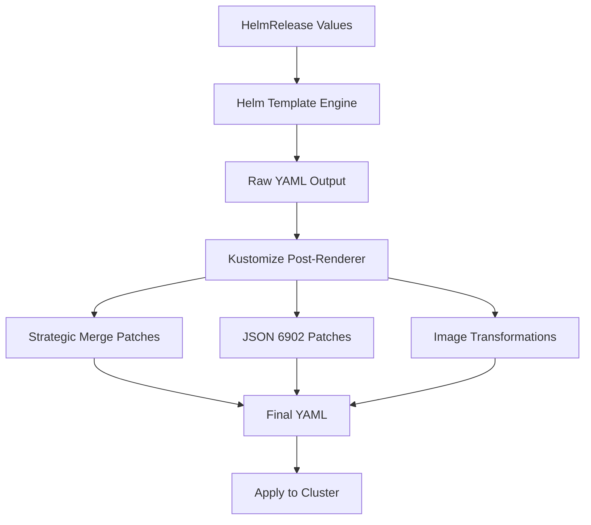

# How to Configure HelmRelease Kustomize Post-Renderer in Flux

Author: [nawazdhandala](https://github.com/nawazdhandala)

Tags: Flux CD, GitOps, Kubernetes, Helm, HelmRelease, Kustomize, Post-Renderer, Resource Transformation

Description: Learn how to use the Kustomize post-renderer in HelmRelease to apply Kustomize transformations to Helm chart output in Flux CD.

---

## Introduction

Flux CD's HelmRelease controller includes a built-in Kustomize post-renderer that processes Helm chart output through Kustomize transformations before applying it to the cluster. This combines the strengths of both Helm (chart packaging and distribution) and Kustomize (declarative resource transformations) in a single workflow.

The Kustomize post-renderer is configured through the `spec.postRenderers[].kustomize` field and supports strategic merge patches, JSON 6902 patches, image transformations, and other Kustomize features. This guide provides a deep dive into configuring the Kustomize post-renderer for common real-world scenarios.

## Kustomize Post-Renderer Architecture

The Kustomize post-renderer operates as a transformation pipeline between Helm's template engine and the Kubernetes API server.



## Strategic Merge Patches

Strategic merge patches allow you to merge fields into existing resources. Kubernetes uses strategic merge patch semantics, which means lists can be merged by key (like container name) rather than replaced entirely.

The following example uses a strategic merge patch to add environment variables and resource limits to a Deployment:

```yaml
apiVersion: helm.toolkit.fluxcd.io/v2
kind: HelmRelease
metadata:
  name: my-application
  namespace: default
spec:
  interval: 10m
  chart:
    spec:
      chart: my-application
      version: "1.2.0"
      sourceRef:
        kind: HelmRepository
        name: my-repo
        namespace: flux-system
  values:
    replicaCount: 3
  postRenderers:
    - kustomize:
        patches:
          # Strategic merge patch to add environment variables
          - target:
              kind: Deployment
              name: my-application
            patch: |
              apiVersion: apps/v1
              kind: Deployment
              metadata:
                name: my-application
              spec:
                template:
                  spec:
                    containers:
                      - name: my-application
                        env:
                          # Add environment-specific configuration
                          - name: LOG_LEVEL
                            value: "info"
                          - name: METRICS_ENABLED
                            value: "true"
                          - name: TRACING_ENDPOINT
                            value: "http://jaeger-collector.observability:14268/api/traces"
```

## JSON 6902 Patches

JSON 6902 patches provide precise, operation-based modifications. They are useful when you need to add, remove, replace, or test specific fields at exact JSON paths.

The following example demonstrates various JSON 6902 patch operations:

```yaml
apiVersion: helm.toolkit.fluxcd.io/v2
kind: HelmRelease
metadata:
  name: my-application
  namespace: default
spec:
  interval: 10m
  chart:
    spec:
      chart: my-application
      version: "1.2.0"
      sourceRef:
        kind: HelmRepository
        name: my-repo
        namespace: flux-system
  values:
    replicaCount: 3
  postRenderers:
    - kustomize:
        patches:
          - target:
              kind: Deployment
              name: my-application
            patch: |
              # Add a new annotation
              - op: add
                path: /metadata/annotations/prometheus.io~1scrape
                value: "true"
              # Replace the replica count
              - op: replace
                path: /spec/replicas
                value: 5
              # Add a toleration for dedicated node pools
              - op: add
                path: /spec/template/spec/tolerations
                value:
                  - key: "dedicated"
                    operator: "Equal"
                    value: "app-pool"
                    effect: "NoSchedule"
          - target:
              kind: Service
              name: my-application
            patch: |
              # Add a service annotation for AWS load balancer
              - op: add
                path: /metadata/annotations
                value:
                  service.beta.kubernetes.io/aws-load-balancer-type: "nlb"
```

## Image Transformations

The Kustomize post-renderer supports the `images` field for overriding container image names, tags, and digests. This is cleaner than using patches for image modifications.

The following example redirects images to an internal registry mirror and pins specific tags:

```yaml
apiVersion: helm.toolkit.fluxcd.io/v2
kind: HelmRelease
metadata:
  name: monitoring-stack
  namespace: monitoring
spec:
  interval: 10m
  chart:
    spec:
      chart: kube-prometheus-stack
      version: "55.0.0"
      sourceRef:
        kind: HelmRepository
        name: prometheus-community
        namespace: flux-system
  values:
    grafana:
      enabled: true
    prometheus:
      enabled: true
  postRenderers:
    - kustomize:
        # Redirect all images to the internal registry
        images:
          - name: quay.io/prometheus/prometheus
            newName: registry.internal.company.com/prometheus/prometheus
            newTag: "v2.48.0"
          - name: grafana/grafana
            newName: registry.internal.company.com/grafana/grafana
            newTag: "10.2.2"
          - name: quay.io/prometheus-operator/prometheus-operator
            newName: registry.internal.company.com/prometheus-operator/prometheus-operator
            newTag: "v0.70.0"
```

## Targeting Resources with Selectors

The `target` field in patches supports selectors that let you apply patches to specific resources based on their kind, name, namespace, group, version, or label selectors.

The following example demonstrates different targeting strategies:

```yaml
apiVersion: helm.toolkit.fluxcd.io/v2
kind: HelmRelease
metadata:
  name: my-application
  namespace: default
spec:
  interval: 10m
  chart:
    spec:
      chart: my-application
      version: "1.2.0"
      sourceRef:
        kind: HelmRepository
        name: my-repo
        namespace: flux-system
  values:
    replicaCount: 3
  postRenderers:
    - kustomize:
        patches:
          # Target all Deployments in the rendered output
          - target:
              kind: Deployment
            patch: |
              apiVersion: apps/v1
              kind: Deployment
              metadata:
                name: all
                labels:
                  managed-by: flux
          # Target a specific Service by name
          - target:
              kind: Service
              name: my-application-api
            patch: |
              apiVersion: v1
              kind: Service
              metadata:
                name: my-application-api
                annotations:
                  external-dns.alpha.kubernetes.io/hostname: api.example.com
          # Target all ConfigMaps
          - target:
              kind: ConfigMap
            patch: |
              apiVersion: v1
              kind: ConfigMap
              metadata:
                name: all
                labels:
                  backup: "true"
```

## Adding Security Context via Post-Renderer

A common use case for post-renderers is enforcing security contexts across all workloads, especially when the Helm chart does not expose security settings through values.

The following example adds a security context to enforce non-root containers:

```yaml
apiVersion: helm.toolkit.fluxcd.io/v2
kind: HelmRelease
metadata:
  name: third-party-app
  namespace: default
spec:
  interval: 10m
  chart:
    spec:
      chart: third-party-app
      version: "3.0.0"
      sourceRef:
        kind: HelmRepository
        name: third-party
        namespace: flux-system
  values:
    replicaCount: 2
  postRenderers:
    - kustomize:
        patches:
          # Enforce security context on all Deployments
          - target:
              kind: Deployment
            patch: |
              apiVersion: apps/v1
              kind: Deployment
              metadata:
                name: all
              spec:
                template:
                  spec:
                    securityContext:
                      runAsNonRoot: true
                      fsGroup: 65534
                      seccompProfile:
                        type: RuntimeDefault
          # Enforce container-level security context
          - target:
              kind: Deployment
              name: third-party-app
            patch: |
              apiVersion: apps/v1
              kind: Deployment
              metadata:
                name: third-party-app
              spec:
                template:
                  spec:
                    containers:
                      - name: third-party-app
                        securityContext:
                          allowPrivilegeEscalation: false
                          readOnlyRootFilesystem: true
                          capabilities:
                            drop:
                              - ALL
```

## Combining Multiple Kustomize Features

You can combine patches, images, and other Kustomize features in a single post-renderer for comprehensive resource customization.

The following example combines patches and image transformations:

```yaml
apiVersion: helm.toolkit.fluxcd.io/v2
kind: HelmRelease
metadata:
  name: my-application
  namespace: production
spec:
  interval: 10m
  chart:
    spec:
      chart: my-application
      version: "1.2.0"
      sourceRef:
        kind: HelmRepository
        name: my-repo
        namespace: flux-system
  values:
    replicaCount: 3
  postRenderers:
    - kustomize:
        # Image overrides for private registry
        images:
          - name: myregistry/my-application
            newName: registry.internal.company.com/my-application
            newTag: "v1.2.0"
        # Patches for organizational standards
        patches:
          - target:
              kind: Deployment
            patch: |
              apiVersion: apps/v1
              kind: Deployment
              metadata:
                name: all
                labels:
                  cost-center: engineering
                  compliance/soc2: "true"
                annotations:
                  configmanagement.gke.io/cluster-selector: production
          - target:
              kind: Service
            patch: |
              apiVersion: v1
              kind: Service
              metadata:
                name: all
                labels:
                  cost-center: engineering
```

## Debugging Post-Renderer Issues

When a post-renderer produces unexpected results, use the following approaches to debug.

Check the HelmRelease status for post-renderer errors:

```bash
# Check for errors in the HelmRelease status
kubectl get helmrelease my-application -n default -o yaml | grep -A 10 "conditions"

# View Helm controller logs for post-renderer processing details
kubectl logs -n flux-system deploy/helm-controller | grep -i "post-render" | tail -20

# Inspect the actual applied resources to see if patches took effect
kubectl get deployment my-application -n default -o yaml
```

## Best Practices

1. **Use strategic merge patches for adding fields** -- they are easier to read and maintain than JSON patches.
2. **Use JSON 6902 patches for precise modifications** -- when you need to replace or remove specific fields at known paths.
3. **Use the images field for image overrides** -- it is cleaner and more explicit than patching image fields manually.
4. **Keep post-renderer configurations focused** -- each post-renderer should serve a clear purpose.
5. **Test patches against the rendered output** before applying them to production HelmReleases.
6. **Prefer chart values over post-renderers** when the chart supports the customization you need.

## Conclusion

The Kustomize post-renderer in Flux's HelmRelease provides a powerful mechanism for customizing Helm chart output without modifying the charts themselves. By leveraging strategic merge patches, JSON 6902 patches, and image transformations, you can enforce organizational standards, redirect images to private registries, add security contexts, and apply any other Kustomize transformation to your Helm-managed resources. This bridge between Helm and Kustomize gives you the best of both ecosystem tools in a single GitOps workflow.
