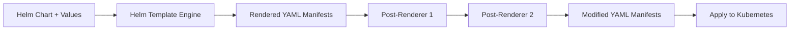

# How to Configure HelmRelease Post-Renderers in Flux

Author: [nawazdhandala](https://github.com/nawazdhandala)

Tags: Flux CD, GitOps, Kubernetes, Helm, HelmRelease, Post-Renderer, Kustomize, Resource Customization

Description: Learn how to configure post-renderers on HelmRelease in Flux CD to modify Helm chart output before it is applied to the cluster.

---

## Introduction

Helm charts provide a powerful templating system, but sometimes you need to modify the rendered output in ways the chart's values do not support. For example, you might need to add labels for compliance, inject sidecar containers, modify resource limits, or add annotations required by your infrastructure.

Flux CD supports **post-renderers** on HelmRelease resources through the `spec.postRenderers` field. Post-renderers process the rendered Helm manifests after Helm template rendering but before they are applied to the cluster. This gives you a final transformation layer that works with any Helm chart without requiring chart modifications.

## How Post-Renderers Work

Post-renderers sit between the Helm template engine and the Kubernetes API server. They receive the fully rendered YAML manifests and can modify them before application.

The following diagram shows where post-renderers fit in the deployment pipeline:



## Post-Renderer Types

Flux supports Kustomize-based post-renderers, which allow you to apply Kustomize operations to the rendered Helm output. This includes:

- **Patches**: Strategic merge patches and JSON patches
- **Images**: Image name and tag overrides
- **Additional labels and annotations**: Applied to all or specific resources

## Basic Post-Renderer Configuration

The `spec.postRenderers` field accepts a list of post-renderer configurations. Each post-renderer contains a `kustomize` field with Kustomize operations to apply.

The following example adds labels to all resources rendered by the Helm chart:

```yaml
apiVersion: helm.toolkit.fluxcd.io/v2
kind: HelmRelease
metadata:
  name: my-application
  namespace: default
spec:
  interval: 10m
  chart:
    spec:
      chart: my-application
      version: "1.2.0"
      sourceRef:
        kind: HelmRepository
        name: my-repo
        namespace: flux-system
  values:
    replicaCount: 3
  # Post-renderers modify the Helm output before applying to the cluster
  postRenderers:
    - kustomize:
        # Add labels to all rendered resources
        patches: []
```

## Adding Labels and Annotations

One of the most common post-renderer use cases is adding labels or annotations that the Helm chart does not natively support.

The following example adds compliance and cost-tracking labels to all resources:

```yaml
apiVersion: helm.toolkit.fluxcd.io/v2
kind: HelmRelease
metadata:
  name: my-application
  namespace: default
spec:
  interval: 10m
  chart:
    spec:
      chart: my-application
      version: "1.2.0"
      sourceRef:
        kind: HelmRepository
        name: my-repo
        namespace: flux-system
  values:
    replicaCount: 3
  postRenderers:
    - kustomize:
        # Apply strategic merge patches to add labels
        patches:
          - target:
              # Match all Deployments
              kind: Deployment
            patch: |
              apiVersion: apps/v1
              kind: Deployment
              metadata:
                name: all
                labels:
                  # Add compliance and cost allocation labels
                  compliance/pci-dss: "true"
                  cost-center: "engineering"
                annotations:
                  # Add monitoring annotations
                  prometheus.io/scrape: "true"
                  prometheus.io/port: "8080"
```

## Overriding Container Images

Post-renderers can override container images across all resources, which is useful when you use a private registry mirror or need to pin specific image digests.

The following example overrides the image repository and tag using the Kustomize images field:

```yaml
apiVersion: helm.toolkit.fluxcd.io/v2
kind: HelmRelease
metadata:
  name: my-application
  namespace: default
spec:
  interval: 10m
  chart:
    spec:
      chart: my-application
      version: "1.2.0"
      sourceRef:
        kind: HelmRepository
        name: my-repo
        namespace: flux-system
  values:
    replicaCount: 3
  postRenderers:
    - kustomize:
        # Override container images to use a private registry mirror
        images:
          - name: docker.io/library/nginx
            newName: registry.internal.company.com/nginx
            newTag: "1.25.3-alpine"
          - name: docker.io/library/redis
            newName: registry.internal.company.com/redis
            newTag: "7.2.3-alpine"
```

## Applying JSON Patches

For more precise modifications, you can use JSON 6902 patches to target specific fields within resources.

The following example uses a JSON patch to modify resource limits on a specific container:

```yaml
apiVersion: helm.toolkit.fluxcd.io/v2
kind: HelmRelease
metadata:
  name: my-application
  namespace: default
spec:
  interval: 10m
  chart:
    spec:
      chart: my-application
      version: "1.2.0"
      sourceRef:
        kind: HelmRepository
        name: my-repo
        namespace: flux-system
  values:
    replicaCount: 3
  postRenderers:
    - kustomize:
        # Use JSON patches for precise field modifications
        patches:
          - target:
              kind: Deployment
              name: my-application
            patch: |
              - op: replace
                path: /spec/template/spec/containers/0/resources/limits/memory
                value: "1Gi"
              - op: replace
                path: /spec/template/spec/containers/0/resources/limits/cpu
                value: "500m"
```

## Chaining Multiple Post-Renderers

You can define multiple post-renderers that are applied in sequence. Each post-renderer receives the output of the previous one.

The following example chains two post-renderers -- one for labels and one for image overrides:

```yaml
apiVersion: helm.toolkit.fluxcd.io/v2
kind: HelmRelease
metadata:
  name: my-application
  namespace: default
spec:
  interval: 10m
  chart:
    spec:
      chart: my-application
      version: "1.2.0"
      sourceRef:
        kind: HelmRepository
        name: my-repo
        namespace: flux-system
  values:
    replicaCount: 3
  postRenderers:
    # First post-renderer: add organizational labels
    - kustomize:
        patches:
          - target:
              kind: Deployment
            patch: |
              apiVersion: apps/v1
              kind: Deployment
              metadata:
                name: all
                labels:
                  team: platform
                  environment: production
    # Second post-renderer: override images for private registry
    - kustomize:
        images:
          - name: nginx
            newName: registry.internal.company.com/nginx
            newTag: "1.25.3"
```

## Practical Example: Adding a Sidecar Container

Post-renderers can inject sidecar containers into Deployments rendered by a Helm chart.

The following example adds a log-shipping sidecar to a Deployment:

```yaml
apiVersion: helm.toolkit.fluxcd.io/v2
kind: HelmRelease
metadata:
  name: my-application
  namespace: default
spec:
  interval: 10m
  chart:
    spec:
      chart: my-application
      version: "1.2.0"
      sourceRef:
        kind: HelmRepository
        name: my-repo
        namespace: flux-system
  values:
    replicaCount: 3
  postRenderers:
    - kustomize:
        patches:
          - target:
              kind: Deployment
              name: my-application
            patch: |
              apiVersion: apps/v1
              kind: Deployment
              metadata:
                name: my-application
              spec:
                template:
                  spec:
                    containers:
                      # Add a fluent-bit sidecar for log shipping
                      - name: fluent-bit
                        image: fluent/fluent-bit:2.2.0
                        resources:
                          requests:
                            cpu: 50m
                            memory: 64Mi
                          limits:
                            cpu: 100m
                            memory: 128Mi
                        volumeMounts:
                          - name: app-logs
                            mountPath: /var/log/app
                    volumes:
                      - name: app-logs
                        emptyDir: {}
```

## Verifying Post-Renderer Output

To verify what your post-renderers produce, you can inspect the resources applied to the cluster.

Use the following commands to verify post-renderer modifications:

```bash
# Check that labels were added by the post-renderer
kubectl get deployment my-application -n default --show-labels

# Verify annotations
kubectl get deployment my-application -n default -o jsonpath='{.metadata.annotations}'

# Check the full rendered and post-processed output
kubectl get deployment my-application -n default -o yaml
```

## Best Practices

1. **Use post-renderers for cross-cutting concerns** like labels, annotations, and security policies that apply to all charts uniformly.
2. **Prefer chart values over post-renderers** when the chart supports the configuration you need -- post-renderers add complexity.
3. **Test post-renderers carefully** -- incorrect patches can break the rendered manifests in subtle ways.
4. **Keep post-renderer patches minimal** -- large patches are hard to maintain and debug.
5. **Document why each post-renderer exists** so future maintainers understand the intent.

## Conclusion

Post-renderers give you a powerful last-mile customization layer for Helm charts managed by Flux. Using `spec.postRenderers` with Kustomize patches, image overrides, and strategic merge patches, you can modify any Helm chart's output without forking the chart or requesting upstream changes. This is particularly valuable for enforcing organizational standards like labeling policies, image registry mirrors, and security sidecars across all your Helm-managed applications.
