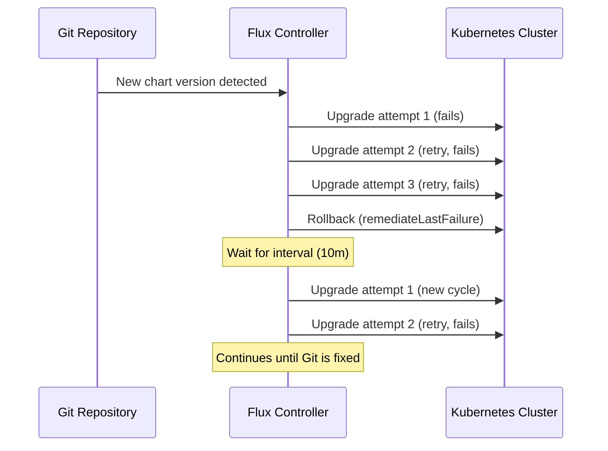

# How to Configure HelmRelease Retry Strategy in Flux

Author: [nawazdhandala](https://github.com/nawazdhandala)

Tags: Flux CD, GitOps, Kubernetes, Helm, HelmRelease, Retry Strategy, Remediation, Reliability

Description: Learn how to configure retry strategies for HelmRelease install and upgrade operations in Flux CD to build resilient deployment pipelines.

---

## Introduction

Helm operations in Kubernetes can fail for transient reasons: network timeouts, temporary API server overload, slow volume provisioning, or brief resource contention. A well-configured retry strategy allows Flux CD to recover from these temporary failures automatically, without requiring manual intervention.

Flux provides retry configuration through the `spec.install.remediation.retries` and `spec.upgrade.remediation.retries` fields on HelmRelease resources. This guide covers how to design effective retry strategies for different workload types and failure scenarios.

## Retry Configuration Fields

The retry strategy in Flux is controlled by the following fields within the HelmRelease spec:

| Field | Description |
|-------|-------------|
| `spec.install.remediation.retries` | Number of times to retry a failed install |
| `spec.upgrade.remediation.retries` | Number of times to retry a failed upgrade |
| `spec.install.remediation.remediateLastFailure` | Whether to uninstall after exhausting install retries |
| `spec.upgrade.remediation.remediateLastFailure` | Whether to rollback after exhausting upgrade retries |
| `spec.install.timeout` | Timeout for each install attempt |
| `spec.upgrade.timeout` | Timeout for each upgrade attempt |

## Basic Retry Configuration

The following example shows a simple retry configuration that handles both install and upgrade failures:

```yaml
apiVersion: helm.toolkit.fluxcd.io/v2
kind: HelmRelease
metadata:
  name: my-application
  namespace: default
spec:
  interval: 10m
  chart:
    spec:
      chart: my-application
      version: "1.2.0"
      sourceRef:
        kind: HelmRepository
        name: my-repo
        namespace: flux-system
  # Retry strategy for initial installation
  install:
    remediation:
      retries: 3
  # Retry strategy for upgrades
  upgrade:
    remediation:
      retries: 3
  values:
    replicaCount: 2
    image:
      repository: myregistry/my-application
      tag: "v1.2.0"
```

## Retry Strategy for Stateless Applications

Stateless applications like web servers and API services typically start quickly and have minimal external dependencies. They benefit from a moderate retry count with shorter timeouts.

The following configuration is optimized for stateless applications:

```yaml
apiVersion: helm.toolkit.fluxcd.io/v2
kind: HelmRelease
metadata:
  name: web-frontend
  namespace: production
spec:
  interval: 10m
  chart:
    spec:
      chart: web-frontend
      version: "2.0.0"
      sourceRef:
        kind: HelmRepository
        name: my-repo
        namespace: flux-system
  install:
    # Stateless apps should start quickly
    timeout: 3m
    remediation:
      # Fewer retries needed -- failures are usually not transient
      retries: 3
      remediateLastFailure: true
  upgrade:
    timeout: 3m
    cleanupOnFail: true
    remediation:
      retries: 3
      # Roll back to keep the service available
      remediateLastFailure: true
  values:
    replicaCount: 3
    image:
      repository: myregistry/web-frontend
      tag: "v2.0.0"
```

## Retry Strategy for Stateful Applications

Stateful applications like databases and message queues require more patience. They may need time to provision persistent volumes, run initialization scripts, or establish cluster membership.

The following configuration is optimized for stateful workloads:

```yaml
apiVersion: helm.toolkit.fluxcd.io/v2
kind: HelmRelease
metadata:
  name: postgresql
  namespace: production
spec:
  interval: 15m
  chart:
    spec:
      chart: postgresql
      version: "12.1.0"
      sourceRef:
        kind: HelmRepository
        name: bitnami
        namespace: flux-system
  install:
    # Databases need time for PV provisioning and initialization
    timeout: 15m
    remediation:
      # More retries for infrastructure dependencies
      retries: 5
      remediateLastFailure: true
  upgrade:
    # Allow time for data migration and schema updates
    timeout: 15m
    cleanupOnFail: true
    remediation:
      retries: 5
      remediateLastFailure: true
  values:
    auth:
      postgresPassword: "${POSTGRES_PASSWORD}"
    primary:
      persistence:
        size: 100Gi
```

## Retry Strategy for Infrastructure Components

Infrastructure components like ingress controllers, service meshes, and monitoring stacks often have CRD dependencies and cross-namespace requirements. They need a resilient retry strategy.

The following configuration is designed for infrastructure-level Helm charts:

```yaml
apiVersion: helm.toolkit.fluxcd.io/v2
kind: HelmRelease
metadata:
  name: ingress-nginx
  namespace: ingress-system
spec:
  interval: 15m
  chart:
    spec:
      chart: ingress-nginx
      version: "4.8.0"
      sourceRef:
        kind: HelmRepository
        name: ingress-nginx
        namespace: flux-system
  install:
    # Infrastructure charts may depend on CRDs and webhooks
    timeout: 10m
    # Create CRDs during install
    crds: CreateReplace
    remediation:
      # Higher retries for infrastructure with ordering dependencies
      retries: 5
      remediateLastFailure: true
  upgrade:
    timeout: 10m
    crds: CreateReplace
    cleanupOnFail: true
    remediation:
      retries: 5
      remediateLastFailure: true
  values:
    controller:
      replicaCount: 2
      service:
        type: LoadBalancer
```

## Monitoring Retry Behavior

Understanding how retries are progressing is important for identifying persistent issues versus transient failures.

Use the following commands to monitor retry behavior:

```bash
# Check the current retry count and status
flux get helmrelease my-application -n production

# View detailed status including failure count
kubectl get helmrelease my-application -n production \
  -o jsonpath='{.status.installFailures}{"\n"}{.status.upgradeFailures}'

# Watch events for retry activity
kubectl events --for helmrelease/my-application -n production --watch
```

To check the Helm controller logs for retry-related messages:

```bash
# Filter helm controller logs for retry activity
kubectl logs -n flux-system deploy/helm-controller \
  --since=1h | grep -E "(retry|retries|remediat)" | grep my-application
```

## Choosing the Right Retry Count

The appropriate number of retries depends on your workload type and failure patterns:

- **0 retries**: Use for development environments where you want immediate feedback on failures.
- **1-2 retries**: Suitable for applications where failures are usually permanent (bad configuration, missing secrets).
- **3 retries**: A good default for most production applications. Handles common transient issues.
- **5 retries**: Appropriate for infrastructure components and stateful applications with external dependencies.
- **More than 5**: Rarely needed. If a Helm operation fails 5 times, the issue is likely not transient.

## Combining Retries with Reconciliation Interval

The `spec.interval` field works alongside the retry strategy. After all retries are exhausted and remediation occurs, the next reconciliation cycle (determined by `spec.interval`) will attempt the operation again if the desired state still differs from the current state.

This means that even after all retries are used, Flux will keep trying on each interval cycle, as the following timeline illustrates:



## Best Practices

1. **Match retry counts to workload characteristics** -- stateless applications need fewer retries than stateful ones.
2. **Set timeouts per attempt** -- each retry will use the configured timeout, so total time equals `retries * timeout`.
3. **Always enable remediateLastFailure** alongside retries to ensure the system recovers after exhausting retries.
4. **Monitor failure counts** to distinguish between transient issues (resolved by retries) and persistent issues (requiring Git fixes).
5. **Use 3 retries as the default** for most workloads and adjust based on observed failure patterns.

## Conclusion

A well-designed retry strategy is fundamental to building resilient GitOps pipelines with Flux CD. By configuring `spec.install.remediation.retries` and `spec.upgrade.remediation.retries` with appropriate values for your workload types, you can handle transient failures automatically while still surfacing persistent issues for human attention. Combined with `remediateLastFailure` and proper timeout settings, retries ensure your deployments are both resilient and responsive.
