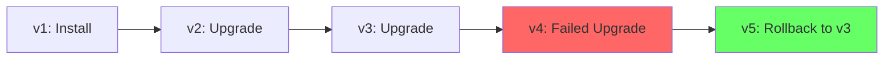

# How to View HelmRelease Revision History in Flux

Author: [nawazdhandala](https://github.com/nawazdhandala)

Tags: Flux CD, GitOps, Kubernetes, Helm, HelmRelease, Revision History, Release Management

Description: Learn how to view and manage HelmRelease revision history in Flux CD to track deployments, audit changes, and troubleshoot rollback issues.

---

Every time Flux installs or upgrades a HelmRelease, Helm creates a new revision in its release history. This history is stored as Kubernetes Secrets and tracks the chart version, values, rendered manifests, and status of each deployment. Understanding how to view and manage this history is essential for auditing deployments, debugging issues, and understanding what changed between releases.

## How Helm Stores Revision History

Helm stores each release revision as a Kubernetes Secret in the release's namespace. The Secret name follows the pattern `sh.helm.release.v1.<release-name>.v<revision>`. Each Secret contains:

- The rendered manifests (compressed and base64-encoded)
- The chart metadata
- The values used for the release
- Release status (deployed, failed, superseded, etc.)
- Timestamps for creation and last update



## Viewing Revision History with Helm CLI

The most direct way to view revision history is through the Helm CLI:

```bash
# View the complete revision history for a release
helm history my-app -n default

# Example output:
# REVISION  UPDATED                   STATUS      CHART         APP VERSION  DESCRIPTION
# 1         2026-02-01 10:00:00       superseded  my-app-1.0.0  1.0.0       Install complete
# 2         2026-02-15 14:30:00       superseded  my-app-1.1.0  1.1.0       Upgrade complete
# 3         2026-03-01 09:00:00       deployed    my-app-1.2.0  1.2.0       Upgrade complete
```

### Limiting Output

```bash
# Show only the last 5 revisions
helm history my-app -n default --max 5

# Output in JSON format for programmatic use
helm history my-app -n default -o json

# Output in YAML format
helm history my-app -n default -o yaml
```

## Viewing the Current Revision via HelmRelease Status

The HelmRelease status tracks the last applied and last attempted revision:

```bash
# View the current revision information from the HelmRelease status
kubectl get helmrelease my-app -n default -o jsonpath='{.status.history}' | jq .

# View the last applied revision
kubectl get helmrelease my-app -n default -o jsonpath='{.status.lastAppliedRevision}'

# View the last attempted revision
kubectl get helmrelease my-app -n default -o jsonpath='{.status.lastAttemptedRevision}'
```

## Examining Release Secrets Directly

You can also inspect the release Secrets directly for more detail:

```bash
# List all revision Secrets for a release
kubectl get secrets -n default -l name=my-app,owner=helm \
  --sort-by='{.metadata.creationTimestamp}' \
  -o custom-columns='NAME:.metadata.name,CREATED:.metadata.creationTimestamp'

# Example output:
# NAME                                CREATED
# sh.helm.release.v1.my-app.v1       2026-02-01T10:00:00Z
# sh.helm.release.v1.my-app.v2       2026-02-15T14:30:00Z
# sh.helm.release.v1.my-app.v3       2026-03-01T09:00:00Z
```

## Inspecting a Specific Revision

To see the details of a specific revision including the values used:

```bash
# Get the values used in revision 2
helm get values my-app -n default --revision 2

# Get all information about revision 2
helm get all my-app -n default --revision 2

# Get the rendered manifests from revision 2
helm get manifest my-app -n default --revision 2

# Get the chart metadata from revision 2
helm get metadata my-app -n default --revision 2
```

## Comparing Revisions

To understand what changed between revisions, compare the rendered manifests:

```bash
# Save manifests from two revisions
helm get manifest my-app -n default --revision 2 > /tmp/rev2.yaml
helm get manifest my-app -n default --revision 3 > /tmp/rev3.yaml

# Compare the manifests
diff /tmp/rev2.yaml /tmp/rev3.yaml
```

For a more readable diff, use a tool like `dyff` or `diff --color`:

```bash
# Using diff with context
diff -u /tmp/rev2.yaml /tmp/rev3.yaml | head -100

# Compare values between revisions
helm get values my-app -n default --revision 2 > /tmp/values-v2.yaml
helm get values my-app -n default --revision 3 > /tmp/values-v3.yaml
diff -u /tmp/values-v2.yaml /tmp/values-v3.yaml
```

## Controlling History Length

Flux provides the `historyLimit` field to control how many revisions are kept:

```yaml
# HelmRelease with history limit configured
apiVersion: helm.toolkit.fluxcd.io/v2
kind: HelmRelease
metadata:
  name: my-app
  namespace: default
spec:
  interval: 10m
  # Keep only the last 5 revisions
  historyLimit: 5
  chart:
    spec:
      chart: my-app
      version: "1.x"
      sourceRef:
        kind: HelmRepository
        name: my-repo
        namespace: flux-system
```

When the number of revisions exceeds `historyLimit`, Flux instructs Helm to delete the oldest revisions.

## Understanding Revision Statuses

Each revision has a status that indicates its outcome:

| Status | Description |
|---|---|
| `deployed` | Currently active revision |
| `superseded` | Successfully deployed but replaced by a newer revision |
| `failed` | The install or upgrade operation failed |
| `pending-install` | Install is in progress |
| `pending-upgrade` | Upgrade is in progress |
| `pending-rollback` | Rollback is in progress |
| `uninstalling` | Release is being uninstalled |

```bash
# Filter history by status
helm history my-app -n default -o json | jq '.[] | select(.status == "failed")'
```

## Using History for Rollback Decisions

When an upgrade fails, the revision history helps you decide which version to roll back to:

```bash
# View history to find the last successful revision
helm history my-app -n default

# Flux handles rollback automatically when configured
```

Configure automatic rollback in your HelmRelease:

```yaml
# HelmRelease with automatic rollback on upgrade failure
apiVersion: helm.toolkit.fluxcd.io/v2
kind: HelmRelease
metadata:
  name: my-app
  namespace: default
spec:
  interval: 10m
  chart:
    spec:
      chart: my-app
      sourceRef:
        kind: HelmRepository
        name: my-repo
        namespace: flux-system
  upgrade:
    remediation:
      remediateLastFailure: true
      strategy: rollback
```

## Auditing Deployment History

For audit purposes, you can export the full revision history:

```bash
# Export complete history with timestamps and descriptions
helm history my-app -n default -o json | jq -r '.[] | "\(.revision)\t\(.updated)\t\(.status)\t\(.chart)\t\(.description)"'

# Count total deployments
helm history my-app -n default -o json | jq 'length'

# Find the first deployment date
helm history my-app -n default -o json | jq -r '.[0].updated'

# Find all failed deployments
helm history my-app -n default -o json | jq '.[] | select(.status == "failed") | {revision, updated, description}'
```

## Cleaning Up History

If you need to manually clean up the revision history:

```bash
# List all release Secrets sorted by age
kubectl get secrets -n default -l name=my-app,owner=helm \
  --sort-by='{.metadata.creationTimestamp}' -o name

# Delete specific old revisions
kubectl delete secret -n default sh.helm.release.v1.my-app.v1
kubectl delete secret -n default sh.helm.release.v1.my-app.v2

# Delete all revisions except the latest (use with caution)
LATEST=$(helm history my-app -n default --max 1 -o json | jq -r '.[0].revision')
echo "Keeping revision ${LATEST}"
kubectl get secrets -n default -l name=my-app,owner=helm -o name | \
  grep -v "v${LATEST}$" | \
  xargs kubectl delete -n default
```

## Best Practices

1. **Set a reasonable historyLimit.** Keep 3-10 revisions depending on your rollback needs and chart size.
2. **Audit history regularly.** Review deployment history as part of your operations routine.
3. **Use revision comparisons for debugging.** When something breaks after an upgrade, compare the current and previous revision's manifests and values.
4. **Monitor history size.** Large charts with many revisions can hit the Secret size limit. Set historyLimit to prevent this.
5. **Export history for compliance.** If you need long-term deployment records, export the history to an external system before old revisions are cleaned up.

## Conclusion

HelmRelease revision history in Flux provides a detailed audit trail of every deployment. By using `helm history`, inspecting release Secrets, and comparing revisions, you can track changes, diagnose issues, and make informed rollback decisions. Setting an appropriate `historyLimit` ensures the history remains manageable while retaining enough context for troubleshooting and auditing.
