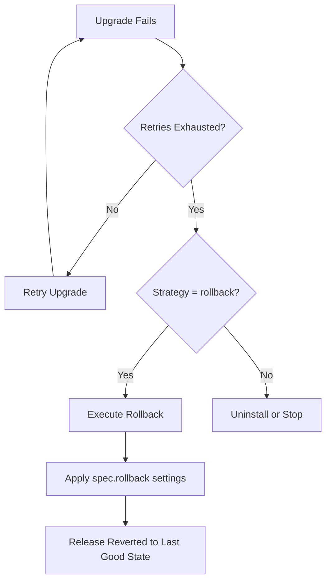

# How to Configure HelmRelease Rollback Action in Flux

Author: [nawazdhandala](https://github.com/nawazdhandala)

Tags: Flux CD, GitOps, Kubernetes, Helm, HelmRelease, Rollback, Recovery

Description: Learn how to configure the rollback action in a Flux CD HelmRelease to control automatic rollback behavior when upgrades fail.

---

## Introduction

When a Helm upgrade fails in Flux CD, the system can automatically roll back to the last successful release. The `spec.rollback` field controls how this rollback is performed, including whether to clean up failed resources, recreate deleted resources, and force rollbacks. Proper rollback configuration is a key part of making your deployments resilient.

## How Rollback Works in Flux

Rollback in Flux CD is triggered automatically when an upgrade fails and the `spec.upgrade.remediation.strategy` is set to `rollback`. The rollback reverts the Helm release to the last known good revision. The `spec.rollback` field configures the behavior of this rollback action.



## Basic Rollback Configuration

Here is a HelmRelease with rollback configured alongside upgrade remediation.

```yaml
# helmrelease.yaml - HelmRelease with rollback configuration
apiVersion: helm.toolkit.fluxcd.io/v2
kind: HelmRelease
metadata:
  name: my-app
  namespace: default
spec:
  interval: 10m
  chart:
    spec:
      chart: my-app
      version: "1.x"
      sourceRef:
        kind: HelmRepository
        name: my-repo
        namespace: flux-system
  # Upgrade must use rollback strategy for spec.rollback to take effect
  upgrade:
    remediation:
      retries: 3
      strategy: rollback
  # Rollback action configuration
  rollback:
    # Clean up new resources created during the failed upgrade
    cleanupOnFail: true
    # Recreate resources that were deleted during the failed upgrade
    recreate: false
    # Do not force resource updates
    force: false
    # Do not disable hooks
    disableHooks: false
    # Wait for rollback resources to be ready
    disableWait: false
  values:
    replicaCount: 3
```

## Rollback Options Explained

Each rollback option controls a specific aspect of the rollback behavior.

### cleanupOnFail

When set to `true`, any resources created during a failed rollback attempt are removed.

```yaml
spec:
  rollback:
    # Remove resources created by a failed rollback
    cleanupOnFail: true
```

### recreate

When set to `true`, Helm performs a delete-and-recreate for resources that have changed, rather than patching them.

```yaml
spec:
  rollback:
    # Delete and recreate changed resources during rollback
    recreate: true
```

This is useful when certain resource fields are immutable and cannot be patched.

### force

When set to `true`, forces the rollback through delete/recreate of all resources, not just changed ones.

```yaml
spec:
  rollback:
    # Force rollback via delete/recreate of all resources
    force: true
```

Use `force` with caution as it causes brief downtime for all resources in the release.

### disableHooks

When set to `true`, Helm hooks are not executed during the rollback.

```yaml
spec:
  rollback:
    # Skip Helm hooks during rollback
    disableHooks: true
```

This is useful if rollback hooks are causing issues or taking too long.

### disableWait

When set to `true`, Helm does not wait for rolled-back resources to become ready.

```yaml
spec:
  rollback:
    # Do not wait for resources to become ready after rollback
    disableWait: true
```

### disableWaitForJobs

When set to `true`, Helm does not wait for Jobs to complete during rollback.

```yaml
spec:
  rollback:
    # Do not wait for Jobs to complete during rollback
    disableWaitForJobs: true
```

## Production Rollback Configuration

Here is a recommended configuration for production workloads that prioritizes reliability.

```yaml
# helmrelease-prod.yaml - Production-grade rollback configuration
apiVersion: helm.toolkit.fluxcd.io/v2
kind: HelmRelease
metadata:
  name: my-app
  namespace: production
spec:
  interval: 10m
  timeout: 10m
  chart:
    spec:
      chart: my-app
      version: "2.x"
      sourceRef:
        kind: HelmRepository
        name: my-repo
        namespace: flux-system
  install:
    createNamespace: true
    remediation:
      retries: 3
  upgrade:
    # Clean up resources from failed upgrades
    cleanupOnFail: true
    remediation:
      retries: 5
      # Rollback when upgrade retries are exhausted
      strategy: rollback
      remediateLastFailure: true
  rollback:
    # Clean up resources from a failed rollback
    cleanupOnFail: true
    # Wait for resources to stabilize after rollback
    disableWait: false
    disableWaitForJobs: false
    # Do not force or recreate unless necessary
    force: false
    recreate: false
  values:
    replicaCount: 3
    image:
      tag: "2.1.0"
```

## Rollback with Max History

The `spec.maxHistory` field determines how many Helm release revisions are kept. This affects how far back a rollback can go.

```yaml
# Rollback configuration with history retention
apiVersion: helm.toolkit.fluxcd.io/v2
kind: HelmRelease
metadata:
  name: my-app
  namespace: default
spec:
  interval: 10m
  # Keep the last 5 release revisions for rollback
  maxHistory: 5
  chart:
    spec:
      chart: my-app
      version: "1.x"
      sourceRef:
        kind: HelmRepository
        name: my-repo
        namespace: flux-system
  upgrade:
    remediation:
      retries: 3
      strategy: rollback
  rollback:
    cleanupOnFail: true
```

## Monitoring Rollbacks

Track rollback events and verify the release state after a rollback.

```bash
# Check HelmRelease status for rollback events
flux get helmreleases -n default

# View the Helm release history to see rollback revisions
helm history my-app -n default

# Check detailed conditions on the HelmRelease
kubectl describe helmrelease my-app -n default

# View Helm Controller logs for rollback details
kubectl logs -n flux-system deploy/helm-controller | grep "my-app"
```

A successful rollback shows up in the Helm history with the description indicating it was a rollback to a previous revision.

```bash
# Example output from helm history
# REVISION  STATUS      DESCRIPTION
# 1         superseded  Install complete
# 2         superseded  Upgrade complete
# 3         failed      Upgrade failed
# 4         deployed    Rollback to 2
```

## What Happens After a Rollback

After a rollback, Flux continues to reconcile the HelmRelease on its regular interval. If the HelmRelease manifest still contains the values that caused the failed upgrade, Flux will attempt the upgrade again on the next reconciliation cycle. To prevent a loop:

1. Fix the values or chart version in Git
2. Commit the fix
3. Flux will pick up the corrected configuration and perform a successful upgrade

If you need to stop reconciliation temporarily while investigating, suspend the HelmRelease.

```bash
# Suspend the HelmRelease to prevent further reconciliation
flux suspend helmrelease my-app -n default

# Investigate the issue, fix values in Git, then resume
flux resume helmrelease my-app -n default
```

## Conclusion

The `spec.rollback` field in Flux CD gives you control over how Helm releases recover from failed upgrades. Combined with `spec.upgrade.remediation.strategy: rollback`, it creates a self-healing deployment pipeline. Use `cleanupOnFail` to keep your cluster clean, set appropriate `maxHistory` for rollback depth, and monitor Helm release history to track rollback events. This configuration ensures your production workloads recover gracefully from deployment failures.
