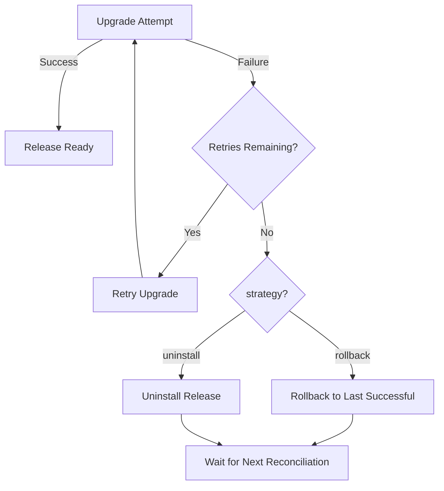

# How to Configure HelmRelease Upgrade Action in Flux

Author: [nawazdhandala](https://github.com/nawazdhandala)

Tags: Flux CD, GitOps, Kubernetes, Helm, HelmRelease, Upgrade, Remediation

Description: Learn how to configure the upgrade action in a Flux CD HelmRelease to control Helm chart upgrade behavior, remediation, and rollback strategies.

---

## Introduction

After a HelmRelease has been initially installed, any subsequent changes to the chart version or values trigger an upgrade action. The `spec.upgrade` field in a HelmRelease controls how Flux performs these upgrades, including retry strategies, cleanup policies, and what happens when an upgrade fails. Proper upgrade configuration is essential for maintaining reliable deployments in production.

## Default Upgrade Behavior

Without any `spec.upgrade` configuration, Flux runs a standard `helm upgrade` with default settings. If the upgrade fails, it is reported as a failure condition on the HelmRelease. Configuring `spec.upgrade` lets you control retries, force upgrades, and automatic rollbacks.

## Basic Upgrade Configuration

Here is a HelmRelease with common upgrade options.

```yaml
# helmrelease.yaml - HelmRelease with upgrade configuration
apiVersion: helm.toolkit.fluxcd.io/v2
kind: HelmRelease
metadata:
  name: my-app
  namespace: default
spec:
  interval: 10m
  chart:
    spec:
      chart: my-app
      version: "1.x"
      sourceRef:
        kind: HelmRepository
        name: my-repo
        namespace: flux-system
  # Upgrade action configuration
  upgrade:
    # Clean up resources from previous releases that are no longer in the chart
    cleanupOnFail: true
    # Remediation configuration for failed upgrades
    remediation:
      # Number of retries before giving up
      retries: 3
      # Strategy when retries are exhausted: rollback or uninstall
      strategy: rollback
  values:
    replicaCount: 3
```

## Upgrade Remediation

The `spec.upgrade.remediation` field is where you define how Flux handles upgrade failures.

```yaml
# HelmRelease with detailed upgrade remediation
apiVersion: helm.toolkit.fluxcd.io/v2
kind: HelmRelease
metadata:
  name: my-app
  namespace: default
spec:
  interval: 10m
  chart:
    spec:
      chart: my-app
      version: "1.x"
      sourceRef:
        kind: HelmRepository
        name: my-repo
        namespace: flux-system
  upgrade:
    remediation:
      # Number of retries after the initial upgrade failure
      retries: 5
      # What to do when all retries are exhausted
      # Options: rollback (default) or uninstall
      strategy: rollback
      # Whether to remediate the last failure when no retries remain
      remediateLastFailure: true
```

The remediation flow works as follows.



## Cleanup on Failure

The `cleanupOnFail` option removes resources that were created during a failed upgrade.

```yaml
# Upgrade with cleanup on failure
spec:
  upgrade:
    # Remove new resources created by the failed upgrade
    cleanupOnFail: true
    remediation:
      retries: 3
      strategy: rollback
```

This is useful when a failed upgrade creates orphaned resources (like new ConfigMaps or Services) that would otherwise linger on the cluster.

## Force Upgrades

The `force` option forces resource updates through a delete and recreate strategy rather than patching.

```yaml
# Upgrade with force enabled
spec:
  upgrade:
    # Force resource updates via delete/recreate
    force: true
    remediation:
      retries: 3
```

Use `force` sparingly. It causes downtime because resources are deleted before being recreated. It can be useful when certain immutable fields on a resource need to change.

## Preserve Values on Upgrade

The `preserveValues` option tells Helm to reuse the last applied values and merge new ones on top.

```yaml
# Upgrade preserving previous values
spec:
  upgrade:
    # Merge new values on top of previously applied values
    preserveValues: false
    remediation:
      retries: 3
```

By default, `preserveValues` is `false` in Flux, meaning each upgrade uses the full set of values from the HelmRelease manifest. Setting it to `true` behaves like `helm upgrade --reuse-values`.

## CRD Upgrade Policy

Control how CRDs are handled during upgrades.

```yaml
# Upgrade with CRD policy
spec:
  upgrade:
    # CRD upgrade policy: Create, CreateReplace, or Skip
    crds: CreateReplace
    remediation:
      retries: 3
```

| Policy | Behavior |
|---|---|
| `Create` | Only create new CRDs, do not update existing ones |
| `CreateReplace` | Create new CRDs and replace existing ones |
| `Skip` | Do not touch CRDs during upgrades |

## Disable Wait on Upgrade

You can disable waiting for resources to become ready during an upgrade.

```yaml
# Upgrade without waiting for readiness
spec:
  upgrade:
    # Do not wait for resources to be ready
    disableWait: true
    # Do not wait for Jobs to complete
    disableWaitForJobs: true
    remediation:
      retries: 3
```

## Complete Upgrade Configuration

Here is a HelmRelease with all upgrade options configured for a production workload.

```yaml
# helmrelease-prod.yaml - Production upgrade configuration
apiVersion: helm.toolkit.fluxcd.io/v2
kind: HelmRelease
metadata:
  name: my-app
  namespace: production
spec:
  interval: 10m
  timeout: 10m
  chart:
    spec:
      chart: my-app
      version: "2.x"
      sourceRef:
        kind: HelmRepository
        name: my-repo
        namespace: flux-system
  install:
    createNamespace: true
    remediation:
      retries: 3
  upgrade:
    # Remove orphaned resources from failed upgrades
    cleanupOnFail: true
    # Do not force delete/recreate
    force: false
    # Use fresh values from the manifest each time
    preserveValues: false
    # CRD policy
    crds: CreateReplace
    # Wait for resources to be ready
    disableWait: false
    disableWaitForJobs: false
    # Remediation strategy
    remediation:
      retries: 5
      strategy: rollback
      remediateLastFailure: true
  values:
    replicaCount: 3
    image:
      tag: "2.1.0"
```

## Combining Install and Upgrade Configuration

It is common to configure both install and upgrade actions together.

```yaml
# Separate install and upgrade strategies
spec:
  install:
    createNamespace: true
    remediation:
      retries: 3
  upgrade:
    cleanupOnFail: true
    remediation:
      retries: 5
      strategy: rollback
      remediateLastFailure: true
```

Install and upgrade have different remediation defaults. Install defaults to no retries and no rollback (since there is nothing to roll back to). Upgrade defaults to `strategy: rollback` when retries are exhausted.

## Monitoring Upgrades

Track upgrade progress and diagnose issues.

```bash
# Watch HelmRelease status during upgrades
flux get helmreleases -n production --watch

# Check the Helm release history for upgrade attempts
helm history my-app -n production

# View the last upgrade conditions
kubectl get helmrelease my-app -n production -o jsonpath='{.status.conditions[*].message}'

# Check Helm Controller logs
kubectl logs -n flux-system deploy/helm-controller | grep my-app
```

## Conclusion

Configuring the upgrade action is critical for reliable HelmRelease management in Flux CD. Use `remediation.retries` with `strategy: rollback` to automatically recover from failed upgrades. Enable `cleanupOnFail` to prevent resource pollution, and set appropriate CRD policies for charts that manage Custom Resource Definitions. These settings make your GitOps upgrades self-healing and production-ready.
