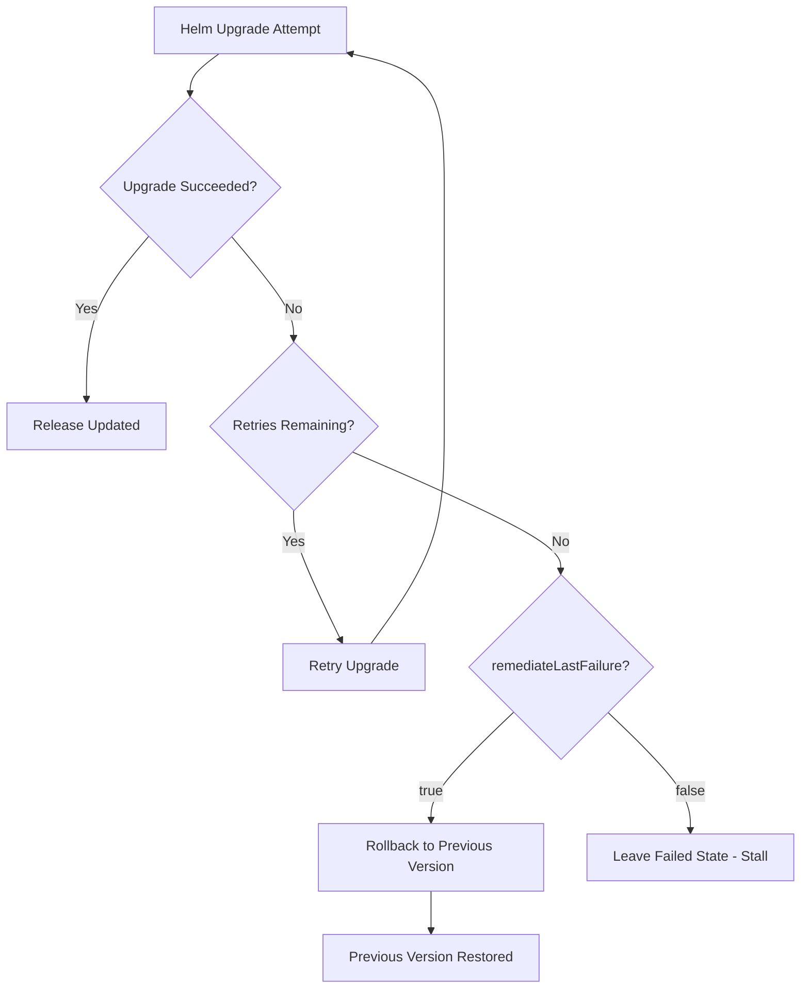

# How to Configure HelmRelease Upgrade Remediation in Flux

Author: [nawazdhandala](https://github.com/nawazdhandala)

Tags: Flux CD, GitOps, Kubernetes, Helm, HelmRelease, Remediation, Upgrade, Rollback

Description: Learn how to configure upgrade remediation strategies for HelmRelease in Flux CD to handle Helm chart upgrade failures with retries and rollbacks.

---

## Introduction

Upgrading Helm releases is a routine operation in Kubernetes, but upgrades can fail for many reasons: incompatible value changes, broken container images, resource conflicts, or cluster capacity issues. When an upgrade fails, you need a clear strategy for recovery.

Flux CD provides the `spec.upgrade.remediation` field on HelmRelease resources to define how the Helm controller should handle upgrade failures. This includes configuring retry attempts, automatic rollback to the previous version, and control over how the last failed attempt is remediated.

## How Upgrade Remediation Works

When a Helm upgrade fails, Flux evaluates the upgrade remediation configuration to decide the next course of action.

The following diagram illustrates the upgrade remediation flow:



## Basic Upgrade Remediation

The simplest upgrade remediation configuration specifies how many times Flux should retry a failed upgrade.

The following example configures Flux to retry upgrades up to 3 times:

```yaml
apiVersion: helm.toolkit.fluxcd.io/v2
kind: HelmRelease
metadata:
  name: my-application
  namespace: default
spec:
  interval: 10m
  chart:
    spec:
      chart: my-application
      version: "1.3.0"
      sourceRef:
        kind: HelmRepository
        name: my-repo
        namespace: flux-system
  # Configure upgrade remediation
  upgrade:
    remediation:
      # Retry the upgrade up to 3 times before giving up
      retries: 3
  values:
    replicaCount: 3
    image:
      repository: myregistry/my-application
      tag: "v1.3.0"
```

## Configuring remediateLastFailure for Rollback

The `remediateLastFailure` field is where upgrade remediation becomes powerful. When set to `true`, Flux will automatically roll back to the last successful release version after all retries are exhausted. This ensures your application remains available even when an upgrade fails.

The following example enables automatic rollback on upgrade failure:

```yaml
apiVersion: helm.toolkit.fluxcd.io/v2
kind: HelmRelease
metadata:
  name: my-application
  namespace: default
spec:
  interval: 10m
  chart:
    spec:
      chart: my-application
      version: "1.3.0"
      sourceRef:
        kind: HelmRepository
        name: my-repo
        namespace: flux-system
  upgrade:
    remediation:
      # Retry the upgrade 3 times
      retries: 3
      # Roll back to the previous version after exhausting retries
      remediateLastFailure: true
  values:
    replicaCount: 3
    image:
      repository: myregistry/my-application
      tag: "v1.3.0"
```

## Combined Install and Upgrade Remediation

In practice, you should configure remediation for both install and upgrade scenarios. Each has its own remediation settings because the recovery strategies differ.

The following example shows a complete HelmRelease with both install and upgrade remediation:

```yaml
apiVersion: helm.toolkit.fluxcd.io/v2
kind: HelmRelease
metadata:
  name: my-application
  namespace: production
spec:
  interval: 10m
  chart:
    spec:
      chart: my-application
      version: "1.3.0"
      sourceRef:
        kind: HelmRepository
        name: my-repo
        namespace: flux-system
  # Install remediation -- for first-time installations
  install:
    remediation:
      retries: 3
      remediateLastFailure: true
  # Upgrade remediation -- for version upgrades
  upgrade:
    # Set a timeout for the upgrade operation
    timeout: 5m
    remediation:
      retries: 3
      # Automatically roll back to the last working version
      remediateLastFailure: true
  values:
    replicaCount: 3
    image:
      repository: myregistry/my-application
      tag: "v1.3.0"
```

## Understanding the Rollback Behavior

When `remediateLastFailure` is set to `true` for upgrade remediation, Flux performs a Helm rollback to the previous release revision. This is equivalent to running `helm rollback` manually. The rollback restores the Helm release values and templates from the last successful revision.

After a rollback, the HelmRelease will be marked with a failure condition. The Flux controller will continue to attempt the upgrade on subsequent reconciliation cycles because the desired state (the new chart version or values in Git) still differs from the current state (the rolled-back version).

This creates a useful pattern: if you push a broken upgrade to Git and Flux rolls it back, fixing the issue in Git and pushing again will trigger a new upgrade attempt with a fresh retry counter.

## Monitoring Upgrade Remediation

Use the following commands to monitor upgrade remediation behavior.

Check the HelmRelease status to see upgrade and rollback information:

```bash
# View the HelmRelease status
flux get helmrelease my-application -n production

# Check for upgrade and rollback events
kubectl events --for helmrelease/my-application -n production

# View detailed status including remediation state
kubectl get helmrelease my-application -n production -o jsonpath='{.status.conditions}' | jq .
```

Check the Helm release history to see rollback revisions:

```bash
# View the Helm release history to see rollback entries
helm history my-application -n production
```

## Production Configuration Example

For production workloads, you should configure upgrade remediation with appropriate timeouts, retries, and monitoring settings.

The following example shows a production-grade upgrade remediation configuration:

```yaml
apiVersion: helm.toolkit.fluxcd.io/v2
kind: HelmRelease
metadata:
  name: api-gateway
  namespace: production
spec:
  interval: 10m
  chart:
    spec:
      chart: api-gateway
      version: "2.1.0"
      sourceRef:
        kind: HelmRepository
        name: internal-charts
        namespace: flux-system
  install:
    timeout: 10m
    remediation:
      retries: 3
      remediateLastFailure: true
  upgrade:
    # Allow sufficient time for rolling updates to complete
    timeout: 10m
    # Clean up on failed upgrade before retrying
    cleanupOnFail: true
    remediation:
      # Allow enough retries for transient issues
      retries: 5
      # Always roll back to keep the service available
      remediateLastFailure: true
  values:
    replicaCount: 5
    image:
      repository: myregistry/api-gateway
      tag: "v2.1.0"
    resources:
      requests:
        cpu: 200m
        memory: 256Mi
      limits:
        cpu: 1000m
        memory: 1Gi
```

## Best Practices

1. **Always enable remediateLastFailure for production upgrades** -- a rolled-back application is better than a broken one.
2. **Set appropriate timeouts** -- the upgrade timeout should account for rolling update times, especially for large Deployments.
3. **Use cleanupOnFail** in the upgrade spec to remove resources created during a failed upgrade before retrying.
4. **Configure alerts** on HelmRelease failures so your team is notified when an upgrade exhausts its retries and rolls back.
5. **Keep retry counts reasonable** -- 3 to 5 retries is sufficient for most scenarios. Higher counts delay the rollback without adding value.
6. **Test upgrades in staging first** to catch issues before they trigger remediation in production.

## Conclusion

Upgrade remediation is essential for maintaining application availability in a GitOps workflow. By configuring `spec.upgrade.remediation` with appropriate retries and enabling `remediateLastFailure`, you ensure that failed upgrades are automatically rolled back while Flux continues to attempt the desired state on subsequent reconciliations. This creates a self-healing deployment pipeline that keeps your services running even when upgrades fail.
