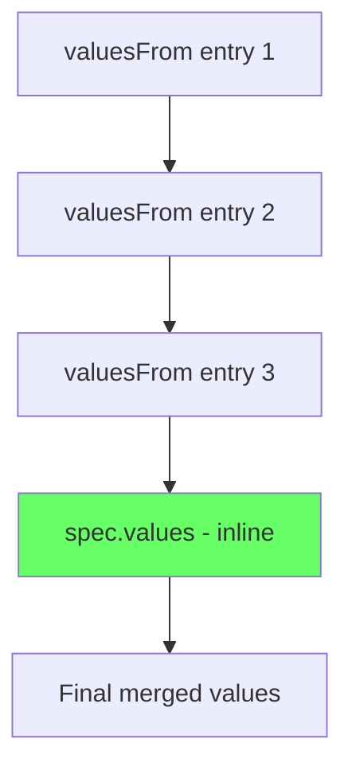

# How to Use HelmRelease with Values References Across Namespaces in Flux

Author: [nawazdhandala](https://github.com/nawazdhandala)

Tags: Flux CD, GitOps, Kubernetes, Helm, HelmRelease, Cross-Namespace, ValuesFrom, ConfigMap, Secret

Description: Learn how to configure HelmRelease to reference values from ConfigMaps and Secrets across different namespaces in Flux CD.

---

Flux CD allows HelmRelease resources to pull values from ConfigMaps and Secrets using the `spec.valuesFrom` field. By default, these references are limited to the same namespace as the HelmRelease. However, there are scenarios where you need to share configuration across namespaces -- for example, a shared database connection string used by multiple applications in different namespaces. This guide covers how to configure cross-namespace value references and the security implications involved.

## How valuesFrom Works

The `spec.valuesFrom` field on a HelmRelease accepts a list of references to ConfigMaps or Secrets. During reconciliation, Flux reads the values from these sources and merges them with `spec.values`. The merge order is:

1. Values from `spec.valuesFrom` entries (in order)
2. Values from `spec.values` (inline values override valuesFrom)

```yaml
# Basic valuesFrom example (same namespace)
apiVersion: helm.toolkit.fluxcd.io/v2
kind: HelmRelease
metadata:
  name: my-app
  namespace: default
spec:
  interval: 10m
  chart:
    spec:
      chart: my-app
      sourceRef:
        kind: HelmRepository
        name: my-repo
        namespace: flux-system
  valuesFrom:
    - kind: ConfigMap
      name: shared-config
      # Optional: specify a key within the ConfigMap
      # If omitted, the entire ConfigMap data is used as values
      valuesKey: values.yaml
    - kind: Secret
      name: db-credentials
      valuesKey: values.yaml
  values:
    # Inline values override valuesFrom
    replicaCount: 3
```

## Cross-Namespace References

To reference a ConfigMap or Secret in a different namespace, use the `targetNamespace` field in the `valuesFrom` entry. However, cross-namespace references require explicit permission through Flux's access control.

### Enabling Cross-Namespace References

By default, Flux denies cross-namespace references for security. To allow them, the helm-controller must be started with the `--no-cross-namespace-refs=false` flag, and the source namespace must not have the `toolkit.fluxcd.io/deny-cross-namespace-source` annotation.

First, check your current configuration:

```bash
# Check if cross-namespace refs are allowed
kubectl get deployment helm-controller -n flux-system -o yaml | grep "no-cross-namespace"
```

If cross-namespace references are disabled, you need to update the helm-controller deployment. This is typically done through your Flux installation configuration:

```yaml
# Flux Kustomization to configure helm-controller flags
apiVersion: kustomize.config.k8s.io/v1beta1
kind: Kustomization
resources:
  - gotk-components.yaml
patches:
  - target:
      kind: Deployment
      name: helm-controller
      namespace: flux-system
    patch: |
      - op: add
        path: /spec/template/spec/containers/0/args/-
        value: --no-cross-namespace-refs=false
```

### Referencing Values from Another Namespace

Once cross-namespace references are enabled, you can reference ConfigMaps and Secrets from other namespaces:

```yaml
# HelmRelease referencing values from a different namespace
apiVersion: helm.toolkit.fluxcd.io/v2
kind: HelmRelease
metadata:
  name: my-app
  namespace: app-namespace
spec:
  interval: 10m
  chart:
    spec:
      chart: my-app
      sourceRef:
        kind: HelmRepository
        name: my-repo
        namespace: flux-system
  valuesFrom:
    # Reference a ConfigMap from the shared-config namespace
    - kind: ConfigMap
      name: global-config
      namespace: shared-config
      valuesKey: values.yaml
    # Reference a Secret from the secrets namespace
    - kind: Secret
      name: shared-credentials
      namespace: secrets
      valuesKey: values.yaml
  values:
    replicaCount: 2
```

## Setting Up Shared Configuration

### Creating a Shared ConfigMap

Create a ConfigMap in a central namespace that multiple HelmReleases can reference:

```yaml
# Shared ConfigMap in a dedicated namespace
apiVersion: v1
kind: Namespace
metadata:
  name: shared-config
---
apiVersion: v1
kind: ConfigMap
metadata:
  name: global-config
  namespace: shared-config
data:
  values.yaml: |
    global:
      domain: example.com
      environment: production
      logging:
        level: info
        format: json
      monitoring:
        enabled: true
        endpoint: http://prometheus.monitoring:9090
```

### Creating Shared Secrets

Store shared credentials in a central Secret:

```yaml
# Shared Secret for database credentials
apiVersion: v1
kind: Secret
metadata:
  name: shared-db-credentials
  namespace: secrets
type: Opaque
stringData:
  values.yaml: |
    database:
      host: postgres.database.svc.cluster.local
      port: 5432
      username: app-user
      password: supersecretpassword
```

### Referencing Shared Values in Multiple HelmReleases

Multiple applications can now reference the same shared configuration:

```yaml
# App 1 in namespace-a
apiVersion: helm.toolkit.fluxcd.io/v2
kind: HelmRelease
metadata:
  name: app-one
  namespace: namespace-a
spec:
  interval: 10m
  chart:
    spec:
      chart: app-one
      sourceRef:
        kind: HelmRepository
        name: my-repo
        namespace: flux-system
  valuesFrom:
    - kind: ConfigMap
      name: global-config
      namespace: shared-config
      valuesKey: values.yaml
    - kind: Secret
      name: shared-db-credentials
      namespace: secrets
      valuesKey: values.yaml
  values:
    replicaCount: 3
---
# App 2 in namespace-b
apiVersion: helm.toolkit.fluxcd.io/v2
kind: HelmRelease
metadata:
  name: app-two
  namespace: namespace-b
spec:
  interval: 10m
  chart:
    spec:
      chart: app-two
      sourceRef:
        kind: HelmRepository
        name: my-repo
        namespace: flux-system
  valuesFrom:
    - kind: ConfigMap
      name: global-config
      namespace: shared-config
      valuesKey: values.yaml
    - kind: Secret
      name: shared-db-credentials
      namespace: secrets
      valuesKey: values.yaml
  values:
    replicaCount: 2
```

## Understanding Value Merge Order

When multiple valuesFrom entries and inline values are combined, the merge order matters:



Later entries override earlier entries. Inline `spec.values` always takes the highest precedence.

```yaml
# Demonstrating merge order
apiVersion: helm.toolkit.fluxcd.io/v2
kind: HelmRelease
metadata:
  name: my-app
  namespace: default
spec:
  interval: 10m
  chart:
    spec:
      chart: my-app
      sourceRef:
        kind: HelmRepository
        name: my-repo
        namespace: flux-system
  valuesFrom:
    # First: base configuration (lowest priority in valuesFrom)
    - kind: ConfigMap
      name: base-config
      namespace: shared-config
      valuesKey: values.yaml
    # Second: environment-specific overrides
    - kind: ConfigMap
      name: prod-config
      namespace: shared-config
      valuesKey: values.yaml
    # Third: secrets (overrides base and env configs)
    - kind: Secret
      name: shared-credentials
      namespace: secrets
      valuesKey: values.yaml
  # Inline values override everything above
  values:
    replicaCount: 5
```

## Handling Optional Values

If a referenced ConfigMap or Secret might not exist, mark it as optional:

```yaml
# Optional valuesFrom reference
valuesFrom:
  - kind: ConfigMap
    name: optional-config
    namespace: shared-config
    valuesKey: values.yaml
    # If the ConfigMap does not exist, skip it instead of failing
    optional: true
```

## Security Considerations

Cross-namespace value references have security implications:

1. **Secret exposure** -- A HelmRelease in one namespace can read Secrets from another namespace, potentially accessing credentials it should not have.
2. **Blast radius** -- A compromised namespace can read shared secrets.
3. **RBAC** -- The helm-controller's service account needs RBAC permissions to read resources in the source namespace.

### Restricting Access

Use Kubernetes RBAC to limit which namespaces the helm-controller can read from:

```yaml
# RBAC to allow helm-controller to read from the shared-config namespace
apiVersion: rbac.authorization.k8s.io/v1
kind: Role
metadata:
  name: helm-controller-reader
  namespace: shared-config
rules:
  - apiGroups: [""]
    resources: ["configmaps", "secrets"]
    verbs: ["get", "list", "watch"]
---
apiVersion: rbac.authorization.k8s.io/v1
kind: RoleBinding
metadata:
  name: helm-controller-reader
  namespace: shared-config
subjects:
  - kind: ServiceAccount
    name: helm-controller
    namespace: flux-system
roleRef:
  kind: Role
  name: helm-controller-reader
  apiGroup: rbac.authorization.k8s.io
```

## Verifying Cross-Namespace References

After configuring cross-namespace references, verify they are working:

```bash
# Check if the HelmRelease is reconciling successfully
flux get helmrelease my-app -n app-namespace

# Verify the values were merged correctly
helm get values my-app -n app-namespace

# Check for errors related to valuesFrom
kubectl describe helmrelease my-app -n app-namespace | grep -A 5 "valuesFrom\|Message"
```

## Best Practices

1. **Minimize cross-namespace references.** Only use them when truly necessary. Prefer duplicating non-sensitive configuration over sharing secrets across namespaces.
2. **Use dedicated namespaces for shared config.** Keep shared ConfigMaps and Secrets in a dedicated namespace with strict RBAC.
3. **Mark optional references explicitly.** Use `optional: true` for configuration that may not exist in all environments.
4. **Document the merge order.** Add comments in your HelmRelease explaining the precedence of valuesFrom entries.
5. **Audit cross-namespace access.** Regularly review which HelmReleases reference resources from other namespaces.

## Conclusion

Cross-namespace value references in Flux HelmRelease enable sharing configuration across applications in different namespaces. By using `spec.valuesFrom` with the `namespace` field, you can reference ConfigMaps and Secrets from any namespace, provided cross-namespace references are enabled in the helm-controller. Use this feature carefully, with proper RBAC and security considerations, to maintain a clean separation of concerns while sharing necessary configuration.
