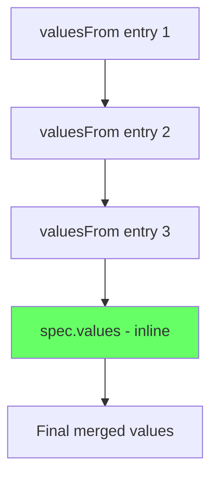

# How to Use HelmRelease with Values References Across Namespaces in Flux

Author: [nawazdhandala](https://github.com/nawazdhandala)

Tags: Flux CD, GitOps, Kubernetes, Helm, HelmRelease, Cross-Namespace, ValuesFrom, ConfigMap, Secret

Description: Learn how to configure HelmRelease to reference values from ConfigMaps and Secrets across different namespaces in Flux CD.

---

Flux CD allows HelmRelease resources to pull values from ConfigMaps and Secrets using the `spec.valuesFrom` field. These references are limited to the same namespace as the HelmRelease. However, there are scenarios where you need to reuse configuration across applications -- for example, a common set of chart values used by multiple releases. This guide covers how to configure value references and the security implications involved.

## How valuesFrom Works

The `spec.valuesFrom` field on a HelmRelease accepts a list of references to ConfigMaps or Secrets. During reconciliation, Flux reads the values from these sources and merges them with `spec.values`. The merge order is:

1. Values from `spec.valuesFrom` entries (in order)
2. Values from `spec.values` (inline values override valuesFrom when `targetPath` is not used)

```yaml
# Basic valuesFrom example (same namespace)

apiVersion: helm.toolkit.fluxcd.io/v2
kind: HelmRelease
metadata:
  name: my-app
  namespace: default
spec:
  interval: 10m
  chart:
    spec:
      chart: my-app
      sourceRef:
        kind: HelmRepository
        name: my-repo
        namespace: flux-system
  valuesFrom:
    - kind: ConfigMap
      name: shared-config
      # Optional: specify a key within the ConfigMap
      # If omitted, this defaults to values.yaml
      valuesKey: values.yaml
    - kind: Secret
      name: db-credentials
      valuesKey: values.yaml
  values:
    # Inline values override valuesFrom
    replicaCount: 3
```

## Namespace Limitations

The `valuesFrom` entries do not support a `namespace` or `targetNamespace` field. The referenced ConfigMap or Secret must exist in the same namespace as the HelmRelease.

### Cross-Namespace Controller Flags

Flux's helm-controller has a `--no-cross-namespace-refs` flag, but this controls cross-namespace references to source objects such as HelmRepository, GitRepository, Bucket, OCIRepository, and HelmChart references. It does not add cross-namespace support to `spec.valuesFrom`.

First, check your current configuration:

```bash
# Check if cross-namespace source refs are allowed
kubectl get deployment helm-controller -n flux-system -o yaml | grep "no-cross-namespace"
```

If cross-namespace source references are disabled, a HelmRelease must reference its chart source from the same namespace as the HelmRelease. This is typically configured through your Flux installation configuration:

```yaml
# Flux Kustomization to configure helm-controller flags for source refs
apiVersion: kustomize.config.k8s.io/v1beta1
kind: Kustomization
resources:
  - gotk-components.yaml
patches:
  - target:
      kind: Deployment
      name: helm-controller
      namespace: flux-system
    patch: |
      - op: add
        path: /spec/template/spec/containers/0/args/-
        value: --no-cross-namespace-refs=false
```

### Referencing Values from the Same Namespace

Create the ConfigMap or Secret in the same namespace as the HelmRelease:

```yaml
# HelmRelease referencing values from its own namespace
apiVersion: helm.toolkit.fluxcd.io/v2
kind: HelmRelease
metadata:
  name: my-app
  namespace: app-namespace
spec:
  interval: 10m
  chart:
    spec:
      chart: my-app
      sourceRef:
        kind: HelmRepository
        name: my-repo
        namespace: flux-system
  valuesFrom:
    # Reference a ConfigMap from the app-namespace namespace
    - kind: ConfigMap
      name: global-config
      valuesKey: values.yaml
    # Reference a Secret from the app-namespace namespace
    - kind: Secret
      name: shared-credentials
      valuesKey: values.yaml
  values:
    replicaCount: 2
```

## Setting Up Shared Configuration

### Creating a Shared ConfigMap

Create a ConfigMap in each namespace that contains a HelmRelease which needs the shared values. You can keep the source values in Git and use Kustomize generators or your preferred GitOps workflow to create the same ConfigMap in multiple namespaces.

```yaml
# Shared ConfigMap data generated into an application namespace
apiVersion: v1
kind: Namespace
metadata:
  name: app-namespace
---
apiVersion: v1
kind: ConfigMap
metadata:
  name: global-config
  namespace: app-namespace
data:
  values.yaml: |
    global:
      domain: example.com
      environment: production
      logging:
        level: info
        format: json
      monitoring:
        enabled: true
        endpoint: http://prometheus.monitoring:9090
```

### Creating Shared Secrets

Store credentials in a Secret in the same namespace as the HelmRelease:

```yaml
# Secret for database credentials in an application namespace
apiVersion: v1
kind: Secret
metadata:
  name: shared-db-credentials
  namespace: app-namespace
type: Opaque
stringData:
  values.yaml: |
    database:
      host: postgres.database.svc.cluster.local
      port: 5432
      username: app-user
      password: supersecretpassword
```

### Referencing Shared Values in Multiple HelmReleases

Multiple applications can reference the same values structure, but the ConfigMap and Secret must be present in each application's namespace:

```yaml
# Values objects in namespace-a
apiVersion: v1
kind: ConfigMap
metadata:
  name: global-config
  namespace: namespace-a
data:
  values.yaml: |
    global:
      domain: example.com
      environment: production
---
apiVersion: v1
kind: Secret
metadata:
  name: shared-db-credentials
  namespace: namespace-a
type: Opaque
stringData:
  values.yaml: |
    database:
      host: postgres.database.svc.cluster.local
      port: 5432
---
# App 1 in namespace-a
apiVersion: helm.toolkit.fluxcd.io/v2
kind: HelmRelease
metadata:
  name: app-one
  namespace: namespace-a
spec:
  interval: 10m
  chart:
    spec:
      chart: app-one
      sourceRef:
        kind: HelmRepository
        name: my-repo
        namespace: flux-system
  valuesFrom:
    - kind: ConfigMap
      name: global-config
      valuesKey: values.yaml
    - kind: Secret
      name: shared-db-credentials
      valuesKey: values.yaml
  values:
    replicaCount: 3
---
# Values objects in namespace-b
apiVersion: v1
kind: ConfigMap
metadata:
  name: global-config
  namespace: namespace-b
data:
  values.yaml: |
    global:
      domain: example.com
      environment: production
---
apiVersion: v1
kind: Secret
metadata:
  name: shared-db-credentials
  namespace: namespace-b
type: Opaque
stringData:
  values.yaml: |
    database:
      host: postgres.database.svc.cluster.local
      port: 5432
---
# App 2 in namespace-b
apiVersion: helm.toolkit.fluxcd.io/v2
kind: HelmRelease
metadata:
  name: app-two
  namespace: namespace-b
spec:
  interval: 10m
  chart:
    spec:
      chart: app-two
      sourceRef:
        kind: HelmRepository
        name: my-repo
        namespace: flux-system
  valuesFrom:
    - kind: ConfigMap
      name: global-config
      valuesKey: values.yaml
    - kind: Secret
      name: shared-db-credentials
      valuesKey: values.yaml
  values:
    replicaCount: 2
```

## Understanding Value Merge Order

When multiple valuesFrom entries and inline values are combined, the merge order matters:


```mermaid
graph TD
    A[valuesFrom entry 1] --> B[valuesFrom entry 2]
    B --> C[valuesFrom entry 3]
    C --> D[spec.values - inline]
    D --> E[Final merged values]
    style D fill:#6f6
```

Later entries override earlier entries. Inline `spec.values` takes the highest precedence when `targetPath` is not used.

```yaml
# Demonstrating merge order
apiVersion: helm.toolkit.fluxcd.io/v2
kind: HelmRelease
metadata:
  name: my-app
  namespace: default
spec:
  interval: 10m
  chart:
    spec:
      chart: my-app
      sourceRef:
        kind: HelmRepository
        name: my-repo
        namespace: flux-system
  valuesFrom:
    # First: base configuration (lowest priority in valuesFrom)
    - kind: ConfigMap
      name: base-config
      valuesKey: values.yaml
    # Second: environment-specific overrides
    - kind: ConfigMap
      name: prod-config
      valuesKey: values.yaml
    # Third: secrets (overrides base and env configs)
    - kind: Secret
      name: shared-credentials
      valuesKey: values.yaml
  # Inline values override everything above
  values:
    replicaCount: 5
```

## Handling Optional Values

If a referenced ConfigMap or Secret might not exist, mark it as optional:

```yaml
# Optional valuesFrom reference
valuesFrom:
  - kind: ConfigMap
    name: optional-config
    valuesKey: values.yaml
    # If the ConfigMap does not exist, skip it instead of failing
    optional: true
```

## Security Considerations

Value references have security implications:

1. **Secret exposure** -- Secret values used as Helm values may be visible to users who can inspect Helm release storage or run Helm commands against the release.
2. **Blast radius** -- Reusing the same secret values across many namespaces increases the impact if those values are compromised.
3. **RBAC** -- Limit who can read ConfigMaps, Secrets, HelmReleases, and Helm release storage in application namespaces.

### Restricting Access

Use Kubernetes RBAC to limit who can read value objects in an application namespace:

```yaml
# RBAC to allow an application operator to read values in one namespace
apiVersion: rbac.authorization.k8s.io/v1
kind: Role
metadata:
  name: app-values-reader
  namespace: app-namespace
rules:
  - apiGroups: [""]
    resources: ["configmaps", "secrets"]
    verbs: ["get", "list"]
---
apiVersion: rbac.authorization.k8s.io/v1
kind: RoleBinding
metadata:
  name: app-values-reader
  namespace: app-namespace
subjects:
  - kind: Group
    name: app-operators
    apiGroup: rbac.authorization.k8s.io
roleRef:
  kind: Role
  name: app-values-reader
  apiGroup: rbac.authorization.k8s.io
```

## Verifying Values References

After configuring values references, verify they are working:

```bash
# Check if the HelmRelease is reconciling successfully
flux get helmreleases -n app-namespace

# Verify the values were merged correctly
helm get values my-app -n app-namespace

# Check for errors related to valuesFrom
kubectl describe helmrelease my-app -n app-namespace | grep -A 5 "valuesFrom\|Message"
```

## Best Practices

1. **Keep values references local.** Create the referenced ConfigMaps and Secrets in the same namespace as the HelmRelease.
2. **Generate repeated values consistently.** Use Kustomize generators, SOPS, or another GitOps-friendly workflow to produce the same value objects in multiple namespaces when needed.
3. **Mark optional references explicitly.** Use `optional: true` for configuration that may not exist in all environments.
4. **Document the merge order.** Add comments in your HelmRelease explaining the precedence of valuesFrom entries.
5. **Audit access.** Regularly review who can read ConfigMaps, Secrets, HelmReleases, and Helm release storage.

## Conclusion

Flux HelmRelease values references let you compose chart values from ConfigMaps and Secrets. By using `spec.valuesFrom`, you can reference value objects in the same namespace as the HelmRelease and combine them with inline values. Use this feature carefully, with proper RBAC and security considerations, to maintain a clean separation of concerns while sharing necessary configuration patterns.
