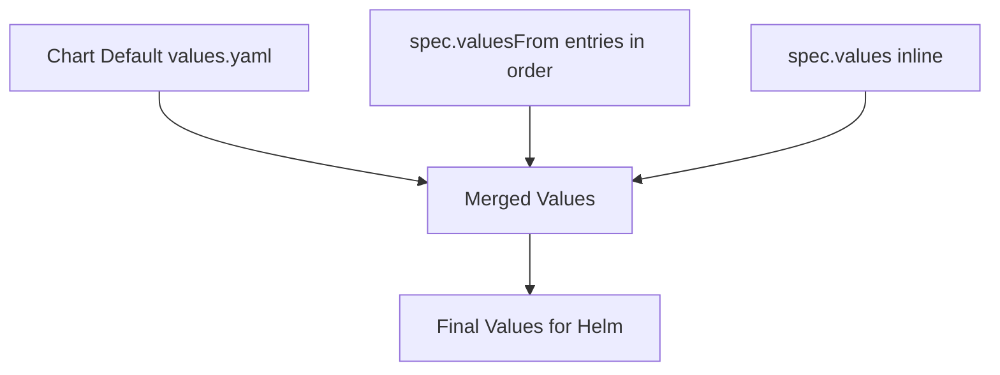

# How to Configure HelmRelease Values in Flux

Author: [nawazdhandala](https://github.com/nawazdhandala)

Tags: Flux CD, GitOps, Kubernetes, Helm, HelmRelease, Values, Configuration

Description: Learn how to configure inline values in a Flux CD HelmRelease to customize Helm chart deployments.

---

## Introduction

Helm charts are customized through values. In a traditional Helm workflow, you pass a `values.yaml` file or use `--set` flags. In Flux CD, the HelmRelease resource provides the `spec.values` field to define inline values directly in the manifest. This keeps all configuration declarative and version-controlled alongside your HelmRelease definitions.

This guide covers how to use `spec.values` to configure Helm chart deployments in Flux.

## Basic Values Configuration

The `spec.values` field accepts a YAML map that corresponds directly to the chart's `values.yaml` structure.

```yaml
# helmrelease.yaml - HelmRelease with inline values
apiVersion: helm.toolkit.fluxcd.io/v2
kind: HelmRelease
metadata:
  name: nginx
  namespace: default
spec:
  interval: 10m
  chart:
    spec:
      chart: nginx
      version: "15.x"
      sourceRef:
        kind: HelmRepository
        name: bitnami
        namespace: flux-system
  # Inline values passed to the Helm chart
  values:
    replicaCount: 3
    service:
      type: LoadBalancer
      port: 80
    resources:
      requests:
        cpu: 100m
        memory: 128Mi
      limits:
        cpu: 250m
        memory: 256Mi
```

These values are merged with the chart's default values during installation and upgrades. Any value you specify here overrides the corresponding default in the chart.

## Nested Values

Helm values often have deeply nested structures. You can define them naturally in YAML.

```yaml
# HelmRelease with deeply nested values
apiVersion: helm.toolkit.fluxcd.io/v2
kind: HelmRelease
metadata:
  name: prometheus
  namespace: monitoring
spec:
  interval: 10m
  chart:
    spec:
      chart: kube-prometheus-stack
      version: "55.x"
      sourceRef:
        kind: HelmRepository
        name: prometheus-community
        namespace: flux-system
  values:
    # Top-level component toggles
    grafana:
      enabled: true
      adminPassword: changeme
      persistence:
        enabled: true
        size: 10Gi
      ingress:
        enabled: true
        hosts:
          - grafana.example.com
    # Alertmanager configuration
    alertmanager:
      enabled: true
      config:
        global:
          resolve_timeout: 5m
        route:
          receiver: "null"
          group_by:
            - alertname
            - namespace
    # Prometheus server settings
    prometheus:
      prometheusSpec:
        retention: 30d
        storageSpec:
          volumeClaimTemplate:
            spec:
              accessModes:
                - ReadWriteOnce
              resources:
                requests:
                  storage: 50Gi
```

## Working with Lists and Arrays

Values can contain lists, which are common for things like extra environment variables, volume mounts, or init containers.

```yaml
# HelmRelease with list-type values
apiVersion: helm.toolkit.fluxcd.io/v2
kind: HelmRelease
metadata:
  name: my-app
  namespace: default
spec:
  interval: 10m
  chart:
    spec:
      chart: my-app
      version: "1.x"
      sourceRef:
        kind: HelmRepository
        name: my-repo
        namespace: flux-system
  values:
    # Extra environment variables as a list
    env:
      - name: DATABASE_HOST
        value: "postgres.database.svc"
      - name: DATABASE_PORT
        value: "5432"
      - name: LOG_LEVEL
        value: "info"
    # Tolerations as a list
    tolerations:
      - key: "dedicated"
        operator: "Equal"
        value: "app"
        effect: "NoSchedule"
    # Node affinity with nested lists
    affinity:
      nodeAffinity:
        requiredDuringSchedulingIgnoredDuringExecution:
          nodeSelectorTerms:
            - matchExpressions:
                - key: workload-type
                  operator: In
                  values:
                    - application
```

## Multi-line Strings in Values

Some chart values expect multi-line strings, such as configuration files or scripts.

```yaml
# HelmRelease with multi-line string values
apiVersion: helm.toolkit.fluxcd.io/v2
kind: HelmRelease
metadata:
  name: nginx
  namespace: default
spec:
  interval: 10m
  chart:
    spec:
      chart: nginx
      version: "15.x"
      sourceRef:
        kind: HelmRepository
        name: bitnami
        namespace: flux-system
  values:
    # Multi-line server block configuration using YAML literal block scalar
    serverBlock: |
      server {
        listen 8080;
        server_name example.com;
        location / {
          proxy_pass http://backend:3000;
          proxy_set_header Host $host;
          proxy_set_header X-Real-IP $remote_addr;
        }
      }
```

## Checking Available Values

Before configuring values, inspect the chart to see what options are available.

```bash
# Show all available values for a chart
helm show values bitnami/nginx --version 15.3.1

# Search for specific values
helm show values bitnami/nginx --version 15.3.1 | grep -A 5 "replicaCount"
```

## Values Merge Behavior

Flux merges values in a specific order. Later sources override earlier ones.



The merge order is:

1. Chart's built-in `values.yaml` (defaults)
2. Each entry in `spec.valuesFrom` (in the order listed)
3. `spec.values` (inline values override everything above)

This means inline `spec.values` always take the highest priority.

## Validating Values Before Applying

You can use `helm template` to validate your values locally before committing them.

```bash
# Render the chart locally with your values to verify output
helm template nginx bitnami/nginx \
  --version 15.3.1 \
  --values my-values.yaml \
  --namespace default
```

Alternatively, use the `--dry-run` option with the Flux CLI.

```bash
# Dry-run a HelmRelease to check for errors
flux reconcile helmrelease nginx --dry-run -n default
```

## Updating Values

To update values, edit the HelmRelease manifest and commit the changes. Flux detects the change on its next reconciliation cycle and triggers a Helm upgrade.

```bash
# After editing the HelmRelease values in your Git repo
git add helmrelease.yaml
git commit -m "Update nginx replica count to 5"
git push

# Optionally force an immediate reconciliation
flux reconcile helmrelease nginx -n default
```

## Common Patterns

Here are some frequently used value patterns across popular Helm charts.

```yaml
# Common value patterns
values:
  # Image configuration
  image:
    repository: nginx
    tag: "1.25"
    pullPolicy: IfNotPresent

  # Ingress configuration
  ingress:
    enabled: true
    className: nginx
    annotations:
      cert-manager.io/cluster-issuer: letsencrypt-prod
    hosts:
      - host: app.example.com
        paths:
          - path: /
            pathType: Prefix
    tls:
      - secretName: app-tls
        hosts:
          - app.example.com

  # Pod security context
  podSecurityContext:
    runAsNonRoot: true
    runAsUser: 1000
    fsGroup: 1000
```

## Conclusion

The `spec.values` field in a HelmRelease is the primary way to customize Helm chart deployments in Flux CD. It supports all YAML data types including maps, lists, and multi-line strings. Inline values take the highest merge priority, making them ideal for environment-specific overrides. For externalized configuration, combine `spec.values` with `spec.valuesFrom` to pull values from ConfigMaps and Secrets, which is covered in separate guides.
