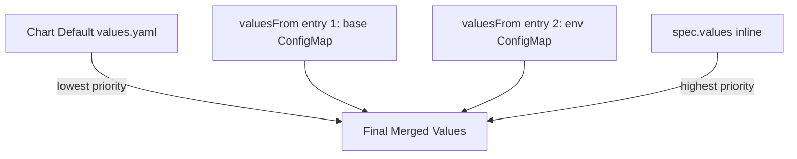

# How to Configure HelmRelease ValuesFrom ConfigMap in Flux

Author: [nawazdhandala](https://github.com/nawazdhandala)

Tags: Flux CD, GitOps, Kubernetes, Helm, HelmRelease, ConfigMap, ValuesFrom

Description: Learn how to use spec.valuesFrom to load Helm chart values from Kubernetes ConfigMaps in Flux CD HelmReleases.

---

## Introduction

While inline `spec.values` works well for simple configurations, there are scenarios where you want to externalize Helm values into Kubernetes ConfigMaps. The `spec.valuesFrom` field in a HelmRelease allows you to reference ConfigMaps (and Secrets) as value sources. This is useful for sharing common configuration across multiple HelmReleases, separating configuration from release definitions, and managing environment-specific settings.

## Why Use ValuesFrom with ConfigMaps

There are several practical reasons to store values in ConfigMaps:

- **Shared configuration**: Multiple HelmReleases can reference the same ConfigMap
- **Separation of concerns**: Platform teams manage ConfigMaps while application teams manage HelmReleases
- **Dynamic updates**: ConfigMaps can be updated independently without modifying the HelmRelease
- **External tooling**: Other tools or controllers can populate ConfigMaps that Flux consumes

## Step 1: Create a ConfigMap with Values

First, create a ConfigMap that contains your Helm values. The values must be stored as a YAML string in a specific key.

```yaml
# configmap-values.yaml - ConfigMap containing Helm values
apiVersion: v1
kind: ConfigMap
metadata:
  name: nginx-values
  namespace: default
data:
  # The key name is important - it will be referenced in valuesFrom
  values.yaml: |
    replicaCount: 3
    service:
      type: LoadBalancer
      port: 80
    resources:
      requests:
        cpu: 100m
        memory: 128Mi
      limits:
        cpu: 250m
        memory: 256Mi
    ingress:
      enabled: true
      hosts:
        - host: nginx.example.com
          paths:
            - path: /
              pathType: Prefix
```

Apply the ConfigMap to your cluster.

```bash
# Create the ConfigMap
kubectl apply -f configmap-values.yaml
```

## Step 2: Reference the ConfigMap in HelmRelease

Use the `spec.valuesFrom` field to reference the ConfigMap.

```yaml
# helmrelease.yaml - HelmRelease loading values from a ConfigMap
apiVersion: helm.toolkit.fluxcd.io/v2
kind: HelmRelease
metadata:
  name: nginx
  namespace: default
spec:
  interval: 10m
  chart:
    spec:
      chart: nginx
      version: "15.x"
      sourceRef:
        kind: HelmRepository
        name: bitnami
        namespace: flux-system
  # Load values from external sources
  valuesFrom:
    - kind: ConfigMap
      name: nginx-values
      # The key in the ConfigMap that contains the YAML values
      valuesKey: values.yaml
```

The `valuesKey` field specifies which key in the ConfigMap contains the values YAML. If omitted, it defaults to `values.yaml`.

## Step 3: Using a Specific Target Path

You can map ConfigMap values to a specific path in the chart's values hierarchy using `targetPath`. This is useful when a ConfigMap contains a single value rather than a full values structure.

```yaml
# configmap-replica.yaml - ConfigMap with a single value
apiVersion: v1
kind: ConfigMap
metadata:
  name: nginx-replica-count
  namespace: default
data:
  # A simple key-value pair
  count: "5"
```

```yaml
# HelmRelease using targetPath to map a value
apiVersion: helm.toolkit.fluxcd.io/v2
kind: HelmRelease
metadata:
  name: nginx
  namespace: default
spec:
  interval: 10m
  chart:
    spec:
      chart: nginx
      version: "15.x"
      sourceRef:
        kind: HelmRepository
        name: bitnami
        namespace: flux-system
  valuesFrom:
    - kind: ConfigMap
      name: nginx-replica-count
      valuesKey: count
      # Maps the value to spec.values.replicaCount in the chart
      targetPath: replicaCount
```

## Step 4: Multiple ConfigMap Sources

You can reference multiple ConfigMaps. They are merged in the order listed.

```yaml
# HelmRelease with multiple ConfigMap sources
apiVersion: helm.toolkit.fluxcd.io/v2
kind: HelmRelease
metadata:
  name: my-app
  namespace: default
spec:
  interval: 10m
  chart:
    spec:
      chart: my-app
      version: "1.x"
      sourceRef:
        kind: HelmRepository
        name: my-repo
        namespace: flux-system
  valuesFrom:
    # Base configuration shared across all environments
    - kind: ConfigMap
      name: my-app-base-values
      valuesKey: values.yaml
    # Environment-specific overrides (merged on top of base)
    - kind: ConfigMap
      name: my-app-prod-values
      valuesKey: values.yaml
  # Inline values take highest priority
  values:
    image:
      tag: "1.5.0"
```

## Values Merge Order

Understanding the merge order is critical when combining multiple value sources.



The merge priority from lowest to highest is:

1. Chart's default `values.yaml`
2. First `valuesFrom` entry
3. Second `valuesFrom` entry (overrides first)
4. Additional `valuesFrom` entries in order
5. `spec.values` inline values (overrides everything)

## Step 5: Optional ConfigMaps

By default, if a referenced ConfigMap does not exist, the HelmRelease will fail to reconcile. You can mark a ConfigMap reference as optional to prevent this.

```yaml
# HelmRelease with an optional ConfigMap reference
apiVersion: helm.toolkit.fluxcd.io/v2
kind: HelmRelease
metadata:
  name: my-app
  namespace: default
spec:
  interval: 10m
  chart:
    spec:
      chart: my-app
      version: "1.x"
      sourceRef:
        kind: HelmRepository
        name: my-repo
        namespace: flux-system
  valuesFrom:
    # Required ConfigMap - reconciliation fails if missing
    - kind: ConfigMap
      name: my-app-base-values
      valuesKey: values.yaml
    # Optional ConfigMap - skipped if it does not exist
    - kind: ConfigMap
      name: my-app-optional-overrides
      valuesKey: values.yaml
      optional: true
```

## Creating ConfigMaps with kubectl

You can create ConfigMaps from files using kubectl.

```bash
# Create a ConfigMap from a values file
kubectl create configmap nginx-values \
  --from-file=values.yaml=./nginx-values.yaml \
  -n default

# Verify the ConfigMap content
kubectl get configmap nginx-values -n default -o yaml
```

## Verifying the Merged Values

After applying the HelmRelease, verify that the values were merged correctly.

```bash
# Check the HelmRelease status
flux get helmreleases -n default

# View the Helm release values that were applied
helm get values nginx -n default

# Check all values including defaults
helm get values nginx -n default --all
```

## Troubleshooting

Common issues when using valuesFrom with ConfigMaps.

```bash
# Check if the ConfigMap exists in the correct namespace
kubectl get configmap nginx-values -n default

# Verify the key name matches what the HelmRelease expects
kubectl get configmap nginx-values -n default -o jsonpath='{.data}'

# Check HelmRelease events for value merge errors
kubectl describe helmrelease nginx -n default

# View Helm Controller logs
kubectl logs -n flux-system deploy/helm-controller | grep nginx
```

If values are not being applied, ensure the `valuesKey` in the HelmRelease matches the actual key name in the ConfigMap's `data` section.

## Conclusion

Using `spec.valuesFrom` with ConfigMaps in Flux CD provides a flexible way to externalize and share Helm chart configuration. You can combine base configurations with environment-specific overrides, use `targetPath` for granular value mapping, and mark references as optional for resilient deployments. This approach pairs well with GitOps practices, where ConfigMaps are managed in Git alongside your HelmRelease definitions.
