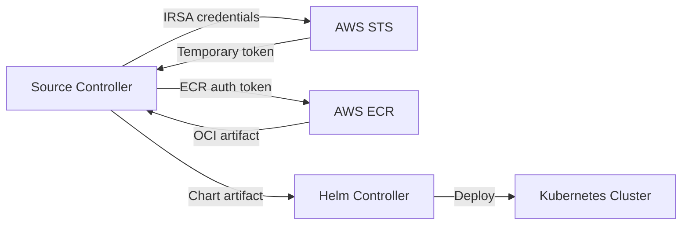

# How to Configure HelmRepository with AWS ECR for Helm OCI in Flux

Author: [nawazdhandala](https://github.com/nawazdhandala)

Tags: Flux CD, GitOps, Kubernetes, Helm, HelmRepository, AWS, ECR, OCI

Description: Learn how to configure a Flux HelmRepository to pull Helm charts from AWS Elastic Container Registry (ECR) using the OCI protocol with automated authentication.

---

## Introduction

AWS Elastic Container Registry (ECR) supports storing Helm charts as OCI artifacts. Flux CD can natively pull Helm charts from ECR using the OCI HelmRepository type with the `aws` provider, which handles ECR token authentication automatically through IRSA (IAM Roles for Service Accounts) or the EC2 instance profile.

This guide walks through setting up a Flux HelmRepository that pulls Helm OCI charts from AWS ECR, including IAM configuration, authentication, and deployment.

## Prerequisites

- A Kubernetes cluster running on AWS (EKS recommended)
- Flux CD v2.x installed on the cluster
- The `flux` CLI, `kubectl`, and `aws` CLI installed
- An AWS ECR repository with at least one Helm chart pushed as an OCI artifact
- IAM permissions to create roles and policies

## Step 1: Push a Helm Chart to ECR

Before configuring Flux, ensure you have a Helm chart stored in ECR. If you have not pushed one yet, follow these steps.

```bash
# Authenticate Helm with ECR
aws ecr get-login-password --region us-east-1 | \
  helm registry login --username AWS --password-stdin 123456789012.dkr.ecr.us-east-1.amazonaws.com

# Create an ECR repository for the chart (if it does not exist)
aws ecr create-repository --repository-name helm-charts/my-app --region us-east-1

# Package and push the chart
helm package ./my-app-chart/
helm push my-app-1.0.0.tgz oci://123456789012.dkr.ecr.us-east-1.amazonaws.com/helm-charts
```

## Step 2: Configure IAM for Flux

Flux needs permission to pull from ECR. The recommended approach on EKS is to use IRSA (IAM Roles for Service Accounts).

### Create an IAM Policy

Create a policy that grants read access to the ECR repository.

```bash
# Create an IAM policy for ECR read access
cat > ecr-helm-policy.json << 'POLICY'
{
  "Version": "2012-10-17",
  "Statement": [
    {
      "Effect": "Allow",
      "Action": [
        "ecr:GetDownloadUrlForLayer",
        "ecr:BatchGetImage",
        "ecr:BatchCheckLayerAvailability",
        "ecr:GetAuthorizationToken"
      ],
      "Resource": "*"
    }
  ]
}
POLICY

aws iam create-policy \
  --policy-name FluxECRHelmReadPolicy \
  --policy-document file://ecr-helm-policy.json
```

### Create an IRSA Role for the Source Controller

Associate the IAM policy with the Flux source controller service account.

```bash
# Create an IRSA role for the Flux source controller
eksctl create iamserviceaccount \
  --name=source-controller \
  --namespace=flux-system \
  --cluster=my-eks-cluster \
  --attach-policy-arn=arn:aws:iam::123456789012:policy/FluxECRHelmReadPolicy \
  --override-existing-serviceaccounts \
  --approve
```

After creating the IRSA binding, restart the source controller to pick up the new credentials.

```bash
# Restart the source controller to pick up the IRSA role
kubectl rollout restart deployment/source-controller -n flux-system
```

## Step 3: Create the OCI HelmRepository

Now create a HelmRepository resource with `type: oci` and `provider: aws`.

```yaml
# helmrepository-ecr.yaml
# HelmRepository configured for AWS ECR with OCI protocol
apiVersion: source.toolkit.fluxcd.io/v1
kind: HelmRepository
metadata:
  name: my-ecr-charts
  namespace: flux-system
spec:
  type: oci                    # Required for OCI registries
  provider: aws                # Enables automatic ECR token refresh via IRSA
  interval: 5m
  url: oci://123456789012.dkr.ecr.us-east-1.amazonaws.com/helm-charts
```

Apply the resource.

```bash
# Apply the HelmRepository resource
kubectl apply -f helmrepository-ecr.yaml
```

The `provider: aws` field tells Flux to use the AWS SDK to obtain short-lived ECR authentication tokens automatically. This eliminates the need to manage static credentials or rotate tokens manually.

## Step 4: Create a HelmRelease

With the HelmRepository in place, create a HelmRelease to deploy the chart.

```yaml
# helmrelease-my-app.yaml
# HelmRelease that pulls the chart from ECR via the OCI HelmRepository
apiVersion: helm.toolkit.fluxcd.io/v2
kind: HelmRelease
metadata:
  name: my-app
  namespace: default
spec:
  interval: 10m
  chart:
    spec:
      chart: my-app                  # Chart name within the OCI repository
      version: ">=1.0.0"             # Semver constraint for chart version
      sourceRef:
        kind: HelmRepository
        name: my-ecr-charts          # References the ECR HelmRepository
        namespace: flux-system
      interval: 5m
  values:
    replicaCount: 2
    service:
      type: ClusterIP
```

Apply the HelmRelease.

```bash
# Apply the HelmRelease
kubectl apply -f helmrelease-my-app.yaml
```

## Step 5: Verify the Configuration

Check that both the HelmRepository and HelmRelease are reconciling successfully.

```bash
# Check the HelmRepository status
flux get sources helm --all-namespaces

# Check the HelmRelease status
flux get helmreleases --all-namespaces

# View detailed events for troubleshooting
kubectl events -n flux-system --for helmrepository/my-ecr-charts
```

## Architecture Overview

The following diagram shows how Flux authenticates with ECR and pulls charts.



## Using Static Credentials Instead of IRSA

If IRSA is not available (for example, on a non-EKS cluster), you can use static credentials stored in a Kubernetes secret.

```bash
# Create a docker-registry secret with ECR credentials
# Note: ECR tokens expire after 12 hours, so this approach requires periodic rotation
kubectl create secret docker-registry ecr-credentials \
  --namespace=flux-system \
  --docker-server=123456789012.dkr.ecr.us-east-1.amazonaws.com \
  --docker-username=AWS \
  --docker-password=$(aws ecr get-login-password --region us-east-1)
```

```yaml
# HelmRepository with static credentials (not recommended for production)
apiVersion: source.toolkit.fluxcd.io/v1
kind: HelmRepository
metadata:
  name: my-ecr-charts
  namespace: flux-system
spec:
  type: oci
  interval: 5m
  url: oci://123456789012.dkr.ecr.us-east-1.amazonaws.com/helm-charts
  secretRef:
    name: ecr-credentials    # Static credentials - must be rotated before expiry
```

Because ECR tokens expire after 12 hours, the IRSA approach with `provider: aws` is strongly recommended for production environments.

## Cross-Account ECR Access

If your Helm charts are stored in a different AWS account, you need to configure an ECR repository policy in the source account and a trust relationship in the IRSA role.

```bash
# In the source account: allow cross-account pull access
aws ecr set-repository-policy \
  --repository-name helm-charts/my-app \
  --region us-east-1 \
  --policy-text '{
    "Version": "2012-10-17",
    "Statement": [
      {
        "Sid": "AllowCrossAccountPull",
        "Effect": "Allow",
        "Principal": {
          "AWS": "arn:aws:iam::987654321098:root"
        },
        "Action": [
          "ecr:GetDownloadUrlForLayer",
          "ecr:BatchGetImage",
          "ecr:BatchCheckLayerAvailability"
        ]
      }
    ]
  }'
```

## Conclusion

Configuring Flux to pull Helm charts from AWS ECR using OCI is straightforward when using the `provider: aws` field. This approach leverages IRSA for automatic token management, eliminating the need for manual credential rotation. The key steps are: setting up IAM permissions via IRSA, creating an OCI-type HelmRepository with the `aws` provider, and creating a HelmRelease that references it. For production environments, always prefer IRSA over static credentials.
