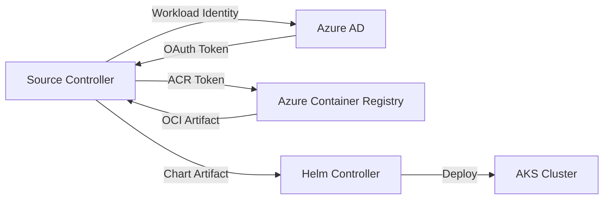

# How to Configure HelmRepository with Azure ACR for Helm OCI in Flux

Author: [nawazdhandala](https://github.com/nawazdhandala)

Tags: Flux CD, GitOps, Kubernetes, Helm, HelmRepository, Azure, ACR, OCI

Description: Learn how to configure a Flux HelmRepository to pull Helm charts from Azure Container Registry (ACR) using the OCI protocol with workload identity authentication.

---

## Introduction

Azure Container Registry (ACR) supports storing Helm charts as OCI artifacts. Flux CD can pull these charts using an OCI-type HelmRepository with the `azure` provider, which enables automatic token authentication through Azure Workload Identity (or AAD Pod Identity). This eliminates the need to manage static credentials and handles token renewal automatically.

This guide covers the full setup, from pushing a Helm chart to ACR to configuring Flux for automated deployment.

## Prerequisites

- An AKS cluster with Flux CD v2.x installed
- Azure Workload Identity configured on the cluster (or AAD Pod Identity)
- The `flux` CLI, `kubectl`, `az` CLI, and `helm` CLI installed
- An Azure Container Registry (ACR) instance

## Step 1: Push a Helm Chart to ACR

First, push a Helm chart to your ACR instance as an OCI artifact.

```bash
# Log in to ACR with the Azure CLI
az acr login --name myacr

# Package your Helm chart
helm package ./my-app-chart/

# Push the chart to ACR as an OCI artifact
helm push my-app-1.0.0.tgz oci://myacr.azurecr.io/helm
```

Verify the chart was pushed successfully.

```bash
# List repositories in ACR
az acr repository list --name myacr --output table

# Show tags for the chart
az acr repository show-tags --name myacr --repository helm/my-app --output table
```

## Step 2: Configure Azure Workload Identity

Azure Workload Identity is the recommended authentication method for Flux on AKS. It allows the source controller pod to authenticate with ACR without static credentials.

### Enable Workload Identity on AKS

```bash
# Update the AKS cluster to enable workload identity
az aks update \
  --resource-group my-rg \
  --name my-aks-cluster \
  --enable-oidc-issuer \
  --enable-workload-identity
```

### Create a Managed Identity

```bash
# Create a managed identity for Flux
az identity create \
  --name flux-source-controller \
  --resource-group my-rg \
  --location eastus

# Get the client ID and principal ID
CLIENT_ID=$(az identity show --name flux-source-controller --resource-group my-rg --query clientId -o tsv)
PRINCIPAL_ID=$(az identity show --name flux-source-controller --resource-group my-rg --query principalId -o tsv)
```

### Grant ACR Pull Access

```bash
# Get the ACR resource ID
ACR_ID=$(az acr show --name myacr --query id -o tsv)

# Assign the AcrPull role to the managed identity
az role assignment create \
  --assignee "$PRINCIPAL_ID" \
  --role AcrPull \
  --scope "$ACR_ID"
```

### Create the Federated Credential

Link the managed identity to the Flux source controller service account.

```bash
# Get the OIDC issuer URL
OIDC_ISSUER=$(az aks show --name my-aks-cluster --resource-group my-rg --query "oidcIssuerProfile.issuerUrl" -o tsv)

# Create the federated identity credential
az identity federated-credential create \
  --name flux-source-controller-federated \
  --identity-name flux-source-controller \
  --resource-group my-rg \
  --issuer "$OIDC_ISSUER" \
  --subject "system:serviceaccount:flux-system:source-controller" \
  --audiences "api://AzureADTokenExchange"
```

### Annotate the Source Controller Service Account

```bash
# Annotate the service account with the client ID
kubectl annotate serviceaccount source-controller \
  --namespace flux-system \
  azure.workload.identity/client-id="$CLIENT_ID" \
  --overwrite

# Label the source controller pod for workload identity injection
kubectl patch deployment source-controller -n flux-system \
  --type=json \
  -p='[{"op":"add","path":"/spec/template/metadata/labels/azure.workload.identity~1use","value":"true"}]'

# Restart the source controller to pick up the identity
kubectl rollout restart deployment/source-controller -n flux-system
```

## Step 3: Create the OCI HelmRepository

Create a HelmRepository with `type: oci` and `provider: azure`.

```yaml
# helmrepository-acr.yaml
# HelmRepository configured for Azure ACR with OCI protocol
apiVersion: source.toolkit.fluxcd.io/v1
kind: HelmRepository
metadata:
  name: my-acr-charts
  namespace: flux-system
spec:
  type: oci                     # Required for OCI registries
  provider: azure               # Enables automatic Azure token refresh
  interval: 5m
  url: oci://myacr.azurecr.io/helm
```

Apply the resource.

```bash
# Apply the HelmRepository
kubectl apply -f helmrepository-acr.yaml

# Verify the status
flux get sources helm -n flux-system
```

## Step 4: Create a HelmRelease

Deploy the chart using a HelmRelease that references the ACR HelmRepository.

```yaml
# helmrelease-my-app.yaml
# HelmRelease that deploys a chart from Azure ACR
apiVersion: helm.toolkit.fluxcd.io/v2
kind: HelmRelease
metadata:
  name: my-app
  namespace: default
spec:
  interval: 10m
  chart:
    spec:
      chart: my-app                   # Chart name in the ACR repository
      version: "1.x"                  # Semver constraint
      sourceRef:
        kind: HelmRepository
        name: my-acr-charts           # References the ACR HelmRepository
        namespace: flux-system
      interval: 5m
  values:
    replicaCount: 3
    image:
      repository: myacr.azurecr.io/my-app
      tag: latest
```

```bash
# Apply the HelmRelease
kubectl apply -f helmrelease-my-app.yaml

# Check reconciliation status
flux get helmreleases -A
```

## Alternative: Using Static Credentials

If workload identity is not available, you can use ACR admin credentials or a service principal.

```bash
# Create a secret with ACR credentials using a service principal
az ad sp create-for-rbac --name flux-acr-reader --scopes "$ACR_ID" --role AcrPull

# Store the credentials in a Kubernetes secret
kubectl create secret docker-registry acr-credentials \
  --namespace=flux-system \
  --docker-server=myacr.azurecr.io \
  --docker-username=<appId> \
  --docker-password=<password>
```

```yaml
# HelmRepository with static credentials (service principal)
apiVersion: source.toolkit.fluxcd.io/v1
kind: HelmRepository
metadata:
  name: my-acr-charts
  namespace: flux-system
spec:
  type: oci
  interval: 5m
  url: oci://myacr.azurecr.io/helm
  secretRef:
    name: acr-credentials     # Service principal credentials
```

## Architecture Overview



## Troubleshooting

### Check Source Controller Logs

```bash
# View source controller logs for authentication errors
kubectl logs -n flux-system deploy/source-controller --since=10m | grep -i "acr\|azure\|error"
```

### Verify Workload Identity Setup

```bash
# Check that the service account has the correct annotation
kubectl get sa source-controller -n flux-system -o yaml | grep azure

# Verify the pod has the workload identity label
kubectl get pods -n flux-system -l app=source-controller -o yaml | grep "azure.workload.identity"
```

### Common Issues

1. **Token refresh failures**: Ensure the federated credential subject matches exactly: `system:serviceaccount:flux-system:source-controller`.
2. **ACR not reachable**: If using a private ACR, ensure the AKS cluster has network connectivity through private endpoints or VNet integration.
3. **Role assignment delay**: After assigning the AcrPull role, it may take a few minutes for the permission to propagate.

## Conclusion

Using Flux with Azure ACR for Helm OCI charts provides a secure, automated approach to Helm chart delivery. The `provider: azure` field in the HelmRepository resource enables seamless token management through Azure Workload Identity, removing the burden of credential rotation. For production AKS deployments, always prefer workload identity over static credentials, and ensure proper RBAC is configured with the AcrPull role.
