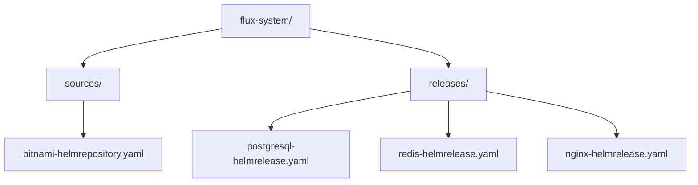

# How to Set Up HelmRepository for Bitnami Charts in Flux

Author: [nawazdhandala](https://github.com/nawazdhandala)

Tags: Flux CD, GitOps, Kubernetes, Helm, HelmRepository, Bitnami, OCI

Description: Step-by-step guide to configuring a Flux CD HelmRepository for Bitnami charts using the OCI registry, and deploying popular Bitnami applications.

---

Bitnami maintains one of the largest collections of production-ready Helm charts, covering databases, web servers, messaging systems, and more. Bitnami migrated from a traditional HTTPS Helm repository to an OCI-based registry hosted on Docker Hub. This guide shows you how to set up Bitnami charts in Flux CD using the correct OCI registry URL and deploy applications from it.

## Bitnami's OCI Registry

Bitnami charts are published as OCI artifacts at `oci://registry-1.docker.io/bitnamicharts`. This is the official and current distribution method. The older `https://charts.bitnami.com/bitnami` URL is deprecated and no longer updated.

Because Bitnami uses OCI, the HelmRepository resource must have `type: oci` specified.

## Creating the HelmRepository

Create a HelmRepository resource that points to the Bitnami OCI registry:

```yaml
# HelmRepository for Bitnami charts via OCI registry on Docker Hub
apiVersion: source.toolkit.fluxcd.io/v1
kind: HelmRepository
metadata:
  name: bitnami
  namespace: flux-system
spec:
  type: oci
  interval: 60m
  url: oci://registry-1.docker.io/bitnamicharts
```

Apply it to your cluster:

```bash
# Apply the Bitnami HelmRepository resource
kubectl apply -f bitnami-helmrepository.yaml
```

Verify the resource was created successfully:

```bash
# Check that the Bitnami HelmRepository is registered
flux get sources helm -n flux-system
```

## Deploying PostgreSQL from Bitnami

Let us deploy a PostgreSQL database using the Bitnami chart. First, create a HelmRelease resource:

```yaml
# HelmRelease to deploy PostgreSQL from Bitnami
apiVersion: helm.toolkit.fluxcd.io/v2
kind: HelmRelease
metadata:
  name: postgresql
  namespace: default
spec:
  interval: 30m
  chart:
    spec:
      # The chart name as published in the Bitnami OCI registry
      chart: postgresql
      version: "16.*"  # Use semver range for automatic minor/patch updates
      sourceRef:
        kind: HelmRepository
        name: bitnami
        namespace: flux-system
      interval: 10m
  values:
    # Configure PostgreSQL with custom settings
    auth:
      postgresPassword: "changeme"
      database: "myapp"
      username: "myuser"
      password: "mypassword"
    primary:
      persistence:
        enabled: true
        size: 10Gi
      resources:
        requests:
          memory: 256Mi
          cpu: 250m
        limits:
          memory: 512Mi
          cpu: 500m
```

## Deploying Redis from Bitnami

Here is another example deploying Redis:

```yaml
# HelmRelease to deploy Redis from Bitnami
apiVersion: helm.toolkit.fluxcd.io/v2
kind: HelmRelease
metadata:
  name: redis
  namespace: default
spec:
  interval: 30m
  chart:
    spec:
      chart: redis
      version: "20.*"
      sourceRef:
        kind: HelmRepository
        name: bitnami
        namespace: flux-system
      interval: 10m
  values:
    # Deploy Redis with a replica set architecture
    architecture: replication
    auth:
      enabled: true
      password: "redis-password"
    replica:
      replicaCount: 3
      persistence:
        enabled: true
        size: 5Gi
```

## Deploying NGINX from Bitnami

Deploy an NGINX web server:

```yaml
# HelmRelease to deploy NGINX from Bitnami
apiVersion: helm.toolkit.fluxcd.io/v2
kind: HelmRelease
metadata:
  name: nginx
  namespace: default
spec:
  interval: 30m
  chart:
    spec:
      chart: nginx
      version: "18.*"
      sourceRef:
        kind: HelmRepository
        name: bitnami
        namespace: flux-system
      interval: 10m
  values:
    # Expose NGINX via a LoadBalancer service
    service:
      type: LoadBalancer
    replicaCount: 2
    resources:
      requests:
        memory: 128Mi
        cpu: 100m
```

## Handling Docker Hub Rate Limits

Docker Hub enforces pull rate limits for unauthenticated and free-tier users. If you are deploying many Bitnami charts, you may hit these limits. To authenticate with Docker Hub and get higher rate limits, create a Docker config Secret:

```bash
# Create a Docker Hub authentication Secret
kubectl create secret docker-registry dockerhub-creds \
  --namespace=flux-system \
  --docker-server=registry-1.docker.io \
  --docker-username=your-dockerhub-username \
  --docker-password=your-dockerhub-token
```

Then reference it in your HelmRepository:

```yaml
# Bitnami HelmRepository with Docker Hub authentication
apiVersion: source.toolkit.fluxcd.io/v1
kind: HelmRepository
metadata:
  name: bitnami
  namespace: flux-system
spec:
  type: oci
  interval: 60m
  url: oci://registry-1.docker.io/bitnamicharts
  secretRef:
    name: dockerhub-creds
```

## GitOps Directory Structure

For a well-organized GitOps repository, structure your Bitnami-related resources like this:



A recommended file layout in your Git repository:

```bash
# Typical directory structure for Flux with Bitnami charts
clusters/my-cluster/
  sources/
    bitnami.yaml           # HelmRepository resource
  apps/
    postgresql.yaml        # HelmRelease for PostgreSQL
    redis.yaml             # HelmRelease for Redis
    nginx.yaml             # HelmRelease for NGINX
```

## Checking Available Chart Versions

Since Bitnami uses OCI, you cannot browse an `index.yaml` file. Use the Flux CLI or Helm to discover available versions:

```bash
# List available tags for a Bitnami chart using Helm
helm show chart oci://registry-1.docker.io/bitnamicharts/postgresql --version 16.0.0

# Pull a specific chart version to inspect its values
helm pull oci://registry-1.docker.io/bitnamicharts/postgresql --version 16.0.0 --untar
```

## Verifying Deployment

After applying your HelmRelease resources, verify everything is working:

```bash
# Check all HelmReleases and their status
flux get helmreleases -A

# Force reconciliation if needed
flux reconcile helmrelease postgresql -n default

# Check the actual deployed pods
kubectl get pods -n default -l app.kubernetes.io/managed-by=Helm
```

Bitnami charts are actively maintained and frequently updated. Using Flux CD with semver version ranges ensures your deployments stay current with the latest patches while giving you control over major version upgrades through your Git-based review process.
